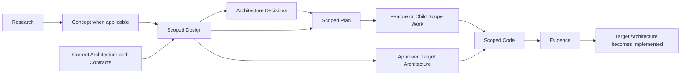

# Scoped SWE Process and Architecture Library

> **Status:** Approved — review candidate, not an approved governed Concept artifact.
>
> **Purpose:** Record the decisions from the process-upgrade discussion so they can be reviewed before any migration of repository governance, skills, templates, or documentation.
>
> **Created:** 2026-08-18
>
> **Target governed Concept:** `.swe/01-concept/CONCEPT-scoped-swe-process-and-architecture-library.md` (only after review and explicit approval).

## 1. Executive summary

The SWE plugin will evolve from a primarily feature-oriented process into one portable, scope-aware software-engineering process that works in both a portfolio or M&A repository and an individual solution repository. The process retains a governed delivery trail in `.swe/`, while `docs/` becomes a companion architecture library containing durable structural truth.

The process is intentionally top-down and recursive: durable architecture establishes System through Module context; a local Concept, Design, ADRs, Plan, Feature, and Evidence trail drives change delivery. Planning is implementation planning, not a substitute for design. Parent plans register child work at the scope that actually fits; they remain living plans as lower-scope work exposes new information.

The recommendation is to proceed with conditions: preserve the existing process until the proposed contracts, templates, validators, and migration plan are reviewed; resolve the governed unknowns in this document before treating the new process as canonical.

## 2. Problem and opportunity

### Problem

The current process is centered on Features. It lacks a clear, reusable way to govern work at System, Solution, Workload, Package, and Module scope while preserving the existing Concept-to-delivery path. The new `docs/` library is useful but is not yet integrated with the skill contracts, template rules, or repository governance.

At portfolio scope, a repository must coordinate shared architecture, roadmaps, dependencies, contracts, risks, and decisions across multiple solutions. A solution repository must be able to consume that direction while continuing local delivery without duplicating the architecture library or treating cross-solution guidance as a functional-requirements document.

### Opportunity

One plugin and reusable project template can give portfolio and solution repositories the same vocabulary, artifact lifecycle, template behavior, and validation rules. The portfolio repository can publish architecture direction and design seeds; solution repositories can reference that source and record only local adaptations or exceptions.

## 3. Confirmed decisions

### 3.1 Architecture and delivery boundaries

- `docs/` is the companion architecture library. It contains enduring structural truth, cross-solution context, contracts, and architecture decisions.
- `.swe/` is the governed change-delivery record. It contains research, concepts, change-specific designs, ADRs, plans, features, and evidence.
- Architecture is distinct from a delivery Design. Architecture describes enduring structure; Design explains how a specific change will be built within that structure.
- A local Design references the applicable architecture and explains fit. It promotes an architecture update only when the change alters a shared boundary, contract, or enduring structure.
- Design-time architecture changes describe the approved target state. Implementation then verifies that target state or records an explicit revision if implementation reality differs.

### 3.2 Architecture hierarchy

The canonical architecture hierarchy is:

```text
System → Solution → [Workload, when present] → Package → Module
```

- **System** is the cross-solution platform or portfolio architecture boundary.
- **Solution** is a cohesive deployable or operational product/system boundary. A Solution may be a server-backed application, a library, an SDK, or another cohesive technical product.
- **Workload** is an optional operational application role within a host-oriented Solution. It may span packages and modules and may later deploy independently without changing architectural identity. A library or SDK Solution need not have any Workloads.
- **Package** is a reusable technical distribution or coherent code grouping.
- **Module** is an internal technical responsibility or unit of implementation.
- **Feature** is a delivery scope, not an architecture level. It describes a functional outcome and may affect multiple Workloads, Packages, or Modules.

### 3.2.1 Scope reach and ownership

| Scope    | What it owns                                                                     | What it may span                                                  | Key distinction                                                                 |
| -------- | -------------------------------------------------------------------------------- | ----------------------------------------------------------------- | ------------------------------------------------------------------------------- |
| System   | Platform-wide rules, shared runtime direction, and relationships among solutions | Multiple Solutions, shared Packages, and cross-solution Contracts | The System is the broadest enduring architecture boundary.                      |
| Solution | One cohesive product or technical boundary, including a library or SDK           | Workloads when relevant, Packages, and Modules                    | A Solution may have no Workloads at all.                                        |
| Workload | One operational application role in a host-oriented Solution                     | Multiple Packages and Modules                                     | A Workload is broader than a Module and may become independently deployed.      |
| Package  | A reusable distribution or coherent technical grouping                           | Multiple Modules                                                  | A Package is a technical reuse and distribution boundary.                       |
| Module   | An internal technical responsibility                                             | Its own components, types, and implementation details             | A Module is not an operational application.                                     |
| Feature  | A functional delivery outcome                                                    | Any affected Workloads, Packages, and Modules                     | A Feature crosses technical boundaries when the functional outcome requires it. |

### 3.3 Server-platform example

The discussed server direction is one Server Platform Solution with an always-running ASP.NET Core host as the platform runtime. Design, CRM, Management, and Voice are Workloads rather than Modules.

- Workloads interact with the host through stable APIs, events, or explicit real-time contracts; they do not reach into host internals.
- The Voice Workload owns avatar experience, real-time interaction, and interruption handling.
- The host owns shared session, authorization, and platform services.
- A real-time contract, such as SignalR or a successor selected by design, connects the Voice Workload and host.

This example illustrates the vocabulary; it does not mandate a final server implementation or technology selection.

### 3.4 Lifecycle and plan behavior

The delivery lifecycle remains:

```text
Research → Concept → Design → ADR → Plan → Feature → Evidence
```

- A Concept expresses functional intent when applicable; it is not a universal prerequisite for System planning.
- Design follows research and concept context, when present, and precedes implementation planning.
- ADRs record enduring decisions before or alongside a Plan as warranted by the decision.
- Plan means delivery and implementation planning. It is not a plan for writing Design.
- Parent plans explicitly register and track their child-scope work. They remain living artifacts and update as lower-level facts emerge.
- A Feature Plan lists affected Workloads, Packages, and Modules. A Module Plan is reserved for independently valuable, standalone, or shared technical work; it is not required for every module touched by a Feature.

### 3.5 Root and direct skills

`swe-plan` is the conversational front door. It helps a developer narrow scope and routes to the appropriate direct planner. Direct dash-qualified skills are deterministic: they inspect existing upstream evidence and produce their scoped artifact without reopening scope discovery. A direct skill stops and reports a specific gap or conflict when required upstream input is missing or inconsistent; it does not invent evidence.

| Skill family           | Proposed skills                                                                                                                    | Responsibility                                                                                                                                                                                                          |
| ---------------------- | ---------------------------------------------------------------------------------------------------------------------------------- | ----------------------------------------------------------------------------------------------------------------------------------------------------------------------------------------------------------------------- |
| Conversational routing | `swe-plan`                                                                                                                       | Discuss ambiguous work, identify the applicable scope, and route to a direct planner.                                                                                                                                   |
| Direct planning        | `swe-plan-system`, `swe-plan-solution`, `swe-plan-workload`, `swe-plan-package`, `swe-plan-module`, `swe-plan-feature` | Read the applicable research, Concept when relevant, parent architecture, decisions, and parent Plan; then create or update the scoped Plan.                                                                            |
| Direct design          | `swe-design-system`, `swe-design-solution`, `swe-design-workload`, `swe-design-package`, `swe-design-module`             | Produce a change-specific Design that fits the durable architecture and identifies any proposed Target architecture update. Feature design remains embodied in the Feature planning/delivery path.                      |
| Direct execution       | `swe-code-system`, `swe-code-solution`, `swe-code-workload`, `swe-code-package`, `swe-code-module`, `swe-code-feature` | Execute only ready scoped work and synchronize verification Evidence. System and Solution code coordinate and validate child work; Workload, Package, Module, and Feature code may make bounded implementation changes. |

### 3.6 Template override model

- Skills own the portable default templates.
- `docs/99-templates/` is the explicit repository override layer.
- A whole override replaces a default only when its filename exactly matches the template requested by the skill.
- Overrides do not merge fragments.
- Generated artifacts record the template identity used so reviews can establish provenance.

### 3.7 Architecture and design status loop

Design and architecture record different, linked states:

| Artifact                      | Status purpose                             | Expected states                  |
| ----------------------------- | ------------------------------------------ | -------------------------------- |
| `.swe` Design               | Delivery lifecycle for the proposed change | Draft → Approved → Verified    |
| `docs/` architecture record | Structural state                           | Current → Target → Implemented |

An approved Design may establish a Target architecture state. After code and verification, the architecture state becomes Implemented, or both records are revised with the reason for divergence.

### 3.8 Definitions and conventions

| Term              | Definition                                                                                              | Rule or implication                                                                                                                            |
| ----------------- | ------------------------------------------------------------------------------------------------------- | ---------------------------------------------------------------------------------------------------------------------------------------------- |
| Research          | Source material, observations, and evaluated evidence that informs later work.                          | Lives only in`.swe/00-research/`; architecture and delivery artifacts link to it rather than duplicating it.                                 |
| Concept           | Functional intent, outcomes, scope, and constraints for a proposed change when a Concept is applicable. | A System Plan may begin from portfolio research and context; Solution and Feature work normally uses a local Concept.                          |
| Architecture      | Durable structural truth: boundaries, responsibilities, contracts, and cross-cutting decisions.         | Lives in`docs/`; it is not copied into local delivery artifacts.                                                                             |
| Design            | A change-specific technical approach prepared before implementation.                                    | Lives in`.swe/02-design/`, references architecture, and may propose a Target architecture state.                                             |
| ADR               | An enduring decision with rationale, consequences, and verification.                                    | Connects Design/Plan work to a durable decision record.                                                                                        |
| Plan              | Delivery and implementation planning derived from Design and ADRs.                                      | Parent Plans register child-scope work and remain living as lower-level facts emerge.                                                          |
| Feature           | A functional delivery outcome.                                                                          | May cross Workloads, Packages, and Modules; it lists affected technical areas but does not automatically create a Module Plan for every touch. |
| Evidence          | Verification results and implementation facts.                                                          | Confirms a Design and advances a Target architecture state to Implemented or records the divergence.                                           |
| Workload          | An optional operational application role inside a host-oriented Solution.                               | May span Packages and Modules; a library or SDK Solution may have no Workloads.                                                                |
| Parent artifact   | The upstream artifact that authorizes, constrains, or organizes a child artifact.                       | Every scoped artifact records its parent link when one exists.                                                                                 |
| Direct skill      | A scope-specific operation with known inputs and a defined output.                                      | Fails closed on missing or conflicting upstream evidence.                                                                                      |
| Template override | A repository-specific replacement for a skill-owned default template.                                   | It applies only on exact filename match and replaces the full template.                                                                        |

### 3.9 Process interaction model

The process is deliberately a chain of evidence and handoffs, not a collection of independent document generators. A later stage reads and constrains itself by the relevant earlier stages; it never silently recreates their decisions.



| Process step                | Primary inputs                                                                          | Primary output                                                       | Required interaction                                                                                                                        |
| --------------------------- | --------------------------------------------------------------------------------------- | -------------------------------------------------------------------- | ------------------------------------------------------------------------------------------------------------------------------------------- |
| Architecture context        | `docs/` architecture, Contracts, Decisions, and the current System/Solution hierarchy | Current structural constraints                                       | These records are read by Design and Plan work. They remain durable and are not copied into`.swe/`.                                       |
| Research and Concept        | `.swe/00-research/` and, when applicable, `.swe/01-concept/`                        | Evidence-backed functional and scope context                         | Research informs Concept, Design, and Plan. A System scope may begin from research and portfolio context without a local Concept.           |
| Scoped Design               | Research/Concept context plus applicable architecture                                   | A change-specific Design and any proposed Target architecture update | Design precedes implementation planning. It explains fit, boundaries, alternatives, and required architecture promotion.                    |
| ADR                         | A material enduring decision surfaced by Design                                         | Decision record linked to Design and downstream work                 | ADRs resolve enduring choices before or alongside delivery planning.                                                                        |
| Conversational routing      | Developer intent plus visible upstream context                                          | Scope selection and a routed direct planner                          | `swe-plan` may discuss ambiguity, but it must not create a Plan before the required Design and ADR inputs exist.                          |
| Scoped Plan                 | Ready Design, relevant ADRs, parent Plan, research, and Concept when applicable         | Delivery Plan and child-scope registry                               | A parent Plan registers work at the scope that fits. System and Solution Plans coordinate child work; they do not flatten it into Features. |
| Feature and Module work     | Scoped Plan plus affected architecture                                                  | Functional Feature plan or independently valuable Module Plan        | A Feature lists the Workloads, Packages, and Modules it affects. A Module Plan is required only for standalone or shared technical work.    |
| Scoped Code and Evidence    | Ready scoped Plan, Design, ADRs, and applicable architecture                            | Bounded implementation plus verification Evidence                    | Direct code skills fail closed on missing readiness. Evidence verifies implementation and resolves the architecture Target state.           |
| Architecture reconciliation | Evidence, implemented change, and approved Target architecture                          | Implemented architecture or an explicit divergence revision          | The Design is marked Verified; root architecture becomes Implemented only after evidence supports it.                                       |

#### Parent/child scope rules

- A System Plan registers Solution work; a Solution Plan may register Workload, Package, Module, or Feature work as appropriate.
- Workload, Package, and Module Plans may register lower-scope work, but no item is forced through every scope.
- A library or SDK Solution may move directly from Solution to Package or Module without creating a Workload.
- A Feature is owned by one primary Workload or Solution context and may reference additional affected Workloads, Packages, and Modules.
- System and Solution code skills coordinate and validate child work. They do not become unbounded code generators across every descendant repository.

#### Template and status rules

- Before a direct skill creates an artifact, it resolves an exact-name override in `docs/99-templates/`; if absent, it uses the skill-owned default.
- Each generated artifact records scope, parent link when applicable, status, and template identity.
- `.swe` Design status is `Draft → Approved → Verified`; root architecture status is `Current → Target → Implemented`.
- A root architecture update is proposed and approved during Design, then verified or revised after Code and Evidence.

### 3.10 Ghostworx root-workspace application

Ghostworx is the root solution and collaborative planning workspace for its component repositories. Its root-level `.swe/` and `docs/` directories hold solution-level concepts, delivery governance, and durable architecture records. Detailed implementation remains in the owning child repository beneath `repos/`.

- Child repositories whose names begin with `ghostworx-` are active, simultaneously developed solution repositories and are read/write when the task explicitly targets them.
- All other child repositories beneath `repos/` are read-only reference checkouts. The root workspace process must not modify their source, configuration, history, or generated files.
- `swe-plugin` remains the reusable process and template source. Ghostworx is an initial root-workspace application of that process; Ghostworx-specific authorization does not become an unconditional write rule for every repository using the plugin.

## 4. Proposed shared `.swe` structure

The same layout is intended for portfolio and solution repositories. Scope and parent links, rather than separate System-versus-Solution trees, express hierarchy.

```text
.swe/
  00-research/
  01-concept/
  02-design/
  03-adrs/
  04-plan/
  05-feature/
  06-evidence/
  20-bugfix/
  30-enhancement/
```

The exact existing casing and numeric compatibility rules remain a migration decision. This draft names the intended lifecycle order, not an instruction to rename existing content.

## 5. Proposed top-level architecture library

Architecture folders are stable classifications, not lifecycle stages. They begin at `01` because `docs/` is independent of the `.swe/` delivery lifecycle; hierarchy appears inside the artifacts and through links.

```text
docs/
  README.md
  01-system/
  02-solution/
    <solution>/
      workloads/                # Only for host-oriented Solutions
  03-package/
  04-module/
  05-contracts/
  06-decisions/
  99-templates/
```

- `01-system/` contains platform-wide principles, host/shared-SDK context, portfolio map, and System architecture.
- `02-solution/` contains Solution architecture and, only when applicable, its Workload records.
- `03-package/` and `04-module/` contain reusable technical architecture where a durable record is warranted.
- `05-contracts/` contains host-workload and cross-solution contract records plus the integration catalog.
- `06-decisions/` contains enduring architecture decisions.
- `99-templates/` contains exact-name whole-template overrides only.

## 6. Functional and operational behavior

### 6.1 Key use cases

| ID    | Use case                                          | Outcome                                                                                                                                          |
| ----- | ------------------------------------------------- | ------------------------------------------------------------------------------------------------------------------------------------------------ |
| UC-01 | A developer starts with ambiguous work            | `swe-plan` discusses scope and routes to the appropriate direct planner.                                                                       |
| UC-02 | A direct planner receives a ready scope           | It reads relevant research, Concept where applicable, parent architecture/design, decisions, and parent plan, then drafts the scoped plan.       |
| UC-03 | A Feature crosses technical areas                 | The Feature Plan identifies affected Workloads, Packages, and Modules; a Module Plan is created only if independent technical work is warranted. |
| UC-04 | A Design changes enduring architecture            | The Design proposes and links a Target architecture update; verification later makes it Implemented or revises the records.                      |
| UC-05 | A repository needs tailored output                | A skill uses an exact-name`docs/99-templates/` override if present; otherwise it uses its bundled default.                                     |
| UC-06 | A library Solution has no hosted application role | Its Solution architecture links directly to Packages and Modules; no Workload record is required.                                                |

## 7. Quality, safety, and governance direction

The process must be portable, traceable, and fail-closed:

- Skills MUST distinguish confirmed upstream evidence from missing or conflicting evidence.
- Direct skills MUST NOT silently invent scope, inputs, architecture decisions, or approval.
- Architecture updates SHOULD link to the originating Design and subsequent Evidence.
- Template selection MUST be deterministic and auditable.
- A generated artifact SHOULD state scope, parent artifact, status, and template identity.
- Higher-scope code skills SHOULD coordinate and validate bounded child work rather than becoming unbounded implementation agents.
- Security, privacy, compliance, data, operational, and technology decisions are not yet defined by this process concept; individual concepts/designs must govern them when applicable.

## 8. Delivery and migration surfaces

The expected implementation change set includes:

1. Replace or substantially revise `.codex/AGENTS.md` to establish the new architecture-versus-delivery boundary, scope vocabulary, routing rules, and promotion rules.
2. Rewrite the repository README and relevant plugin READMEs so the portable process, plugin layout, and setup expectations match actual behavior.
3. Add or revise skill contracts, manifests, and routing for the conversational `swe-plan` entry point and direct planning, design, and code skills.
4. Place default templates with their owning skills; implement exact-name override discovery in `docs/99-templates/`.
5. Add the architecture-library index and missing System and Workload templates, while preserving the valuable existing `99-templates` content as the override layer.
6. Define artifact names, identifiers, parent links, lifecycle states, and traceability requirements.
7. Add static validation for folder layout, template selection, required metadata, parent links, and status transitions.
8. Audit and repair stale lifecycle naming, obsolete template paths, broken orchestration references, and portability or permission inconsistencies discovered during migration.

No implementation work is authorized by this draft.

## 9. Constraints and non-goals

### Constraints

- The resulting plugin/template MUST work at both portfolio and solution scope.
- Existing documents and unrelated worktree changes MUST be preserved until a reviewed migration explicitly changes them.
- The new process MUST avoid duplicate architecture libraries in every solution repository.
- The process MUST support conversational scope discovery only at root entry points and deterministic execution in direct skills.

### Non-goals

- This draft does not select the final server architecture, deployment topology, data stores, identity provider, or real-time technology.
- This draft does not make a functional-requirements document a new required artifact.
- This draft does not require every Feature to create a Module Plan.
- This draft does not authorize changing repository files other than this review candidate.
- This draft does not replace the governed Concept, Design, ADR, Plan, Feature, or validation approval gates.

## 10. Risks, assumptions, and governed open decisions

### Risks

| ID   | Risk                                                                     | Mitigation direction                                                                                            |
| ---- | ------------------------------------------------------------------------ | --------------------------------------------------------------------------------------------------------------- |
| R-01 | A broad skill family becomes inconsistent or overlaps in responsibility. | Define scoped inputs, outputs, preconditions, and stop conditions before implementation; add static validation. |
| R-02 | Architecture and delivery documents drift.                               | Require parent links, Target/Implemented architecture states, Design status, and Evidence linkage.              |
| R-03 | Template overrides create unpredictable output.                          | Exact-name whole-template replacement only, with template provenance in generated artifacts.                    |
| R-04 | Migration disrupts existing governed content.                            | Inventory existing artifacts, preserve compatibility where needed, and migrate incrementally under review.      |
| R-05 | Workload terminology is misapplied.                                      | Publish concise vocabulary and scope-selection guidance with concrete examples.                                 |

### Assumptions

| ID   | Assumption                                                                       | Impact if false                                  | Resolution method                                         |
| ---- | -------------------------------------------------------------------------------- | ------------------------------------------------ | --------------------------------------------------------- |
| A-01 | One shared plugin can serve both portfolio and solution repositories.            | Separate variants may be required.               | Prototype the same workflow in both contexts.             |
| A-02 | The existing`99-templates` content can be retained as an override library.     | Templates may require conversion or replacement. | Audit template names, schemas, and current skill use.     |
| A-03 | Scope can usually be inferred from target, parent artifact, and desired outcome. | Conversational routing may need richer input.    | Exercise representative System through Feature scenarios. |

### Open decisions

| ID   | Open decision                                                                  | Why it matters                                              | Resolution method                                                      | Status |
| ---- | ------------------------------------------------------------------------------ | ----------------------------------------------------------- | ---------------------------------------------------------------------- | ------ |
| Q-01 | Exact artifact identifiers, filenames, and status-transition rules             | Required for reliable validation and migration.             | Define a document convention and validator specification.              | Open   |
| Q-02 | Direct Design and code skill names, inputs, outputs, and ready criteria        | Required to prevent overlap and unauthorized work.          | Draft skill contracts for each scope and review as a family.           | Open   |
| Q-03 | Contract and decision record schemas                                           | Required for cross-solution interoperability and promotion. | Define`05-contracts` and `06-decisions` templates.                 | Open   |
| Q-04 | System Plan publication and child Solution registration mechanics              | Required for portfolio coordination.                        | Design a minimal parent/child registry with links and status.          | Open   |
| Q-05 | Compatibility strategy for current`.swe` folder names and existing artifacts | Required to avoid breaking users or references.             | Inventory current artifacts and write an explicit migration plan.      | Open   |
| Q-06 | Static validator implementation and invocation point                           | Required to make governance enforceable.                    | Select validation approach after current plugin structure is reviewed. | Open   |

## 11. Required design decisions and handoff

The follow-on Design must resolve, at minimum:

| ID     | Decision                                                                        | Target artifact                          |
| ------ | ------------------------------------------------------------------------------- | ---------------------------------------- |
| DEC-01 | Canonical artifact metadata, identifiers, naming, parent links, and statuses    | Process Design and templates             |
| DEC-02 | Skill routing and direct-skill contracts across Plan, Design, and Code families | Skill specifications and manifests       |
| DEC-03 | Template-discovery and exact-name override algorithm                            | Shared template utility and tests        |
| DEC-04 | Architecture promotion workflow and traceability model                          | Architecture/Design status specification |
| DEC-05 | Validation rules, compatibility strategy, and migration sequence                | Migration plan and static validator      |

## 12. Traceability

| Source | Decision or goal                                          | Follow-on verification                                                         |
| ------ | --------------------------------------------------------- | ------------------------------------------------------------------------------ |
| G-01   | One process works for portfolio and solution repositories | Exercise representative System and solution workflows.                         |
| G-02   | Durable architecture stays distinct from delivery design  | Validate link and state transitions across Design, architecture, and Evidence. |
| G-03   | Scope-aware direct skills remain deterministic            | Contract tests verify required inputs and fail-closed gaps.                    |
| G-04   | Template overrides are predictable                        | Tests cover exact-match override, default fallback, and provenance.            |
| R-04   | Existing content is protected during migration            | Migration dry run inventories changes and preserves unrelated files.           |

## 13. Review and approval

This root-level review Concept was approved to advance to the Design stage. It remains a review artifact rather than the eventual canonical `.swe/01-concept/` record, because the migration Design must settle compatibility and canonical locations before that migration occurs.

**Authorized next artifact:** the companion process Design and its decision records. They may refine the open implementation and migration choices, but do not authorize changing the plugin process itself.
