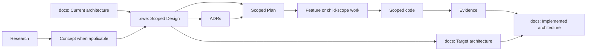

# Design: Scoped SWE Process and Architecture Library

> **Status:** Approved — review candidate.
>
> **Source Concept:** [Scoped SWE Process and Architecture Library](CONCEPT-scoped-swe-process-and-architecture-library.md)
>
> **Scope:** Reusable `swe-plugin` process and project template. No child repository implementation is included.

## 1. Decision summary

Create one portable, scope-aware SWE process. `docs/` is the durable architecture library; `.swe/` is the evidence-backed delivery trail. The same plugin supports portfolio roots and individual solution repositories through explicit scope metadata, parent links, deterministic direct skills, and repository-local template overrides.

Architecture uses the hierarchy `System → Solution → [Workload] → Package → Module`. Workload is optional and applies only to host-oriented solutions. A Feature is a functional delivery outcome, not an architecture level; it can affect several technical areas.

## 2. Goals and non-goals

| Goals                                                                     | Non-goals                                                     |
| ------------------------------------------------------------------------- | ------------------------------------------------------------- |
| Make planning and execution work at System through Module scope.          | Choose the Ghostworx server topology or real-time technology. |
| Preserve one portable plugin/template for root and solution repositories. | Require a standalone requirements document.                   |
| Keep durable architecture separate from change-specific Design.           | Force every Feature through a Module Plan.                    |
| Make template selection and readiness validation deterministic.           | Move existing artifacts before the migration is reviewed.     |

## 3. Artifact model



### 3.1 Durable architecture library

```text
docs/
  README.md
  01-system/
  02-solution/<solution>/workloads/  # only when applicable
  03-package/
  04-module/
  05-contracts/
  06-decisions/
  99-templates/
```

Architecture records carry durable boundaries, responsibilities, contracts, and decisions. Each record names its scope, applicable repository or repositories, status, and links to the Design that proposed any Target state.

### 3.2 Delivery trail

```text
.swe/
  00-research/
  01-concept/
  02-design/
  03-adrs/
  04-plan/
  05-feature/
  06-evidence/
  20-bugfix/
  30-enhancement/
```

Research lives only here. Delivery artifacts record scope, parent link when one exists, status, and template provenance. Migration preserves existing artifacts until compatibility rules are approved.

## 4. Scope and planning rules

| Scope    | Planning purpose                                             | Execution boundary                            |
| -------- | ------------------------------------------------------------ | --------------------------------------------- |
| System   | Coordinate cross-solution work and shared dependencies.      | Coordinates and validates child work.         |
| Solution | Plan a cohesive product, library, SDK, or host.              | Coordinates and validates bounded child work. |
| Workload | Plan an optional operational role spanning packages/modules. | May implement bounded workload changes.       |
| Package  | Plan reusable distribution/coherent technical grouping.      | May implement bounded package changes.        |
| Module   | Plan standalone or shared internal technical work.           | May implement bounded module changes.         |
| Feature  | Plan one functional outcome and list affected areas.         | May implement the ready feature.              |

Parent plans register child work at the scope that fits; they are living plans. A Feature lists affected Workloads, Packages, and Modules but does not create Module Plans merely because it touches a module. Library/SDK solutions may go directly to Package or Module scope.

## 5. Skill contracts

`swe-plan` is the only conversational planning front door. It identifies scope from the target, parent artifact, and desired outcome, then routes to a direct planner. Direct skills are deterministic and fail closed: missing or conflicting upstream evidence is reported rather than invented.

| Family | Direct skills                                                                              |
| ------ | ------------------------------------------------------------------------------------------ |
| Plan   | `swe-plan-system`, `-solution`, `-workload`, `-package`, `-module`, `-feature` |
| Design | `swe-design-system`, `-solution`, `-workload`, `-package`, `-module`             |
| Code   | `swe-code-system`, `-solution`, `-workload`, `-package`, `-module`, `-feature` |

Feature design remains in the Feature planning/delivery path. Every direct skill declares required inputs, output type, stop conditions, and permitted write boundary. System and Solution code skills coordinate and validate rather than editing every descendant repository.

## 6. Architecture promotion loop

| Artifact            | States                           | Responsibility                                  |
| ------------------- | -------------------------------- | ----------------------------------------------- |
| Delivery Design     | Draft → Approved → Verified    | Records change approach and fit.                |
| Architecture record | Current → Target → Implemented | Records structural intent and verified reality. |

When a Design changes an enduring boundary or contract, it proposes a linked Target architecture record. Approval authorizes code against that target. Evidence either advances it to Implemented or records the approved divergence in both the Design and architecture record.

## 7. Template resolution and validation

Each skill owns a default template. Before generation, it checks `docs/99-templates/` for a whole-file override whose filename exactly matches the requested default. An exact match replaces the default; otherwise the bundled default is used. No fragment merge is allowed. Output records the template identity.

A static validator will check: artifact metadata; permitted scope; parent link existence; lifecycle/status transitions; template provenance; required architecture links; folder/manifest consistency; and repository authorization boundaries.

## 8. Governance and portability

At a portfolio root such as Ghostworx, root `.swe/` and `docs/` govern shared work. Child repositories named `ghostworx-*` are writable only when explicitly targeted. Other child repositories are reference-only. This is a repository-specific authorization policy supplied by the host project; it is not an unconditional permission granted by the reusable plugin.

## 9. Delivery phases

1. **Process contract:** finalize metadata, statuses, parent-child registry, contract/decision schemas, and migration compatibility.
2. **Skill foundation:** add routing and direct-skill contracts, default templates, override resolution, and static validation.
3. **Documentation migration:** replace the obsolete governance/readme material; add architecture index and System/Workload templates; repair stale paths and references.
4. **Pilot:** exercise a System-to-Solution path and a bounded Feature/Module path before declaring the new process canonical.

## 10. Open design decisions

- Exact artifact identifier and status syntax.
- Minimal System Plan child-Solution registry format.
- Contract and decision template schemas.
- Backward compatibility and migration treatment for current `.swe` names.
- Validator implementation language, invocation point, and test fixtures.

## 11. Acceptance criteria

- A portfolio and a standalone library solution can each use the same plugin without divergent process definitions.
- Direct skills reject missing readiness inputs with actionable gaps.
- A Feature can name affected technical areas without generating unnecessary Module Plans.
- A Target architecture update is traceable through Design and Evidence to Implemented or an explicit divergence.
- Exact-name template override, default fallback, and provenance are testable.
- The validator detects broken parent links, forbidden state transitions, unresolved templates, and unauthorized child-repository writes.

## 12. Review gate

This Design is a review candidate. Approval authorizes a scoped implementation Plan for the process migration; it does not itself authorize migration edits or changes inside child repositories.
