# Local Real-Time Voice + Animated Avatar Architecture

> **Status:** Reference concept / selected architecture
> **Scope:** Logical architecture, data flow, boundary interfaces, lifecycle events, middleware hook points, and browser rendering responsibilities.
> **Non-goal:** This document does not evaluate or discuss alternative models or competing approaches.

---

## 1. Purpose

This architecture defines a local, real-time conversational avatar system with four primary runtime concerns:

1. **Human speech acquisition and transcription** using a local Whisper speech-to-text (STT) service.
2. **Conversational reasoning and orchestration** through a Voice Orchestrator using an OpenAI-compatible local inference endpoint.
3. **Speech synthesis** through `Chatterbox-TTS-Server`, using the selected real-time streaming mode and an OpenAI-compatible TTS contract.
4. **Facial animation and rendering** through NVIDIA Audio2Face-3D NIM, normalized animation frames, a LAM avatar asset, and client-side WebGL rendering in a Blazor SPA.

A separate **Background Work Orchestrator** handles work that must not block the low-latency conversational path.

The architecture intentionally defines stable internal boundaries around third-party protocols so middleware, telemetry, policy, experimentation, and lifecycle hooks can be inserted at well-defined points without coupling the application to transport-specific or vendor-specific details.

---

## 2. Terminology

### Whisper

Whisper is used for **speech-to-text (STT)** / automatic speech recognition. It converts the human speaker's audio into text.

### Chatterbox-TTS-Server

Chatterbox is used for **text-to-speech (TTS)**. It converts the agent's response text into synthesized speech.

This concept assumes the selected Chatterbox deployment exposes the chosen **real-time streaming TTS mode** behind an OpenAI-compatible interface. The application still wraps this interface behind `ITtsService`, so endpoint or streaming implementation details do not leak into orchestration logic.

### Audio2Face-3D NIM

Audio2Face-3D NIM receives synthesized speech audio and produces time-aligned facial animation data as **ARKit-compatible blendshape coefficients**.

### LAM Avatar

LAM is used for the avatar representation and WebGL rendering path. Avatar construction/provisioning is outside the latency-critical turn loop. At runtime, a pre-created LAM avatar asset is loaded into the browser renderer and driven by normalized facial animation frames.

### Voice Orchestrator

The latency-sensitive conversational state machine. It owns:

- conversational sessions;
- turn detection and turn lifecycle;
- transcription handling;
- agent inference;
- foreground tool invocation;
- TTS scheduling;
- audio/animation synchronization;
- interruption/barge-in;
- lifecycle event publication.

### Background Work Orchestrator

The durable/asynchronous work coordinator. It receives explicit work requests from the conversational layer when work does not need to complete in the active speech turn.

Examples include:

- long-running research;
- data preparation;
- report generation;
- external workflow execution;
- queued business processes;
- retryable or durable operations.

The Voice Orchestrator remains responsible for the live conversation even while background work is executing.

---

## 3. Architectural Principles

### 3.1 The Voice Orchestrator owns the conversation, not model servers

Whisper, the agent inference server, Chatterbox, and Audio2Face are infrastructure dependencies. None owns conversational state.

The Voice Orchestrator owns the authoritative:

- `SessionId`
- `ConversationId`
- `TurnId`
- `UtteranceId`
- `SpeechGenerationId`
- `AnimationStreamId`
- correlation / causation identifiers.

---

### 3.2 Audio is a first-class streaming data type

Audio is never treated merely as a file.

The architecture supports a sequence of timestamped audio frames/chunks with explicit format metadata:

```text
sample rate
channel count
sample format
codec
timestamp
sequence number
duration
```

This allows the same audio stream to be observed, transformed, recorded, routed, cancelled, synchronized, and replayed.

---

## 3.3 TTS audio is fanned out once

The synthesized speech stream is the synchronization source for both:

1. **browser audio playback**, and
2. **Audio2Face facial animation generation**.

The system must not independently synthesize one audio stream for playback and another for animation.

---

## 3.4 Animation output is normalized before entering the UI

The browser does not consume NVIDIA-specific transport messages.

Audio2Face output is converted into a stable application contract:

`AvatarAnimationFrame`

That contract is the public boundary between the Avatar Animation Service and the Blazor/WebGL client.

---

## 3.5 Background work is not in the critical voice loop

The Voice Orchestrator may dispatch work to the Background Work Orchestrator, but interactive speech generation must not wait for background execution unless the conversational policy explicitly declares the work result to be turn-blocking.

---

## 3.6 Every major boundary is middleware-capable

Each transition in the pipeline exposes:

- `Before` lifecycle events;
- `After` lifecycle events;
- stream observers;
- exception/failure events;
- cancellation;
- correlation metadata.

This allows logging, metrics, policy, auditing, persistence, UI updates, tracing, instrumentation, content transforms, debugging, and future extensions without rewriting service implementations.

---

# 4. High-Level Logical Architecture

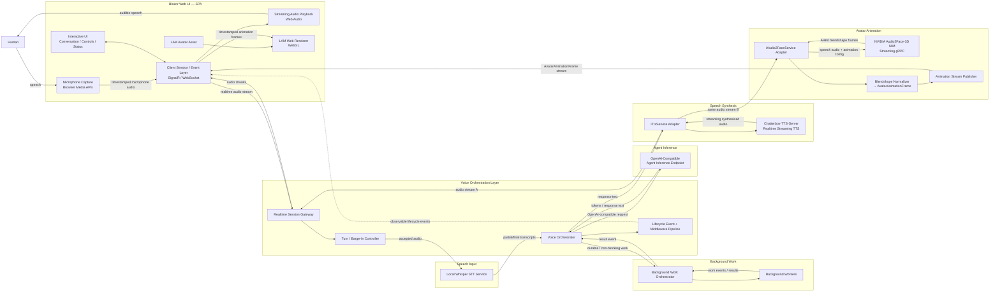

---

# 5. End-to-End Human Speech → Agent Speech + Avatar Data Flow

This is the canonical foreground path.

```mermaid
flowchart TD

    H0["1. Human begins speaking"]
    H1["2. Browser captures microphone frames"]
    H2["3. Client stamps SessionId + sequence + media clock"]
    H3["4. Realtime Session Gateway receives audio"]
    H4["5. Turn Controller / VAD establishes active user turn"]
    H5["6. Whisper receives speech audio"]
    H6["7. Whisper emits partial transcript"]
    H7["8. Whisper emits final transcript"]
    H8["9. Voice Orchestrator commits UserTurn"]
    H9["10. Middleware executes BeforeAgentInference"]
    H10["11. OpenAI-Compatible Agent Inference Endpoint"]
    H11["12. Agent tokens / response arrive"]
    H12["13. Foreground actions resolved"]
    BG{"Background work needed?"}
    B1["Dispatch BackgroundWorkRequest"]
    B2["Background Work Orchestrator"]
    B3["Publish progress / completion events"]
    H13["14. Voice response text committed"]
    H14["15. Middleware executes BeforeTts"]
    H15["16. Chatterbox realtime TTS generation"]
    FAN["17. Audio Fan-Out<br/>ONE synthesized source stream"]
    AUDIO["18A. Browser audio stream"]
    A2F["18B. Audio2Face-3D NIM stream"]
    FACE["19. ARKit blendshape frames"]
    NORM["20. Normalize + timestamp"]
    FRAME["21. AvatarAnimationFrame stream"]
    SYNC["22. Client Playback / Animation Synchronizer"]
    PLAY["23A. Web Audio playback"]
    RENDER["23B. LAM WebGL rendering"]
    HUMAN["24. Human hears and sees synchronized agent response"]

    H0 --> H1 --> H2 --> H3 --> H4 --> H5 --> H6 --> H7 --> H8 --> H9 --> H10 --> H11 --> H12 --> BG
    BG -->|"yes"| B1 --> B2 --> B3
    B3 -.->|"non-blocking result/event"| H13
    BG -->|"no"| H13
    H12 -->|"foreground result"| H13
    H13 --> H14 --> H15 --> FAN
    FAN --> AUDIO --> SYNC
    FAN --> A2F --> FACE --> NORM --> FRAME --> SYNC
    SYNC --> PLAY --> HUMAN
    SYNC --> RENDER --> HUMAN
```

---

# 6. Turn Sequence Diagram

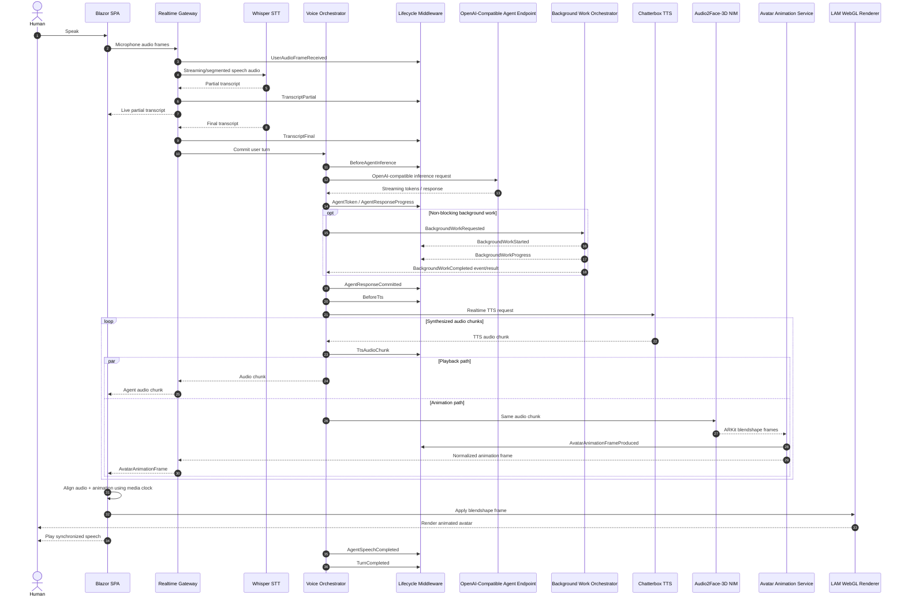

---

# 7. Voice Orchestrator

The Voice Orchestrator is the central low-latency coordinator.

It should **not** contain model-specific code.

Its dependencies are interfaces such as:

```csharp
public interface ISpeechToTextService;
public interface IAgentInferenceService;
public interface ITtsService;
public interface IAvatarAnimationService;
public interface IBackgroundWorkDispatcher;
public interface IConversationEventBus;
public interface IVoiceLifecycleMiddleware;
```

The orchestrator owns the conversational state machine:

```text
Idle
  ↓
Listening
  ↓
UserSpeaking
  ↓
Transcribing
  ↓
Thinking
  ↓
Responding
  ↓
Speaking
  ↓
Idle
```

The state machine must also support:

```text
Speaking
   ↓
UserBargeInDetected
   ↓
Cancel TTS
Cancel queued audio
Cancel animation generation
Flush client playback
   ↓
Listening
```

Cancellation is therefore a cross-cutting contract, not an implementation detail.

---

# 8. Background Work Orchestrator

The Background Work Orchestrator is separate from the Voice Orchestrator because the two systems have different latency and durability requirements.

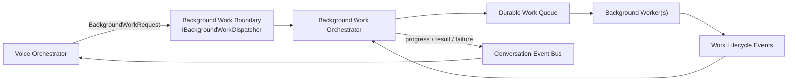

### Foreground vs. background decision

A foreground operation belongs in the Voice Orchestrator when the current spoken answer **cannot continue correctly without its result**.

A background operation belongs in the Background Work Orchestrator when the conversation can continue while the work executes.

The dispatch request should include:

```csharp
BackgroundWorkRequest
{
    WorkId,
    SessionId,
    ConversationId,
    OriginatingTurnId,
    WorkType,
    Payload,
    Priority,
    CorrelationId,
    CausationId,
    RequestedAt
}
```

---

# 9. Speech Input Boundary — Whisper

Whisper is hidden behind:

```csharp
public interface ISpeechToTextService
{
    IAsyncEnumerable<TranscriptEvent> TranscribeAsync(
        IAsyncEnumerable<AudioFrame> audio,
        SpeechRecognitionContext context,
        CancellationToken cancellationToken);
}
```

Possible `TranscriptEvent` types:

```text
SpeechStarted
PartialTranscript
FinalTranscript
SpeechEnded
RecognitionWarning
RecognitionFailed
```

The Voice Orchestrator should never import Whisper-specific types.

---

# 10. Agent Inference Boundary

The Voice Orchestrator communicates with the local agent inference server through an **OpenAI-compatible endpoint**.

The application boundary is:

```csharp
public interface IAgentInferenceService
{
    IAsyncEnumerable<AgentInferenceEvent> StreamAsync(
        AgentInferenceRequest request,
        CancellationToken cancellationToken);
}
```

The adapter maps this internal request onto the deployed OpenAI-compatible API.

Conceptually:

```text
Voice Orchestrator
      │
      ▼
IAgentInferenceService
      │
      ▼
OpenAI-Compatible Adapter
      │
      ▼
/v1/... agent inference endpoint
```

The OpenAI wire format remains an infrastructure detail.

---

# 11. TTS Boundary — Chatterbox-TTS-Server

Chatterbox is hidden behind:

```csharp
public interface ITtsService
{
    IAsyncEnumerable<TtsEvent> SynthesizeAsync(
        TtsRequest request,
        CancellationToken cancellationToken);
}
```

A request contains:

```csharp
TtsRequest
{
    SpeechGenerationId,
    SessionId,
    TurnId,
    Text,
    VoiceId,
    Language,
    OutputFormat,
    SampleRate,
    ExpressiveHints
}
```

Streaming output:

```csharp
TtsAudioChunk
{
    SpeechGenerationId,
    Sequence,
    MediaTimestamp,
    Duration,
    AudioFormat,
    Data
}
```

### Chatterbox wire boundary

The currently selected Chatterbox server exposes OpenAI-compatible speech APIs and a streaming-capable server mode.

The application does **not** couple the orchestrator to a raw path such as `/v1/audio/speech` or `/tts`.

Instead:

```text
Voice Orchestrator
       │
       ▼
    ITtsService
       │
       ▼
Chatterbox Adapter
       │
       ▼
Chatterbox-TTS-Server
```

This preserves the internal contract even if endpoint-level streaming behavior changes.

---

# 12. Audio Fan-Out Contract

This is one of the most important boundaries in the architecture.

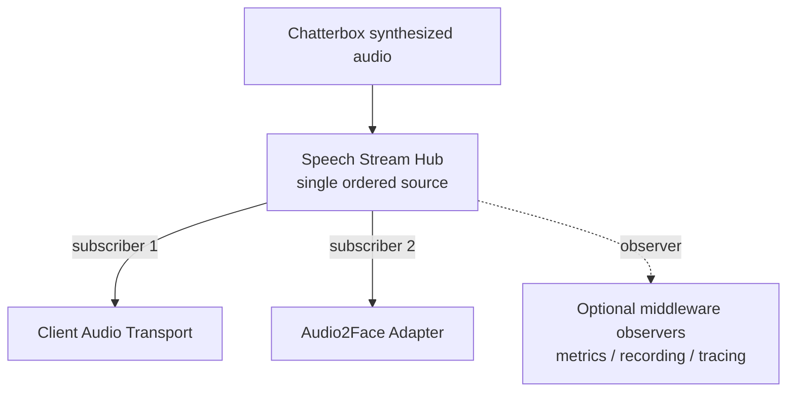

The hub guarantees that both consumers observe:

- the same audio payload;
- the same sequence numbers;
- the same media timestamps;
- the same cancellation boundary.

This makes audio ↔ facial motion synchronization deterministic.

---

# 13. Audio2Face-3D Boundary

NVIDIA Audio2Face-3D NIM is treated as an infrastructure service behind:

```csharp
public interface IAudio2FaceService
{
    IAsyncEnumerable<RawFacialAnimationFrame> AnimateAsync(
        IAsyncEnumerable<AudioFrame> audio,
        AvatarAnimationContext context,
        CancellationToken cancellationToken);
}
```

The adapter performs the NIM streaming gRPC exchange.

The NIM receives speech audio and returns ARKit-compatible blendshape animation frames.

Application code outside this adapter should not depend on:

- NVIDIA protobuf messages;
- NIM gRPC service definitions;
- NVIDIA stream headers;
- model configuration message shapes.

---

# 14. Avatar Animation Service

The Avatar Animation Service is the stable boundary between the animation inference server and the web client.

```mermaid
flowchart LR

    PCM["Timestamped synthesized audio"]
    A2FA["Audio2Face Adapter"]
    NIM["Audio2Face-3D NIM"]
    RAW["Raw ARKit Blendshape Output"]
    MAP["Blendshape Normalization / Retargeting"]
    EVENT["Animation Middleware"]
    PUB["Animation Stream Publisher"]
    WEB["Blazor SPA"]

    PCM --> A2FA
    A2FA --> NIM
    NIM --> RAW
    RAW --> MAP
    MAP --> EVENT
    EVENT --> PUB
    PUB --> WEB
```

Public animation contract:

```csharp
AvatarAnimationFrame
{
    AnimationStreamId,
    SpeechGenerationId,
    Sequence,
    MediaTimestamp,
    Duration,
    Blendshapes,
    HeadPose,
    Metadata
}
```

`Blendshapes` should use a stable canonical naming convention.

The web client must not need to understand how Audio2Face represents or transports the source frame.

---

# 15. Blazor Web UI Architecture

The Blazor SPA owns four separate client concerns:

1. **Interactive application UI**
2. **Microphone capture**
3. **Audio playback**
4. **LAM/WebGL avatar rendering**

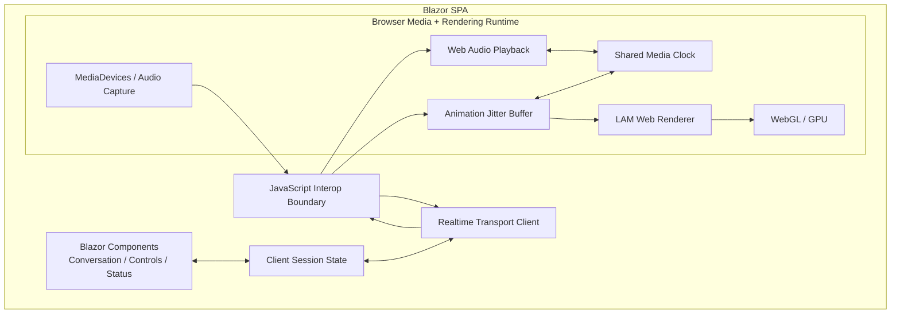

## Why JavaScript interop exists

Blazor owns the application UI and session state.

Browser-native JavaScript is the correct boundary for:

- `navigator.mediaDevices.getUserMedia`;
- low-level microphone frame acquisition;
- `AudioContext`;
- audio scheduling;
- WebGL;
- LAM WebRender integration;
- frame synchronization.

Do not force these real-time media operations through frequent high-overhead Blazor/.NET round trips.

The preferred model is:

```text
Blazor
  │
  │ coarse commands/state
  ▼
JS media/rendering module
  │
  │ real-time frames
  ▼
Browser APIs / WebGL
```

---

# 16. Browser Audio / Avatar Synchronization

Audio playback is the authoritative media clock.

Animation frames are applied relative to the same speech-generation timeline.

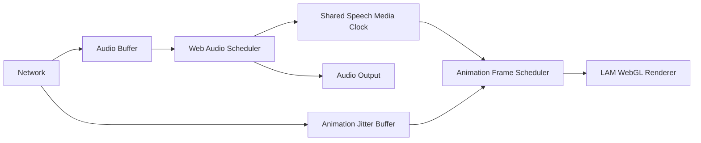

Animation should therefore be selected by:

```text
currentAudioMediaTimestamp
```

rather than by:

```text
animationPacketArrivalTime
```

This prevents network jitter from becoming visible lip-sync jitter.

---

# 17. Lifecycle Event Model

Every lifecycle event should carry a common envelope.

```csharp
LifecycleEventEnvelope
{
    EventId,
    EventType,
    Timestamp,
    SessionId,
    ConversationId,
    TurnId?,
    UtteranceId?,
    SpeechGenerationId?,
    AnimationStreamId?,
    CorrelationId,
    CausationId,
    Payload
}
```

## Recommended lifecycle events

### Session

```text
SessionStarting
SessionStarted
SessionEnding
SessionEnded
SessionFaulted
```

### User audio

```text
MicrophoneOpened
UserSpeechStarted
UserAudioChunkReceived
UserSpeechEnded
UserBargeInDetected
```

### STT

```text
TranscriptionStarted
TranscriptPartial
TranscriptFinal
TranscriptionCompleted
TranscriptionFailed
```

### Conversation turn

```text
UserTurnStarting
UserTurnCommitted
BeforeAgentInference
AgentInferenceStarted
AgentTokenReceived
AgentResponseCommitted
AgentInferenceCompleted
AgentInferenceFailed
TurnCancelled
TurnCompleted
```

### Background work

```text
BackgroundWorkRequested
BackgroundWorkAccepted
BackgroundWorkStarted
BackgroundWorkProgress
BackgroundWorkCompleted
BackgroundWorkFailed
BackgroundWorkCancelled
```

### TTS

```text
BeforeTts
TtsStarted
TtsAudioChunkGenerated
TtsCompleted
TtsCancelled
TtsFailed
```

### Animation

```text
AnimationStarted
Audio2FaceStreamOpened
RawBlendshapeFrameReceived
AvatarAnimationFrameProduced
AnimationCompleted
AnimationCancelled
AnimationFailed
```

### Client playback/rendering

```text
PlaybackStarted
PlaybackBufferLow
PlaybackCompleted
AvatarAssetLoaded
AvatarRenderStarted
AnimationFrameApplied
RenderDegraded
ClientBargeIn
```

---

# 18. Middleware Pipeline

Middleware is executed around logical operations rather than third-party APIs.

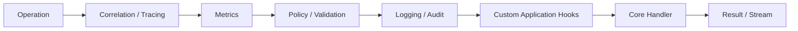

A generic middleware contract can be modeled as:

```csharp
public interface IVoicePipelineMiddleware
{
    ValueTask InvokeAsync(
        VoicePipelineContext context,
        VoicePipelineDelegate next,
        CancellationToken cancellationToken);
}
```

For stream-intensive stages, use observers/interceptors rather than copying full stream payloads through every middleware component.

---

# 19. Primary Hook Points

The following are intentional extension seams.

| Hook                             | What is available             | Typical use                       |
| -------------------------------- | ----------------------------- | --------------------------------- |
| `UserAudioReceived`            | raw/normalized mic audio      | meters, diagnostics, recording    |
| `BeforeStt`                    | speech segment                | preprocessing, metadata           |
| `TranscriptPartial`            | evolving text                 | live captions/UI                  |
| `TranscriptFinal`              | committed user text           | persistence, policy               |
| `BeforeAgentInference`         | full agent request            | prompt augmentation, tracing      |
| `AgentTokenReceived`           | streamed response token/event | UI streaming, telemetry           |
| `AgentResponseCommitted`       | final response                | persistence, action extraction    |
| `BackgroundWorkRequested`      | durable task request          | workflow routing                  |
| `BeforeTts`                    | speech text + voice config    | pronunciation, prosody transforms |
| `TtsAudioChunkGenerated`       | generated audio               | metrics, recording, waveform      |
| `BeforeAudio2Face`             | identical TTS audio           | animation controls                |
| `RawBlendshapeFrameReceived`   | raw A2F output                | diagnostics                       |
| `AvatarAnimationFrameProduced` | canonical frame               | retargeting extensions            |
| `BeforeClientPlayback`         | audio + media timeline        | jitter buffering                  |
| `AnimationFrameApplied`        | client frame                  | render telemetry                  |
| `TurnCompleted`                | entire turn correlation graph | persistence / analytics           |

---

# 20. Realtime Transport Boundary

The Blazor SPA communicates with the application backend over a realtime session channel.

The logical contract includes independent message streams:

```text
client → server
    microphone audio
    client lifecycle
    UI commands
    cancel/barge-in
    user interaction events

server → client
    partial transcripts
    agent text/events
    synthesized audio
    avatar animation frames
    background-work progress
    session lifecycle
    errors / warnings
```

SignalR or raw WebSockets may implement this boundary.

The logical contract must remain independent of the chosen transport.

---

# 21. Correlation and Timing

Every data element in a spoken response must be traceable to the same speech generation.

Example:

```text
SessionId          = S42
TurnId             = T19
SpeechGenerationId = SP19-A
AnimationStreamId  = AN19-A
```

Audio:

```text
SP19-A / sequence 0041 / media time 820 ms
```

Animation:

```text
AN19-A / sequence 0025 / media time 833 ms
```

The browser aligns both against the speech media clock.

This provides deterministic observability from:

```text
human audio
   ↓
transcript
   ↓
agent turn
   ↓
generated speech
   ↓
facial animation
   ↓
browser playback/rendering
```

---

# 22. Error and Cancellation Boundaries

Errors should be translated at every infrastructure boundary.

For example:

```text
Audio2Face gRPC error
       ↓
Audio2FaceAdapter
       ↓
AvatarAnimationException
       ↓
AnimationFailed lifecycle event
       ↓
Voice Orchestrator policy
```

The UI should never receive raw infrastructure exceptions.

Likewise, cancellation must propagate:

```text
User barge-in
    ↓
Voice Orchestrator cancels active SpeechGenerationId
    ├── cancel Chatterbox request
    ├── stop audio fan-out
    ├── cancel Audio2Face stream
    ├── flush queued browser audio
    └── discard future animation frames
```

---

# 23. LAM Avatar Provisioning vs Runtime

LAM avatar creation is a provisioning concern.

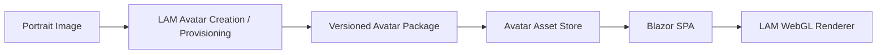

Runtime conversation does not reconstruct the avatar.

At session initialization:

1. the Blazor SPA receives the avatar identity/configuration;
2. the browser loads the versioned LAM avatar package;
3. WebGL resources are initialized;
4. the client emits `AvatarAssetLoaded`;
5. animation frames may then be applied.

---

# 24. Component Responsibility Matrix

| Component                    | Owns                                | Does not own                   |
| ---------------------------- | ----------------------------------- | ------------------------------ |
| Blazor SPA                   | UX, client state, media interaction | conversation truth             |
| Browser media module         | mic/audio scheduling/media clock    | agent logic                    |
| LAM Web Renderer             | visual avatar rendering             | speech generation              |
| Realtime Gateway             | client transport/session stream     | agent policy                   |
| Whisper STT                  | audio → transcript                 | turn orchestration             |
| Voice Orchestrator           | live conversational state machine   | model internals                |
| Agent Inference Endpoint     | text/token inference                | conversation/session lifecycle |
| Background Work Orchestrator | durable/non-blocking work           | realtime speech loop           |
| Chatterbox-TTS-Server        | text → synthesized speech          | audio playback                 |
| Speech Stream Hub            | ordered fan-out of generated audio  | speech generation              |
| Audio2Face-3D NIM            | speech audio → facial coefficients | browser rendering              |
| Avatar Animation Service     | normalized animation contract       | LAM rendering                  |
| Event/Middleware Pipeline    | hooks/observation/policy            | domain ownership               |

---

# 25. Canonical Internal Contracts

The system should standardize a small set of transport-neutral records.

```text
AudioFrame
TranscriptEvent
ConversationTurn
AgentInferenceRequest
AgentInferenceEvent
BackgroundWorkRequest
BackgroundWorkEvent
TtsRequest
TtsAudioChunk
RawFacialAnimationFrame
AvatarAnimationFrame
LifecycleEventEnvelope
```

These contracts—not Docker images, gRPC protos, OpenAI JSON, or browser message formats—form the application architecture.

---

# 26. Full Pipeline with Lifecycle Hook Points

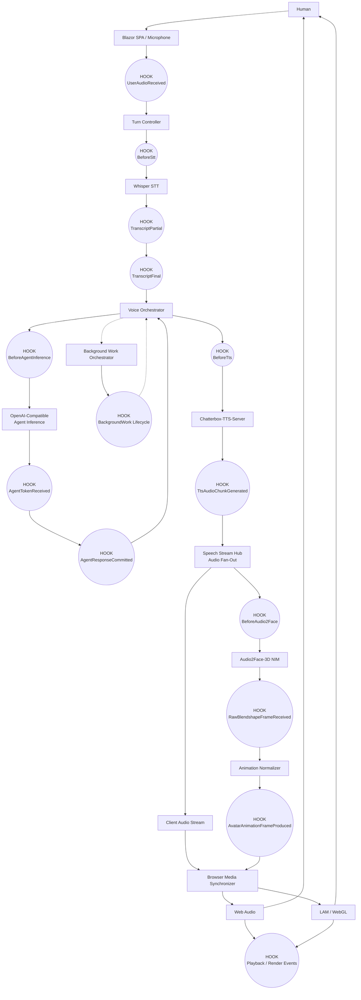

This diagram is the primary reference for pipeline interception.

---

# 27. Recommended Namespace / Project Boundaries

A possible .NET solution decomposition:

```text
Application.Voice
    VoiceOrchestrator
    TurnController
    VoiceSession
    lifecycle contracts

Application.BackgroundWork
    BackgroundWorkOrchestrator
    job contracts

Application.Contracts
    AudioFrame
    TranscriptEvent
    TtsAudioChunk
    AvatarAnimationFrame
    lifecycle envelopes

Application.Middleware
    voice middleware
    stream observers
    telemetry hooks

Infrastructure.Whisper
    ISpeechToTextService implementation

Infrastructure.AgentInference.OpenAI
    IAgentInferenceService implementation

Infrastructure.Chatterbox
    ITtsService implementation

Infrastructure.Audio2Face
    IAudio2FaceService implementation
    gRPC/protobuf isolation

Infrastructure.Realtime
    SignalR/WebSocket transport
    client session gateway

Web.Blazor
    Razor components
    application state
    JS interop façade

Web.Blazor/wwwroot/media
    microphone capture
    Web Audio scheduling
    shared media clock
    jitter buffer

Web.Blazor/wwwroot/avatar
    LAM WebRender integration
    WebGL
    avatar asset loader
```

---

# 28. Selected Runtime Technology Boundaries

```text
Human Speech
    │
    ▼
Browser Media Capture
    │
    ▼
Whisper STT
    │
    ▼
Voice Orchestrator
    │
    ▼
OpenAI-Compatible Agent Inference Endpoint
    │
    ▼
Voice Orchestrator
    │
    ▼
Chatterbox-TTS-Server
    │
    ├────────────► Browser Web Audio
    │
    └────────────► Audio2Face-3D NIM
                        │
                        ▼
                 ARKit Blendshapes
                        │
                        ▼
                Animation Normalizer
                        │
                        ▼
                 Blazor Realtime UI
                        │
                        ▼
                 LAM WebGL Renderer
```

The Background Work Orchestrator is deliberately adjacent to—not inline with—this path.

---

# 29. Architectural Invariants

The following should be treated as design rules:

1. **Whisper is STT; Chatterbox is TTS.**
2. The Voice Orchestrator is the authority for conversational lifecycle.
3. The Background Work Orchestrator never silently becomes part of the critical speech path.
4. A single generated audio stream feeds both playback and Audio2Face.
5. Browser playback time is the authoritative synchronization clock.
6. Audio2Face-specific messages do not cross the Avatar Animation Service boundary.
7. OpenAI wire contracts do not cross the agent/TTS infrastructure adapter boundaries.
8. LAM rendering occurs in the browser through the WebGL integration layer.
9. Every stream supports cancellation and correlation.
10. Every major pipeline stage exposes lifecycle hooks.
11. Client rendering and transport jitter must not alter server-side conversational truth.
12. Third-party model/server failures are translated into application-level events/errors.
13. Avatar reconstruction/provisioning is separate from realtime animation.
14. UI interaction events and speech events share the same session/correlation model.

---

# 30. External Implementation Notes

The following implementation facts informed this concept:

- NVIDIA Audio2Face-3D NIM accepts speech and produces ARKit-compatible facial blendshape animation. Its service integration uses streaming gRPC.
- OpenAI Whisper is a speech recognition / speech-to-text model.
- Chatterbox-TTS-Server provides OpenAI-compatible TTS APIs. Current upstream server releases also provide a streaming TTS mode; the selected deployment should remain isolated behind `ITtsService`.

References:

- NVIDIA Audio2Face-3D NIM documentation:https://docs.nvidia.com/ace/audio2face-3d-microservice/latest/
- NVIDIA Audio2Face-3D overview:https://docs.nvidia.com/ace/audio2face-3d-microservice/latest/text/getting-started/overview.html
- Chatterbox-TTS-Server:https://github.com/devnen/Chatterbox-TTS-Server
- OpenAI Whisper:
  https://github.com/openai/whisper

---

# 31. Summary

The system is built around two orchestration planes:

```text
REALTIME PLANE
Voice Orchestrator
    ↓
STT → Agent → TTS → Audio + Animation → Browser

DURABLE WORK PLANE
Background Work Orchestrator
    ↓
Queued / asynchronous work → lifecycle events → conversation
```

The **Voice Orchestrator** coordinates the live interaction.

The **Background Work Orchestrator** handles durable work without contaminating the realtime latency path.

The **Blazor SPA** handles microphone interaction, conversational UI, audio playback, and LAM/WebGL rendering.

The **middleware/lifecycle event system** makes the entire pipeline observable and interceptable at defined boundaries.

The resulting architecture allows application logic to hook into the conversation at audio, transcription, inference, work dispatch, TTS, animation, playback, and rendering stages while keeping all external server protocols behind stable internal interfaces.
