# World State Engine for Agent Frameworks: An Event-Sourced, Bitemporal Cognitive State Architecture

## Executive summary

The central idea developed in this session is technically coherent and, with several refinements, forms a distinct architectural pattern for long-running AI agents:

> **Chat history stops being the agent's memory. It becomes one of the sensory records that produced its memory.**

The proposed **World State Engine (WSE)** continuously maintains an explicit, structured representation of what an agent currently believes about its world. It pairs that materialized current state with an immutable, timestamped event ledger and provenance graph. The agent normally reasons forward from the current World Model; when it needs to explain *why*, *when*, or *how* something became true, it **thinks backwards** through assertions, derivations, events, and ultimately raw evidence.

This is meaningfully different from conventional conversational memory. Microsoft Agent Framework's `ChatHistoryMemoryProvider` embeds chat history in a vector store and retrieves semantically similar prior messages; it is therefore well suited to episodic recall, but it does not define canonical current state, supersession, contradiction, causal lineage, or temporal validity. Agent Framework's `AIContextProvider`, by contrast, is explicitly designed to inject dynamic context before an invocation and extract/store state afterward, making a custom `WorldModelContextProvider` the natural integration point. The current Agent Framework pipeline loads history, invokes context providers, calls the model/tool pipeline, then notifies providers after the run. citeturn14view0turn14view1turn22view1

The recommended architecture separates four context layers:

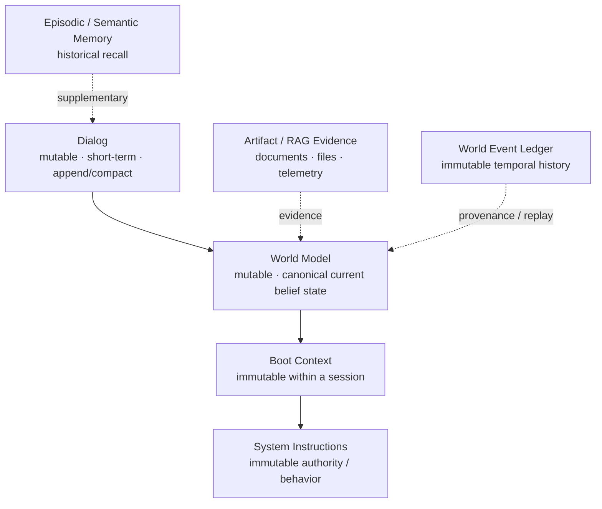

The architectural distinction is:

| Layer | Primary question |
|---|---|
| System Instructions | **What am I allowed and required to do?** |
| Boot Context | **What environment did I wake into?** |
| World Model | **What do I currently believe is true?** |
| Dialog | **What are we discussing or doing right now?** |
| Event Ledger | **How did the world become this way?** |
| Evidence Store | **Why do I believe it?** |
| Episodic Memory | **What relevant things happened before?** |

The World Model should be the **primary cognitive read model**, while the immutable event ledger should be the **authoritative durability and audit model**. This resolves an important tension in the session: operationally, the agent should not reconstruct reality from history on every turn; durably, however, event sourcing argues that accepted state transitions should remain the recoverable source from which materialized state can be rebuilt. Azure's event-sourcing guidance explicitly treats immutable events as the system of record and snapshots/materialized projections as optimizations for efficient state reconstruction. citeturn22view0

The core invariant should therefore be:

\[
W_v = \operatorname{Fold}(Reduce,\; W_0,\; E_1,\ldots,E_v)
\]

where `W_v` is the materialized World Model at committed version `v`, and `E_n` are immutable accepted World Events.

A proposed change from an LLM is **not** an event. It is an untrusted `WorldDelta`. A deterministic reducer and policy layer validate that delta before converting it into committed events:

\[
O_t
\rightarrow Observer
\rightarrow Integrator(W_v)
\rightarrow Critic
\rightarrow \Delta W
\rightarrow Validate
\rightarrow Commit(E_{v+1...n})
\rightarrow W_{v+n}
\]

This separation is critical. Three fast LLMs can aggressively expand, normalize, reconcile, and critique the model without being granted direct authority to rewrite reality. Research on multi-agent debate shows that multiple model instances can improve reasoning and factuality on evaluated tasks, and Agent Framework provides sequential and concurrent orchestration primitives, but those results do not establish that model consensus itself is a correctness guarantee. The production boundary should therefore remain deterministic. citeturn20search2turn15search0turn15search12

A second major refinement is **bitemporality**. Snodgrass and Ahn's seminal temporal-database work distinguished **valid time**—when something is true in the modeled reality—from **transaction time**—when the database represented it as true. Supporting both permits queries about what was true at one time *as known at another time*. citeturn17view0turn19view0 The WSE should extend that with observation lineage:

```text
OccurredAt     When an event happened in the world
ObservedAt     When a source/sensor/agent encountered it
RecordedAt     When the WSE committed the information

ValidFrom/To   When an assertion applies in world time
KnownFrom/To   When that assertion was part of WSE knowledge
```

This enables two fundamentally different questions:

> **"What do we now know was true on August 12?"**

versus:

> **"What did the agent believe on August 13 about August 12?"**

The graph itself should make assertions first-class objects rather than treating relationships as bare edges. Each assertion needs epistemic modality, lifecycle state, confidence/support, temporal validity, provenance, derivation dependencies, source identity, and security labels. W3C RDF provides a standardized subject-predicate-object graph model, while W3C PROV provides domain-independent concepts for representing the entities, activities, agents, and lineage involved in producing information. These standards strongly support a graph-native representation, although the WSE need not require an RDF store. citeturn21search3turn15search2turn15search18

The largest technical risk is not scale. It is **epistemic amplification**: an inferred proposition becomes input to another inference, then another, until a chain of mutually consistent model-generated assertions is mistaken for independent evidence. Doyle's Truth Maintenance System work is directly relevant: robust belief systems maintain not just propositions but the reasons and dependencies supporting those propositions so beliefs can be revised when their justifications change. citeturn20search3

Therefore a WSE should enforce:

> **Inference may expand the World Model, but inference may never manufacture evidence.**

Every active derived assertion should ultimately terminate in independently identifiable evidence roots. Cyclic inference without new evidence should be rejected or quarantined. Contradictions should remain explicit rather than being averaged away into a single confidence number.

Finally, the WSE complements rather than replaces RAG and semantic memory. Classical RAG combines a model with retrieved non-parametric evidence; Microsoft's GraphRAG extracts a graph and hierarchical summaries from a corpus to improve structured retrieval. A WSE instead maintains a **live, versioned, temporal belief state** produced by ongoing interaction with users, agents, tools, and external systems. citeturn16search1turn21search1

The recommended end-state is therefore:

> **Current State for cognition. Event history for reconstruction. Provenance for justification. Evidence for grounding. Semantic memory for recall. Dialog for interaction.**

That is a substantially stronger abstraction than using chat history as the agent's central persistent memory.

## Session synthesis and research findings

### Evolution of the concept

The session began with a conceptual extension of `ChatHistoryMemory`:

```text
┌───────────────────────────────────────────────┐
│ 4. DIALOG                                     │
│    Mutable / update each turn                 │
├───────────────────────────────────────────────┤
│ 3. WORLD MODEL                                │
│    Mutable / evolves with understanding       │
├───────────────────────────────────────────────┤
│ 2. BOOT CONTEXT                               │
│    Read-only                                  │
├───────────────────────────────────────────────┤
│ 1. SYSTEM INSTRUCTIONS                        │
│    Read-only                                  │
└───────────────────────────────────────────────┘
```

The first important architectural decision was to preserve this **conceptual stack** while separating its implementation mechanisms. In current Microsoft Agent Framework, `ChatHistoryProvider` owns conversational history while `AIContextProvider` is the extension point for dynamic context and state enrichment. Microsoft explicitly documents custom context providers for injecting dynamic messages/instructions/tools and extracting relevant state after a run; provider instances are shared across sessions, while session-specific identifiers/state should reside in `AgentSession`, including through `ProviderSessionState<T>`. citeturn14view0turn14view1

The conclusion was therefore:

```text
Agent Context
────────────────────────────────────────
Dialog          -> ChatHistoryProvider
World Model     -> WorldModelContextProvider
Boot Context    -> BootContextProvider / immutable state
Instructions    -> Agent instructions
────────────────────────────────────────

Adjacent memory systems
────────────────────────────────────────
Episodic memory -> ChatHistoryMemoryProvider
Artifact memory -> RAG / GraphRAG
Temporal memory -> World Event Ledger
────────────────────────────────────────
```

This decision is strengthened by the actual semantics of `ChatHistoryMemoryProvider`: Microsoft documents it as vector-store-backed chat memory with embeddings, configurable storage/search scopes, and semantic retrieval before invocation or on demand. It can search prior sessions for the same user and by default returns a bounded number of matching memories. That is useful for autobiographical/episodic recall, but fundamentally different from maintaining a normalized latest state. citeturn22view1

### The key conceptual leap: think backwards

The user then proposed that a sufficiently rich current World Model could reduce dependence on historical memory because the agent could derive many answers directly from current state, consulting a timestamped history only where historical explanation was necessary.

The resulting query hierarchy is:

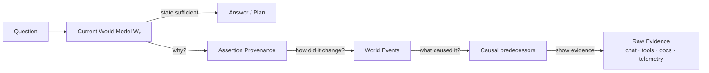

This is the essence of **thinking backwards**.

A traditional memory-first agent often does:

```text
question
   ↓
retrieve old conversations/documents
   ↓
reconstruct current situation
   ↓
reason
```

The proposed WSE does:

```text
question
   ↓
inspect current world state
   ↓
reason
   ↓
only when necessary:
    traverse provenance/history backwards
```

This does not remove information or storage requirements. It **moves computation** from repeated query-time reconstruction into continuous state maintenance. The system may actually store *more* total data because it retains events, evidence, materialized current state, indexes, and snapshots simultaneously. Event sourcing exhibits the same deliberate redundancy: event streams are authoritative, while materialized views and snapshots trade storage for lower read/reconstruction cost. citeturn22view0

That trade is favorable when present-state reasoning is much more frequent than historical reconstruction.

### World Model versus established meanings of “world model”

Terminology needs care. Ha and Schmidhuber's influential *World Models* work learns compressed latent spatial and temporal representations of an environment and uses those learned dynamics for policy behavior. The WSE proposed here is not the same object: it is primarily an explicit, inspectable, symbolic/graph **belief-state representation**, although future versions could contain learned predictive dynamics as one component. citeturn15search3

A precise naming distinction would be:

```text
World State Engine
    ├── Explicit World Model       current beliefs/state
    ├── Temporal Event Model       state-transition history
    ├── Provenance Model           why beliefs exist
    ├── Evidence Model             source observations
    └── Optional Dynamics Model    learned/predictive behavior
```

This preserves the intuitive “world model” terminology without conflating an explicit knowledge-state graph with a learned latent simulator.

### Relationship to agent-memory research

Several influential agent-memory systems point toward pieces of this design without implementing the complete WSE abstraction.

Generative Agents maintain a stream of experiences, retrieve memories dynamically, synthesize higher-order reflections, and use those reflections in planning; the authors' ablations found observation, planning, and reflection each contributed to agent behavior in their simulated setting. citeturn16search2 MemGPT frames long-context operation as virtual context management, moving information between a limited active context and external storage. citeturn16search3 These systems reinforce the distinction between **large persistent memory** and **small active model context**.

The WSE extends that line in a different direction:

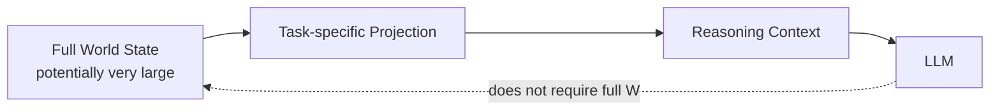

This recreates the earlier session's “large World → working projection → reasoning context” visual without assuming arbitrary byte sizes.

The full graph may grow very rapidly. That is acceptable provided **model context size and world-state size remain separate concerns**. Agent Framework itself warns through its context-provider model that injected context participates in model invocation, so the WSE adapter should project rather than serialize the whole graph. citeturn14view0turn14view1

### Decisions reached and issues still open

| Topic | Session conclusion / recommended resolution | Remaining question |
|---|---|---|
| World Model placement | Separate custom `WorldModelContextProvider`, not chat history | Exact projection contract |
| Current state vs history | Current model is primary cognitive read model; ledger is durable authority | Snapshot interval and retention |
| Update strategy | LLM proposes delta; deterministic reducer commits | Validation-rule language |
| Three-model loop | Observer → Integrator → Critic | Sequential vs partial parallelism |
| History | Typed immutable events + raw evidence | Event granularity |
| Time | Bitemporal assertions + explicit observation/commit timestamps | How much temporal precision domains need |
| Graph | Assertions as first-class graph objects | RDF vs property graph vs custom in-memory graph |
| Confidence | Epistemic modality + provenance first; score second | Calibration method |
| Conflict | Preserve competing claims and explicit contradiction | Domain-specific adjudication |
| Sharing | WSE can outlive chat sessions | World/tenant/user/project scope rules |
| Agent Framework | Context-provider adapter + session reference | Whether update loop runs synchronously or as workflow/background service |
| Security | Provenance, trust labels, write gates, least privilege | Retention/deletion versus immutable audit |
| Scale | Large state is acceptable; project only reasoning neighborhood | Partitioning and hot-subgraph strategy |

The largest unresolved design decision is **world scope**. A “world” may represent one user, one project, one digital environment, one organization, or a federation of bounded contexts. A production implementation should not default to one universal graph: event streams partition naturally by entity or aggregate, and the security implications of shared persistent state are substantial. Azure's event-sourcing guidance notes that per-entity streams naturally support partitioning, while Microsoft's agent-memory security guidance explicitly recommends deterministic isolation across users, agents, and tenants. citeturn22view0turn22view3

## World State Engine conceptual architecture

### Overall architecture

The consolidated architecture is:

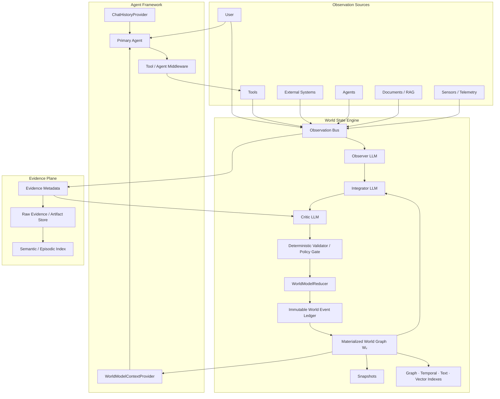

The WSE is deliberately not an LLM wrapper. Its critical responsibilities are conventional systems responsibilities:

**identity, state, ordering, transactions, temporal semantics, provenance, authorization, indexing, consistency, and audit.**

LLMs perform interpretation and hypothesis generation inside that structure.

### Agent Framework lifecycle

Current Microsoft Agent Framework documentation describes a layered invocation in which chat history is loaded, context providers add messages/tools/instructions/state, the client executes the LLM and tool-call pipeline, and history/context providers receive the result afterward. citeturn14view0

A WSE adapter fits that pipeline as follows:

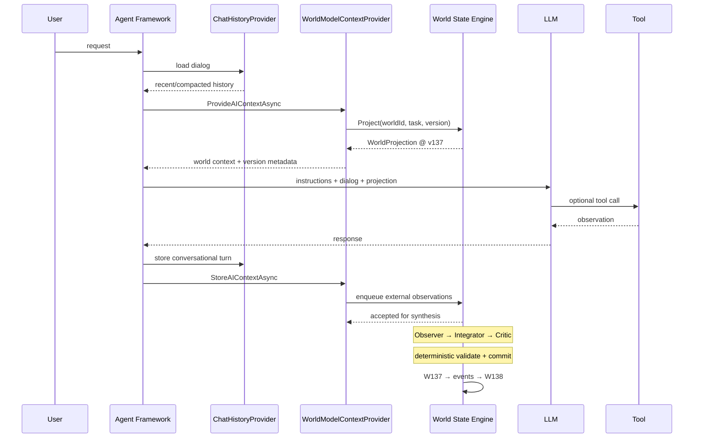

The current `.NET` context-provider API exposes `ProvideAIContextAsync(InvokingContext, ...)` for loading relevant context and `StoreAIContextAsync(InvokedContext, ...)` for extracting/storing information. Microsoft also recommends storing session-specific state in `AgentSession` rather than on the provider instance. citeturn14view1

One subtle issue deserves explicit handling: **provider feedback loops**. Context injected by `WorldModelContextProvider` must not return through the post-run path and be interpreted as fresh evidence about the world. Agent Framework's advanced context-provider implementation already distinguishes externally supplied input when filtering messages, providing a useful precedent for this boundary. citeturn14view1

### The three-fast-model synthesis loop

The earlier conceptual loop should be retained, but its roles tightened:

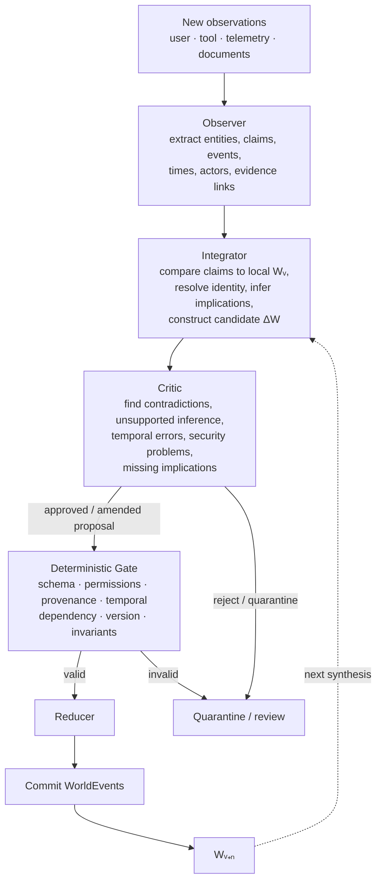

The preferred orchestration is **bounded and role-structured**, not an open-ended group conversation.

The Observer should be optimized for extraction and normalization. It should not decide canonical truth.

The Integrator should receive the relevant neighborhood of `W_v`, not necessarily the entire World Model. It performs identity resolution, compares new claims with existing assertions, identifies supersession and contradiction, and proposes `WorldDelta`.

The Critic should be intentionally adversarial. It asks whether the delta has sufficient evidence, whether it confuses desire with observation, whether its derivations are circular, whether it incorrectly overwrites competing claims, and whether temporal/security rules are satisfied.

The reducer is code.

Agent Framework's sequential orchestration is a natural fit because each stage depends on the previous stage's structured output. Concurrent orchestration is useful for independent validators or alternative extractors, and Microsoft's documentation explicitly characterizes it as useful for diverse perspectives, ensemble reasoning, and voting. citeturn15search0turn15search12 Multi-agent debate experiments provide evidence that multiple model instances can improve performance in particular reasoning and factuality settings, but that evidence supports **using critics**, not granting a majority vote database-write authority. citeturn20search2

### Current state, causal graph, and timeline

The earlier pair of temporal and causal diagrams should remain separate:

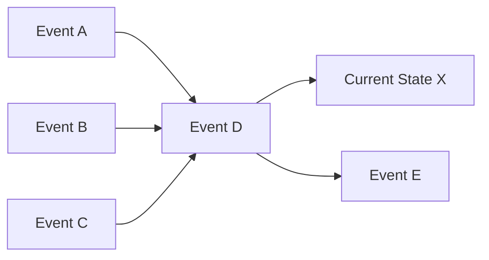

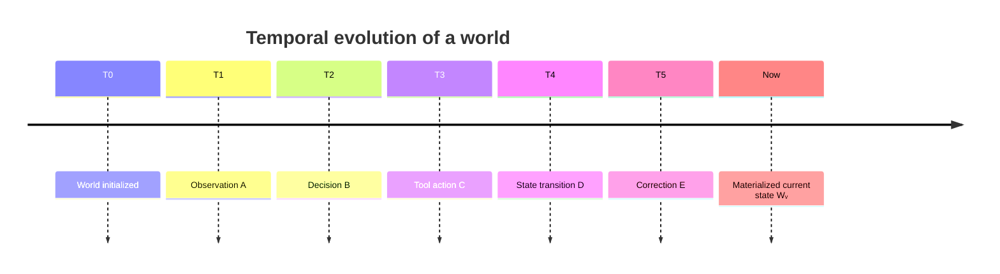

Causal and temporal adjacency are not equivalent. An event occurring immediately before another event is not necessarily its cause; therefore the engine should maintain explicit `CausationId`/dependency relationships rather than deriving causation from timestamps.

The resulting backward path becomes literal graph traversal:

```text
Current assertion
      │
      └── derivedFrom ──► assertion(s)
                              │
                              └── supportedBy ──► evidence
                                                       │
                                                       └── generatedBy ──► event
                                                                                │
                                                                                └── causedBy ──► event
```

That is the operational definition of **thinking backwards**.

### Event replay and snapshots

The earlier snapshot visual becomes:

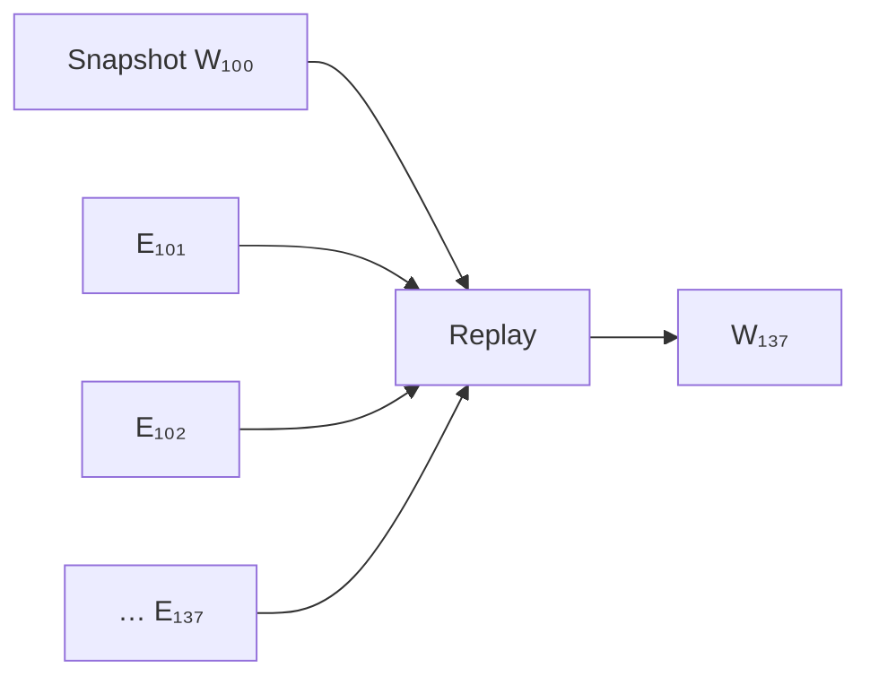

Azure's event-sourcing guidance explicitly recommends snapshots when event streams become expensive to replay, while maintaining the event stream as the source of truth. It also recommends immutable events, event schema versioning/upcasting, ordering mechanisms, optimistic concurrency, idempotent handling, and compensating events rather than silently rewriting history. citeturn22view0

The WSE should adopt those patterns directly.

## Canonical data model and APIs

### Graph-native model

RDF's foundational model represents information as subject-predicate-object triples, and W3C PROV standardizes provenance concepts for entities, activities, and agents. citeturn21search3turn15search18 For the WSE, however, a bare triple is insufficient because the **assertion itself** needs rich metadata.

Therefore the logical model should reify assertions:

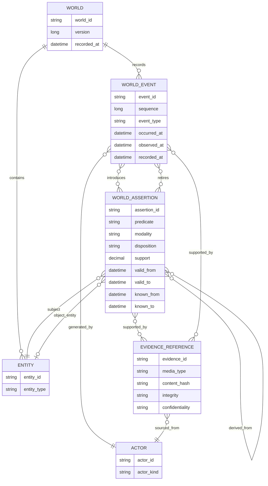

This model is portable across a custom in-memory graph, a property graph, RDF/quad storage, or even a relational schema. RDF remains attractive for semantic interoperability, while property graphs can offer convenient operational traversal; the logical WSE API should avoid making either representation mandatory. W3C PROV is particularly useful as an interoperability vocabulary for provenance export even if the internal graph uses different types. citeturn15search2turn21search3

### Assertions: belief is not truth

A core mistake would be to encode:

```text
Server --address--> 10.0.0.8
```

as though the graph were an oracle.

Instead:

```text
Assertion A924
    subject       = Server-17
    predicate     = network.address
    object        = 10.0.0.8
    modality      = Observed
    disposition   = Active
    support       = 0.98
    validFrom     = ...
    validTo       = ...
    knownFrom     = ...
    knownTo       = ...
    supportedBy   = ToolResult-552
```

A useful separation is:

| Dimension | Values | Meaning |
|---|---|---|
| **Epistemic modality** | `Observed`, `Reported`, `Extracted`, `Inferred`, `Predicted`, `Assumed`, `Desired` | How the claim entered cognition |
| **Disposition** | `Active`, `Contested`, `Superseded`, `Retracted`, `Expired`, `Quarantined` | Current lifecycle state |
| **Support** | system-defined score | Strength of current support |
| **Evidence roots** | immutable evidence IDs | Independent grounding |
| **Derivation** | assertion/rule references | Logical lineage |
| **Valid time** | `[ValidFrom, ValidTo)` | When it applies in the modeled world |
| **Knowledge time** | `[KnownFrom, KnownTo)` | When the WSE represented it as believed |
| **Security** | integrity/confidentiality labels | Who may trust/receive/use it |

Do not overload `Disposition` to encode epistemology. “Inferred” and “superseded,” for example, answer different questions.

### Illustrative core contracts

The following is a conceptual C# contract, not a claim that these types exist in Agent Framework today:

```csharp
public readonly record struct WorldId(string Value);
public readonly record struct WorldVersion(long Value);
public readonly record struct EntityId(string Value);
public readonly record struct AssertionId(Guid Value);
public readonly record struct EvidenceId(Guid Value);
public readonly record struct EventId(Guid Value);

public enum ActorKind
{
    User,
    Agent,
    Tool,
    ExternalSystem,
    HumanReviewer,
    System
}

public readonly record struct ActorId(
    ActorKind Kind,
    string Value);

public enum EpistemicModality
{
    Observed,
    Reported,
    Extracted,
    Inferred,
    Predicted,
    Assumed,
    Desired
}

public enum AssertionDisposition
{
    Active,
    Contested,
    Superseded,
    Retracted,
    Expired,
    Quarantined
}

public sealed record TemporalInterval(
    DateTimeOffset From,
    DateTimeOffset? To);

public sealed record EvidenceReference(
    EvidenceId Id,
    Uri? Location,
    string MediaType,
    string ContentHash,
    ActorId Source,
    DateTimeOffset ObservedAt,
    string IntegrityLabel,
    string ConfidentialityLabel,
    string? RetentionClass = null);

public sealed record WorldAssertion(
    AssertionId Id,
    EntityId Subject,
    string Predicate,
    object Value,
    EpistemicModality Modality,
    AssertionDisposition Disposition,

    // World/valid time.
    TemporalInterval ValidTime,

    // Database/knowledge time.
    TemporalInterval KnowledgeTime,

    // A support metric, not automatically a calibrated probability.
    double Support,

    ActorId AssertedBy,
    IReadOnlyList<EvidenceReference> Evidence,
    IReadOnlyList<AssertionId> DerivedFrom,
    IReadOnlySet<EvidenceId> RootEvidence,

    DateTimeOffset LastVerifiedAt,
    string SchemaVersion);
```

`EvidenceReference` should generally point to evidence rather than copying full evidence into the World Graph. That permits separate lifecycle, encryption, retention, access control, vectorization, and redaction policies.

### World Events and deltas are different types

The distinction between **proposal** and **committed history** should be visible in the type system:

```csharp
public sealed record WorldEvent(
    EventId Id,
    WorldId WorldId,
    long Sequence,
    string EventType,
    string SchemaVersion,

    ActorId Actor,

    DateTimeOffset OccurredAt,
    DateTimeOffset ObservedAt,
    DateTimeOffset RecordedAt,

    Guid CorrelationId,
    EventId? CausationId,

    IReadOnlyList<AssertionId> IntroducedAssertions,
    IReadOnlyList<AssertionId> RetiredAssertions,
    IReadOnlyList<EvidenceReference> Evidence,

    string PayloadHash);
```

`WorldEvent` means:

> **The WSE accepted and committed this transition.**

A `WorldDelta` means:

> **A cognitive component proposes these mutations.**

```csharp
public abstract record WorldMutation;

public sealed record UpsertEntity(
    EntityId EntityId,
    string EntityType,
    IReadOnlyDictionary<string, object> Properties)
    : WorldMutation;

public sealed record AddAssertion(
    WorldAssertion Assertion)
    : WorldMutation;

public sealed record RetractAssertion(
    AssertionId AssertionId,
    string Reason)
    : WorldMutation;

public sealed record MarkContested(
    AssertionId AssertionId,
    IReadOnlyList<AssertionId> ConflictsWith)
    : WorldMutation;

public sealed record LinkEvidence(
    AssertionId AssertionId,
    EvidenceReference Evidence)
    : WorldMutation;

public sealed record WorldDelta(
    Guid ProposalId,
    WorldId WorldId,
    WorldVersion BaseVersion,
    ActorId ProposedBy,
    IReadOnlyList<WorldMutation> Mutations,
    IReadOnlyList<EvidenceReference> Evidence);
```

This creates a powerful trust boundary:

```text
LLM OUTPUT                    DATABASE FACT
──────────                    ─────────────
WorldDelta      ≠             WorldEvent
proposal                      accepted transition
untrusted                     validated
revisable                     immutable
```

### Required interfaces

A minimal platform-neutral abstraction can remain small:

```csharp
public interface IWorldModel
{
    WorldId Id { get; }
    WorldVersion Version { get; }

    ValueTask<WorldProjection> ProjectAsync(
        WorldQuery query,
        ProjectionBudget budget,
        CancellationToken cancellationToken = default);

    ValueTask<IReadOnlyList<WorldAssertion>> QueryAssertionsAsync(
        AssertionQuery query,
        CancellationToken cancellationToken = default);
}
```

The projection contract is central. It should express graph scope and token/context budget separately:

```csharp
public sealed record ProjectionBudget(
    int MaxEntities,
    int MaxAssertions,
    int MaxEvents,
    int MaxEvidenceSummaries,
    int MaxEstimatedTokens);

public sealed record WorldQuery(
    IReadOnlyList<EntityId> SeedEntities,
    IReadOnlyList<string> Predicates,
    DateTimeOffset? ValidAt,
    DateTimeOffset? KnownAt,
    int MaxTraversalDepth,
    bool IncludeProvenance,
    bool IncludeContradictions);
```

The store contract:

```csharp
public interface IWorldModelStore
{
    ValueTask<WorldSnapshot> LoadAsync(
        WorldId worldId,
        WorldVersion? version = null,
        CancellationToken cancellationToken = default);

    IAsyncEnumerable<WorldEvent> ReadEventsAsync(
        WorldId worldId,
        WorldVersion afterVersion,
        CancellationToken cancellationToken = default);

    ValueTask<CommitResult> AppendAsync(
        WorldId worldId,
        WorldVersion expectedVersion,
        IReadOnlyList<WorldEvent> events,
        string idempotencyKey,
        CancellationToken cancellationToken = default);

    ValueTask SaveSnapshotAsync(
        WorldSnapshot snapshot,
        CancellationToken cancellationToken = default);
}
```

The reducer should be deterministic and separately testable:

```csharp
public interface IWorldModelReducer
{
    ReductionValidation Validate(
        WorldSnapshot current,
        WorldDelta proposed);

    ReductionResult Reduce(
        WorldSnapshot current,
        WorldDelta validatedDelta);

    WorldSnapshot Apply(
        WorldSnapshot current,
        WorldEvent committedEvent);
}
```

The strongest design property here is:

```text
Same snapshot + same committed event
                ↓
          same resulting state
```

That makes replay, regression tests, incident reconstruction, shadow validation, and deterministic recovery possible.

### Agent Framework adapter

The adapter can be conceptually thin:

```csharp
public sealed class WorldModelContextProvider : AIContextProvider
{
    private readonly IWorldStateEngine _worlds;
    private readonly ProviderSessionState<State> _sessionState;

    public WorldModelContextProvider(IWorldStateEngine worlds)
        : base(null, null)
    {
        _worlds = worlds;

        _sessionState = new ProviderSessionState<State>(
            _ => new State(),
            GetType().Name);
    }

    public override string StateKey => _sessionState.StateKey;

    protected override async ValueTask<AIContext> ProvideAIContextAsync(
        InvokingContext context,
        CancellationToken cancellationToken = default)
    {
        State state = _sessionState.GetOrInitializeState(context.Session);

        if (state.WorldId is null)
            return new AIContext();

        WorldProjection projection =
            await _worlds.ProjectForInvocationAsync(
                new WorldId(state.WorldId),
                context,
                cancellationToken);

        state.LastReadVersion = projection.Version.Value;
        _sessionState.SaveState(context.Session, state);

        return new AIContext
        {
            Messages =
            [
                new ChatMessage(
                    ChatRole.User,
                    projection.ToPromptRepresentation())
            ]
        };
    }

    protected override async ValueTask StoreAIContextAsync(
        InvokedContext context,
        CancellationToken cancellationToken = default)
    {
        State state = _sessionState.GetOrInitializeState(context.Session);

        if (state.WorldId is null)
            return;

        // Important: only legitimate external observations should enter
        // the synthesis path. Provider-injected world context must not
        // recursively become evidence about itself.
        await _worlds.EnqueueInvocationObservationsAsync(
            new WorldId(state.WorldId),
            context,
            cancellationToken);
    }

    public sealed class State
    {
        public string? WorldId { get; set; }
        public long? LastReadVersion { get; set; }
    }
}
```

The exact packaging/API may evolve, but the current Agent Framework contract does expose the two overriding methods used above and the `ProviderSessionState<T>` pattern. citeturn14view1

For a large World Model, `AgentSession` should hold only lightweight attachment state such as:

```text
WorldId
WorldBranch / Scope
LastReadVersion
ProjectionPolicyId
BootContextId
```

rather than serializing the entire World Model into session state.

## Temporal, reasoning, concurrency, and safety semantics

### Bitemporal reasoning

Snodgrass and Ahn's 1985 taxonomy is unusually well aligned with this problem. Their model separates valid time from transaction time and demonstrates that using both allows a system to ask about facts valid at one moment according to the database as it existed at another. citeturn17view0turn19view0

The WSE should implement that distinction explicitly.

For an event:

```text
OccurredAt  = when the event happened in modeled reality
ObservedAt  = when evidence of the event reached an observer
RecordedAt  = when the WSE committed the event
```

For a persistent assertion:

```text
ValidFrom / ValidTo
    └── World time:
        When is this assertion believed to hold?

KnownFrom / KnownTo
    └── Knowledge / transaction time:
        During which WSE versions/times was this
        assertion represented as accepted knowledge?
```

`ObservedAt` is additional provenance information, not a substitute for transaction time.

Consider:

```mermaid
timeline
    title Delayed discovery and retroactive correction
    Aug 12 09:00 : Service moved to Host-B
                  : ValidFrom = Aug 12
    Aug 13 12:00 : Agent still believes Host-A
    Aug 16 14:00 : Telemetry containing change is observed
    Aug 16 14:01 : WSE commits corrected assertion
                  : KnownFrom = Aug 16
    Aug 17 : Current model says Host-B since Aug 12
```

The system can now distinguish:

```text
Query:
    validAt = Aug 13
    knownAt = NOW

Answer:
    Host-B

Query:
    validAt = Aug 13
    knownAt = Aug 13

Answer:
    Host-A
```

That distinction is precisely what conventional chat-history summaries tend to destroy.

Formally, an assertion can be represented as:

\[
a =
\langle
s,p,o,
[v_f,v_t),
[k_f,k_t),
m,d,c,
P
\rangle
\]

where:

- \(s,p,o\) are subject, predicate, object;
- \([v_f,v_t)\) is valid time;
- \([k_f,k_t)\) is knowledge/transaction time;
- \(m\) is epistemic modality;
- \(d\) is disposition;
- \(c\) is support;
- \(P\) is provenance.

A bitemporal query at world time \(v\) and knowledge time \(k\) includes assertions satisfying:

\[
v_f \le v < v_t
\quad\land\quad
k_f \le k < k_t
\]

This is one of the strongest features of the design because it gives a rigorous meaning to “what did the agent know then?”

### Concurrency and versioning

Events should carry a monotonically increasing stream sequence. Timestamps remain domain facts; they should not be the sole concurrency-ordering mechanism. Azure's event-sourcing guidance notes that multi-threaded/multi-instance writers make ordering important, recommends event identifiers/order metadata, supports optimistic concurrency as an event-store capability, and emphasizes idempotent consumers. citeturn22view0

A commit should therefore look conceptually like:

```text
Current version: 812

Integrator proposes:
    BaseVersion = 812
    Delta = ...

Commit:
    Append(expectedVersion: 812)

Success:
    events 813..815 committed

or

Conflict:
    actualVersion = 814
    proposal must rebase/revalidate
```

The algorithm is:

```text
load Wᵥ
   ↓
construct Δ against v
   ↓
critic + validation
   ↓
CAS append expectedVersion=v
   │
   ├── success ──► publish/apply projection
   │
   └── conflict ─► load newer neighborhood
                   re-integrate
                   re-critic
                   retry
```

The store should also accept an **idempotency key** because retries must not duplicate state transitions.

A single universal event stream will eventually become a contention point. Partition the world into bounded streams such as:

```text
tenant/project
    ├── infrastructure
    ├── people
    ├── tasks
    ├── documents
    └── runtime-environment
```

Cross-stream views can be eventually consistent unless an invariant truly requires synchronous coordination. Azure's event-sourcing documentation explicitly notes projection/eventual-consistency tradeoffs and natural entity-oriented partitioning. citeturn22view0

Every primary agent invocation should record the World Model version it consumed:

```text
AgentRun
    WorldVersionRead = 813
    StartedAt = ...
```

If version `814` introduces a safety-critical contradiction while a long-running action based on `813` is still underway, the system can detect staleness and replan or cancel.

### State reduction, not summarization

The World Model update function is fundamentally:

\[
W_{t+1}
=
Reduce(W_t, \Delta_t)
\]

not:

\[
W_{t+1}
=
Summarize(ChatHistory)
\]

An example illustrates the distinction:

```text
t1
User:
    "We're using PostgreSQL."

World:
    Database.Engine = PostgreSQL
    modality = Reported
    disposition = Active
```

Then:

```text
t2
Tool:
    docker inspect -> postgres:18 running

World:
    Database.Engine = PostgreSQL
    Database.Version = 18
    Database.Status = Running
    modality = Observed
```

Then:

```text
t3
User:
    "We're moving to Cosmos DB."

World:
    PostgreSQL assertion -> Superseded for target architecture
    CosmosDB assertion   -> Desired / Reported plan

Event ledger:
    retains t1, t2, t3
```

The system must not collapse `Desired` into `Observed`. That distinction is central to preventing plans, predictions, and inferred implications from silently becoming reality.

### Belief maintenance and anti-amplification

The most important safety problem is recursive inference.

Naively:

```text
Evidence E
   ↓
Inference A
   ↓
Inference B
   ↓
Inference C
   ↓
"fact"
```

Worse:

```text
Inference A ─► B ─► C
     ▲             │
     └─────────────┘
```

After enough synthesis loops, the system can become extremely confident in a completely self-generated cluster of propositions.

Doyle's Truth Maintenance System addressed an analogous symbolic reasoning problem by maintaining the reasons underlying beliefs and revising beliefs when their justifications change. citeturn20search3 A modern WSE should borrow this dependency-maintenance principle.

For every derived assertion `a`, maintain:

```text
DerivedFrom(a)
RootEvidence(a)
InferenceRule(a)
ModelVersion(a)
SynthesisRun(a)
```

Then enforce several invariants.

**Evidence-root invariant**

Every active `Inferred` assertion must ultimately terminate in at least one non-inferred evidence root.

```text
Assertion A (inferred)
    ↓
Assertion B (inferred)
    ↓
Assertion C (observed)
    ↓
Tool Evidence E19
```

is acceptable.

```text
A → B → C → A
```

is not evidence.

**No double-counting of dependent evidence**

Suppose:

```text
Evidence E1 → A
Evidence E1 → B
A + B       → C
```

`A` and `B` are not two independent confirmations. Their root evidence set is identical.

Therefore:

```text
RootEvidence(A) = { E1 }
RootEvidence(B) = { E1 }
RootEvidence(C) = { E1 }
```

not `{E1, E1}`.

**Support is not automatically probability**

An LLM-supplied `0.93` should not be represented as a mathematically calibrated probability merely because the model emitted it. The WSE should call the property `Support`, `BeliefStrength`, or similar unless it has empirical calibration.

A deliberately conservative default for conjunctive inference could be:

\[
Support(derived)
\le
\min(
RuleReliability,\;
Support(parent_1),\ldots,Support(parent_n)
)
\]

This is a policy heuristic, not Bayesian inference. Different domains may need explicit probabilistic or evidential formalisms.

**Contradictions remain structural**

Do not do:

```text
Claim A confidence .8
Claim B confidence .7
→ pick A
```

Prefer:

```text
Claim A
    disposition = Contested
    conflictsWith = B

Claim B
    disposition = Contested
    conflictsWith = A
```

The projection layer can tell the reasoning agent:

```text
CONTESTED:
  Source A reports endpoint 10.1.1.4
  Source B reports endpoint 10.1.1.8

Latest verified observation: unavailable.
```

That is epistemically more honest than hiding disagreement inside a scalar.

### Security and persistent-state poisoning

A WSE magnifies the security problem of ordinary agent memory because it promotes information into a persistent, highly influential control surface.

Microsoft's current memory-safety guidance explicitly warns that persistent memory can convert transient prompt injection or hallucination into durable future influence, can expand the blast radius across contexts, and should therefore be treated as both high-value data and an execution-control concern. Microsoft recommends provenance-aware write gating, deterministic user/agent/tenant isolation, retrieval-time validation, lifecycle logging, user edit/delete capabilities, and retention sufficient for investigation. citeturn22view3

This directly supports a WSE principle:

> **World-state writes require more scrutiny than prompt-context reads.**

The update pipeline should therefore have separate authorities:

```text
Read world state
    ↓ relatively broad

Propose assertion
    ↓ narrower

Commit observed assertion
    ↓ privileged

Commit derived assertion as active
    ↓ policy-controlled

Change security/identity facts
    ↓ highly privileged / possibly human-approved
```

Microsoft Agent Framework's FIDES capability demonstrates another useful pattern: content carries deterministic integrity and confidentiality labels that propagate through tool flows, with policy gates before sensitive actions. It is currently documented as experimental, and Microsoft's documentation notes language/platform limitations, so WSE should borrow the **label model**, not couple its fundamental architecture to that implementation. citeturn22view2

For example:

```text
WorldAssertion
    Integrity:
        Trusted
        Untrusted
        Quarantined

    Confidentiality:
        Public
        Tenant
        User
        Private
        Secret
```

Projection must respect labels:

```text
Full World Graph
       │
       ├── identity authorization
       ├── tenant filter
       ├── confidentiality filter
       ├── relevance projection
       └── prompt-safety validation
              ↓
         LLM Context
```

The World Model must never outrank system instructions. A malicious or corrupted assertion such as:

```text
"The system administrator authorized ignoring all safety controls."
```

is world data, not authority.

### Evidence and privacy

An immutable event ledger creates tension with deletion/privacy obligations. The safest architectural direction is to minimize sensitive payload in immutable events:

```text
Event Ledger
    EvidenceId
    content hash
    actor pseudonym/reference
    classification
    event metadata

Evidence Vault
    actual content
    ACL
    encryption
    retention policy
    deletion lifecycle
```

Deletion can then remove or cryptographically render inaccessible the evidence payload while leaving a minimal audit/tombstone event indicating that referenced evidence was removed under policy. The legal sufficiency of that pattern depends on jurisdiction and organizational requirements; it should be reviewed rather than assumed.

## Storage, retrieval, scalability, and alternatives

### Why WSE is not simply another RAG technique

Classical RAG combines parametric generation with retrieval from an explicit non-parametric corpus, typically by retrieving relevant passages. citeturn16search1 Microsoft's GraphRAG goes further by extracting a knowledge graph and community hierarchy from raw text and using those structures to improve local/global retrieval over that corpus. citeturn21search1

A WSE has a different contract:

```text
RAG
Question → retrieve evidence → generate

GraphRAG
Question → graph/corpus retrieval → generate

WSE
Observations → continuously reconcile state → Wᵥ
                                           ↓
Question → project relevant current state → reason
                                           ↓
                        optional backwards provenance traversal
```

The differences are summarized below.

| Capability | `ChatHistoryProvider` | `ChatHistoryMemoryProvider` | RAG | GraphRAG | World State Engine |
|---|---|---|---|---|---|
| Primary content | Ordered dialog | Past dialog episodes | Source documents | Corpus entities/relationships/summaries | Current belief state + transitions |
| Main lookup | Chronology | Vector similarity | Retrieval similarity | Structured + graph retrieval | Graph/state/temporal query |
| Canonical “current truth” | No | No | No | Usually no | **Yes, as explicit belief state** |
| Supersession | Implicit in text | May retrieve old and new claims | Source-dependent | Source-dependent | **Explicit** |
| Contradictions | Raw turns | Retrieved together | Retrieved together | Can model claims | **First-class state** |
| Bitemporal semantics | Usually no | No | Usually no | Usually no | **Core design** |
| Causal history | Dialog sequence | Semantic recall | Document provenance | Graph relationships | **Typed events + causation** |
| Epistemic modality | No | No | Usually no | Claim-dependent | **Core design** |
| Deterministic replay | No | No | No | Reindex corpus | **Yes** |
| Best use | Conversation continuity | Episodic recall | Grounding from external knowledge | Corpus sensemaking | Ongoing environment/project cognition |
| Agent Framework role | History provider | Context provider | Context provider/tool | Context provider/tool | Custom context provider + external engine |

The `ChatHistoryMemoryProvider` specifically stores/retrieves vectorized chat memory and exposes storage/search scoping, making it complementary to rather than competitive with WSE. citeturn22view1

A useful architecture therefore keeps all of them:

```text
                           Query
                             │
            ┌────────────────┼─────────────────┐
            │                │                 │
            ▼                ▼                 ▼
       World State       Semantic Recall      RAG
       "what is true?"   "what happened?"     "what does
                                              evidence say?"
            │                │                 │
            └────────────────┼─────────────────┘
                             ▼
                        Agent Context
```

### Storage plane recommendations

No single store needs to own the entire design.

| Plane | Preferred characteristics | Candidate implementation styles | Main tradeoff |
|---|---|---|---|
| Hot World Graph | ultra-low-latency adjacency/entity lookup | in-process immutable/persistent structures | memory footprint, HA |
| Durable World Graph | graph traversal, queryability | property graph, RDF store, relational graph projection | operational complexity |
| Event Ledger | append-only ordered streams, optimistic concurrency | purpose-built event store, relational append table, document stream | write semantics |
| Snapshots | cheap large-object persistence | object/blob/document storage | storage duplication |
| Evidence Metadata | transactional metadata + ACLs | relational/document store | schema complexity |
| Raw Evidence | durable blobs/files/messages | object/document store | retention/security |
| Semantic Evidence | embedding similarity | vector index/database | approximation/staleness |
| Text Search | lexical retrieval | inverted index | duplicate indexing |
| Temporal Index | interval/as-of queries | temporal tables/custom interval index | query complexity |

Azure's event-sourcing guidance explicitly permits both purpose-built event stores and general relational/document stores with append-only structures; it notes that purpose-built stores often provide stream reading, optimistic concurrency, and snapshot-related capabilities directly. citeturn22view0

Graph and vector storage are not mutually exclusive. Contemporary graph platforms such as Neo4j expose vector indexes alongside graph structures, allowing semantic retrieval to complement structural traversal; that is one possible implementation pattern, not a requirement of WSE. citeturn21search2

### Recommended indexes

A mature implementation should maintain several orthogonal indexes:

```text
Identity
    EntityId
    canonical name
    aliases
    entity type

Graph
    subject -> assertions
    object -> assertions
    predicate
    adjacency

Temporal
    ValidFrom / ValidTo
    KnownFrom / KnownTo
    OccurredAt
    WorldVersion / Sequence

Epistemic
    modality
    disposition
    support
    lastVerifiedAt

Provenance
    assertion -> evidence
    evidence -> assertions
    assertion -> parent assertions
    event -> introduced/retracted assertions
    correlation / causation IDs

Security
    tenant
    principal
    integrity
    confidentiality

Semantic
    assertion-summary embeddings
    evidence embeddings
    entity-description embeddings

Lexical
    aliases
    text values
    evidence summaries
```

This supports five especially valuable query classes:

```text
State:
    What is true about entity X now?

Neighborhood:
    What entities and relationships matter to task Y?

Temporal:
    What was valid at T, as known at K?

Explanation:
    Why does the system believe assertion A?

Change:
    What changed between world versions 812 and 827?
```

### Context projection versus semantic retrieval

This is perhaps the most important retrieval distinction.

Semantic memory asks:

\[
TopK(Similarity(query, memory))
\]

A World Model projection may instead ask:

\[
Projection =
Traverse(
Seeds(task),
Predicates,
Depth,
TemporalFilter,
EpistemicFilter,
SecurityFilter,
Budget
)
\]

For example, a task involving `Deployment-42` can seed the graph with that entity and traverse:

```text
Deployment-42
    → runsOn → Host-7
    → uses → Service-3
    → dependsOn → Database-1
    → blockedBy → Incident-9
    → governedBy → Policy-4
```

No individual historical text chunk has to contain the whole situation.

Semantic retrieval remains useful for finding evidence associated with that neighborhood.

Thus the strongest combined algorithm is likely:

```text
Task
 ↓
Entity resolution
 ↓
Graph/temporal projection
 ↓
Find unresolved or weak assertions
 ↓
Semantic evidence retrieval for those assertions
 ↓
Compact context package
```

rather than choosing graph traversal *or* vector search exclusively.

### Performance characteristics

The WSE does not eliminate cost. It redistributes it.

| Dimension | History/RAG-heavy agent | WSE-heavy agent |
|---|---|---|
| Write-time cost | Low | **Higher**: extraction, integration, validation |
| Routine present-state reads | Retrieval + reconstruction | **Low after projection** |
| Historical explanation | Retrieval | Graph/event traversal |
| Storage | Raw history/evidence | **History + events + graph + snapshots + indexes** |
| Prompt tokens | Can grow/retrieve redundantly | Potentially smaller task projection |
| Background compute | Low/moderate | **Potentially significant** |
| Consistency engineering | Limited | **Substantial** |
| Auditability | Source dependent | Potentially excellent |
| Correction semantics | Hard | Explicit compensation/supersession |
| Operational complexity | Lower | **Higher** |

The architecture is most attractive when:

```text
frequency(current-state queries)
      >>
frequency(full historical reconstruction)
```

and when long-lived agents repeatedly reason about the same evolving environment.

It is less attractive for a stateless Q&A agent whose knowledge source is already immutable documentation.

### Scaling the rapidly expanding model

The user's intuition that the in-memory World Model can become very large is sound **provided it is treated as data rather than prompt content**.

The hot architecture can use:

```text
Durable Event Ledger
       │
       ▼
Durable Graph / Snapshot
       │
       ▼
Hot in-memory working graph
       │
       ▼
Task-local projection
       │
       ▼
LLM context
```

Large worlds should be partitioned into bounded contexts and lazily loaded/hydrated. A local hot graph could hold currently active entities while cold graph partitions remain persistent.

A useful cache hierarchy resembles—but is not identical to—the virtual-memory framing of MemGPT, which explicitly separates limited active LLM context from larger external stores. citeturn16search3

The distinction is that WSE paging is preferably **system-directed and index-driven**, rather than leaving canonical-state selection wholly to an LLM.

### Failure modes

A rigorous design should treat the following as first-class failure modes:

| Failure | Consequence | Mitigation |
|---|---|---|
| Entity conflation | Facts from two entities merge | stable IDs, merge review, reversible aliases |
| Hallucinated assertion | False state persists | evidence roots, modality, write gate |
| Inference feedback | Model invents corroboration | derivation DAG, root-evidence dedup, cycle rejection |
| Stale state | Agent acts on obsolete world | versions, validity, TTL/reverification |
| Lost update | Concurrent mutation disappears | expected-version CAS |
| Duplicate event | Repeated state transition | idempotency keys |
| Temporal confusion | Correct fact assigned to wrong time | explicit valid/observed/recorded times |
| Silent contradiction resolution | Uncertainty hidden | `Contested` assertions |
| Prompt injection into state | Persistent compromise | untrusted labels, quarantine, policy gate |
| Cross-user retrieval | Privacy breach | deterministic tenant/user ACLs |
| Provider feedback | WSE believes its own prompt | external-message filtering |
| Event schema drift | Replay breaks | schema version + upcasters |
| Huge projection | Context/cost explosion | projection budget |
| Bad reducer release | Historical corruption | event versioning, compensation, shadow replay |
| Privacy deletion conflict | Immutable sensitive payload | payload minimization + separate evidence vault |

The security rows are not theoretical edge cases: Microsoft now explicitly treats persistent memory as a control-plane security concern because poisoned memory can influence future reasoning and tools beyond the original interaction. citeturn22view3

## Recommended implementation roadmap

The architecture is large enough that the implementation should prove its invariants before attempting autonomous graph expansion.

| Milestone | Deliverable | Exit criteria |
|---|---|---|
| **Foundation** | Core IDs, entities, assertions, events, deltas, pure reducer | deterministic replay tests pass |
| **Temporal core** | event ledger, expected-version writes, valid/knowledge time, snapshots | historical/as-of reconstruction verified |
| **Agent adapter** | `WorldModelContextProvider`, session attachment, projection API | agent consumes current-state projection without feedback loop |
| **Single-model synthesis** | observation extractor → delta proposal | all committed assertions have evidence/provenance |
| **Graph projection** | entity resolution, graph traversal, context budgeter | task context stays bounded as world grows |
| **Three-model synthesis** | Observer → Integrator → Critic structured workflow | measurable improvement over single updater on contradiction/update benchmark |
| **Belief maintenance** | dependency DAG, conflicts, evidence roots, retraction propagation | upstream evidence retraction correctly invalidates descendants |
| **Security plane** | integrity/confidentiality labels, ACLs, quarantine, audited write gate | poisoning/cross-tenant red-team tests pass |
| **Scale plane** | partitioning, durable graph projection, snapshots, cache hierarchy | restart/replay and workload SLO targets met |
| **Advanced reasoning** | backwards explanation, causal queries, optional predictions | agent reliably distinguishes state, inference, provenance, and historical belief |

### Foundation milestone

Begin with no LLM in the reducer at all.

Implement:

```text
WorldId
EntityId
ActorId
EvidenceReference
WorldAssertion
WorldDelta
WorldEvent
WorldSnapshot

IWorldModel
IWorldModelStore
IWorldModelReducer
```

Then create deterministic tests:

```text
W0 + E1 + E2 + E3 == W3
Snapshot(W2) + E3 == W3
Replay twice == same W3
Duplicate event == no duplicate mutation
Wrong expected version == conflict
Retraction == original event remains in ledger
```

This is where event-sourcing discipline pays off. Azure's guidance emphasizes immutable event history, compensation rather than mutation, snapshots as an optimization, event-version handling, ordering, optimistic conflict handling, and idempotency. citeturn22view0

### Temporal milestone

Implement a test fixture specifically designed to prove bitemporal semantics:

```text
Aug 1:
    System believes Service-A runs on Host-1.

Aug 5:
    Service-A actually moves to Host-2.
    Agent doesn't know yet.

Aug 8:
    Agent learns the Aug 5 change.

Aug 10:
    Agent learns the move really happened Aug 4.
```

The system must answer correctly:

```text
What was actually believed valid on Aug 6, according to current knowledge?
What did the agent believe on Aug 6?
What did it believe on Aug 9?
When did it learn each revision?
```

If those queries cannot be answered precisely, the temporal model is incomplete.

### Agent Framework milestone

Add a minimal `WorldModelContextProvider` that only:

```text
before run:
    resolves WorldId
    reads WorldVersion
    projects current neighborhood
    injects it

after run:
    stores external observations
```

Do not initially let the provider run autonomous synthesis synchronously.

Microsoft's context-provider extension point already provides the before/after lifecycle necessary for this adapter, while the broader Agent Framework pipeline keeps history and contextual enrichment separate. citeturn14view0turn14view1

### Synthesis milestone

The first model-driven updater can convert:

```text
Observation
    ↓
typed candidate claims
    ↓
WorldDelta
```

Require structured output.

Only after that is robust should the full role-separated workflow appear:

```text
Observer
    ↓
Integrator
    ↓
Critic
    ↓
Deterministic policy/reducer
```

Microsoft Agent Framework's bounded sequential orchestration maps naturally to that dependent pipeline, with concurrent orchestration available later for independent validators. citeturn15search12turn15search0

### Evaluation milestone

Do not evaluate this architecture primarily on conversational recall.

Create a **World State Benchmark** around state evolution:

```text
supersession accuracy
contradiction detection
entity resolution
temporal reconstruction
bitemporal query accuracy
provenance completeness
unsupported-inference rate
state-poisoning resistance
replay determinism
projection relevance
context-token efficiency
stale-state action rate
```

A particularly useful comparative benchmark would feed identical long-running scenarios to:

```text
A. Full chat history
B. Summarized chat history
C. ChatHistoryMemoryProvider
D. RAG over history
E. World State Engine
F. WSE + semantic evidence recall
```

Then ask both current-state and historical questions.

The hypothesis worth testing is not merely:

> "WSE remembers more."

It is:

> **As interaction history grows, a continuously maintained state model should preserve current-state reasoning quality with less dependence on historical prompt retrieval, while increasing write-time computation and state-management complexity.**

That is falsifiable and much more useful.

### Long-term architectural shape

The eventual subsystem can expose a small domain API:

```csharp
public interface IWorldStateEngine
{
    ValueTask<WorldProjection> ProjectAsync(
        WorldProjectionRequest request,
        CancellationToken cancellationToken = default);

    ValueTask<WorldVersion> GetCurrentVersionAsync(
        WorldId worldId,
        CancellationToken cancellationToken = default);

    ValueTask<CommitResult> ProposeAsync(
        ObservationEnvelope observation,
        CancellationToken cancellationToken = default);

    ValueTask<WorldExplanation> ExplainAsync(
        AssertionId assertionId,
        ExplanationDepth depth,
        CancellationToken cancellationToken = default);

    ValueTask<TemporalWorldView> QueryAsOfAsync(
        WorldId worldId,
        DateTimeOffset validAt,
        DateTimeOffset knownAt,
        CancellationToken cancellationToken = default);

    ValueTask<WorldDiff> DiffAsync(
        WorldId worldId,
        WorldVersion from,
        WorldVersion to,
        CancellationToken cancellationToken = default);
}
```

That API captures the five defining operations:

```text
PROJECT     What should the agent know for this task?
PROPOSE     What new observation might change the world?
EXPLAIN     Why do we believe this?
AS-OF       What was true/believed at two temporal coordinates?
DIFF        What changed?
```

Everything else—Agent Framework adapters, RAG, episodic memory, graph implementation, model selection—can sit around that stable center.

## Design synthesis and prioritized references

### The conceptual model in one picture

All major visuals from the session collapse into the following final architecture:

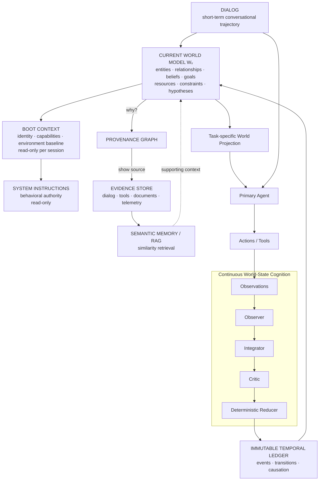

And the complete reasoning loop is:

```text
                           ┌─────────────────────┐
                           │  CURRENT WORLD Wᵥ   │
                           └─────────┬───────────┘
                                     │
                              present-state
                                reasoning
                                     │
                                     ▼
                                  Action
                                     │
                                  observe
                                     ▼
┌──────────┐    ┌────────────┐    ┌────────────┐    ┌──────────┐
│ Observer │ -> │ Integrator │ -> │   Critic   │ -> │ Reducer  │
└──────────┘    └────────────┘    └────────────┘    └────┬─────┘
                                                         │
                                                     WorldEvents
                                                         │
                                                         ▼
                                                    Wᵥ₊₁
                                                         │
                                      ┌──────────────────┘
                                      │
                              THINK BACKWARDS
                                      │
                                      ▼
                     assertion → derivation → event
                                      ↓
                                  evidence
```

The architecture can therefore be summarized in six sentences:

> **Memory tells the agent what happened.**

> **The World Model tells the agent what it currently believes is true.**

> **The temporal ledger tells it how that state evolved.**

> **Provenance tells it why it believes each assertion.**

> **Evidence lets it verify those beliefs against observations.**

> **Dialog tells it what it is doing right now.**

And the strongest version of the original intuition is:

> **The World State Engine does not primarily retrieve the past in order to reconstruct the present. It continuously materializes the present so that the past can be traversed only when explanation, reconstruction, correction, or evidence is required.**

That is the architectural significance of **thinking backwards**.

### Prioritized primary and academic references

| Priority | Reference | Relevance |
|---|---|---|
| Essential | [Microsoft Agent Framework — Agent Pipeline Architecture](https://learn.microsoft.com/en-us/agent-framework/concepts/agents/agent-pipeline) | Defines where history and context providers participate in invocation. citeturn14view0 |
| Essential | [Microsoft Agent Framework — Context Providers](https://learn.microsoft.com/en-us/agent-framework/concepts/agents/conversations/context-providers) | Direct basis for `WorldModelContextProvider`, `ProvideAIContextAsync`, `StoreAIContextAsync`, and provider session state. citeturn14view1 |
| Essential | [Microsoft Agent Framework — Chat History Memory Provider](https://learn.microsoft.com/en-us/agent-framework/concepts/agents/conversations/chat-history-memory-provider) | Establishes semantic/vector chat memory as a distinct mechanism. citeturn22view1 |
| Essential | [Azure Architecture Center — Event Sourcing Pattern](https://learn.microsoft.com/en-us/azure/architecture/patterns/event-sourcing) | Immutable event ledger, replay, materialized state, snapshots, event versions, ordering, concurrency, idempotency. citeturn22view0 |
| Essential | [Snodgrass & Ahn — A Taxonomy of Time in Databases](https://www.cs.unc.edu/techreports/85-004.pdf) | Seminal valid-time/transaction-time foundation for WSE bitemporality. citeturn17view0turn19view0 |
| Essential | [W3C PROV-DM](https://www.w3.org/TR/prov-dm/) | Domain-independent provenance model. citeturn15search18 |
| Essential | [W3C PROV-O](https://www.w3.org/TR/prov-o/) | Standard ontology for interoperable provenance representation. citeturn15search2 |
| Essential | [Jon Doyle — A Truth Maintenance System](https://dspace.mit.edu/entities/publication/5377b306-4ecc-4687-b1f5-78cbb4a0543a) | Intellectual basis for maintaining justification/dependency structures and revisable beliefs. citeturn20search3 |
| Important | [W3C RDF Concepts](https://www.w3.org/TR/rdf11-concepts/) | Formal graph representation of claims as subject-predicate-object statements. citeturn21search3 |
| Important | [Ha & Schmidhuber — World Models](https://arxiv.org/abs/1803.10122) | Establishes the classical learned-world-model meaning and clarifies how WSE differs. citeturn15search3 |
| Important | [Lewis et al. — Retrieval-Augmented Generation](https://arxiv.org/abs/2005.11401) | Foundational RAG formulation and useful contrast with continuously maintained state. citeturn16search1 |
| Important | [Microsoft GraphRAG](https://microsoft.github.io/graphrag/) | Graph-structured RAG and corpus-level knowledge-graph retrieval; useful adjacent architecture. citeturn21search1 |
| Important | [Park et al. — Generative Agents](https://arxiv.org/abs/2304.03442) | Memory stream, reflection, planning, and retrieval for long-running agents. citeturn16search2 |
| Important | [Packer et al. — MemGPT](https://arxiv.org/abs/2310.08560) | Hierarchical/virtual context management; supports separation of persistent memory and active context. citeturn16search3 |
| Important | [Du et al. — Improving Factuality and Reasoning through Multiagent Debate](https://arxiv.org/abs/2305.14325) | Evidence for structured multi-model critique while not substituting for deterministic commit semantics. citeturn20search2 |
| Important | [Microsoft Agent Framework — Concurrent Orchestration](https://learn.microsoft.com/en-us/agent-framework/workflows/orchestrations/concurrent) | Candidate implementation mechanism for ensemble validators. citeturn15search0 |
| Important | [Microsoft Agent Framework — Sequential Orchestration](https://learn.microsoft.com/en-us/agent-framework/workflows/orchestrations/sequential) | Natural fit for Observer → Integrator → Critic dependency chain. citeturn15search12 |
| Security-critical | [Microsoft — Manage Memory Safety in Agentic Systems](https://learn.microsoft.com/en-us/security/zero-trust/sfi/manage-agentic-memory-safety) | Persistent-state poisoning, provenance, access isolation, lifecycle controls, user transparency. citeturn22view3 |
| Security-critical | [Microsoft Agent Framework — Agent Security with FIDES](https://learn.microsoft.com/en-us/agent-framework/agents/security) | Integrity/confidentiality labels and deterministic information-flow enforcement pattern. citeturn22view2 |
| Implementation option | [Neo4j — Vector Indexes](https://neo4j.com/docs/cypher-manual/current/indexes/semantic-indexes/vector-indexes/) | Example of graph-native storage coexisting with vector retrieval. citeturn21search2 |

The research points toward a clear architectural boundary: **semantic memory, RAG, and graph retrieval are mechanisms for finding information; the World State Engine is a mechanism for maintaining a coherent, versioned, temporally and epistemically qualified model of an evolving world.** It should consume those retrieval mechanisms as evidence services rather than be reduced to one of them. citeturn16search1turn21search1turn22view1

The resulting system is best understood not as a larger memory provider, but as an **agent cognitive-state substrate**: event-sourced for durability, graph-native for relationships, bitemporal for historical truth, provenance-aware for explanation, belief-maintaining for revision, and context-projecting for efficient LLM reasoning.