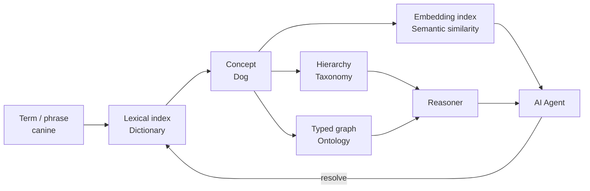
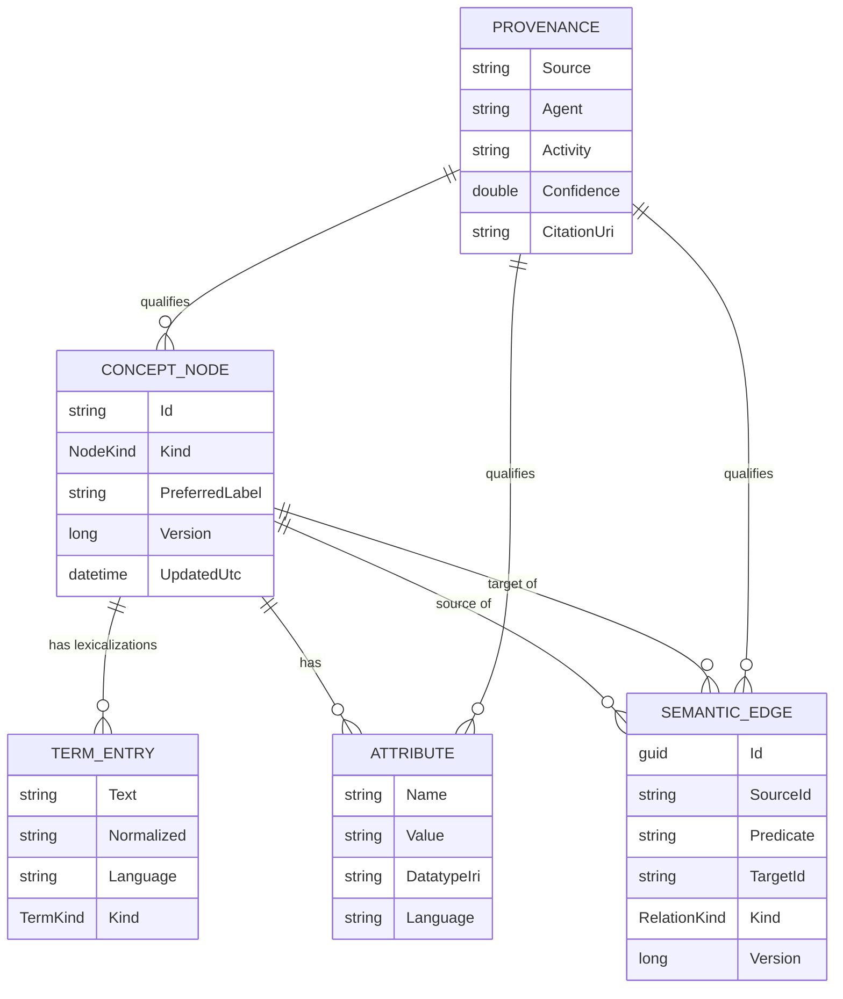
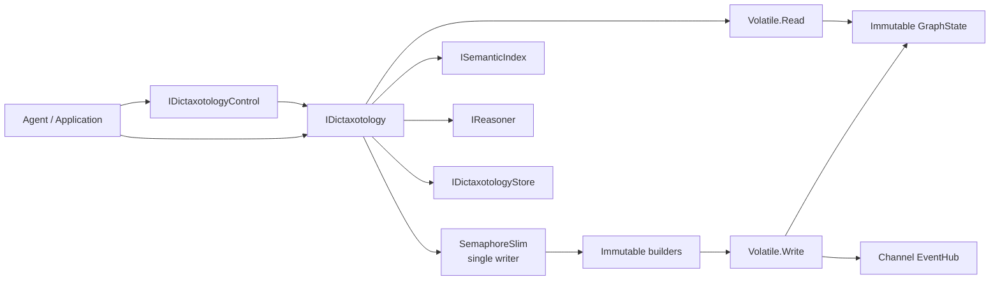

# Dictaxotology: A Concurrent Semantic Data Structure for Agentic Knowledge

## Executive summary

**Dictaxotology** is best understood not as a new ontology language, but as a **software data-structure architecture that deliberately overlays three different access models over the same canonical knowledge state**:

**Dictionary** → deterministic lexical resolution of words, labels, synonyms, acronyms, aliases, and other terms.

**Taxonomy** → efficient hierarchical navigation through broader/narrower, parent/child, class/subclass, part/whole, and related concept structures.

**Ontology** → typed arbitrary relationships, entity kinds, attributes, provenance, semantic identity, extensible predicates, and reasoning hooks.

That combination is particularly valuable to AI agents because an agent rarely wants only one kind of retrieval. In one reasoning episode it may need to resolve `"canine"` to a concept, discover that the concept is `"Dog"`, navigate `Dog → Mammal → Animal`, inspect structured attributes and provenance, semantically retrieve nearby concepts from an embedding, and atomically assert new knowledge. This is essentially the old AI “ask/tell” vision of shared knowledge through a common representational vocabulary, translated into a modern concurrent application data structure. Gruber's foundational ontology work explicitly connected common vocabularies to knowledge sharing among AI systems, while contemporary OWL formalizes classes, individuals, properties, and machine-supported inference. citeturn15search3turn15search0turn14view3

SKOS is an especially appropriate foundation for the taxonomy/lexical part of this idea: the W3C defines SKOS specifically for thesauri, classifications, taxonomies, subject headings and related knowledge-organization systems; concepts have identifiers, multilingual lexical labels, associative links and hierarchical relationships. citeturn14view2turn12search0

The implementation I recommend is a **hybrid immutable-snapshot architecture**:

> **immutable multi-index graph + serialized atomic writer + lock-free snapshot readers + concurrent auxiliary indexes + async bounded event streams**

The important insight is that a collection of `ConcurrentDictionary` objects is **not enough**. Microsoft documents that `ConcurrentDictionary` reads are lock-free and modifications use fine-grained locking, but factory delegates can execute outside those locks and individual thread-safe operations do not magically create an atomic transaction spanning several dictionaries. A graph update frequently needs to change a node table, term index, predicate index, and two adjacency indexes as one logical operation. citeturn11search1turn11search3

The design therefore keeps all structurally significant indexes in one immutable `GraphState`. A single asynchronous `SemaphoreSlim` writer gate creates builders from the current state, applies an entire mutation batch, verifies invariants, creates a new immutable state and publishes the single state reference with `Volatile.Write`. Readers perform one `Volatile.Read` and then traverse an immutable snapshot without taking the writer lock. .NET's immutable collections explicitly support implicit thread safety, and `Volatile.Read`/`Write` provide the required ordering constraints around publication. citeturn11search6turn16search1turn16search5turn16search9

This gives Dictaxotology several properties that are particularly useful to agents:

| Property                | Result                                                             |
| ----------------------- | ------------------------------------------------------------------ |
| Exact lexical lookup    | Direct normalized-term index                                       |
| Graph navigation        | Precomputed incoming/outgoing adjacency indexes                    |
| Typed semantics         | `RelationKind` plus arbitrary predicate IRI                      |
| Semantic retrieval      | Pluggable`ISemanticIndex` and `IEmbeddingProvider`             |
| Reasoning               | Pluggable`IReasoner` over stable snapshots                       |
| Safe concurrent reading | Immutable snapshot; no read lock                                   |
| Atomic agent updates    | Mutation batches and Unit-of-Work transaction                      |
| Lost-update protection  | Graph revision and entity-version preconditions                    |
| Events                  | `IAsyncEnumerable<GraphChange>` over bounded Channels            |
| Agent control plane     | JSON-shaped`ControlRequest` / `ControlResponse` API            |
| Security hook           | Per-agent capability authorization strategy                        |
| Persistence             | Pluggable snapshot store                                           |
| Interoperability        | IRI-friendly model and interchange adapter seam                    |
| Auditability            | Provenance on nodes, edges and attributes                          |
| Extensibility           | Strategy, Adapter, Visitor, Builder, Repository and Observer seams |

As of August 13, 2026, **.NET 10 is the current LTS release**, supported through November 2028, so the supplied project targets `net10.0`. citeturn11search0turn11search2

The complete artifacts are also provided directly:

[Download `Dictaxotology.cs`](sandbox:/mnt/data/Dictaxotology.cs)

[Download concurrency/unit tests](sandbox:/mnt/data/Dictaxotology.Tests.cs)

[Download minimal .NET project](sandbox:/mnt/data/Dictaxotology.csproj)

[Download complete source bundle](sandbox:/mnt/data/Dictaxotology.bundle.zip)

## Conceptual model and intended uses

### Why the three models belong together

A dictionary, taxonomy and ontology answer different questions.

A **dictionary** answers:

> “What concept does this symbol, phrase, synonym or alias refer to?”

A **taxonomy** answers:

> “Where is that concept situated in a classification?”

An **ontology** answers:

> “What kinds of things exist in this domain, how may they relate, and what consequences can be inferred from those relationships?”

SKOS deliberately sits near the boundary between the first two: it represents concepts, preferred/alternative/hidden lexical labels, concept schemes, informal hierarchies and associative networks. OWL goes farther into explicit classes, individuals, properties and logically meaningful axioms. citeturn14view2turn14view3

Dictaxotology should therefore **not try to make every dictionary operation an ontology theorem or every ontology expression an in-memory CLR type**. Doing so would make the common case expensive.

Instead, use a layered model:



The canonical object should be the **concept/entity node**, not the term. A word can be ambiguous; a concept can have many terms. This also follows the separation visible in SKOS, where concepts have identifiers and may be associated with several lexical labels. citeturn14view2

### Core invariants

The implementation is organized around these invariants:

1. Every node has a stable ID.
2. Node and edge entity versions monotonically advance when that entity is replaced.
3. The graph revision advances once per successfully published mutation batch.
4. Every edge source and target identifies a live node.
5. Every term index entry points to a live node containing the indexed term.
6. Every adjacency entry corresponds to a live edge.
7. Every predicate-index entry corresponds to a live edge.
8. A canonical hierarchy can optionally be constrained to be acyclic.
9. A single commit changes all structural indexes atomically from the perspective of readers.
10. Embeddings are auxiliary rather than authoritative; stale embeddings must not change semantic truth.
11. Provenance is data associated with a claim; it is not itself an authorization decision.

The supplied lexical validation is intentionally SKOS-inspired: a concept gets one preferred label per language, while conflicting label roles are rejected. SKOS defines preferred, alternative and hidden labels and permits at most one preferred lexical label per language. citeturn14view2

### Data model



Provenance belongs directly in the core rather than in an afterthought audit table. W3C PROV was designed to represent, exchange and integrate provenance from different systems and contexts, and is explicitly extensible for application-specific provenance. citeturn14view4turn12search2

### Agent-oriented use cases

A Dictaxotology becomes useful when the same in-memory structure services several reasoning modes:

**Tool and capability catalogs.** An agent resolves natural language such as “calendar”, follows `EquivalentTo` and `Related` relations, filters entities by structured attributes, then selects an implementation.

**Enterprise vocabulary grounding.** Acronyms and colloquial terms are mapped to canonical concepts before retrieval or generation.

**Agent memory.** Episodes, documents, agents, entities and concepts can be related while provenance distinguishes observations, imported facts and inferred assertions.

**RAG enrichment.** Vector search returns likely concepts, exact lexical indexes anchor them, and graph traversal supplies deterministic context.

**Planning.** `DependsOn`, `PartOf`, `Causes`, `IsA`, and custom predicates provide structured context unavailable from embedding similarity alone.

**Ontology-assisted reasoning.** The in-process reasoner handles inexpensive closures, while a pluggable reasoner can export snapshots to more expressive OWL machinery when formal inference is required. OWL itself is designed for automated consequences, but its richer forms come with substantial reasoning complexity; the W3C consequently defines computationally motivated OWL profiles. citeturn14view3

The guiding principle is:

> **Embeddings propose; symbolic structure constrains; provenance explains; versions coordinate.**

## Architecture, concurrency and transactional semantics

### The chosen concurrency model

The proposed architecture looks like this:



The core state contains:

```text
Nodes             ID          -> ConceptNode
Edges             edge GUID   -> SemanticEdge
TermIndex         term        -> node IDs
PredicateIndex    predicate   -> edge IDs
OutgoingIndex     source ID   -> edge IDs
IncomingIndex     target ID   -> edge IDs
```

Each state instance is immutable.

A read therefore follows essentially:

```csharp
var state = Volatile.Read(ref _state);
return state.Nodes.TryGetValue(nodeId, out node);
```

A transaction follows:

```text
acquire write gate
       ↓
capture current immutable state
       ↓
verify expected graph revision
       ↓
create mutable builders
       ↓
apply all mutations
       ↓
update every affected index
       ↓
check structural constraints
       ↓
materialize new immutable state
       ↓
Volatile.Write(_state, newState)   ← commit point
       ↓
release gate
       ↓
post-commit notifications / auxiliary cleanup
```

The important feature is that **there is only one published reference representing the logical database state**. A reader can therefore see revision N or revision N+1, but not “new node dictionary + old adjacency dictionary.”

.NET immutable collections are specifically intended to be shareable without locks after construction. `Volatile.Read` prevents later operations from being reordered before the read, while `Volatile.Write` prevents earlier operations from moving after publication. citeturn11search6turn16search1turn16search5turn16search9

### Why not simply use ConcurrentDictionary everywhere?

`ConcurrentDictionary` is excellent for **independent entries**. The implementation uses it for two such cases:

* embedding entries;
* event subscribers;
* bounded string flyweights.

Microsoft documents that its read operations are lock-free and its modifications use fine-grained locking. Microsoft also warns that value factories for methods such as `AddOrUpdate` execute outside the internal locks and can be run repeatedly. citeturn11search1turn11search3

Suppose an edge insertion required:

```text
Edges.TryAdd(edge)
Outgoing[source].Add(edgeId)
Incoming[target].Add(edgeId)
Predicate[predicate].Add(edgeId)
```

Even if every call is individually thread-safe, the **four-call sequence is not one atomic graph mutation**. A reader can observe intermediate states.

Hence:

> `ConcurrentDictionary` protects containers.
> A Dictaxotology transaction must protect **knowledge invariants**.

### Other concurrency alternatives

| Model                             | Strength                                                     | Weakness                                                 | Recommendation                                       |
| --------------------------------- | ------------------------------------------------------------ | -------------------------------------------------------- | ---------------------------------------------------- |
| One global`lock`                | Very simple                                                  | Blocks reads; cannot`await` inside `lock`            | Fine for tiny graphs                                 |
| `ReaderWriterLockSlim`          | Multiple concurrent readers                                  | Read acquisition overhead; awkward with async operations | Reasonable alternative for write-heavy mutable graph |
| Multiple`ConcurrentDictionary`s | Excellent per-key concurrency                                | No cross-index transaction                               | Auxiliary indexes only                               |
| Fully lock-free multi-index graph | Maximum theoretical concurrency                              | Very difficult reclamation/invariant logic               | Not justified initially                              |
| Immutable snapshot + writer gate  | Lock-free reads, atomic snapshots, straightforward reasoning | Copy-on-write write amplification                        | **Recommended default**                        |
| Sharded immutable snapshots       | Scales writers horizontally                                  | Cross-shard edges/transactions become complex            | Scale-out evolution                                  |

C# also explicitly prohibits `await` inside a regular `lock` statement, reinforcing the value of an asynchronous coordination primitive when persistence or extensible hooks may become asynchronous. citeturn11search5

### Transactions

There are two optimistic concurrency scopes.

**Graph revision concurrency**

```csharp
var expected = graph.Revision;

await graph.ApplyAsync(
    mutations,
    expectedRevision: expected);
```

This is suitable for an agent that:

1. reads knowledge at revision `r`;
2. reasons;
3. proposes a compound update;
4. commits only if nobody changed the graph after `r`.

**Entity version concurrency**

```csharp
await graph.UpsertNodeAsync(
    updated,
    expectedEntityVersion: existing.Version);
```

This is useful when unrelated changes elsewhere in the graph should not cause the update to fail.

The Unit-of-Work facade captures the graph revision automatically:

```csharp
await using var tx = graph.BeginTransaction(TransactionMode.Optimistic);

tx.UpsertNode(...);
tx.UpsertEdge(...);

await tx.CommitAsync();
```

### Notifications and streaming

The Observer implementation uses `System.Threading.Channels`. Microsoft describes Channels as synchronization structures for asynchronous producer/consumer flows and specifically provides bounded-channel modes for backpressure or controlled dropping. `IAsyncEnumerable<T>` is the natural .NET abstraction for asynchronously produced streams. citeturn16search0turn16search3turn16search4

Dictaxotology exposes four overflow strategies:

```text
Wait
DropOldest
DropNewest
DropWrite
```

`Wait` gives true backpressure but deliberately allows a slow subscriber to affect commit-call latency after publication. The drop strategies provide lower coupling but are best-effort. A system that requires durable auditing should implement an append-only event log or transactional outbox instead of treating the in-process Channel as an audit ledger.

## Agent control plane and software-design patterns

### Why an agent control plane should differ from the raw object API

Developers want:

```csharp
graph.FindByTerm("canine");
graph.Traverse("urn:dog", options);
```

Agents generally benefit from a more uniform envelope:

```json
{
  "requestId": "plan-step-47",
  "operation": "graph.traverse",
  "arguments": {
    "startNodeId": "urn:dog",
    "options": {
      "maxDepth": 4
    }
  },
  "expectedRevision": 531
}
```

with a result:

```json
{
  "requestId": "plan-step-47",
  "success": true,
  "revision": 531,
  "data": []
}
```

This yields several benefits without building an MCP server:

* stable operation names;
* JSON-friendly argument boundaries;
* retryable concurrency errors;
* authorization before dispatch;
* revision feedback;
* batch operations;
* cancellation;
* one transport-neutral agent facade.

Supported commands are:

```text
node.get
node.findTerm
node.upsert
node.delete
edge.upsert
edge.delete
graph.traverse
graph.query
semantic.search
reason
batch
stats
validate
snapshot.save
snapshot.load
```

The important architectural boundary is:

```text
LLM / Agent
     ↓
IDictaxotologyControl
     ↓ authorization
structured commands
     ↓
IDictaxotology
     ↓
canonical graph state
```

The LLM never manipulates internal dictionaries directly.

### Patterns and why they matter

| Pattern                          | Dictaxotology component                                                                                  | Agentic value                                                                                     |
| -------------------------------- | -------------------------------------------------------------------------------------------------------- | ------------------------------------------------------------------------------------------------- |
| **Repository**             | `IConceptRepository`, `IRelationRepository`                                                          | Separates knowledge operations from storage mechanics                                             |
| **Unit of Work**           | `IDictaxotologyTransaction`                                                                            | Agents can submit an entire reasoned change-set atomically                                        |
| **Strategy**               | `ITermNormalizer`, `ISemanticIndex`, `IEmbeddingProvider`, `IReasoner`, `IAuthorizationPolicy` | Different semantic/reasoning/security implementations can be selected without modifying the graph |
| **Adapter**                | `IDictaxotologyControl`, `IDictaxotologyStore`, `IGraphInterchangeAdapter<T>`                      | Bridges agents, persistence and semantic-web representations                                      |
| **Observer**               | `EventHub`, `IAsyncEnumerable<GraphChange>`                                                          | Reactive agents can observe committed changes                                                     |
| **Visitor**                | `IDictaxotologyVisitor`                                                                                | Snapshot export, indexing, analytics and validation without exposing internals                    |
| **Builder**                | `ConceptBuilder`, `RelationBuilder`                                                                  | Human-friendly fluent creation while canonical records stay immutable                             |
| **Flyweight**              | `StringFlyweightPool`                                                                                  | Reuses repeated normalized terms and predicate strings                                            |
| **Snapshot / COW**         | `GraphState`                                                                                           | Stable reasoning inputs and lock-free reads                                                       |
| **Optimistic concurrency** | graph revision + entity versions                                                                         | Agents can safely “read → reason → conditionally write”                                       |

There is an especially useful correspondence between the **Strategy pattern** and agentic systems: embeddings, reasoning, authorization and normalization are all forms of policy. Keeping them outside `Dictaxotology` prevents the central structure from becoming a giant semantic monolith.

### Reasoning philosophy

The bundled `TaxonomyReasoner` performs inexpensive transitive traversal for:

```text
Ancestors
Descendants
Equivalents
```

It intentionally does **not** pretend to be an OWL reasoner.

This matters because OWL supports significantly richer expressions and formal entailment. OWL reasoners can automatically compute consequences, but the language's formal semantics and profiles involve considerably more machinery than adjacency closure. citeturn14view3

The proper architecture is:

```csharp
public interface IReasoner
{
    ValueTask<ReasoningResult> InferAsync(
        DictaxotologySnapshot snapshot,
        ReasoningRequest request,
        CancellationToken cancellationToken = default);
}
```

Then a project can supply:

```text
TaxonomyReasoner
RulesEngineReasoner
RdfsReasoner
OwlRlReasoner
RemoteReasonerAdapter
DomainSpecificReasoner
```

without altering the data structure.

## Type design

The following table is the UML-like design map for the supplied implementation.

| Type                                 | Role                                | Key members                                                                  | Thread-safety / lifecycle                         |
| ------------------------------------ | ----------------------------------- | ---------------------------------------------------------------------------- | ------------------------------------------------- |
| `Dictaxotology`                    | Main facade and transactional graph | `Query`, `Traverse`, `ApplyAsync`, `ReasonAsync`, `CreateSnapshot` | Concurrent reads; serialized structural writes    |
| `GraphState`                       | Complete immutable revision         | nodes, edges, all structural indexes, revision                               | Immutable after construction                      |
| `ConceptNode`                      | Canonical concept/entity            | ID, kind, labels, attributes, provenance, version                            | Immutable record                                  |
| `SemanticEdge`                     | Typed relationship                  | source, predicate, target, kind, version                                     | Immutable record                                  |
| `TermEntry`                        | Indexed lexicalization              | original text, normalized key, language, kind                                | Immutable                                         |
| `DtxAttribute`                     | Typed/language-aware value          | name, value, datatype IRI, provenance                                        | Immutable                                         |
| `Provenance`                       | Origin/confidence metadata          | source, agent, activity, timestamp, citation                                 | Immutable                                         |
| `ConceptDraft`                     | Node mutation DTO                   | user-facing mutable-intent representation                                    | Immutable record; normalized at commit            |
| `EdgeDraft`                        | Edge mutation DTO                   | source, target, relation, predicate                                          | Immutable record                                  |
| `IConceptRepository`               | Dictionary/concept repository       | lookup, term search, CRUD                                                    | Implementation determines safety                  |
| `IRelationRepository`              | Relationship repository             | edge CRUD, traversal                                                         | Implementation determines safety                  |
| `IDictaxotology`                   | Full developer API                  | repositories + semantic/reasoning/transaction API                            | Main thread-safe contract                         |
| `IDictaxotologyTransaction`        | Unit of Work                        | enqueue mutations,`CommitAsync`                                            | Internal mutation list protected by lock          |
| `GraphMutation`                    | Transaction command base            | node/edge upsert/delete variants                                             | Immutable records                                 |
| `IDictaxotologyControl`            | Agent-facing control adapter        | `ExecuteAsync`, `SubscribeAsync`                                         | Safe over graph facade                            |
| `ControlRequest`                   | Agent command envelope              | request ID, operation, JSON arguments, revision                              | Immutable                                         |
| `ControlResponse`                  | Uniform agent result                | success, revision, data/error                                                | Immutable                                         |
| `AgentContext`                     | Caller security context             | permissions, tenant, roles, claims                                           | Immutable                                         |
| `IAuthorizationPolicy`             | Authorization Strategy              | `AuthorizeAsync`                                                           | Implementation-specific                           |
| `CapabilityAuthorizationPolicy`    | Default coarse ACL                  | read/write/reason/subscribe/persist capabilities                             | Stateless singleton                               |
| `ITermNormalizer`                  | Lexical Strategy                    | `Normalize`                                                                | Should be stateless/thread-safe                   |
| `DefaultTermNormalizer`            | Default lexical canonicalization    | Unicode FormKC + invariant casing                                            | Stateless singleton                               |
| `ISemanticIndex`                   | Vector-index Strategy               | upsert, remove, clear, search                                                | Contract intended for concurrent calls            |
| `ExactCosineSemanticIndex`         | Correctness/reference vector search | exact cosine scan                                                            | `ConcurrentDictionary` backed                   |
| `IEmbeddingProvider`               | Text→vector Strategy               | `EmbedAsync`                                                               | Provider-specific                                 |
| `IReasoner`                        | Inference Strategy                  | `InferAsync(snapshot, request)`                                            | Receives immutable snapshot                       |
| `TaxonomyReasoner`                 | Default closure reasoner            | ancestors, descendants, equivalence                                          | Stateless singleton                               |
| `IDictaxotologyStore`              | Persistence Adapter                 | save/load snapshots                                                          | Store-specific                                    |
| `InMemorySnapshotStore`            | In-memory persistence example       | `SaveAsync`, `LoadAsync`                                                 | Volatile reference publication                    |
| `JsonFileSnapshotStore`            | File snapshot adapter               | async JSON save/load                                                         | One store instance should be coordinated by owner |
| `IGraphInterchangeAdapter<T>`      | RDF/JSON-LD/etc. seam               | export/import                                                                | External implementation                           |
| `IDictaxotologyVisitor`            | Visitor pattern                     | node/edge callbacks                                                          | Snapshot traversal                                |
| `ConceptBuilder`                   | Fluent Builder                      | term, attribute, provenance methods                                          | Intentionally local/non-shared                    |
| `RelationBuilder`                  | Fluent edge Builder                 | predicate, attribute, provenance                                             | Intentionally local/non-shared                    |
| `EventHub`                         | Observer infrastructure             | publish / subscribe                                                          | Concurrent subscribers + Channels                 |
| `StringFlyweightPool`              | Bounded Flyweight cache             | `Get`                                                                      | `ConcurrentDictionary`                          |
| `DictaxotologySnapshot`            | Public stable read view             | nodes/edges/indexes/revision                                                 | Immutable                                         |
| `ConcurrencyConflictException`     | Optimistic-write conflict           | expected vs current revision/version                                         | Normal exception                                  |
| `DictaxotologyValidationException` | Structural validation failure       | collection of issues                                                         | Normal exception                                  |

The design deliberately uses IDs and predicate strings that can hold IRIs. RDF's basic model is a set of subject-predicate-object triples, and RDF predicates are IRIs; that makes a `SourceId / Predicate / TargetId` relationship straightforward to adapt without forcing the in-process implementation itself to become an RDF engine. citeturn15search1

## Complete implementation

The canonical implementation below targets .NET 10 and is also available as [the source artifact](sandbox:/mnt/data/Dictaxotology.cs).

One qualification is important: the execution environment used to prepare this report did **not** contain a .NET SDK, so I could not run `dotnet build` or `dotnet test` here. I did perform source-level structural checking, including delimiter balance, but the implementation should still pass through the project's normal compiler, analyzer and CI gates before release.

### Minimal project file

```xml
<Project Sdk="Microsoft.NET.Sdk">
  <PropertyGroup>
    <TargetFramework>net10.0</TargetFramework>
    <ImplicitUsings>enable</ImplicitUsings>
    <Nullable>enable</Nullable>
    <TreatWarningsAsErrors>true</TreatWarningsAsErrors>
    <GenerateDocumentationFile>true</GenerateDocumentationFile>
  </PropertyGroup>
</Project>
```

### `Dictaxotology.cs`

```csharp
#nullable enable

using System.Collections.Concurrent;
using System.Collections.Immutable;
using System.Runtime.CompilerServices;
using System.Text;
using System.Text.Json;
using System.Threading.Channels;

namespace AgenticKnowledge;

/// <summary>
/// A high-throughput, thread-safe, semantically addressable knowledge structure combining
/// dictionary lookup, taxonomy traversal, ontology-style relations, provenance, versioning,
/// semantic-vector hooks, transactions, event streaming, and an agent-friendly control plane.
/// </summary>
public sealed class Dictaxotology :
    IDictaxotology,
    IConceptRepository,
    IRelationRepository,
    IAsyncDisposable
{
    private readonly SemaphoreSlim _writeGate = new(1, 1);
    private readonly ITermNormalizer _normalizer;
    private readonly ISemanticIndex _semanticIndex;
    private readonly IEmbeddingProvider? _embeddingProvider;
    private readonly IReasoner _reasoner;
    private readonly IDictaxotologyStore? _store;
    private readonly EventHub _events;
    private readonly StringFlyweightPool _flyweights;
    private readonly DictaxotologyOptions _options;
    private GraphState _state;
    private int _disposed;

    public Dictaxotology(
        DictaxotologyOptions? options = null,
        ITermNormalizer? normalizer = null,
        ISemanticIndex? semanticIndex = null,
        IEmbeddingProvider? embeddingProvider = null,
        IReasoner? reasoner = null,
        IDictaxotologyStore? store = null)
    {
        _options = options ?? new DictaxotologyOptions();
        _normalizer = normalizer ?? DefaultTermNormalizer.Instance;
        _semanticIndex = semanticIndex ?? new ExactCosineSemanticIndex();
        _embeddingProvider = embeddingProvider;
        _reasoner = reasoner ?? TaxonomyReasoner.Instance;
        _store = store;
        _events = new EventHub();
        _flyweights = new StringFlyweightPool(_options.FlyweightCapacity);
        _state = GraphState.Empty;
        Control = new DictaxotologyControl(
            this,
            _options.AuthorizationPolicy ?? CapabilityAuthorizationPolicy.Instance);
    }

    public IDictaxotologyControl Control { get; }

    public long Revision => Volatile.Read(ref _state).Revision;

    public GraphStatistics GetStatistics()
    {
        var state = Volatile.Read(ref _state);
        return new GraphStatistics(
            state.Revision,
            state.Nodes.Count,
            state.Edges.Count,
            state.TermIndex.Count,
            state.PredicateIndex.Count);
    }

    public bool TryGetNode(string nodeId, out ConceptNode? node)
    {
        ThrowIfDisposed();
        ArgumentException.ThrowIfNullOrWhiteSpace(nodeId);
        return Volatile.Read(ref _state).Nodes.TryGetValue(nodeId, out node);
    }

    public bool TryGetEdge(Guid edgeId, out SemanticEdge? edge)
    {
        ThrowIfDisposed();
        return Volatile.Read(ref _state).Edges.TryGetValue(edgeId, out edge);
    }

    public IReadOnlyList<ConceptNode> FindByTerm(
        string term,
        string? language = null,
        bool includeHidden = true,
        int limit = 50)
    {
        ThrowIfDisposed();
        ArgumentException.ThrowIfNullOrWhiteSpace(term);
        limit = Math.Clamp(limit, 1, _options.MaxQueryResults);

        var state = Volatile.Read(ref _state);
        return FindByTermInState(state, term, language, includeHidden, limit);
    }

    public IReadOnlyList<ConceptNode> Query(QuerySpec query)
    {
        ThrowIfDisposed();
        ArgumentNullException.ThrowIfNull(query);

        var state = Volatile.Read(ref _state);
        var limit = Math.Clamp(query.Limit, 1, _options.MaxQueryResults);
        IEnumerable<ConceptNode> candidates;

        if (!string.IsNullOrWhiteSpace(query.ExactTerm))
        {
            candidates = FindByTermInState(
                state,
                query.ExactTerm!,
                query.Language,
                query.IncludeHidden,
                Math.Min(_options.MaxQueryResults, limit * 4));
        }
        else
        {
            candidates = state.Nodes.Values;
        }

        if (query.Kind is not null)
            candidates = candidates.Where(n => n.Kind == query.Kind);

        if (!string.IsNullOrWhiteSpace(query.AttributeName))
        {
            candidates = candidates.Where(n => n.Attributes.Any(a =>
                StringComparer.Ordinal.Equals(a.Name, query.AttributeName) &&
                (query.AttributeValue is null ||
                 StringComparer.Ordinal.Equals(a.Value, query.AttributeValue))));
        }

        return candidates.Take(limit).ToArray();
    }

    public IReadOnlyList<TraversalHit> Traverse(
        string startNodeId,
        TraverseOptions? options = null)
    {
        ThrowIfDisposed();
        ArgumentException.ThrowIfNullOrWhiteSpace(startNodeId);
        options ??= new TraverseOptions();

        var state = Volatile.Read(ref _state);
        if (!state.Nodes.ContainsKey(startNodeId))
            return Array.Empty<TraversalHit>();

        var maxDepth = Math.Clamp(
            options.MaxDepth, 0, _options.MaxTraversalDepth);
        var maxResults = Math.Clamp(
            options.MaxResults, 1, _options.MaxQueryResults);

        var acceptedKinds = options.RelationKinds is { Count: > 0 }
            ? options.RelationKinds.ToHashSet()
            : null;

        var acceptedPredicates = options.Predicates is { Count: > 0 }
            ? options.Predicates.ToHashSet(StringComparer.Ordinal)
            : null;

        var visited = new HashSet<string>(StringComparer.Ordinal)
        {
            startNodeId
        };

        var queue =
            new Queue<(string Id, int Depth, Guid? ViaEdge)>();
        var result = new List<TraversalHit>();

        queue.Enqueue((startNodeId, 0, null));

        while (queue.Count > 0 && result.Count < maxResults)
        {
            var current = queue.Dequeue();

            if (current.Depth > 0 || options.IncludeStart)
            {
                result.Add(new TraversalHit(
                    state.Nodes[current.Id],
                    current.Depth,
                    current.ViaEdge));
            }

            if (current.Depth >= maxDepth)
                continue;

            foreach (var (neighborId, edgeId) in EnumerateNeighbors(
                         state,
                         current.Id,
                         options.Direction,
                         acceptedKinds,
                         acceptedPredicates))
            {
                if (!visited.Add(neighborId))
                    continue;

                queue.Enqueue(
                    (neighborId, current.Depth + 1, edgeId));

                if (visited.Count > _options.MaxQueryResults * 8)
                    break;
            }
        }

        return result;
    }

    public ValueTask<ReasoningResult> ReasonAsync(
        ReasoningRequest request,
        CancellationToken cancellationToken = default)
    {
        ThrowIfDisposed();
        ArgumentNullException.ThrowIfNull(request);

        return _reasoner.InferAsync(
            CreateSnapshot(),
            request,
            cancellationToken);
    }

    public async ValueTask<IReadOnlyList<SemanticSearchHit>>
        SemanticSearchAsync(
            ReadOnlyMemory<float> vector,
            int topK = 10,
            CancellationToken cancellationToken = default)
    {
        ThrowIfDisposed();

        if (vector.IsEmpty)
            throw new ArgumentException(
                "Semantic query vector cannot be empty.",
                nameof(vector));

        topK = Math.Clamp(
            topK,
            1,
            _options.MaxSemanticResults);

        var state = Volatile.Read(ref _state);

        var raw = await _semanticIndex
            .SearchAsync(vector, topK * 3, cancellationToken)
            .ConfigureAwait(false);

        var filtered = new List<SemanticSearchHit>(topK);

        foreach (var hit in raw)
        {
            if (!state.Nodes.TryGetValue(hit.NodeId, out var node))
                continue;

            if (node.Version != hit.EntityVersion)
                continue;

            filtered.Add(new SemanticSearchHit(node, hit.Score));

            if (filtered.Count >= topK)
                break;
        }

        return filtered;
    }

    public async ValueTask<IReadOnlyList<SemanticSearchHit>>
        SemanticSearchTextAsync(
            string text,
            int topK = 10,
            CancellationToken cancellationToken = default)
    {
        ThrowIfDisposed();
        ArgumentException.ThrowIfNullOrWhiteSpace(text);

        if (_embeddingProvider is null)
        {
            throw new InvalidOperationException(
                "No IEmbeddingProvider was configured.");
        }

        var vector = await _embeddingProvider
            .EmbedAsync(text, cancellationToken)
            .ConfigureAwait(false);

        return await SemanticSearchAsync(
                vector,
                topK,
                cancellationToken)
            .ConfigureAwait(false);
    }

    public async ValueTask SetEmbeddingAsync(
        string nodeId,
        ReadOnlyMemory<float> vector,
        CancellationToken cancellationToken = default)
    {
        ThrowIfDisposed();
        ArgumentException.ThrowIfNullOrWhiteSpace(nodeId);

        if (vector.IsEmpty)
            throw new ArgumentException(
                "Embedding cannot be empty.",
                nameof(vector));

        var state = Volatile.Read(ref _state);

        if (!state.Nodes.TryGetValue(nodeId, out var node))
        {
            throw new KeyNotFoundException(
                $"Node '{nodeId}' does not exist.");
        }

        await _semanticIndex
            .UpsertAsync(
                nodeId,
                node.Version,
                vector,
                cancellationToken)
            .ConfigureAwait(false);
    }

    public ValueTask<CommitResult> UpsertNodeAsync(
        ConceptDraft draft,
        long? expectedEntityVersion = null,
        CancellationToken cancellationToken = default) =>
        ApplyAsync(
            new GraphMutation[]
            {
                new UpsertNodeMutation(
                    draft,
                    expectedEntityVersion)
            },
            null,
            cancellationToken);

    public ValueTask<CommitResult> DeleteNodeAsync(
        string nodeId,
        DeleteMode mode = DeleteMode.RejectIfConnected,
        long? expectedEntityVersion = null,
        CancellationToken cancellationToken = default) =>
        ApplyAsync(
            new GraphMutation[]
            {
                new DeleteNodeMutation(
                    nodeId,
                    mode,
                    expectedEntityVersion)
            },
            null,
            cancellationToken);

    public ValueTask<CommitResult> UpsertEdgeAsync(
        EdgeDraft draft,
        long? expectedEntityVersion = null,
        CancellationToken cancellationToken = default) =>
        ApplyAsync(
            new GraphMutation[]
            {
                new UpsertEdgeMutation(
                    draft,
                    expectedEntityVersion)
            },
            null,
            cancellationToken);

    public ValueTask<CommitResult> DeleteEdgeAsync(
        Guid edgeId,
        long? expectedEntityVersion = null,
        CancellationToken cancellationToken = default) =>
        ApplyAsync(
            new GraphMutation[]
            {
                new DeleteEdgeMutation(
                    edgeId,
                    expectedEntityVersion)
            },
            null,
            cancellationToken);

    public IDictaxotologyTransaction BeginTransaction(
        TransactionMode mode = TransactionMode.Optimistic)
    {
        ThrowIfDisposed();

        var expectedRevision =
            mode == TransactionMode.Optimistic
                ? Revision
                : null;

        return new DictaxotologyTransaction(
            this,
            expectedRevision);
    }

    public async ValueTask<CommitResult> ApplyAsync(
        IReadOnlyList<GraphMutation> mutations,
        long? expectedRevision = null,
        CancellationToken cancellationToken = default)
    {
        ThrowIfDisposed();
        ArgumentNullException.ThrowIfNull(mutations);

        if (mutations.Count == 0)
        {
            return new CommitResult(
                Revision,
                Array.Empty<string>(),
                Array.Empty<Guid>(),
                false);
        }

        if (mutations.Count > _options.MaxBatchMutations)
        {
            throw new ArgumentOutOfRangeException(
                nameof(mutations),
                $"Batch exceeds {_options.MaxBatchMutations} mutations.");
        }

        var changedNodes =
            new HashSet<string>(StringComparer.Ordinal);
        var changedEdges = new HashSet<Guid>();
        var deletedNodes =
            new HashSet<string>(StringComparer.Ordinal);

        GraphState next;

        await _writeGate
            .WaitAsync(cancellationToken)
            .ConfigureAwait(false);

        try
        {
            var before = Volatile.Read(ref _state);

            if (expectedRevision is not null &&
                before.Revision != expectedRevision.Value)
            {
                throw new ConcurrencyConflictException(
                    $"Expected graph revision " +
                    $"{expectedRevision.Value}, " +
                    $"actual {before.Revision}.");
            }

            var nodes = before.Nodes.ToBuilder();
            var edges = before.Edges.ToBuilder();
            var termIndex = before.TermIndex.ToBuilder();
            var predicateIndex =
                before.PredicateIndex.ToBuilder();
            var outgoing =
                before.OutgoingIndex.ToBuilder();
            var incoming =
                before.IncomingIndex.ToBuilder();

            foreach (var mutation in mutations)
            {
                cancellationToken.ThrowIfCancellationRequested();

                switch (mutation)
                {
                    case UpsertNodeMutation upsertNode:
                        ApplyUpsertNode(
                            upsertNode,
                            nodes,
                            termIndex,
                            changedNodes);
                        break;

                    case DeleteNodeMutation deleteNode:
                        ApplyDeleteNode(
                            deleteNode,
                            nodes,
                            edges,
                            termIndex,
                            predicateIndex,
                            outgoing,
                            incoming,
                            changedNodes,
                            changedEdges,
                            deletedNodes);
                        break;

                    case UpsertEdgeMutation upsertEdge:
                        ApplyUpsertEdge(
                            upsertEdge,
                            nodes,
                            edges,
                            predicateIndex,
                            outgoing,
                            incoming,
                            changedEdges);
                        break;

                    case DeleteEdgeMutation deleteEdge:
                        ApplyDeleteEdge(
                            deleteEdge,
                            edges,
                            predicateIndex,
                            outgoing,
                            incoming,
                            changedEdges);
                        break;

                    default:
                        throw new NotSupportedException(
                            $"Mutation type " +
                            $"'{mutation.GetType().Name}' " +
                            $"is not supported.");
                }
            }

            next = new GraphState(
                before.Revision + 1,
                nodes.ToImmutable(),
                edges.ToImmutable(),
                termIndex.ToImmutable(),
                predicateIndex.ToImmutable(),
                outgoing.ToImmutable(),
                incoming.ToImmutable());

            if (_options.ValidateOnCommit)
            {
                var issues = ValidateState(
                    next,
                    includeExpensiveCycleCheck: false);

                var errors = issues
                    .Where(i =>
                        i.Severity ==
                        ValidationSeverity.Error)
                    .ToArray();

                if (errors.Length > 0)
                {
                    throw new
                        DictaxotologyValidationException(
                            errors);
                }
            }

            // Linearization / structural commit point.
            Volatile.Write(ref _state, next);
        }
        finally
        {
            _writeGate.Release();
        }

        // Auxiliary semantic cleanup occurs after the
        // canonical graph commit. Search filters stale
        // entries by node existence + node version.
        foreach (var nodeId in deletedNodes)
        {
            try
            {
                await _semanticIndex
                    .RemoveAsync(
                        nodeId,
                        cancellationToken)
                    .ConfigureAwait(false);
            }
            catch (OperationCanceledException)
                when (cancellationToken.IsCancellationRequested)
            {
                // Commit is already visible.
            }
            catch when (
                _options.IgnoreSemanticIndexCleanupFailures)
            {
                // A stale vector cannot be returned as
                // current because search checks the node
                // and entity version.
            }
        }

        var change = new GraphChange(
            ChangeKind.Commit,
            next.Revision,
            changedNodes.ToArray(),
            changedEdges.ToArray(),
            DateTimeOffset.UtcNow);

        try
        {
            await _events
                .PublishAsync(change, cancellationToken)
                .ConfigureAwait(false);
        }
        catch (OperationCanceledException)
            when (cancellationToken.IsCancellationRequested)
        {
            // The graph is committed. Notification
            // cancellation is not a rollback.
        }

        return new CommitResult(
            next.Revision,
            change.NodeIds,
            change.EdgeIds,
            true);
    }

    public IAsyncEnumerable<GraphChange> SubscribeAsync(
        ChangeSubscriptionOptions? options = null,
        CancellationToken cancellationToken = default)
    {
        ThrowIfDisposed();

        return _events.SubscribeAsync(
            options ?? new ChangeSubscriptionOptions(),
            cancellationToken);
    }

    public DictaxotologySnapshot CreateSnapshot()
    {
        ThrowIfDisposed();

        var state = Volatile.Read(ref _state);

        return new DictaxotologySnapshot(
            state.Revision,
            state.Nodes,
            state.Edges,
            state.TermIndex,
            state.PredicateIndex,
            state.OutgoingIndex,
            state.IncomingIndex);
    }

    public async ValueTask SaveAsync(
        CancellationToken cancellationToken = default)
    {
        ThrowIfDisposed();

        if (_store is null)
        {
            throw new InvalidOperationException(
                "No IDictaxotologyStore was configured.");
        }

        var state = Volatile.Read(ref _state);

        var document = new SnapshotDocument(
            state.Revision,
            state.Nodes.Values.ToImmutableArray(),
            state.Edges.Values.ToImmutableArray(),
            DateTimeOffset.UtcNow);

        await _store
            .SaveAsync(document, cancellationToken)
            .ConfigureAwait(false);
    }

    public async ValueTask LoadAsync(
        CancellationToken cancellationToken = default)
    {
        ThrowIfDisposed();

        if (_store is null)
        {
            throw new InvalidOperationException(
                "No IDictaxotologyStore was configured.");
        }

        var document = await _store
            .LoadAsync(cancellationToken)
            .ConfigureAwait(false)
            ?? throw new InvalidOperationException(
                "The configured store contains no snapshot.");

        var rebuilt = RebuildState(document);

        var issues = ValidateState(
            rebuilt,
            includeExpensiveCycleCheck:
                _options.PreventHierarchyCycles);

        var errors = issues
            .Where(i =>
                i.Severity == ValidationSeverity.Error)
            .ToArray();

        if (errors.Length > 0)
        {
            throw new DictaxotologyValidationException(
                errors);
        }

        await _writeGate
            .WaitAsync(cancellationToken)
            .ConfigureAwait(false);

        try
        {
            var current = Volatile.Read(ref _state);

            if (rebuilt.Revision <= current.Revision)
            {
                rebuilt = rebuilt with
                {
                    Revision = current.Revision + 1
                };
            }

            // SnapshotDocument deliberately does not
            // contain embeddings. Clearing prevents an
            // equal ID/version from accidentally adopting
            // an embedding belonging to the replaced graph.
            await _semanticIndex
                .ClearAsync(cancellationToken)
                .ConfigureAwait(false);

            Volatile.Write(ref _state, rebuilt);
        }
        finally
        {
            _writeGate.Release();
        }

        try
        {
            await _events.PublishAsync(
                    new GraphChange(
                        ChangeKind.Loaded,
                        rebuilt.Revision,
                        rebuilt.Nodes.Keys.ToArray(),
                        rebuilt.Edges.Keys.ToArray(),
                        DateTimeOffset.UtcNow),
                    cancellationToken)
                .ConfigureAwait(false);
        }
        catch (OperationCanceledException)
            when (cancellationToken.IsCancellationRequested)
        {
            // Load is already published.
        }
    }

    public IReadOnlyList<ValidationIssue> Validate(
        bool includeExpensiveCycleCheck = true)
    {
        ThrowIfDisposed();

        return ValidateState(
            Volatile.Read(ref _state),
            includeExpensiveCycleCheck);
    }

    public async ValueTask VisitAsync(
        IDictaxotologyVisitor visitor,
        CancellationToken cancellationToken = default)
    {
        ThrowIfDisposed();
        ArgumentNullException.ThrowIfNull(visitor);

        var snapshot = CreateSnapshot();

        await visitor
            .BeginAsync(snapshot.Revision, cancellationToken)
            .ConfigureAwait(false);

        foreach (var node in snapshot.Nodes.Values)
        {
            cancellationToken.ThrowIfCancellationRequested();

            await visitor
                .VisitNodeAsync(node, cancellationToken)
                .ConfigureAwait(false);
        }

        foreach (var edge in snapshot.Edges.Values)
        {
            cancellationToken.ThrowIfCancellationRequested();

            await visitor
                .VisitEdgeAsync(edge, cancellationToken)
                .ConfigureAwait(false);
        }

        await visitor
            .EndAsync(snapshot.Revision, cancellationToken)
            .ConfigureAwait(false);
    }

    public async ValueTask DisposeAsync()
    {
        if (Interlocked.Exchange(ref _disposed, 1) != 0)
            return;

        await _events.DisposeAsync().ConfigureAwait(false);
        _writeGate.Dispose();
    }

    private IReadOnlyList<ConceptNode> FindByTermInState(
        GraphState state,
        string term,
        string? language,
        bool includeHidden,
        int limit)
    {
        var normalized = _normalizer.Normalize(term);

        if (!state.TermIndex.TryGetValue(
                normalized,
                out var ids))
        {
            return Array.Empty<ConceptNode>();
        }

        var result =
            new List<ConceptNode>(
                Math.Min(limit, ids.Count));

        foreach (var id in ids)
        {
            if (!state.Nodes.TryGetValue(id, out var node))
                continue;

            var matches = node.Terms.Any(t =>
                StringComparer.Ordinal.Equals(
                    t.Normalized,
                    normalized) &&
                (language is null ||
                 StringComparer.OrdinalIgnoreCase.Equals(
                     t.Language,
                     language)) &&
                (includeHidden ||
                 t.Kind != TermKind.Hidden));

            if (!matches)
                continue;

            result.Add(node);

            if (result.Count >= limit)
                break;
        }

        result.Sort(static (a, b) =>
            StringComparer.OrdinalIgnoreCase.Compare(
                a.PreferredLabel,
                b.PreferredLabel));

        return result;
    }

    private void ApplyUpsertNode(
        UpsertNodeMutation mutation,
        ImmutableDictionary<string, ConceptNode>.Builder nodes,
        ImmutableDictionary<
            string,
            ImmutableHashSet<string>>.Builder termIndex,
        HashSet<string> changedNodes)
    {
        ArgumentNullException.ThrowIfNull(mutation.Draft);

        ArgumentException.ThrowIfNullOrWhiteSpace(
            mutation.Draft.Id);

        EnsureCanonicalId(
            mutation.Draft.Id,
            nameof(mutation.Draft.Id));

        nodes.TryGetValue(
            mutation.Draft.Id,
            out var existing);

        EnsureExpectedVersion(
            mutation.ExpectedEntityVersion,
            existing?.Version,
            $"node '{mutation.Draft.Id}'");

        if (existing is not null)
            RemoveNodeFromTermIndex(existing, termIndex);

        var node = BuildNode(
            mutation.Draft,
            existing);

        nodes[node.Id] = node;
        AddNodeToTermIndex(node, termIndex);
        changedNodes.Add(node.Id);
    }

    private void ApplyDeleteNode(
        DeleteNodeMutation mutation,
        ImmutableDictionary<string, ConceptNode>.Builder nodes,
        ImmutableDictionary<Guid, SemanticEdge>.Builder edges,
        ImmutableDictionary<
            string,
            ImmutableHashSet<string>>.Builder termIndex,
        ImmutableDictionary<
            string,
            ImmutableHashSet<Guid>>.Builder predicateIndex,
        ImmutableDictionary<
            string,
            ImmutableHashSet<Guid>>.Builder outgoing,
        ImmutableDictionary<
            string,
            ImmutableHashSet<Guid>>.Builder incoming,
        HashSet<string> changedNodes,
        HashSet<Guid> changedEdges,
        HashSet<string> deletedNodes)
    {
        ArgumentException.ThrowIfNullOrWhiteSpace(
            mutation.NodeId);

        EnsureCanonicalId(
            mutation.NodeId,
            nameof(mutation.NodeId));

        if (!nodes.TryGetValue(
                mutation.NodeId,
                out var existing))
        {
            EnsureExpectedVersion(
                mutation.ExpectedEntityVersion,
                null,
                $"node '{mutation.NodeId}'");

            return;
        }

        EnsureExpectedVersion(
            mutation.ExpectedEntityVersion,
            existing.Version,
            $"node '{mutation.NodeId}'");

        var connected = new HashSet<Guid>();

        if (outgoing.TryGetValue(
                mutation.NodeId,
                out var outgoingIds))
        {
            connected.UnionWith(outgoingIds);
        }

        if (incoming.TryGetValue(
                mutation.NodeId,
                out var incomingIds))
        {
            connected.UnionWith(incomingIds);
        }

        if (connected.Count > 0 &&
            mutation.Mode == DeleteMode.RejectIfConnected)
        {
            throw new InvalidOperationException(
                $"Node '{mutation.NodeId}' has " +
                $"{connected.Count} connected edges.");
        }

        if (mutation.Mode == DeleteMode.Cascade)
        {
            foreach (var edgeId in connected)
            {
                if (edges.TryGetValue(edgeId, out var edge))
                {
                    RemoveEdge(
                        edge,
                        edges,
                        predicateIndex,
                        outgoing,
                        incoming);
                }

                changedEdges.Add(edgeId);
            }
        }

        RemoveNodeFromTermIndex(
            existing,
            termIndex);

        nodes.Remove(mutation.NodeId);
        outgoing.Remove(mutation.NodeId);
        incoming.Remove(mutation.NodeId);
        changedNodes.Add(mutation.NodeId);
        deletedNodes.Add(mutation.NodeId);
    }

    private void ApplyUpsertEdge(
        UpsertEdgeMutation mutation,
        ImmutableDictionary<string, ConceptNode>.Builder nodes,
        ImmutableDictionary<Guid, SemanticEdge>.Builder edges,
        ImmutableDictionary<
            string,
            ImmutableHashSet<Guid>>.Builder predicateIndex,
        ImmutableDictionary<
            string,
            ImmutableHashSet<Guid>>.Builder outgoing,
        ImmutableDictionary<
            string,
            ImmutableHashSet<Guid>>.Builder incoming,
        HashSet<Guid> changedEdges)
    {
        ArgumentNullException.ThrowIfNull(mutation.Draft);

        ArgumentException.ThrowIfNullOrWhiteSpace(
            mutation.Draft.SourceId);

        ArgumentException.ThrowIfNullOrWhiteSpace(
            mutation.Draft.TargetId);

        EnsureCanonicalId(
            mutation.Draft.SourceId,
            nameof(mutation.Draft.SourceId));

        EnsureCanonicalId(
            mutation.Draft.TargetId,
            nameof(mutation.Draft.TargetId));

        if (!nodes.ContainsKey(mutation.Draft.SourceId))
        {
            throw new InvalidOperationException(
                $"Source node " +
                $"'{mutation.Draft.SourceId}' " +
                $"does not exist.");
        }

        if (!nodes.ContainsKey(mutation.Draft.TargetId))
        {
            throw new InvalidOperationException(
                $"Target node " +
                $"'{mutation.Draft.TargetId}' " +
                $"does not exist.");
        }

        var edgeId =
            mutation.Draft.Id ?? Guid.NewGuid();

        edges.TryGetValue(
            edgeId,
            out var existing);

        EnsureExpectedVersion(
            mutation.ExpectedEntityVersion,
            existing?.Version,
            $"edge '{edgeId}'");

        if (existing is not null)
        {
            RemoveEdge(
                existing,
                edges,
                predicateIndex,
                outgoing,
                incoming);
        }

        if (_options.PreventHierarchyCycles &&
            IsHierarchical(mutation.Draft.Kind) &&
            WouldCreateHierarchyCycle(
                mutation.Draft.SourceId,
                mutation.Draft.TargetId,
                edges,
                outgoing))
        {
            if (existing is not null)
            {
                AddEdge(
                    existing,
                    edges,
                    predicateIndex,
                    outgoing,
                    incoming);
            }

            throw new
                DictaxotologyValidationException(
                    new[]
                    {
                        new ValidationIssue(
                            ValidationSeverity.Error,
                            "hierarchy.cycle",
                            $"Edge " +
                            $"{mutation.Draft.SourceId} -> " +
                            $"{mutation.Draft.TargetId} " +
                            $"would create a hierarchy cycle.")
                    });
        }

        var now = DateTimeOffset.UtcNow;

        var predicate =
            string.IsNullOrWhiteSpace(
                mutation.Draft.Predicate)
                ? SemanticPredicates.ForKind(
                    mutation.Draft.Kind)
                : mutation.Draft.Predicate!.Trim();

        predicate = _flyweights.Get(predicate);

        var edge = new SemanticEdge(
            edgeId,
            mutation.Draft.SourceId,
            predicate,
            mutation.Draft.TargetId,
            mutation.Draft.Kind,
            NormalizeAttributes(
                mutation.Draft.Attributes),
            mutation.Draft.Provenance,
            (existing?.Version ?? 0) + 1,
            existing?.CreatedUtc ?? now,
            now);

        AddEdge(
            edge,
            edges,
            predicateIndex,
            outgoing,
            incoming);

        changedEdges.Add(edge.Id);
    }

    private static void ApplyDeleteEdge(
        DeleteEdgeMutation mutation,
        ImmutableDictionary<Guid, SemanticEdge>.Builder edges,
        ImmutableDictionary<
            string,
            ImmutableHashSet<Guid>>.Builder predicateIndex,
        ImmutableDictionary<
            string,
            ImmutableHashSet<Guid>>.Builder outgoing,
        ImmutableDictionary<
            string,
            ImmutableHashSet<Guid>>.Builder incoming,
        HashSet<Guid> changedEdges)
    {
        if (!edges.TryGetValue(
                mutation.EdgeId,
                out var existing))
        {
            EnsureExpectedVersion(
                mutation.ExpectedEntityVersion,
                null,
                $"edge '{mutation.EdgeId}'");

            return;
        }

        EnsureExpectedVersion(
            mutation.ExpectedEntityVersion,
            existing.Version,
            $"edge '{mutation.EdgeId}'");

        RemoveEdge(
            existing,
            edges,
            predicateIndex,
            outgoing,
            incoming);

        changedEdges.Add(mutation.EdgeId);
    }

    private ConceptNode BuildNode(
        ConceptDraft draft,
        ConceptNode? existing)
    {
        var preferred =
            draft.PreferredLabel?.Trim();

        if (string.IsNullOrWhiteSpace(preferred))
        {
            throw new ArgumentException(
                "PreferredLabel is required.",
                nameof(draft));
        }

        var terms = new List<TermEntry>();

        if (draft.Terms is not null)
        {
            foreach (var term in draft.Terms)
            {
                if (string.IsNullOrWhiteSpace(term.Text))
                    continue;

                terms.Add(NormalizeTerm(term));
            }
        }

        terms.Add(
            NormalizeTerm(
                new TermDraft(
                    preferred,
                    draft.Language,
                    TermKind.Preferred)));

        var distinct = terms
            .GroupBy(t =>
                (
                    t.Normalized,
                    Language: t.Language ?? string.Empty,
                    t.Kind))
            .Select(g => g.First())
            .ToList();

        var preferredByLanguage = distinct
            .Where(t =>
                t.Kind == TermKind.Preferred)
            .GroupBy(
                t => t.Language ?? string.Empty,
                StringComparer.OrdinalIgnoreCase);

        foreach (var group in preferredByLanguage)
        {
            if (group
                .Select(t => t.Normalized)
                .Distinct(StringComparer.Ordinal)
                .Skip(1)
                .Any())
            {
                throw new
                    DictaxotologyValidationException(
                        new[]
                        {
                            new ValidationIssue(
                                ValidationSeverity.Error,
                                "term.multiplePreferred",
                                $"Node '{draft.Id}' has " +
                                $"more than one preferred " +
                                $"label for language " +
                                $"'{group.Key}'.")
                        });
            }
        }

        var lexicalGroups = distinct.GroupBy(t =>
            (
                t.Normalized,
                Language: t.Language ?? string.Empty));

        foreach (var group in lexicalGroups)
        {
            if (group
                    .Select(t => t.Kind)
                    .Distinct()
                    .Count() > 1 &&
                group.Any(t =>
                    t.Kind is
                        TermKind.Preferred or
                        TermKind.Alternative or
                        TermKind.Hidden))
            {
                throw new
                    DictaxotologyValidationException(
                        new[]
                        {
                            new ValidationIssue(
                                ValidationSeverity.Error,
                                "term.labelRoleConflict",
                                $"Node '{draft.Id}' reuses " +
                                $"the same lexical label in " +
                                $"incompatible label roles.")
                        });
            }
        }

        var now = DateTimeOffset.UtcNow;

        return new ConceptNode(
            draft.Id,
            draft.Kind,
            preferred,
            draft.Language,
            distinct.ToImmutableArray(),
            NormalizeAttributes(draft.Attributes),
            draft.Provenance,
            (existing?.Version ?? 0) + 1,
            existing?.CreatedUtc ?? now,
            now);
    }

    private TermEntry NormalizeTerm(TermDraft term)
    {
        var text = term.Text.Trim();

        var normalized =
            _flyweights.Get(
                _normalizer.Normalize(text));

        var language =
            string.IsNullOrWhiteSpace(term.Language)
                ? null
                : term.Language.Trim();

        return new TermEntry(
            text,
            normalized,
            language,
            term.Kind);
    }

    private static ImmutableArray<DtxAttribute>
        NormalizeAttributes(
            IReadOnlyList<DtxAttribute>? attributes)
    {
        if (attributes is null ||
            attributes.Count == 0)
        {
            return ImmutableArray<DtxAttribute>.Empty;
        }

        var result =
            ImmutableArray.CreateBuilder<DtxAttribute>(
                attributes.Count);

        var seen = new HashSet<
            (
                string Name,
                string? Language,
                string? Datatype,
                string Value)>();

        foreach (var attribute in attributes)
        {
            if (string.IsNullOrWhiteSpace(attribute.Name))
            {
                throw new ArgumentException(
                    "Attribute names cannot be empty.",
                    nameof(attributes));
            }

            var normalized = attribute with
            {
                Name = attribute.Name.Trim()
            };

            if (seen.Add(
                    (
                        normalized.Name,
                        normalized.Language,
                        normalized.DatatypeIri,
                        normalized.Value)))
            {
                result.Add(normalized);
            }
        }

        return result.ToImmutable();
    }

    private static void AddNodeToTermIndex(
        ConceptNode node,
        ImmutableDictionary<
            string,
            ImmutableHashSet<string>>.Builder termIndex)
    {
        foreach (var key in node.Terms
                     .Select(t => t.Normalized)
                     .Distinct(StringComparer.Ordinal))
        {
            AddIndex(
                termIndex,
                key,
                node.Id,
                StringComparer.Ordinal);
        }
    }

    private static void RemoveNodeFromTermIndex(
        ConceptNode node,
        ImmutableDictionary<
            string,
            ImmutableHashSet<string>>.Builder termIndex)
    {
        foreach (var key in node.Terms
                     .Select(t => t.Normalized)
                     .Distinct(StringComparer.Ordinal))
        {
            RemoveIndex(
                termIndex,
                key,
                node.Id);
        }
    }

    private static void AddEdge(
        SemanticEdge edge,
        ImmutableDictionary<Guid, SemanticEdge>.Builder edges,
        ImmutableDictionary<
            string,
            ImmutableHashSet<Guid>>.Builder predicateIndex,
        ImmutableDictionary<
            string,
            ImmutableHashSet<Guid>>.Builder outgoing,
        ImmutableDictionary<
            string,
            ImmutableHashSet<Guid>>.Builder incoming)
    {
        edges[edge.Id] = edge;

        AddIndex(
            predicateIndex,
            edge.Predicate,
            edge.Id,
            EqualityComparer<Guid>.Default);

        AddIndex(
            outgoing,
            edge.SourceId,
            edge.Id,
            EqualityComparer<Guid>.Default);

        AddIndex(
            incoming,
            edge.TargetId,
            edge.Id,
            EqualityComparer<Guid>.Default);
    }

    private static void RemoveEdge(
        SemanticEdge edge,
        ImmutableDictionary<Guid, SemanticEdge>.Builder edges,
        ImmutableDictionary<
            string,
            ImmutableHashSet<Guid>>.Builder predicateIndex,
        ImmutableDictionary<
            string,
            ImmutableHashSet<Guid>>.Builder outgoing,
        ImmutableDictionary<
            string,
            ImmutableHashSet<Guid>>.Builder incoming)
    {
        edges.Remove(edge.Id);

        RemoveIndex(
            predicateIndex,
            edge.Predicate,
            edge.Id);

        RemoveIndex(
            outgoing,
            edge.SourceId,
            edge.Id);

        RemoveIndex(
            incoming,
            edge.TargetId,
            edge.Id);
    }

    private static void AddIndex<T>(
        ImmutableDictionary<
            string,
            ImmutableHashSet<T>>.Builder index,
        string key,
        T value,
        IEqualityComparer<T> comparer)
        where T : notnull
    {
        if (!index.TryGetValue(key, out var set))
            set = ImmutableHashSet.Create(comparer);

        index[key] = set.Add(value);
    }

    private static void RemoveIndex<T>(
        ImmutableDictionary<
            string,
            ImmutableHashSet<T>>.Builder index,
        string key,
        T value)
        where T : notnull
    {
        if (!index.TryGetValue(key, out var set))
            return;

        set = set.Remove(value);

        if (set.Count == 0)
            index.Remove(key);
        else
            index[key] = set;
    }

    private static IEnumerable<
        (string NeighborId, Guid EdgeId)>
        EnumerateNeighbors(
            GraphState state,
            string nodeId,
            TraversalDirection direction,
            HashSet<RelationKind>? acceptedKinds,
            HashSet<string>? acceptedPredicates)
    {
        if (direction is
            TraversalDirection.Outgoing or
            TraversalDirection.Both)
        {
            if (state.OutgoingIndex.TryGetValue(
                    nodeId,
                    out var edgeIds))
            {
                foreach (var edgeId in edgeIds)
                {
                    if (!state.Edges.TryGetValue(
                            edgeId,
                            out var edge) ||
                        !Accept(
                            edge,
                            acceptedKinds,
                            acceptedPredicates))
                    {
                        continue;
                    }

                    yield return (
                        edge.TargetId,
                        edgeId);
                }
            }
        }

        if (direction is
            TraversalDirection.Incoming or
            TraversalDirection.Both)
        {
            if (state.IncomingIndex.TryGetValue(
                    nodeId,
                    out var edgeIds))
            {
                foreach (var edgeId in edgeIds)
                {
                    if (!state.Edges.TryGetValue(
                            edgeId,
                            out var edge) ||
                        !Accept(
                            edge,
                            acceptedKinds,
                            acceptedPredicates))
                    {
                        continue;
                    }

                    yield return (
                        edge.SourceId,
                        edgeId);
                }
            }
        }

        static bool Accept(
            SemanticEdge edge,
            HashSet<RelationKind>? kinds,
            HashSet<string>? predicates) =>
            (kinds is null ||
             kinds.Contains(edge.Kind)) &&
            (predicates is null ||
             predicates.Contains(edge.Predicate));
    }

    private static bool WouldCreateHierarchyCycle(
        string sourceId,
        string targetId,
        ImmutableDictionary<Guid, SemanticEdge>.Builder edges,
        ImmutableDictionary<
            string,
            ImmutableHashSet<Guid>>.Builder outgoing)
    {
        if (StringComparer.Ordinal.Equals(
                sourceId,
                targetId))
        {
            return true;
        }

        var visited =
            new HashSet<string>(StringComparer.Ordinal)
            {
                targetId
            };

        var queue = new Queue<string>();
        queue.Enqueue(targetId);

        while (queue.Count > 0)
        {
            var current = queue.Dequeue();

            if (!outgoing.TryGetValue(
                    current,
                    out var edgeIds))
            {
                continue;
            }

            foreach (var edgeId in edgeIds)
            {
                if (!edges.TryGetValue(
                        edgeId,
                        out var edge) ||
                    !IsHierarchical(edge.Kind))
                {
                    continue;
                }

                if (StringComparer.Ordinal.Equals(
                        edge.TargetId,
                        sourceId))
                {
                    return true;
                }

                if (visited.Add(edge.TargetId))
                    queue.Enqueue(edge.TargetId);
            }
        }

        return false;
    }

    private static bool IsHierarchical(
        RelationKind kind) =>
        kind is
            RelationKind.Broader or
            RelationKind.IsA;

    private GraphState RebuildState(
        SnapshotDocument document)
    {
        var nodes =
            ImmutableDictionary
                .CreateBuilder<string, ConceptNode>(
                    StringComparer.Ordinal);

        var edges =
            ImmutableDictionary
                .CreateBuilder<Guid, SemanticEdge>();

        var termIndex =
            ImmutableDictionary.CreateBuilder<
                string,
                ImmutableHashSet<string>>(
                    StringComparer.Ordinal);

        var predicateIndex =
            ImmutableDictionary.CreateBuilder<
                string,
                ImmutableHashSet<Guid>>(
                    StringComparer.Ordinal);

        var outgoing =
            ImmutableDictionary.CreateBuilder<
                string,
                ImmutableHashSet<Guid>>(
                    StringComparer.Ordinal);

        var incoming =
            ImmutableDictionary.CreateBuilder<
                string,
                ImmutableHashSet<Guid>>(
                    StringComparer.Ordinal);

        foreach (var rawNode in document.Nodes)
        {
            var normalizedTerms =
                rawNode.Terms.Select(t =>
                    t with
                    {
                        Normalized =
                            _flyweights.Get(
                                _normalizer.Normalize(
                                    t.Text))
                    })
                .ToImmutableArray();

            var node = rawNode with
            {
                Terms = normalizedTerms
            };

            nodes[node.Id] = node;
            AddNodeToTermIndex(node, termIndex);
        }

        foreach (var edge in document.Edges)
        {
            AddEdge(
                edge,
                edges,
                predicateIndex,
                outgoing,
                incoming);
        }

        return new GraphState(
            document.Revision,
            nodes.ToImmutable(),
            edges.ToImmutable(),
            termIndex.ToImmutable(),
            predicateIndex.ToImmutable(),
            outgoing.ToImmutable(),
            incoming.ToImmutable());
    }

    private static IReadOnlyList<ValidationIssue>
        ValidateState(
            GraphState state,
            bool includeExpensiveCycleCheck)
    {
        var issues =
            new List<ValidationIssue>();

        foreach (var edge in state.Edges.Values)
        {
            if (!state.Nodes.ContainsKey(edge.SourceId))
            {
                issues.Add(
                    new ValidationIssue(
                        ValidationSeverity.Error,
                        "edge.danglingSource",
                        $"Edge '{edge.Id}' source " +
                        $"'{edge.SourceId}' " +
                        $"does not exist."));
            }

            if (!state.Nodes.ContainsKey(edge.TargetId))
            {
                issues.Add(
                    new ValidationIssue(
                        ValidationSeverity.Error,
                        "edge.danglingTarget",
                        $"Edge '{edge.Id}' target " +
                        $"'{edge.TargetId}' " +
                        $"does not exist."));
            }

            if (!state.OutgoingIndex.TryGetValue(
                    edge.SourceId,
                    out var outIds) ||
                !outIds.Contains(edge.Id))
            {
                issues.Add(
                    new ValidationIssue(
                        ValidationSeverity.Error,
                        "index.outgoing",
                        $"Outgoing index missing " +
                        $"edge '{edge.Id}'."));
            }

            if (!state.IncomingIndex.TryGetValue(
                    edge.TargetId,
                    out var inIds) ||
                !inIds.Contains(edge.Id))
            {
                issues.Add(
                    new ValidationIssue(
                        ValidationSeverity.Error,
                        "index.incoming",
                        $"Incoming index missing " +
                        $"edge '{edge.Id}'."));
            }

            if (!state.PredicateIndex.TryGetValue(
                    edge.Predicate,
                    out var predicateIds) ||
                !predicateIds.Contains(edge.Id))
            {
                issues.Add(
                    new ValidationIssue(
                        ValidationSeverity.Error,
                        "index.predicate",
                        $"Predicate index missing " +
                        $"edge '{edge.Id}'."));
            }
        }

        foreach (var node in state.Nodes.Values)
        {
            foreach (var term in node.Terms)
            {
                if (!state.TermIndex.TryGetValue(
                        term.Normalized,
                        out var ids) ||
                    !ids.Contains(node.Id))
                {
                    issues.Add(
                        new ValidationIssue(
                            ValidationSeverity.Error,
                            "index.term",
                            $"Term index missing node " +
                            $"'{node.Id}' for " +
                            $"'{term.Normalized}'."));
                }
            }
        }

        if (includeExpensiveCycleCheck)
        {
            var color =
                new Dictionary<string, byte>(
                    StringComparer.Ordinal);

            foreach (var nodeId in state.Nodes.Keys)
            {
                if (HasHierarchyCycle(
                        nodeId,
                        state,
                        color))
                {
                    issues.Add(
                        new ValidationIssue(
                            ValidationSeverity.Error,
                            "hierarchy.cycle",
                            "Hierarchy contains at " +
                            "least one cycle."));
                    break;
                }
            }
        }

        return issues;
    }

    private static bool HasHierarchyCycle(
        string nodeId,
        GraphState state,
        Dictionary<string, byte> color)
    {
        if (color.TryGetValue(nodeId, out var c))
            return c == 1;

        color[nodeId] = 1;

        if (state.OutgoingIndex.TryGetValue(
                nodeId,
                out var edgeIds))
        {
            foreach (var edgeId in edgeIds)
            {
                if (!state.Edges.TryGetValue(
                        edgeId,
                        out var edge) ||
                    !IsHierarchical(edge.Kind))
                {
                    continue;
                }

                if (HasHierarchyCycle(
                        edge.TargetId,
                        state,
                        color))
                {
                    return true;
                }
            }
        }

        color[nodeId] = 2;
        return false;
    }

    private static void EnsureCanonicalId(
        string id,
        string paramName)
    {
        if (!StringComparer.Ordinal.Equals(
                id,
                id.Trim()))
        {
            throw new ArgumentException(
                "Identifiers cannot contain leading " +
                "or trailing whitespace.",
                paramName);
        }
    }

    private static void EnsureExpectedVersion(
        long? expected,
        long? actual,
        string resource)
    {
        if (expected is null)
            return;

        if (actual is null)
        {
            throw new ConcurrencyConflictException(
                $"Expected version {expected.Value} " +
                $"for {resource}, but it does not exist.");
        }

        if (actual.Value != expected.Value)
        {
            throw new ConcurrencyConflictException(
                $"Expected version {expected.Value} " +
                $"for {resource}, actual {actual.Value}.");
        }
    }

    private void ThrowIfDisposed() =>
        ObjectDisposedException.ThrowIf(
            Volatile.Read(ref _disposed) != 0,
            this);
}

#region Public model

public enum NodeKind
{
    Concept,
    Entity,
    Class,
    Instance,
    Property,
    Collection,
    Document,
    Agent,
    Custom
}

public enum TermKind
{
    Preferred,
    Alternative,
    Hidden,
    Synonym,
    Acronym,
    Abbreviation,
    Misspelling,
    Custom
}

public enum RelationKind
{
    Broader,
    Narrower,
    Related,
    IsA,
    InstanceOf,
    PartOf,
    HasPart,
    EquivalentTo,
    SameAs,
    DependsOn,
    Causes,
    Custom
}

public enum DeleteMode
{
    RejectIfConnected,
    Cascade
}

public enum TraversalDirection
{
    Outgoing,
    Incoming,
    Both
}

public enum TransactionMode
{
    Optimistic,
    Blind
}

public enum ChangeKind
{
    Commit,
    Loaded
}

public enum ChangeOverflowStrategy
{
    Wait,
    DropOldest,
    DropNewest,
    DropWrite
}

public enum ValidationSeverity
{
    Information,
    Warning,
    Error
}

public enum ReasoningMode
{
    Ancestors,
    Descendants,
    Equivalents
}

[Flags]
public enum AgentPermission
{
    None = 0,
    Read = 1 << 0,
    Write = 1 << 1,
    Reason = 1 << 2,
    Subscribe = 1 << 3,
    Persist = 1 << 4,
    Admin = 1 << 5,
    All = Read |
          Write |
          Reason |
          Subscribe |
          Persist |
          Admin
}

public sealed record Provenance(
    string? Source = null,
    string? Agent = null,
    string? Activity = null,
    DateTimeOffset? TimestampUtc = null,
    double? Confidence = null,
    string? CitationUri = null,
    ImmutableDictionary<string, string>? Metadata = null);

public sealed record TermDraft(
    string Text,
    string? Language = null,
    TermKind Kind = TermKind.Alternative);

public sealed record TermEntry(
    string Text,
    string Normalized,
    string? Language,
    TermKind Kind);

public sealed record DtxAttribute(
    string Name,
    string Value,
    string? DatatypeIri = null,
    string? Language = null,
    Provenance? Provenance = null);

public sealed record ConceptDraft(
    string Id,
    string PreferredLabel,
    NodeKind Kind = NodeKind.Concept,
    string? Language = "en-US",
    IReadOnlyList<TermDraft>? Terms = null,
    IReadOnlyList<DtxAttribute>? Attributes = null,
    Provenance? Provenance = null);

public sealed record ConceptNode(
    string Id,
    NodeKind Kind,
    string PreferredLabel,
    string? Language,
    ImmutableArray<TermEntry> Terms,
    ImmutableArray<DtxAttribute> Attributes,
    Provenance? Provenance,
    long Version,
    DateTimeOffset CreatedUtc,
    DateTimeOffset UpdatedUtc);

public sealed record EdgeDraft(
    string SourceId,
    string TargetId,
    RelationKind Kind,
    string? Predicate = null,
    Guid? Id = null,
    IReadOnlyList<DtxAttribute>? Attributes = null,
    Provenance? Provenance = null);

public sealed record SemanticEdge(
    Guid Id,
    string SourceId,
    string Predicate,
    string TargetId,
    RelationKind Kind,
    ImmutableArray<DtxAttribute> Attributes,
    Provenance? Provenance,
    long Version,
    DateTimeOffset CreatedUtc,
    DateTimeOffset UpdatedUtc);

public sealed record QuerySpec(
    string? ExactTerm = null,
    string? Language = null,
    NodeKind? Kind = null,
    string? AttributeName = null,
    string? AttributeValue = null,
    bool IncludeHidden = true,
    int Limit = 50);

public sealed record TraverseOptions(
    TraversalDirection Direction =
        TraversalDirection.Outgoing,
    IReadOnlyCollection<RelationKind>? RelationKinds = null,
    IReadOnlyCollection<string>? Predicates = null,
    int MaxDepth = 4,
    int MaxResults = 200,
    bool IncludeStart = false);

public sealed record TraversalHit(
    ConceptNode Node,
    int Depth,
    Guid? ViaEdgeId);

public sealed record SemanticIndexHit(
    string NodeId,
    long EntityVersion,
    double Score);

public sealed record SemanticSearchHit(
    ConceptNode Node,
    double Score);

public sealed record ReasoningRequest(
    string StartNodeId,
    ReasoningMode Mode =
        ReasoningMode.Ancestors,
    int MaxDepth = 8,
    IReadOnlyCollection<RelationKind>? RelationKinds = null);

public sealed record InferredRelation(
    string SourceId,
    RelationKind Kind,
    string TargetId,
    int PathLength,
    ImmutableArray<Guid> EvidenceEdgeIds);

public sealed record ReasoningResult(
    long Revision,
    ImmutableArray<InferredRelation> Relations);

public sealed record GraphChange(
    ChangeKind Kind,
    long Revision,
    IReadOnlyList<string> NodeIds,
    IReadOnlyList<Guid> EdgeIds,
    DateTimeOffset TimestampUtc);

public sealed record CommitResult(
    long Revision,
    IReadOnlyList<string> ChangedNodeIds,
    IReadOnlyList<Guid> ChangedEdgeIds,
    bool Committed);

public sealed record GraphStatistics(
    long Revision,
    int NodeCount,
    int EdgeCount,
    int IndexedTermCount,
    int IndexedPredicateCount);

public sealed record ValidationIssue(
    ValidationSeverity Severity,
    string Code,
    string Message);

public sealed record ChangeSubscriptionOptions(
    int Capacity = 256,
    ChangeOverflowStrategy OverflowStrategy =
        ChangeOverflowStrategy.DropOldest);

public sealed record DictaxotologyOptions
{
    public int MaxQueryResults { get; init; } = 10_000;
    public int MaxSemanticResults { get; init; } = 1_000;
    public int MaxTraversalDepth { get; init; } = 64;
    public int MaxBatchMutations { get; init; } = 50_000;
    public int FlyweightCapacity { get; init; } = 200_000;

    public bool PreventHierarchyCycles { get; init; } = true;
    public bool ValidateOnCommit { get; init; } = false;

    public bool IgnoreSemanticIndexCleanupFailures
    {
        get;
        init;
    } = true;

    public IAuthorizationPolicy? AuthorizationPolicy
    {
        get;
        init;
    }
}

public sealed record SnapshotDocument(
    long Revision,
    ImmutableArray<ConceptNode> Nodes,
    ImmutableArray<SemanticEdge> Edges,
    DateTimeOffset CreatedUtc);

public sealed record DictaxotologySnapshot(
    long Revision,
    ImmutableDictionary<string, ConceptNode> Nodes,
    ImmutableDictionary<Guid, SemanticEdge> Edges,
    ImmutableDictionary<
        string,
        ImmutableHashSet<string>> TermIndex,
    ImmutableDictionary<
        string,
        ImmutableHashSet<Guid>> PredicateIndex,
    ImmutableDictionary<
        string,
        ImmutableHashSet<Guid>> OutgoingIndex,
    ImmutableDictionary<
        string,
        ImmutableHashSet<Guid>> IncomingIndex);

#endregion

#region Mutations and transactions

public abstract record GraphMutation;

public sealed record UpsertNodeMutation(
    ConceptDraft Draft,
    long? ExpectedEntityVersion = null)
    : GraphMutation;

public sealed record DeleteNodeMutation(
    string NodeId,
    DeleteMode Mode =
        DeleteMode.RejectIfConnected,
    long? ExpectedEntityVersion = null)
    : GraphMutation;

public sealed record UpsertEdgeMutation(
    EdgeDraft Draft,
    long? ExpectedEntityVersion = null)
    : GraphMutation;

public sealed record DeleteEdgeMutation(
    Guid EdgeId,
    long? ExpectedEntityVersion = null)
    : GraphMutation;

public interface IDictaxotologyTransaction :
    IAsyncDisposable
{
    long? ExpectedRevision { get; }
    int Count { get; }

    void UpsertNode(
        ConceptDraft draft,
        long? expectedEntityVersion = null);

    void DeleteNode(
        string nodeId,
        DeleteMode mode =
            DeleteMode.RejectIfConnected,
        long? expectedEntityVersion = null);

    void UpsertEdge(
        EdgeDraft draft,
        long? expectedEntityVersion = null);

    void DeleteEdge(
        Guid edgeId,
        long? expectedEntityVersion = null);

    ValueTask<CommitResult> CommitAsync(
        CancellationToken cancellationToken = default);
}

internal sealed class DictaxotologyTransaction :
    IDictaxotologyTransaction
{
    private readonly object _sync = new();
    private readonly Dictaxotology _owner;
    private readonly List<GraphMutation> _mutations = new();
    private int _completed;

    public DictaxotologyTransaction(
        Dictaxotology owner,
        long? expectedRevision)
    {
        _owner = owner;
        ExpectedRevision = expectedRevision;
    }

    public long? ExpectedRevision { get; }

    public int Count
    {
        get
        {
            lock (_sync)
                return _mutations.Count;
        }
    }

    public void UpsertNode(
        ConceptDraft draft,
        long? expectedEntityVersion = null) =>
        Add(
            new UpsertNodeMutation(
                draft,
                expectedEntityVersion));

    public void DeleteNode(
        string nodeId,
        DeleteMode mode =
            DeleteMode.RejectIfConnected,
        long? expectedEntityVersion = null) =>
        Add(
            new DeleteNodeMutation(
                nodeId,
                mode,
                expectedEntityVersion));

    public void UpsertEdge(
        EdgeDraft draft,
        long? expectedEntityVersion = null) =>
        Add(
            new UpsertEdgeMutation(
                draft,
                expectedEntityVersion));

    public void DeleteEdge(
        Guid edgeId,
        long? expectedEntityVersion = null) =>
        Add(
            new DeleteEdgeMutation(
                edgeId,
                expectedEntityVersion));

    public async ValueTask<CommitResult> CommitAsync(
        CancellationToken cancellationToken = default)
    {
        GraphMutation[] snapshot;

        lock (_sync)
        {
            EnsureActive();
            _completed = 1;
            snapshot = _mutations.ToArray();
        }

        return await _owner.ApplyAsync(
                snapshot,
                ExpectedRevision,
                cancellationToken)
            .ConfigureAwait(false);
    }

    public ValueTask DisposeAsync()
    {
        lock (_sync)
        {
            _completed = 1;
            _mutations.Clear();
        }

        return ValueTask.CompletedTask;
    }

    private void Add(GraphMutation mutation)
    {
        lock (_sync)
        {
            EnsureActive();
            _mutations.Add(mutation);
        }
    }

    private void EnsureActive()
    {
        if (_completed != 0)
        {
            throw new InvalidOperationException(
                "Transaction is already " +
                "committed or disposed.");
        }
    }
}

#endregion

#region Interfaces and strategies

public interface IConceptRepository
{
    bool TryGetNode(
        string nodeId,
        out ConceptNode? node);

    IReadOnlyList<ConceptNode> FindByTerm(
        string term,
        string? language = null,
        bool includeHidden = true,
        int limit = 50);

    ValueTask<CommitResult> UpsertNodeAsync(
        ConceptDraft draft,
        long? expectedEntityVersion = null,
        CancellationToken cancellationToken = default);

    ValueTask<CommitResult> DeleteNodeAsync(
        string nodeId,
        DeleteMode mode =
            DeleteMode.RejectIfConnected,
        long? expectedEntityVersion = null,
        CancellationToken cancellationToken = default);
}

public interface IRelationRepository
{
    bool TryGetEdge(
        Guid edgeId,
        out SemanticEdge? edge);

    ValueTask<CommitResult> UpsertEdgeAsync(
        EdgeDraft draft,
        long? expectedEntityVersion = null,
        CancellationToken cancellationToken = default);

    ValueTask<CommitResult> DeleteEdgeAsync(
        Guid edgeId,
        long? expectedEntityVersion = null,
        CancellationToken cancellationToken = default);

    IReadOnlyList<TraversalHit> Traverse(
        string startNodeId,
        TraverseOptions? options = null);
}

public interface IDictaxotology :
    IConceptRepository,
    IRelationRepository
{
    long Revision { get; }
    IDictaxotologyControl Control { get; }

    GraphStatistics GetStatistics();

    IReadOnlyList<ConceptNode> Query(
        QuerySpec query);

    ValueTask<
        IReadOnlyList<SemanticSearchHit>>
        SemanticSearchAsync(
            ReadOnlyMemory<float> vector,
            int topK = 10,
            CancellationToken cancellationToken = default);

    ValueTask<
        IReadOnlyList<SemanticSearchHit>>
        SemanticSearchTextAsync(
            string text,
            int topK = 10,
            CancellationToken cancellationToken = default);

    ValueTask SetEmbeddingAsync(
        string nodeId,
        ReadOnlyMemory<float> vector,
        CancellationToken cancellationToken = default);

    ValueTask<ReasoningResult> ReasonAsync(
        ReasoningRequest request,
        CancellationToken cancellationToken = default);

    IDictaxotologyTransaction BeginTransaction(
        TransactionMode mode =
            TransactionMode.Optimistic);

    ValueTask<CommitResult> ApplyAsync(
        IReadOnlyList<GraphMutation> mutations,
        long? expectedRevision = null,
        CancellationToken cancellationToken = default);

    IAsyncEnumerable<GraphChange> SubscribeAsync(
        ChangeSubscriptionOptions? options = null,
        CancellationToken cancellationToken = default);

    DictaxotologySnapshot CreateSnapshot();

    ValueTask SaveAsync(
        CancellationToken cancellationToken = default);

    ValueTask LoadAsync(
        CancellationToken cancellationToken = default);

    IReadOnlyList<ValidationIssue> Validate(
        bool includeExpensiveCycleCheck = true);

    ValueTask VisitAsync(
        IDictaxotologyVisitor visitor,
        CancellationToken cancellationToken = default);
}

public interface ITermNormalizer
{
    string Normalize(string term);
}

public interface ISemanticIndex
{
    ValueTask UpsertAsync(
        string nodeId,
        long entityVersion,
        ReadOnlyMemory<float> vector,
        CancellationToken cancellationToken = default);

    ValueTask RemoveAsync(
        string nodeId,
        CancellationToken cancellationToken = default);

    ValueTask ClearAsync(
        CancellationToken cancellationToken = default);

    ValueTask<
        IReadOnlyList<SemanticIndexHit>>
        SearchAsync(
            ReadOnlyMemory<float> vector,
            int topK,
            CancellationToken cancellationToken = default);
}

public interface IEmbeddingProvider
{
    ValueTask<ReadOnlyMemory<float>> EmbedAsync(
        string text,
        CancellationToken cancellationToken = default);
}

public interface IReasoner
{
    ValueTask<ReasoningResult> InferAsync(
        DictaxotologySnapshot snapshot,
        ReasoningRequest request,
        CancellationToken cancellationToken = default);
}

public interface IDictaxotologyStore
{
    ValueTask SaveAsync(
        SnapshotDocument snapshot,
        CancellationToken cancellationToken = default);

    ValueTask<SnapshotDocument?> LoadAsync(
        CancellationToken cancellationToken = default);
}

public interface IDictaxotologyVisitor
{
    ValueTask BeginAsync(
        long revision,
        CancellationToken cancellationToken = default) =>
        ValueTask.CompletedTask;

    ValueTask VisitNodeAsync(
        ConceptNode node,
        CancellationToken cancellationToken = default);

    ValueTask VisitEdgeAsync(
        SemanticEdge edge,
        CancellationToken cancellationToken = default);

    ValueTask EndAsync(
        long revision,
        CancellationToken cancellationToken = default) =>
        ValueTask.CompletedTask;
}

#endregion

#region Agent control plane

public static class ControlOperations
{
    public const string NodeGet = "node.get";
    public const string NodeFindTerm = "node.findTerm";
    public const string NodeUpsert = "node.upsert";
    public const string NodeDelete = "node.delete";
    public const string EdgeUpsert = "edge.upsert";
    public const string EdgeDelete = "edge.delete";
    public const string GraphTraverse = "graph.traverse";
    public const string GraphQuery = "graph.query";
    public const string SemanticSearch = "semantic.search";
    public const string Reason = "reason";
    public const string Batch = "batch";
    public const string Stats = "stats";
    public const string Validate = "validate";
    public const string SnapshotSave = "snapshot.save";
    public const string SnapshotLoad = "snapshot.load";
}

public sealed record AgentContext(
    string AgentId,
    AgentPermission Permissions =
        AgentPermission.Read,
    string? TenantId = null,
    ImmutableHashSet<string>? Roles = null,
    ImmutableDictionary<string, string>? Claims = null)
{
    public static AgentContext System(
        string agentId = "system") =>
        new(
            agentId,
            AgentPermission.All);
}

public sealed record ControlRequest(
    string RequestId,
    string Operation,
    JsonElement Arguments,
    long? ExpectedRevision = null);

public sealed record ControlError(
    string Code,
    string Message,
    bool Retryable = false);

public sealed record ControlResponse(
    string RequestId,
    bool Success,
    long Revision,
    JsonElement? Data = null,
    ControlError? Error = null)
{
    public static ControlResponse Ok<T>(
        string requestId,
        long revision,
        T data) =>
        new(
            requestId,
            true,
            revision,
            JsonSerializer.SerializeToElement(
                data,
                ControlJson.Options),
            null);

    public static ControlResponse Fail(
        string requestId,
        long revision,
        string code,
        string message,
        bool retryable = false) =>
        new(
            requestId,
            false,
            revision,
            null,
            new ControlError(
                code,
                message,
                retryable));
}

public interface IDictaxotologyControl
{
    ValueTask<ControlResponse> ExecuteAsync(
        ControlRequest request,
        AgentContext context,
        CancellationToken cancellationToken = default);

    IAsyncEnumerable<GraphChange> SubscribeAsync(
        AgentContext context,
        ChangeSubscriptionOptions? options = null,
        CancellationToken cancellationToken = default);
}

public interface IAuthorizationPolicy
{
    ValueTask<bool> AuthorizeAsync(
        AgentContext context,
        string operation,
        string? resourceId = null,
        CancellationToken cancellationToken = default);
}

public sealed class CapabilityAuthorizationPolicy :
    IAuthorizationPolicy
{
    public static CapabilityAuthorizationPolicy Instance
    {
        get;
    } = new();

    private CapabilityAuthorizationPolicy()
    {
    }

    public ValueTask<bool> AuthorizeAsync(
        AgentContext context,
        string operation,
        string? resourceId = null,
        CancellationToken cancellationToken = default)
    {
        cancellationToken.ThrowIfCancellationRequested();

        var required = operation switch
        {
            ControlOperations.NodeGet or
            ControlOperations.NodeFindTerm or
            ControlOperations.GraphTraverse or
            ControlOperations.GraphQuery or
            ControlOperations.Stats or
            ControlOperations.Validate
                => AgentPermission.Read,

            ControlOperations.NodeUpsert or
            ControlOperations.NodeDelete or
            ControlOperations.EdgeUpsert or
            ControlOperations.EdgeDelete or
            ControlOperations.Batch
                => AgentPermission.Write,

            ControlOperations.SemanticSearch
                => AgentPermission.Read,

            ControlOperations.Reason
                => AgentPermission.Reason,

            ControlOperations.SnapshotSave or
            ControlOperations.SnapshotLoad
                => AgentPermission.Persist,

            "subscribe"
                => AgentPermission.Subscribe,

            _ => AgentPermission.Admin
        };

        return ValueTask.FromResult(
            (context.Permissions & required) == required ||
            (context.Permissions &
             AgentPermission.Admin) != 0);
    }
}

internal sealed class DictaxotologyControl :
    IDictaxotologyControl
{
    private readonly Dictaxotology _graph;
    private readonly IAuthorizationPolicy _authorization;

    public DictaxotologyControl(
        Dictaxotology graph,
        IAuthorizationPolicy authorization)
    {
        _graph = graph;
        _authorization = authorization;
    }

    public async ValueTask<ControlResponse> ExecuteAsync(
        ControlRequest request,
        AgentContext context,
        CancellationToken cancellationToken = default)
    {
        ArgumentNullException.ThrowIfNull(request);
        ArgumentNullException.ThrowIfNull(context);

        try
        {
            if (!await _authorization
                    .AuthorizeAsync(
                        context,
                        request.Operation,
                        ResourceHint(request),
                        cancellationToken)
                    .ConfigureAwait(false))
            {
                return ControlResponse.Fail(
                    request.RequestId,
                    _graph.Revision,
                    "forbidden",
                    "The agent is not authorized " +
                    "for this operation.");
            }

            return request.Operation switch
            {
                ControlOperations.NodeGet =>
                    await NodeGetAsync(
                            request,
                            cancellationToken)
                        .ConfigureAwait(false),

                ControlOperations.NodeFindTerm =>
                    await NodeFindTermAsync(
                            request,
                            cancellationToken)
                        .ConfigureAwait(false),

                ControlOperations.NodeUpsert =>
                    await NodeUpsertAsync(
                            request,
                            cancellationToken)
                        .ConfigureAwait(false),

                ControlOperations.NodeDelete =>
                    await NodeDeleteAsync(
                            request,
                            cancellationToken)
                        .ConfigureAwait(false),

                ControlOperations.EdgeUpsert =>
                    await EdgeUpsertAsync(
                            request,
                            cancellationToken)
                        .ConfigureAwait(false),

                ControlOperations.EdgeDelete =>
                    await EdgeDeleteAsync(
                            request,
                            cancellationToken)
                        .ConfigureAwait(false),

                ControlOperations.GraphTraverse =>
                    await TraverseAsync(
                            request,
                            cancellationToken)
                        .ConfigureAwait(false),

                ControlOperations.GraphQuery =>
                    await GraphQueryAsync(
                            request,
                            cancellationToken)
                        .ConfigureAwait(false),

                ControlOperations.SemanticSearch =>
                    await SemanticSearchAsync(
                            request,
                            cancellationToken)
                        .ConfigureAwait(false),

                ControlOperations.Reason =>
                    await ReasonAsync(
                            request,
                            cancellationToken)
                        .ConfigureAwait(false),

                ControlOperations.Batch =>
                    await BatchAsync(
                            request,
                            cancellationToken)
                        .ConfigureAwait(false),

                ControlOperations.Stats =>
                    ControlResponse.Ok(
                        request.RequestId,
                        _graph.Revision,
                        _graph.GetStatistics()),

                ControlOperations.Validate =>
                    ControlResponse.Ok(
                        request.RequestId,
                        _graph.Revision,
                        _graph.Validate()),

                ControlOperations.SnapshotSave =>
                    await SaveAsync(
                            request,
                            cancellationToken)
                        .ConfigureAwait(false),

                ControlOperations.SnapshotLoad =>
                    await LoadAsync(
                            request,
                            cancellationToken)
                        .ConfigureAwait(false),

                _ => ControlResponse.Fail(
                    request.RequestId,
                    _graph.Revision,
                    "unknown_operation",
                    $"Unknown operation " +
                    $"'{request.Operation}'.")
            };
        }
        catch (ConcurrencyConflictException ex)
        {
            return ControlResponse.Fail(
                request.RequestId,
                _graph.Revision,
                "concurrency_conflict",
                ex.Message,
                retryable: true);
        }
        catch (DictaxotologyValidationException ex)
        {
            return ControlResponse.Fail(
                request.RequestId,
                _graph.Revision,
                "validation_failed",
                ex.Message);
        }
        catch (OperationCanceledException)
            when (cancellationToken.IsCancellationRequested)
        {
            throw;
        }
        catch (Exception ex)
            when (ex is
                ArgumentException or
                InvalidOperationException or
                KeyNotFoundException or
                JsonException)
        {
            return ControlResponse.Fail(
                request.RequestId,
                _graph.Revision,
                "bad_request",
                ex.Message);
        }
    }

    public async IAsyncEnumerable<GraphChange>
        SubscribeAsync(
            AgentContext context,
            ChangeSubscriptionOptions? options = null,
            [EnumeratorCancellation]
            CancellationToken cancellationToken = default)
    {
        if (!await _authorization
                .AuthorizeAsync(
                    context,
                    "subscribe",
                    null,
                    cancellationToken)
                .ConfigureAwait(false))
        {
            throw new UnauthorizedAccessException(
                "The agent is not authorized to subscribe.");
        }

        await foreach (var change in _graph
                           .SubscribeAsync(
                               options,
                               cancellationToken)
                           .WithCancellation(
                               cancellationToken)
                           .ConfigureAwait(false))
        {
            yield return change;
        }
    }

    private ValueTask<ControlResponse> NodeGetAsync(
        ControlRequest request,
        CancellationToken cancellationToken)
    {
        var args =
            Deserialize<NodeIdArgs>(
                request.Arguments);

        _graph.TryGetNode(
            args.NodeId,
            out var node);

        return ValueTask.FromResult(
            ControlResponse.Ok(
                request.RequestId,
                _graph.Revision,
                node));
    }

    private ValueTask<ControlResponse>
        NodeFindTermAsync(
            ControlRequest request,
            CancellationToken cancellationToken)
    {
        var args =
            Deserialize<TermQueryArgs>(
                request.Arguments);

        var result = _graph.FindByTerm(
            args.Term,
            args.Language,
            args.IncludeHidden,
            args.Limit);

        return ValueTask.FromResult(
            ControlResponse.Ok(
                request.RequestId,
                _graph.Revision,
                result));
    }

    private async ValueTask<ControlResponse>
        NodeUpsertAsync(
            ControlRequest request,
            CancellationToken cancellationToken)
    {
        var args =
            Deserialize<NodeUpsertArgs>(
                request.Arguments);

        var result = await _graph.ApplyAsync(
                new GraphMutation[]
                {
                    new UpsertNodeMutation(
                        args.Node,
                        args.ExpectedEntityVersion)
                },
                request.ExpectedRevision,
                cancellationToken)
            .ConfigureAwait(false);

        return ControlResponse.Ok(
            request.RequestId,
            result.Revision,
            result);
    }

    private async ValueTask<ControlResponse>
        NodeDeleteAsync(
            ControlRequest request,
            CancellationToken cancellationToken)
    {
        var args =
            Deserialize<NodeDeleteArgs>(
                request.Arguments);

        var result = await _graph.ApplyAsync(
                new GraphMutation[]
                {
                    new DeleteNodeMutation(
                        args.NodeId,
                        args.Mode,
                        args.ExpectedEntityVersion)
                },
                request.ExpectedRevision,
                cancellationToken)
            .ConfigureAwait(false);

        return ControlResponse.Ok(
            request.RequestId,
            result.Revision,
            result);
    }

    private async ValueTask<ControlResponse>
        EdgeUpsertAsync(
            ControlRequest request,
            CancellationToken cancellationToken)
    {
        var args =
            Deserialize<EdgeUpsertArgs>(
                request.Arguments);

        var result = await _graph.ApplyAsync(
                new GraphMutation[]
                {
                    new UpsertEdgeMutation(
                        args.Edge,
                        args.ExpectedEntityVersion)
                },
                request.ExpectedRevision,
                cancellationToken)
            .ConfigureAwait(false);

        return ControlResponse.Ok(
            request.RequestId,
            result.Revision,
            result);
    }

    private async ValueTask<ControlResponse>
        EdgeDeleteAsync(
            ControlRequest request,
            CancellationToken cancellationToken)
    {
        var args =
            Deserialize<EdgeDeleteArgs>(
                request.Arguments);

        var result = await _graph.ApplyAsync(
                new GraphMutation[]
                {
                    new DeleteEdgeMutation(
                        args.EdgeId,
                        args.ExpectedEntityVersion)
                },
                request.ExpectedRevision,
                cancellationToken)
            .ConfigureAwait(false);

        return ControlResponse.Ok(
            request.RequestId,
            result.Revision,
            result);
    }

    private ValueTask<ControlResponse> TraverseAsync(
        ControlRequest request,
        CancellationToken cancellationToken)
    {
        var args =
            Deserialize<TraverseArgs>(
                request.Arguments);

        var result = _graph.Traverse(
            args.StartNodeId,
            args.Options);

        return ValueTask.FromResult(
            ControlResponse.Ok(
                request.RequestId,
                _graph.Revision,
                result));
    }

    private ValueTask<ControlResponse> GraphQueryAsync(
        ControlRequest request,
        CancellationToken cancellationToken)
    {
        var query =
            Deserialize<QuerySpec>(
                request.Arguments);

        var result =
            _graph.Query(query);

        return ValueTask.FromResult(
            ControlResponse.Ok(
                request.RequestId,
                _graph.Revision,
                result));
    }

    private async ValueTask<ControlResponse>
        SemanticSearchAsync(
            ControlRequest request,
            CancellationToken cancellationToken)
    {
        var args =
            Deserialize<SemanticSearchArgs>(
                request.Arguments);

        IReadOnlyList<SemanticSearchHit> result;

        if (args.Vector is { Length: > 0 })
        {
            result = await _graph.SemanticSearchAsync(
                    args.Vector,
                    args.TopK,
                    cancellationToken)
                .ConfigureAwait(false);
        }
        else if (!string.IsNullOrWhiteSpace(args.Text))
        {
            result =
                await _graph.SemanticSearchTextAsync(
                        args.Text,
                        args.TopK,
                        cancellationToken)
                    .ConfigureAwait(false);
        }
        else
        {
            throw new ArgumentException(
                "semantic.search requires either " +
                "'vector' or 'text'.");
        }

        return ControlResponse.Ok(
            request.RequestId,
            _graph.Revision,
            result);
    }

    private async ValueTask<ControlResponse> ReasonAsync(
        ControlRequest request,
        CancellationToken cancellationToken)
    {
        var args =
            Deserialize<ReasoningRequest>(
                request.Arguments);

        var result = await _graph
            .ReasonAsync(
                args,
                cancellationToken)
            .ConfigureAwait(false);

        return ControlResponse.Ok(
            request.RequestId,
            result.Revision,
            result);
    }

    private async ValueTask<ControlResponse> BatchAsync(
        ControlRequest request,
        CancellationToken cancellationToken)
    {
        var args =
            Deserialize<BatchArgs>(
                request.Arguments);

        var mutations =
            new List<GraphMutation>(
                args.Mutations.Count);

        foreach (var item in args.Mutations)
            mutations.Add(ToMutation(item));

        var expected =
            request.ExpectedRevision ??
            args.ExpectedRevision;

        var result = await _graph.ApplyAsync(
                mutations,
                expected,
                cancellationToken)
            .ConfigureAwait(false);

        return ControlResponse.Ok(
            request.RequestId,
            result.Revision,
            result);
    }

    private async ValueTask<ControlResponse> SaveAsync(
        ControlRequest request,
        CancellationToken cancellationToken)
    {
        await _graph
            .SaveAsync(cancellationToken)
            .ConfigureAwait(false);

        return ControlResponse.Ok(
            request.RequestId,
            _graph.Revision,
            new { saved = true });
    }

    private async ValueTask<ControlResponse> LoadAsync(
        ControlRequest request,
        CancellationToken cancellationToken)
    {
        await _graph
            .LoadAsync(cancellationToken)
            .ConfigureAwait(false);

        return ControlResponse.Ok(
            request.RequestId,
            _graph.Revision,
            new { loaded = true });
    }

    private static GraphMutation ToMutation(
        ControlMutation mutation)
    {
        switch (mutation.Operation)
        {
            case ControlOperations.NodeUpsert:
            {
                var args =
                    Deserialize<NodeUpsertArgs>(
                        mutation.Arguments);

                return new UpsertNodeMutation(
                    args.Node,
                    args.ExpectedEntityVersion);
            }

            case ControlOperations.NodeDelete:
            {
                var args =
                    Deserialize<NodeDeleteArgs>(
                        mutation.Arguments);

                return new DeleteNodeMutation(
                    args.NodeId,
                    args.Mode,
                    args.ExpectedEntityVersion);
            }

            case ControlOperations.EdgeUpsert:
            {
                var args =
                    Deserialize<EdgeUpsertArgs>(
                        mutation.Arguments);

                return new UpsertEdgeMutation(
                    args.Edge,
                    args.ExpectedEntityVersion);
            }

            case ControlOperations.EdgeDelete:
            {
                var args =
                    Deserialize<EdgeDeleteArgs>(
                        mutation.Arguments);

                return new DeleteEdgeMutation(
                    args.EdgeId,
                    args.ExpectedEntityVersion);
            }

            default:
                throw new ArgumentException(
                    $"Operation '{mutation.Operation}' " +
                    $"is not a valid batch mutation.");
        }
    }

    private static string? ResourceHint(
        ControlRequest request)
    {
        try
        {
            if (request.Arguments.ValueKind !=
                JsonValueKind.Object)
            {
                return null;
            }

            if (request.Arguments.TryGetProperty(
                    "nodeId",
                    out var nodeId) &&
                nodeId.ValueKind ==
                JsonValueKind.String)
            {
                return nodeId.GetString();
            }

            if (request.Arguments.TryGetProperty(
                    "startNodeId",
                    out var startNodeId) &&
                startNodeId.ValueKind ==
                JsonValueKind.String)
            {
                return startNodeId.GetString();
            }
        }
        catch (InvalidOperationException)
        {
        }

        return null;
    }

    private static T Deserialize<T>(
        JsonElement element) =>
        element.Deserialize<T>(
            ControlJson.Options)
        ?? throw new JsonException(
            $"Unable to deserialize control " +
            $"arguments as {typeof(T).Name}.");

    private sealed record NodeIdArgs(
        string NodeId);

    private sealed record TermQueryArgs(
        string Term,
        string? Language = null,
        bool IncludeHidden = true,
        int Limit = 50);

    private sealed record NodeUpsertArgs(
        ConceptDraft Node,
        long? ExpectedEntityVersion = null);

    private sealed record NodeDeleteArgs(
        string NodeId,
        DeleteMode Mode =
            DeleteMode.RejectIfConnected,
        long? ExpectedEntityVersion = null);

    private sealed record EdgeUpsertArgs(
        EdgeDraft Edge,
        long? ExpectedEntityVersion = null);

    private sealed record EdgeDeleteArgs(
        Guid EdgeId,
        long? ExpectedEntityVersion = null);

    private sealed record TraverseArgs(
        string StartNodeId,
        TraverseOptions? Options = null);

    private sealed record SemanticSearchArgs(
        string? Text = null,
        float[]? Vector = null,
        int TopK = 10);

    private sealed record BatchArgs(
        IReadOnlyList<ControlMutation> Mutations,
        long? ExpectedRevision = null);
}

public sealed record ControlMutation(
    string Operation,
    JsonElement Arguments);

internal static class ControlJson
{
    public static readonly JsonSerializerOptions Options =
        new(JsonSerializerDefaults.Web)
        {
            PropertyNameCaseInsensitive = true,
            WriteIndented = false
        };
}

#endregion

#region Default strategies and adapters

public sealed class DefaultTermNormalizer :
    ITermNormalizer
{
    public static DefaultTermNormalizer Instance
    {
        get;
    } = new();

    private DefaultTermNormalizer()
    {
    }

    public string Normalize(string term)
    {
        ArgumentException.ThrowIfNullOrWhiteSpace(term);

        return term
            .Trim()
            .Normalize(NormalizationForm.FormKC)
            .ToUpperInvariant();
    }
}

/// <summary>
/// Exact O(N*d) cosine-search baseline.
/// Replace with an ANN/vector-index adapter for a
/// sufficiently large corpus.
/// </summary>
public sealed class ExactCosineSemanticIndex :
    ISemanticIndex
{
    private readonly ConcurrentDictionary<
        string,
        VectorEntry> _vectors =
        new(StringComparer.Ordinal);

    public ValueTask UpsertAsync(
        string nodeId,
        long entityVersion,
        ReadOnlyMemory<float> vector,
        CancellationToken cancellationToken = default)
    {
        cancellationToken.ThrowIfCancellationRequested();
        ArgumentException.ThrowIfNullOrWhiteSpace(nodeId);

        if (vector.IsEmpty)
        {
            throw new ArgumentException(
                "Vector cannot be empty.",
                nameof(vector));
        }

        _vectors[nodeId] =
            new VectorEntry(
                entityVersion,
                vector.ToArray());

        return ValueTask.CompletedTask;
    }

    public ValueTask RemoveAsync(
        string nodeId,
        CancellationToken cancellationToken = default)
    {
        cancellationToken.ThrowIfCancellationRequested();
        _vectors.TryRemove(nodeId, out _);
        return ValueTask.CompletedTask;
    }

    public ValueTask ClearAsync(
        CancellationToken cancellationToken = default)
    {
        cancellationToken.ThrowIfCancellationRequested();
        _vectors.Clear();
        return ValueTask.CompletedTask;
    }

    public ValueTask<
        IReadOnlyList<SemanticIndexHit>>
        SearchAsync(
            ReadOnlyMemory<float> vector,
            int topK,
            CancellationToken cancellationToken = default)
    {
        cancellationToken.ThrowIfCancellationRequested();

        if (vector.IsEmpty)
        {
            throw new ArgumentException(
                "Vector cannot be empty.",
                nameof(vector));
        }

        if (topK <= 0)
            throw new ArgumentOutOfRangeException(nameof(topK));

        var query = vector.Span;
        var queryNorm = Norm(query);

        if (queryNorm == 0)
        {
            return ValueTask.FromResult<
                IReadOnlyList<SemanticIndexHit>>(
                    Array.Empty<SemanticIndexHit>());
        }

        var best =
            new PriorityQueue<
                SemanticIndexHit,
                double>();

        foreach (var pair in _vectors)
        {
            cancellationToken.ThrowIfCancellationRequested();

            var candidate =
                pair.Value.Vector;

            if (candidate.Length != query.Length)
                continue;

            var candidateNorm =
                Norm(candidate);

            if (candidateNorm == 0)
                continue;

            double dot = 0;

            for (var i = 0; i < query.Length; i++)
                dot += query[i] * candidate[i];

            var score =
                dot /
                (queryNorm * candidateNorm);

            var hit =
                new SemanticIndexHit(
                    pair.Key,
                    pair.Value.EntityVersion,
                    score);

            if (best.Count < topK)
            {
                best.Enqueue(hit, score);
            }
            else if (
                best.TryPeek(
                    out _,
                    out var minScore) &&
                score > minScore)
            {
                best.Dequeue();
                best.Enqueue(hit, score);
            }
        }

        var result =
            new List<SemanticIndexHit>(best.Count);

        while (best.TryDequeue(
                   out var hit,
                   out _))
        {
            result.Add(hit);
        }

        result.Sort(
            static (a, b) =>
                b.Score.CompareTo(a.Score));

        return ValueTask.FromResult<
            IReadOnlyList<SemanticIndexHit>>(
                result);
    }

    private static double Norm(
        ReadOnlySpan<float> vector)
    {
        double sum = 0;

        for (var i = 0; i < vector.Length; i++)
            sum += vector[i] * vector[i];

        return Math.Sqrt(sum);
    }

    private sealed record VectorEntry(
        long EntityVersion,
        float[] Vector);
}

/// <summary>
/// Minimal symbolic reasoner for taxonomy hierarchy and
/// equivalence closure.
/// </summary>
public sealed class TaxonomyReasoner :
    IReasoner
{
    public static TaxonomyReasoner Instance
    {
        get;
    } = new();

    private TaxonomyReasoner()
    {
    }

    public ValueTask<ReasoningResult> InferAsync(
        DictaxotologySnapshot snapshot,
        ReasoningRequest request,
        CancellationToken cancellationToken = default)
    {
        ArgumentNullException.ThrowIfNull(snapshot);
        ArgumentNullException.ThrowIfNull(request);

        if (!snapshot.Nodes.ContainsKey(
                request.StartNodeId))
        {
            return ValueTask.FromResult(
                new ReasoningResult(
                    snapshot.Revision,
                    ImmutableArray<
                        InferredRelation>.Empty));
        }

        var maxDepth =
            Math.Clamp(
                request.MaxDepth,
                1,
                128);

        var kinds =
            request.RelationKinds is { Count: > 0 }
                ? request.RelationKinds.ToHashSet()
                : request.Mode ==
                  ReasoningMode.Equivalents
                    ? new HashSet<RelationKind>
                    {
                        RelationKind.EquivalentTo,
                        RelationKind.SameAs
                    }
                    : new HashSet<RelationKind>
                    {
                        RelationKind.Broader,
                        RelationKind.IsA
                    };

        var incoming =
            request.Mode ==
            ReasoningMode.Descendants;

        var both =
            request.Mode ==
            ReasoningMode.Equivalents;

        var visited =
            new HashSet<string>(
                StringComparer.Ordinal)
            {
                request.StartNodeId
            };

        var queue =
            new Queue<
                (
                    string Id,
                    int Depth,
                    ImmutableArray<Guid> Path)>();

        var inferred =
            ImmutableArray
                .CreateBuilder<InferredRelation>();

        queue.Enqueue(
            (
                request.StartNodeId,
                0,
                ImmutableArray<Guid>.Empty));

        while (queue.Count > 0)
        {
            cancellationToken
                .ThrowIfCancellationRequested();

            var current = queue.Dequeue();

            if (current.Depth >= maxDepth)
                continue;

            foreach (var (
                         neighbor,
                         edgeId,
                         kind) in NeighborEdges(
                         snapshot,
                         current.Id,
                         incoming,
                         both,
                         kinds))
            {
                if (!visited.Add(neighbor))
                    continue;

                var path =
                    current.Path.Add(edgeId);

                inferred.Add(
                    new InferredRelation(
                        request.StartNodeId,
                        kind,
                        neighbor,
                        current.Depth + 1,
                        path));

                queue.Enqueue(
                    (
                        neighbor,
                        current.Depth + 1,
                        path));
            }
        }

        return ValueTask.FromResult(
            new ReasoningResult(
                snapshot.Revision,
                inferred.ToImmutable()));
    }

    private static IEnumerable<
        (
            string Neighbor,
            Guid EdgeId,
            RelationKind Kind)>
        NeighborEdges(
            DictaxotologySnapshot snapshot,
            string nodeId,
            bool incoming,
            bool both,
            HashSet<RelationKind> accepted)
    {
        if (!incoming || both)
        {
            if (snapshot.OutgoingIndex.TryGetValue(
                    nodeId,
                    out var ids))
            {
                foreach (var id in ids)
                {
                    var edge =
                        snapshot.Edges[id];

                    if (accepted.Contains(edge.Kind))
                    {
                        yield return (
                            edge.TargetId,
                            id,
                            edge.Kind);
                    }
                }
            }
        }

        if (incoming || both)
        {
            if (snapshot.IncomingIndex.TryGetValue(
                    nodeId,
                    out var ids))
            {
                foreach (var id in ids)
                {
                    var edge =
                        snapshot.Edges[id];

                    if (accepted.Contains(edge.Kind))
                    {
                        yield return (
                            edge.SourceId,
                            id,
                            edge.Kind);
                    }
                }
            }
        }
    }
}

public sealed class InMemorySnapshotStore :
    IDictaxotologyStore
{
    private SnapshotDocument? _snapshot;

    public ValueTask SaveAsync(
        SnapshotDocument snapshot,
        CancellationToken cancellationToken = default)
    {
        cancellationToken.ThrowIfCancellationRequested();

        Volatile.Write(
            ref _snapshot,
            snapshot);

        return ValueTask.CompletedTask;
    }

    public ValueTask<SnapshotDocument?> LoadAsync(
        CancellationToken cancellationToken = default)
    {
        cancellationToken.ThrowIfCancellationRequested();

        return ValueTask.FromResult(
            Volatile.Read(ref _snapshot));
    }
}

/// <summary>
/// Simple JSON snapshot adapter. For high write rates,
/// use a transactional store or append-only log adapter.
/// </summary>
public sealed class JsonFileSnapshotStore :
    IDictaxotologyStore
{
    private readonly string _path;
    private readonly JsonSerializerOptions _json;

    public JsonFileSnapshotStore(
        string path,
        JsonSerializerOptions? options = null)
    {
        ArgumentException.ThrowIfNullOrWhiteSpace(path);

        _path = Path.GetFullPath(path);

        _json = options ??
            new JsonSerializerOptions(
                JsonSerializerDefaults.Web)
            {
                WriteIndented = false
            };
    }

    public async ValueTask SaveAsync(
        SnapshotDocument snapshot,
        CancellationToken cancellationToken = default)
    {
        var directory =
            Path.GetDirectoryName(_path);

        if (!string.IsNullOrEmpty(directory))
            Directory.CreateDirectory(directory);

        var temp =
            _path +
            ".tmp." +
            Guid.NewGuid().ToString("N");

        try
        {
            await using (
                var stream = new FileStream(
                    temp,
                    FileMode.CreateNew,
                    FileAccess.Write,
                    FileShare.None,
                    64 * 1024,
                    FileOptions.Asynchronous |
                    FileOptions.SequentialScan))
            {
                await JsonSerializer.SerializeAsync(
                        stream,
                        snapshot,
                        _json,
                        cancellationToken)
                    .ConfigureAwait(false);

                await stream
                    .FlushAsync(cancellationToken)
                    .ConfigureAwait(false);
            }

            File.Move(
                temp,
                _path,
                overwrite: true);
        }
        finally
        {
            try
            {
                if (File.Exists(temp))
                    File.Delete(temp);
            }
            catch
            {
            }
        }
    }

    public async ValueTask<SnapshotDocument?> LoadAsync(
        CancellationToken cancellationToken = default)
    {
        if (!File.Exists(_path))
            return null;

        await using var stream =
            new FileStream(
                _path,
                FileMode.Open,
                FileAccess.Read,
                FileShare.Read,
                64 * 1024,
                FileOptions.Asynchronous |
                FileOptions.SequentialScan);

        return await JsonSerializer
            .DeserializeAsync<SnapshotDocument>(
                stream,
                _json,
                cancellationToken)
            .ConfigureAwait(false);
    }
}

/// <summary>
/// Interchange seam for RDF, JSON-LD, or other graph
/// representations without coupling the core to a
/// particular RDF library.
/// </summary>
public interface IGraphInterchangeAdapter<TExternal>
{
    ValueTask<TExternal> ExportAsync(
        DictaxotologySnapshot snapshot,
        CancellationToken cancellationToken = default);

    ValueTask<IReadOnlyList<GraphMutation>> ImportAsync(
        TExternal external,
        CancellationToken cancellationToken = default);
}

public static class SemanticPredicates
{
    public const string SkosBroader =
        "http://www.w3.org/2004/02/skos/core#broader";

    public const string SkosNarrower =
        "http://www.w3.org/2004/02/skos/core#narrower";

    public const string SkosRelated =
        "http://www.w3.org/2004/02/skos/core#related";

    public const string RdfsSubClassOf =
        "http://www.w3.org/2000/01/rdf-schema#subClassOf";

    public const string RdfType =
        "http://www.w3.org/1999/02/22-rdf-syntax-ns#type";

    public const string OwlEquivalentClass =
        "http://www.w3.org/2002/07/owl#equivalentClass";

    public const string OwlSameAs =
        "http://www.w3.org/2002/07/owl#sameAs";

    public const string DctermsIsPartOf =
        "http://purl.org/dc/terms/isPartOf";

    public static string ForKind(
        RelationKind kind) =>
        kind switch
        {
            RelationKind.Broader =>
                SkosBroader,

            RelationKind.Narrower =>
                SkosNarrower,

            RelationKind.Related =>
                SkosRelated,

            RelationKind.IsA =>
                RdfsSubClassOf,

            RelationKind.InstanceOf =>
                RdfType,

            RelationKind.EquivalentTo =>
                OwlEquivalentClass,

            RelationKind.SameAs =>
                OwlSameAs,

            RelationKind.PartOf =>
                DctermsIsPartOf,

            RelationKind.HasPart =>
                "urn:dictaxotology:hasPart",

            RelationKind.DependsOn =>
                "urn:dictaxotology:dependsOn",

            RelationKind.Causes =>
                "urn:dictaxotology:causes",

            _ =>
                "urn:dictaxotology:related"
        };
}

#endregion

#region Builders and visitor utilities

public sealed class ConceptBuilder
{
    private readonly string _id;
    private string _label;
    private NodeKind _kind = NodeKind.Concept;
    private string? _language = "en-US";

    private readonly List<TermDraft> _terms = new();
    private readonly List<DtxAttribute> _attributes = new();

    private Provenance? _provenance;

    public ConceptBuilder(
        string id,
        string preferredLabel)
    {
        ArgumentException.ThrowIfNullOrWhiteSpace(id);
        ArgumentException.ThrowIfNullOrWhiteSpace(
            preferredLabel);

        _id = id;
        _label = preferredLabel;
    }

    public ConceptBuilder Kind(NodeKind kind)
    {
        _kind = kind;
        return this;
    }

    public ConceptBuilder Language(string? language)
    {
        _language = language;
        return this;
    }

    public ConceptBuilder PreferredLabel(string label)
    {
        ArgumentException.ThrowIfNullOrWhiteSpace(label);
        _label = label;
        return this;
    }

    public ConceptBuilder Term(
        string text,
        TermKind kind = TermKind.Alternative,
        string? language = null)
    {
        _terms.Add(
            new TermDraft(
                text,
                language ?? _language,
                kind));

        return this;
    }

    public ConceptBuilder Attribute(
        string name,
        string value,
        string? datatypeIri = null,
        string? language = null,
        Provenance? provenance = null)
    {
        _attributes.Add(
            new DtxAttribute(
                name,
                value,
                datatypeIri,
                language,
                provenance));

        return this;
    }

    public ConceptBuilder Provenance(
        Provenance provenance)
    {
        _provenance = provenance;
        return this;
    }

    public ConceptDraft Build() =>
        new(
            _id,
            _label,
            _kind,
            _language,
            _terms.ToArray(),
            _attributes.ToArray(),
            _provenance);
}

public sealed class RelationBuilder
{
    private readonly string _source;
    private readonly string _target;
    private readonly RelationKind _kind;

    private string? _predicate;
    private Guid? _id;

    private readonly List<DtxAttribute> _attributes =
        new();

    private Provenance? _provenance;

    public RelationBuilder(
        string sourceId,
        RelationKind kind,
        string targetId)
    {
        _source = sourceId;
        _target = targetId;
        _kind = kind;
    }

    public RelationBuilder Id(Guid id)
    {
        _id = id;
        return this;
    }

    public RelationBuilder Predicate(string predicate)
    {
        _predicate = predicate;
        return this;
    }

    public RelationBuilder Attribute(
        string name,
        string value,
        string? datatypeIri = null,
        string? language = null,
        Provenance? provenance = null)
    {
        _attributes.Add(
            new DtxAttribute(
                name,
                value,
                datatypeIri,
                language,
                provenance));

        return this;
    }

    public RelationBuilder Provenance(
        Provenance provenance)
    {
        _provenance = provenance;
        return this;
    }

    public EdgeDraft Build() =>
        new(
            _source,
            _target,
            _kind,
            _predicate,
            _id,
            _attributes.ToArray(),
            _provenance);
}

#endregion

#region Internal concurrent infrastructure

internal sealed record GraphState(
    long Revision,
    ImmutableDictionary<string, ConceptNode> Nodes,
    ImmutableDictionary<Guid, SemanticEdge> Edges,
    ImmutableDictionary<
        string,
        ImmutableHashSet<string>> TermIndex,
    ImmutableDictionary<
        string,
        ImmutableHashSet<Guid>> PredicateIndex,
    ImmutableDictionary<
        string,
        ImmutableHashSet<Guid>> OutgoingIndex,
    ImmutableDictionary<
        string,
        ImmutableHashSet<Guid>> IncomingIndex)
{
    public static GraphState Empty { get; } =
        new(
            0,
            ImmutableDictionary.Create<
                string,
                ConceptNode>(
                    StringComparer.Ordinal),
            ImmutableDictionary<
                Guid,
                SemanticEdge>.Empty,
            ImmutableDictionary.Create<
                string,
                ImmutableHashSet<string>>(
                    StringComparer.Ordinal),
            ImmutableDictionary.Create<
                string,
                ImmutableHashSet<Guid>>(
                    StringComparer.Ordinal),
            ImmutableDictionary.Create<
                string,
                ImmutableHashSet<Guid>>(
                    StringComparer.Ordinal),
            ImmutableDictionary.Create<
                string,
                ImmutableHashSet<Guid>>(
                    StringComparer.Ordinal));
}

internal sealed class StringFlyweightPool
{
    private readonly int _capacity;

    private readonly ConcurrentDictionary<
        string,
        string> _pool =
        new(StringComparer.Ordinal);

    public StringFlyweightPool(int capacity)
    {
        _capacity = Math.Max(0, capacity);
    }

    public string Get(string value)
    {
        if (_capacity == 0 ||
            _pool.Count >= _capacity)
        {
            return value;
        }

        return _pool.GetOrAdd(
            value,
            static key => key);
    }
}

internal sealed class EventHub :
    IAsyncDisposable
{
    private readonly ConcurrentDictionary<
        Guid,
        Subscriber> _subscribers = new();

    private int _disposed;

    public async ValueTask PublishAsync(
        GraphChange change,
        CancellationToken cancellationToken)
    {
        if (Volatile.Read(ref _disposed) != 0)
            return;

        foreach (var subscriber in
                 _subscribers.Values)
        {
            if (subscriber.OverflowStrategy ==
                ChangeOverflowStrategy.Wait)
            {
                try
                {
                    await subscriber.Channel.Writer
                        .WriteAsync(
                            change,
                            cancellationToken)
                        .ConfigureAwait(false);
                }
                catch (ChannelClosedException)
                {
                }
            }
            else
            {
                subscriber.Channel.Writer
                    .TryWrite(change);
            }
        }
    }

    public async IAsyncEnumerable<GraphChange>
        SubscribeAsync(
            ChangeSubscriptionOptions options,
            [EnumeratorCancellation]
            CancellationToken cancellationToken)
    {
        ObjectDisposedException.ThrowIf(
            Volatile.Read(ref _disposed) != 0,
            this);

        var capacity =
            Math.Max(1, options.Capacity);

        var fullMode =
            options.OverflowStrategy switch
            {
                ChangeOverflowStrategy.DropNewest =>
                    BoundedChannelFullMode.DropNewest,

                ChangeOverflowStrategy.DropWrite =>
                    BoundedChannelFullMode.DropWrite,

                ChangeOverflowStrategy.Wait =>
                    BoundedChannelFullMode.Wait,

                _ =>
                    BoundedChannelFullMode.DropOldest
            };

        var channel =
            Channel.CreateBounded<GraphChange>(
                new BoundedChannelOptions(capacity)
                {
                    FullMode = fullMode,
                    SingleReader = true,
                    SingleWriter = false,
                    AllowSynchronousContinuations = false
                });

        var id = Guid.NewGuid();

        var subscriber =
            new Subscriber(
                channel,
                options.OverflowStrategy);

        if (!_subscribers.TryAdd(
                id,
                subscriber))
        {
            throw new InvalidOperationException(
                "Unable to register change subscriber.");
        }

        try
        {
            await foreach (var item in
                channel.Reader
                    .ReadAllAsync(cancellationToken)
                    .ConfigureAwait(false))
            {
                yield return item;
            }
        }
        finally
        {
            if (_subscribers.TryRemove(
                    id,
                    out var removed))
            {
                removed.Channel.Writer.TryComplete();
            }
        }
    }

    public ValueTask DisposeAsync()
    {
        if (Interlocked.Exchange(
                ref _disposed,
                1) == 0)
        {
            foreach (var pair in _subscribers)
                pair.Value.Channel.Writer.TryComplete();

            _subscribers.Clear();
        }

        return ValueTask.CompletedTask;
    }

    private sealed record Subscriber(
        Channel<GraphChange> Channel,
        ChangeOverflowStrategy OverflowStrategy);
}

#endregion

#region Exceptions

public sealed class ConcurrencyConflictException :
    Exception
{
    public ConcurrencyConflictException(
        string message)
        : base(message)
    {
    }
}

public sealed class DictaxotologyValidationException :
    Exception
{
    public DictaxotologyValidationException(
        IReadOnlyList<ValidationIssue> issues)
        : base(
            string.Join(
                "; ",
                issues.Select(i =>
                    $"[{i.Code}] {i.Message}")))
    {
        Issues = issues;
    }

    public IReadOnlyList<ValidationIssue> Issues
    {
        get;
    }
}

#endregion
```

The downloadable artifact is the canonical exact source; the formatting above is expanded for report readability.

## Usage, agent interaction and concurrency validation

### Build a small semantic domain

```csharp
using AgenticKnowledge;

await using var graph = new Dictaxotology(
    new DictaxotologyOptions
    {
        PreventHierarchyCycles = true,
        ValidateOnCommit = true
    },
    store: new JsonFileSnapshotStore(
        "knowledge.dictaxotology.json"));

await graph.UpsertNodeAsync(
    new ConceptBuilder(
            "urn:concept:animal",
            "Animal")
        .Kind(NodeKind.Class)
        .Build());

await graph.UpsertNodeAsync(
    new ConceptBuilder(
            "urn:concept:mammal",
            "Mammal")
        .Kind(NodeKind.Class)
        .Build());

await graph.UpsertNodeAsync(
    new ConceptBuilder(
            "urn:concept:dog",
            "Dog")
        .Kind(NodeKind.Class)
        .Term(
            "Canine",
            TermKind.Synonym)
        .Term(
            "Domestic dog",
            TermKind.Alternative)
        .Attribute(
            "definition",
            "A domesticated canid.")
        .Provenance(
            new Provenance(
                Source: "curated-vocabulary",
                Agent: "knowledge-engineer",
                TimestampUtc: DateTimeOffset.UtcNow,
                Confidence: 0.99))
        .Build());

await graph.ApplyAsync(
    new GraphMutation[]
    {
        new UpsertEdgeMutation(
            new RelationBuilder(
                    "urn:concept:dog",
                    RelationKind.Broader,
                    "urn:concept:mammal")
                .Build()),

        new UpsertEdgeMutation(
            new RelationBuilder(
                    "urn:concept:mammal",
                    RelationKind.Broader,
                    "urn:concept:animal")
                .Build())
    });
```

The convention used by the default reasoner is that `Broader` and `IsA` hierarchy edges point **from the more specific concept toward the broader/parent concept**:

```text
Dog → Mammal → Animal
```

That convention should be documented as part of a domain's semantic contract.

### Dictionary lookup

```csharp
var matches = graph.FindByTerm("canine");

foreach (var concept in matches)
{
    Console.WriteLine(
        $"{concept.Id}: {concept.PreferredLabel}");
}
```

`DefaultTermNormalizer` applies trimming, Unicode compatibility normalization and invariant casing to the lookup key while retaining the original lexical form on the `TermEntry`.

### Taxonomy traversal

```csharp
var path = graph.Traverse(
    "urn:concept:dog",
    new TraverseOptions(
        Direction: TraversalDirection.Outgoing,
        RelationKinds: new[]
        {
            RelationKind.Broader
        },
        MaxDepth: 10));

foreach (var hit in path)
{
    Console.WriteLine(
        $"{hit.Depth}: {hit.Node.PreferredLabel}");
}
```

### Reasoning

```csharp
var inferred = await graph.ReasonAsync(
    new ReasoningRequest(
        "urn:concept:dog",
        ReasoningMode.Ancestors,
        MaxDepth: 10));

foreach (var relation in inferred.Relations)
{
    Console.WriteLine(
        $"{relation.SourceId} => " +
        $"{relation.TargetId}, " +
        $"distance={relation.PathLength}");
}
```

The evidence edge IDs are retained with an inferred relationship so an agent can distinguish a direct stored assertion from a derived path.

### Semantic retrieval

With an external embedding provider:

```csharp
await using var graph = new Dictaxotology(
    embeddingProvider: myEmbeddingProvider);

await graph.UpsertNodeAsync(
    new ConceptDraft(
        "urn:concept:dog",
        "Dog"));

var vector =
    await myEmbeddingProvider.EmbedAsync(
        "domesticated canine");

await graph.SetEmbeddingAsync(
    "urn:concept:dog",
    vector);

var hits =
    await graph.SemanticSearchTextAsync(
        "household canine",
        topK: 10);
```

The built-in semantic index performs exact cosine comparison and is primarily a reference/correctness implementation. For a large vector population, an ANN adapter is appropriate. The original HNSW work describes a multilayer proximity-graph method for approximate nearest-neighbor search and reports logarithmic complexity scaling in its evaluated setting; that makes HNSW a natural strategy implementation behind `ISemanticIndex`, while preserving the rest of Dictaxotology. citeturn13search3

### Optimistic agent workflow

```csharp
var revision = graph.Revision;

// Agent reads and reasons here.

var result = await graph.ApplyAsync(
    new GraphMutation[]
    {
        new UpsertNodeMutation(
            new ConceptDraft(
                "urn:concept:wolf",
                "Wolf")),

        new UpsertEdgeMutation(
            new EdgeDraft(
                "urn:concept:wolf",
                "urn:concept:mammal",
                RelationKind.Broader))
    },
    expectedRevision: revision);
```

When another writer has committed meanwhile, the agent receives `ConcurrencyConflictException` rather than silently committing conclusions derived from obsolete premises.

### Unit-of-Work transaction

```csharp
await using var tx =
    graph.BeginTransaction(
        TransactionMode.Optimistic);

tx.UpsertNode(
    new ConceptDraft(
        "urn:concept:vehicle",
        "Vehicle"));

tx.UpsertNode(
    new ConceptDraft(
        "urn:concept:car",
        "Car"));

tx.UpsertEdge(
    new EdgeDraft(
        "urn:concept:car",
        "urn:concept:vehicle",
        RelationKind.Broader));

var commit =
    await tx.CommitAsync();
```

To every lock-free reader, that batch appears as one graph revision.

### Agent control interface

```csharp
using System.Text.Json;

var agent = new AgentContext(
    AgentId: "planner-7",
    Permissions:
        AgentPermission.Read |
        AgentPermission.Reason |
        AgentPermission.Write |
        AgentPermission.Subscribe);

var arguments =
    JsonSerializer.SerializeToElement(
        new
        {
            term = "canine",
            language = "en-US",
            includeHidden = false,
            limit = 5
        });

var response =
    await graph.Control.ExecuteAsync(
        new ControlRequest(
            RequestId: "lookup-17",
            Operation:
                ControlOperations.NodeFindTerm,
            Arguments: arguments),
        agent);

if (!response.Success)
{
    Console.WriteLine(
        $"{response.Error?.Code}: " +
        $"{response.Error?.Message}");
}
```

An atomic write through the same control plane:

```csharp
var expectedRevision = graph.Revision;

var args =
    JsonSerializer.SerializeToElement(
        new
        {
            node = new ConceptDraft(
                "urn:concept:agent",
                "AI Agent",
                NodeKind.Agent)
        });

var result =
    await graph.Control.ExecuteAsync(
        new ControlRequest(
            "mutation-42",
            ControlOperations.NodeUpsert,
            args,
            ExpectedRevision: expectedRevision),
        agent);
```

### Subscribe an observing agent

```csharp
using var cts =
    new CancellationTokenSource();

await foreach (
    var change in graph.Control.SubscribeAsync(
        new AgentContext(
            "observer",
            AgentPermission.Subscribe),
        new ChangeSubscriptionOptions(
            Capacity: 512,
            OverflowStrategy:
                ChangeOverflowStrategy.DropOldest),
        cts.Token))
{
    Console.WriteLine(
        $"revision={change.Revision}, " +
        $"nodes={change.NodeIds.Count}, " +
        $"edges={change.EdgeIds.Count}");
}
```

### Concurrency tests

The complete test file is available as [Dictaxotology.Tests.cs](sandbox:/mnt/data/Dictaxotology.Tests.cs). These tests exercise concurrent readers/writers, atomic multi-index publication, lost-update detection, semantic-index versioning, subscriptions, cycle prevention and persistence reconstruction.

```csharp
#nullable enable

using System.Collections.Concurrent;
using System.Text.Json;
using AgenticKnowledge;
using Xunit;

namespace AgenticKnowledge.Tests;

public sealed class DictaxotologyConcurrencyTests
{
    [Fact]
    public async Task
        ConcurrentUpsertsAndReads_PreserveIndexesAndEntities()
    {
        await using var graph =
            new Dictaxotology(
                new DictaxotologyOptions
                {
                    PreventHierarchyCycles = true,
                    ValidateOnCommit = true
                });

        const int writers = 8;
        const int perWriter = 250;

        var observed =
            new ConcurrentBag<string>();

        var writeTasks =
            Enumerable.Range(0, writers)
                .Select(async worker =>
                {
                    for (var i = 0;
                         i < perWriter;
                         i++)
                    {
                        var id =
                            $"urn:test:{worker}:{i}";

                        await graph.UpsertNodeAsync(
                            new ConceptDraft(
                                id,
                                $"Item {worker}-{i}",
                                Terms: new[]
                                {
                                    new TermDraft(
                                        $"alias-{worker}-{i}",
                                        Kind:
                                            TermKind.Alternative)
                                }));

                        observed.Add(id);
                    }
                });

        var readTasks =
            Enumerable.Range(0, 4)
                .Select(async _ =>
                {
                    while (observed.Count <
                           writers * perWriter)
                    {
                        foreach (var id in
                                 observed.Take(100))
                        {
                            graph.TryGetNode(
                                id,
                                out _);
                        }

                        _ = graph.GetStatistics();
                        await Task.Yield();
                    }
                });

        await Task.WhenAll(
            writeTasks.Concat(readTasks));

        var stats =
            graph.GetStatistics();

        Assert.Equal(
            writers * perWriter,
            stats.NodeCount);

        Assert.Empty(
            graph.Validate(
                    includeExpensiveCycleCheck: true)
                .Where(x =>
                    x.Severity ==
                    ValidationSeverity.Error));

        var sample =
            graph.FindByTerm("alias-3-42");

        Assert.Single(sample);

        Assert.Equal(
            "urn:test:3:42",
            sample[0].Id);
    }

    [Fact]
    public async Task
        OptimisticTransactions_DetectLostUpdate()
    {
        await using var graph =
            new Dictaxotology();

        await graph.UpsertNodeAsync(
            new ConceptDraft(
                "urn:a",
                "A"));

        await using var tx1 =
            graph.BeginTransaction(
                TransactionMode.Optimistic);

        await using var tx2 =
            graph.BeginTransaction(
                TransactionMode.Optimistic);

        tx1.UpsertNode(
            new ConceptDraft(
                "urn:b",
                "B"));

        tx2.UpsertNode(
            new ConceptDraft(
                "urn:c",
                "C"));

        await tx1.CommitAsync();

        await Assert.ThrowsAsync<
            ConcurrencyConflictException>(
            async () =>
                await tx2.CommitAsync());

        Assert.True(
            graph.TryGetNode(
                "urn:b",
                out _));

        Assert.False(
            graph.TryGetNode(
                "urn:c",
                out _));
    }

    [Fact]
    public async Task
        AtomicBatch_NeverPublishesDanglingEdge()
    {
        await using var graph =
            new Dictaxotology();

        var stop =
            new CancellationTokenSource();

        Exception? readerFailure = null;

        var reader =
            Task.Run(
                async () =>
                {
                    try
                    {
                        while (!stop
                                   .IsCancellationRequested)
                        {
                            var snapshot =
                                graph.CreateSnapshot();

                            foreach (var edge in
                                     snapshot.Edges.Values)
                            {
                                Assert.True(
                                    snapshot.Nodes
                                        .ContainsKey(
                                            edge.SourceId));

                                Assert.True(
                                    snapshot.Nodes
                                        .ContainsKey(
                                            edge.TargetId));
                            }

                            await Task.Yield();
                        }
                    }
                    catch (Exception ex)
                    {
                        readerFailure = ex;
                    }
                });

        for (var i = 0; i < 500; i++)
        {
            var a = $"urn:a:{i}";
            var b = $"urn:b:{i}";

            await graph.ApplyAsync(
                new GraphMutation[]
                {
                    new UpsertNodeMutation(
                        new ConceptDraft(
                            a,
                            $"A{i}")),

                    new UpsertNodeMutation(
                        new ConceptDraft(
                            b,
                            $"B{i}")),

                    new UpsertEdgeMutation(
                        new EdgeDraft(
                            a,
                            b,
                            RelationKind.Related))
                });
        }

        stop.Cancel();
        await reader;

        Assert.Null(readerFailure);
    }

    [Fact]
    public async Task HierarchyCycle_IsRejected()
    {
        await using var graph =
            new Dictaxotology(
                new DictaxotologyOptions
                {
                    PreventHierarchyCycles = true
                });

        await graph.ApplyAsync(
            new GraphMutation[]
            {
                new UpsertNodeMutation(
                    new ConceptDraft(
                        "urn:dog",
                        "Dog")),

                new UpsertNodeMutation(
                    new ConceptDraft(
                        "urn:mammal",
                        "Mammal")),

                new UpsertNodeMutation(
                    new ConceptDraft(
                        "urn:animal",
                        "Animal")),

                new UpsertEdgeMutation(
                    new EdgeDraft(
                        "urn:dog",
                        "urn:mammal",
                        RelationKind.Broader)),

                new UpsertEdgeMutation(
                    new EdgeDraft(
                        "urn:mammal",
                        "urn:animal",
                        RelationKind.Broader))
            });

        await Assert.ThrowsAsync<
            DictaxotologyValidationException>(
            async () =>
                await graph.UpsertEdgeAsync(
                    new EdgeDraft(
                        "urn:animal",
                        "urn:dog",
                        RelationKind.Broader)));
    }

    [Fact]
    public async Task
        SemanticIndex_RejectsEmbeddingFromPriorEntityVersion()
    {
        await using var graph =
            new Dictaxotology();

        await graph.UpsertNodeAsync(
            new ConceptDraft(
                "urn:x",
                "First"));

        await graph.SetEmbeddingAsync(
            "urn:x",
            new float[]
            {
                1, 0, 0
            });

        var before =
            await graph.SemanticSearchAsync(
                new float[]
                {
                    1, 0, 0
                });

        Assert.Single(before);

        await graph.UpsertNodeAsync(
            new ConceptDraft(
                "urn:x",
                "Second"));

        var stale =
            await graph.SemanticSearchAsync(
                new float[]
                {
                    1, 0, 0
                });

        Assert.Empty(stale);

        await graph.SetEmbeddingAsync(
            "urn:x",
            new float[]
            {
                1, 0, 0
            });

        var refreshed =
            await graph.SemanticSearchAsync(
                new float[]
                {
                    1, 0, 0
                });

        Assert.Single(refreshed);

        Assert.Equal(
            "Second",
            refreshed[0]
                .Node
                .PreferredLabel);
    }

    [Fact]
    public async Task
        ControlPlane_AuthorizesAndExecutesStructuredAgentCommand()
    {
        await using var graph =
            new Dictaxotology();

        var readOnly =
            new AgentContext(
                "reader",
                AgentPermission.Read);

        var writer =
            new AgentContext(
                "writer",
                AgentPermission.Read |
                AgentPermission.Write);

        var args =
            JsonSerializer.SerializeToElement(
                new
                {
                    node =
                        new ConceptDraft(
                            "urn:agentic",
                            "Agentic AI")
                });

        var denied =
            await graph.Control.ExecuteAsync(
                new ControlRequest(
                    "r1",
                    ControlOperations.NodeUpsert,
                    args),
                readOnly);

        Assert.False(denied.Success);

        Assert.Equal(
            "forbidden",
            denied.Error?.Code);

        var accepted =
            await graph.Control.ExecuteAsync(
                new ControlRequest(
                    "r2",
                    ControlOperations.NodeUpsert,
                    args),
                writer);

        Assert.True(accepted.Success);

        Assert.True(
            graph.TryGetNode(
                "urn:agentic",
                out _));
    }

    [Fact]
    public async Task
        Subscription_ObservesCommittedRevision()
    {
        await using var graph =
            new Dictaxotology();

        using var cts =
            new CancellationTokenSource(
                TimeSpan.FromSeconds(5));

        var observed =
            Task.Run(
                async () =>
                {
                    await foreach (
                        var change in
                        graph.SubscribeAsync(
                            new ChangeSubscriptionOptions(
                                Capacity: 8,
                                OverflowStrategy:
                                    ChangeOverflowStrategy.Wait),
                            cts.Token))
                    {
                        return change;
                    }

                    throw new
                        InvalidOperationException(
                            "Subscription ended unexpectedly.");
                },
                cts.Token);

        await Task.Delay(
            20,
            cts.Token);

        var commit =
            await graph.UpsertNodeAsync(
                new ConceptDraft(
                    "urn:event",
                    "Event"),
                cancellationToken: cts.Token);

        var change =
            await observed;

        Assert.Equal(
            commit.Revision,
            change.Revision);

        Assert.Contains(
            "urn:event",
            change.NodeIds);
    }

    [Fact]
    public async Task
        SnapshotRoundTrip_RebuildsIndexes()
    {
        var store =
            new InMemorySnapshotStore();

        await using var graph =
            new Dictaxotology(
                store: store);

        await graph.ApplyAsync(
            new GraphMutation[]
            {
                new UpsertNodeMutation(
                    new ConceptDraft(
                        "urn:cat",
                        "Cat",
                        Terms: new[]
                        {
                            new TermDraft(
                                "Feline")
                        })),

                new UpsertNodeMutation(
                    new ConceptDraft(
                        "urn:animal",
                        "Animal")),

                new UpsertEdgeMutation(
                    new EdgeDraft(
                        "urn:cat",
                        "urn:animal",
                        RelationKind.Broader))
            });

        await graph.SaveAsync();

        await using var restored =
            new Dictaxotology(
                store: store);

        await restored.LoadAsync();

        Assert.Single(
            restored.FindByTerm(
                "feline"));

        Assert.Single(
            restored.Traverse(
                "urn:cat",
                new TraverseOptions(
                    RelationKinds:
                        new[]
                        {
                            RelationKind.Broader
                        })));

        Assert.Empty(
            restored.Validate()
                .Where(x =>
                    x.Severity ==
                    ValidationSeverity.Error));
    }
}
```

A serious production test suite should add randomized/property-based mutation sequences, repeated stress loops, cancellation at every pre-commit stage, corrupted snapshots, duplicate lexical forms, very high-degree nodes, resource-limit enforcement, authorization-policy tests, and long-running contention tests.

## Performance, persistence, security and interoperability

### Performance profile

The structure has several deliberately different fast paths.

| Operation             | Main index/work                      | Expected practical behavior                            |
| --------------------- | ------------------------------------ | ------------------------------------------------------ |
| Node ID lookup        | immutable node dictionary            | Direct hash lookup                                     |
| Exact term resolution | term → node-ID index                | Direct lookup + small lexical post-filter              |
| Outgoing relations    | source → edge-ID index              | Proportional primarily to local degree                 |
| Incoming relations    | target → edge-ID index              | Proportional primarily to local degree                 |
| Predicate filtering   | predicate → edge-ID index           | Direct predicate bucket                                |
| Bounded BFS traversal | adjacency indexes                    | Proportional to visited subgraph                       |
| Default reasoning     | bounded BFS closure                  | Proportional to visited hierarchy                      |
| Exact vector search   | every stored vector                  | `O(N × dimensions)` by implementation               |
| Commit                | immutable builders + changed indexes | More expensive than a mutable single-table update      |
| Snapshot read         | reference capture                    | Extremely cheap                                        |
| Full validation       | graph/index scan                     | Intended for diagnostics, import validation or testing |

The exact vector implementation should not be mistaken for the long-term search engine. Its job is to make the interface usable and semantically correct with no external dependency.

For a large embedding population:

```text
ISemanticIndex
    ├── ExactCosineSemanticIndex       development/small corpora
    ├── HnswSemanticIndex              in-process ANN
    ├── RemoteVectorStoreAdapter       dedicated vector service
    └── DomainSpecificSemanticIndex    specialized accelerator
```

HNSW is an obvious candidate because its original design uses hierarchical proximity graphs and was developed specifically for efficient approximate nearest-neighbor retrieval. citeturn13search3

### Frozen read models

For data that transitions from “live editable” to “published and mostly fixed,” consider generating a separate frozen read image using `FrozenDictionary`/`FrozenSet`. Microsoft describes these as immutable collections optimized for lookup/enumeration in cases where construction is infrequent and runtime use is frequent, while noting that construction itself has relatively high cost. citeturn16search2turn16search6

That suggests a useful two-tier architecture:

```text
         mutable publishing workspace
             Dictaxotology
                  │
            publish snapshot
                  ▼
       Frozen semantic read image
                  │
       thousands of agent readers
```

### Scaling beyond one process

The current concurrency model is intentionally strongest for a **read-heavy in-process graph**.

When write rate or graph size becomes sufficiently large, the next evolution should be **sharding**, not a heroic attempt at global lock-free mutation.

Good shard dimensions include:

```text
Tenant
Concept scheme
Ontology/domain
Namespace/IRI prefix
Application bounded context
```

Within a shard, retain the immutable-snapshot model. Across shards, maintain a lightweight cross-shard edge directory.

For very large graphs, also consider replacing repeated string IDs in adjacency sets with compact internal integer IDs:

```text
IRI/string ID
     ↓
surrogate integer ID
     ↓
compressed adjacency
```

The public API can continue exposing IRIs while internal frozen shards operate on integers.

### Query caching

The graph revision makes cache invalidation unusually clean:

```text
cache key =
    graph revision
    + query type
    + normalized parameters
```

A cached result for revision 702 can never be confused with revision 703.

Do not use an unbounded `ConcurrentDictionary` as that cache. Use a bounded cache with explicit eviction.

### Persistence

`IDictaxotologyStore` intentionally stores **canonical node/edge state rather than derived indexes**.

On load:

```text
deserialize nodes + edges
        ↓
normalize terms
        ↓
rebuild term index
        ↓
rebuild predicate index
        ↓
rebuild incoming/outgoing indexes
        ↓
validate
        ↓
publish
```

This avoids persisting redundant structures that can drift from the authoritative model.

The supplied `JsonFileSnapshotStore` writes to a temporary file and then replaces the destination. It should be regarded as a useful single-process snapshot adapter, **not** as a database-grade durability protocol: a truly durable backend should define transaction boundaries, crash recovery, checksums/version headers, migration semantics and possibly a write-ahead or append-only log.

A mature persistence contract would eventually add:

```csharp
public interface IDictaxotologyJournal
{
    ValueTask AppendAsync(
        CommittedMutationBatch batch,
        CancellationToken ct);

    IAsyncEnumerable<CommittedMutationBatch>
        ReplayAsync(
            long afterRevision,
            CancellationToken ct);
}
```

Then:

```text
periodic snapshot + mutation journal
```

provides faster recovery and durable change history.

### Provenance and temporal history

Current node/edge `Version` represents **replacement concurrency**, not full temporal history.

Those are different requirements.

For audit-grade history, persist:

```text
entity ID
entity version
graph revision
valid-from / valid-to
provenance
mutation origin
previous hash / event ID
```

Do not overload `Version` into every meaning of time.

### Security model

The default `CapabilityAuthorizationPolicy` is deliberately coarse:

```text
Read
Write
Reason
Subscribe
Persist
Admin
```

That is an appropriate starting point for trusted in-process agents, but it is **not sufficient as a complete multi-tenant authorization system**.

A production multi-tenant policy should evaluate:

```text
AgentContext
TenantId
Roles
Claims
Operation
Resource ID
Node classification
Edge classification
Requested traversal
```

before returning data.

In particular, graph traversal creates an important information-flow issue: it is insufficient to authorize only the starting node if a path can lead into resources the caller may not read. A hardened implementation should therefore support an `IAccessFilter` that is evaluated while traversing rather than filtering only after traversal.

Recommended extension:

```csharp
public interface IGraphAccessFilter
{
    bool CanReadNode(
        AgentContext context,
        ConceptNode node);

    bool CanReadEdge(
        AgentContext context,
        SemanticEdge edge);
}
```

Other controls should include strict maximum depths, maximum result counts, bounded batch sizes, bounded event queues, maximum embedding dimensions and import-size limits. These are security controls as well as performance controls because they constrain resource-exhaustion attacks.

Free-text terms, labels, predicates and attribute values should always remain **data**, never executable code. An agent-generated predicate should not be dynamically compiled or reflected into a CLR invocation simply because it resembles a method name.

### RDF, SKOS, OWL and JSON-LD interoperability

The model maps naturally to semantic-web representations:

```text
ConceptNode.Id
    → RDF subject IRI

SemanticEdge.Predicate
    → RDF predicate IRI

SemanticEdge.TargetId
    → RDF object IRI

DtxAttribute
    → literal-valued predicate

DtxAttribute.DatatypeIri
    → RDF datatype

DtxAttribute.Language
    → language-tagged literal

Preferred term
    → skos:prefLabel

Alternative term
    → skos:altLabel

Hidden term
    → skos:hiddenLabel

Broader
    → skos:broader

IsA
    → rdfs:subClassOf

InstanceOf
    → rdf:type

EquivalentTo
    → owl:equivalentClass

SameAs
    → owl:sameAs
```

RDF 1.1 defines the basic subject-predicate-object graph model, SKOS supplies the knowledge-organization vocabulary, OWL supplies richer ontological constructs, and JSON-LD 1.1 is a W3C Recommendation specifically designed to serialize Linked Data using JSON. citeturn15search1turn14view2turn14view3turn12search3

That is why the core includes:

```csharp
public interface IGraphInterchangeAdapter<TExternal>
{
    ValueTask<TExternal> ExportAsync(
        DictaxotologySnapshot snapshot,
        CancellationToken cancellationToken = default);

    ValueTask<IReadOnlyList<GraphMutation>> ImportAsync(
        TExternal external,
        CancellationToken cancellationToken = default);
}
```

This is preferable to hard-coupling the data structure to one RDF library.

A future JSON-LD adapter can expose:

```text
DictaxotologySnapshot
        ↓
IGraphInterchangeAdapter<JsonDocument>
        ↓
JSON-LD
```

while another adapter may target an RDF library's native graph type.

SHACL is also a natural external validation layer: W3C defines SHACL specifically for validating RDF graphs against shape constraints. Dictaxotology's internal `Validate()` should protect structural/runtime invariants; SHACL should protect application/domain constraints after RDF projection. citeturn13search2

For example:

```text
Internal invariant:
    every edge endpoint exists

SHACL/domain rule:
    every MedicalProcedure must have exactly
    one procedure code of a permitted datatype
```

Those belong at different layers.

### SPARQL

I would **not implement SPARQL inside the core Dictaxotology class**.

Instead:

```text
Dictaxotology
     ↓ export snapshot
RDF projection / RDF store
     ↓
SPARQL endpoint
```

or:

```text
SPARQL subset parser
     ↓
query translator
     ↓
Dictaxotology indexes
```

as a separate adapter package.

SPARQL supports graph-pattern queries over RDF, including optional patterns, unions and property paths. Importantly for versioning decisions, the W3C's SPARQL 1.2 Query Language publication dated June 25, 2026 is still explicitly a **Working Draft**, so an interoperability layer should version its supported SPARQL profile rather than silently assuming every 1.2 feature is stable. citeturn14view1

### Important trade-offs and open limitations

The central trade-off is straightforward:

> **Dictaxotology spends write-side allocations and serialization to buy extremely simple, fast, consistent concurrent reads.**

That is usually the right exchange for agentic knowledge because grounding, retrieval and reasoning normally dominate structural ontology mutation. It is less attractive for workloads that perform hundreds of thousands of graph mutations per second.

The most important limitations of this version are:

**The graph is single-process.** The writer gate coordinates one `Dictaxotology` instance. Distributed transactions require a different persistence/coordination layer.

**Embeddings are auxiliary.** They are version-filtered but are not stored in `SnapshotDocument`. After loading a snapshot they must be recomputed or rehydrated from a semantic-index-specific store.

**The default vector search is linear.** Replace `ExactCosineSemanticIndex` for serious embedding scale.

**The reasoner is intentionally small.** It handles hierarchy/equivalence closure, not OWL semantics.

**Hierarchy semantics are opinionated.** Default cycle checks and transitive reasoning treat `Broader` and `IsA` as canonical child→parent hierarchical relationships. `Narrower` remains representable but is not automatically folded into that canonical hierarchy. A custom reasoner can change this behavior.

**Change streams are not durable.** Drop modes are intentionally best-effort; even `Wait` gives in-process delivery rather than durable event sourcing.

**The default authorization policy is capability-level.** It is a control-plane guard, not a row-level graph-security implementation.

**Immutable snapshots amplify writes.** Structural sharing reduces the cost but does not eliminate it. Very large, rapidly mutated graphs should move toward sharded mutable/frozen pages or a dedicated graph store.

**The file adapter is snapshot persistence, not a transactional database.**

### Overall recommendation

The strongest form of the Dictaxotology idea is not “put a dictionary, a tree and a graph into one class.”

It is:

```text
                    ┌───────────────────────┐
natural language →  │ Lexical grounding     │
                    │ Dictionary index      │
                    └──────────┬────────────┘
                               │ canonical ID
                               ▼
                    ┌───────────────────────┐
                    │ Concept / Entity       │
                    │ identity + attributes │
                    │ provenance + version  │
                    └───────┬──────┬────────┘
                            │      │
                  hierarchy│      │typed predicates
                            ▼      ▼
                       Taxonomy  Ontology
                            │      │
                            └──┬───┘
                               ▼
                       symbolic reasoner
                               │
           embedding search ───┼─── exact lookup
                               ▼
                         Agent control
                               │
                    revision-aware actions
```

The architecture makes semantic knowledge **multi-modal at the data-structure level**. The same concept can be reached by symbol, hierarchy, predicate, vector, provenance or inferred relationship without forcing an agent to reconcile several unrelated stores.

That is the distinguishing value of a Dictaxotology.

A dictionary alone gives names without structure. A taxonomy gives structure with limited semantics. A formal ontology gives semantics but can impose unnecessary cost on the common retrieval path. Vector search gives similarity without truth conditions.

A well-designed Dictaxotology lets each mechanism do the work it is good at, while **stable identity, immutable revisions and transactional publication keep the mechanisms coherent**. That combination is particularly well aligned with agent systems: agents can cheaply *ask*, safely *tell*, observe changes, reason over stable snapshots, carry evidence/provenance, and condition their writes on the exact knowledge revision from which their conclusions were derived. Gruber's original knowledge-sharing work emphasized precisely the value of shared representational vocabularies for communicating assertions and queries among agents; Dictaxotology turns that conceptual principle into a modern concurrent application primitive. citeturn15search3turn15search0
