# Graph + ComponentModel Architecture

> **Scope selector:** [x] Module  [ ] Package  [ ] Solution
> **Document status:** Accepted snapshot of current implementation
> **Owner:** Ghostworx.System
> **Version:** 1.0
> **Last updated:** 2026-08-16
> **Source scope:** [ComponentModel.cs](repos\ghostworx-system\Ghostworx.System.Core\ComponentModel.cs) — `Ghostworx.System.Graph` and `Ghostworx.System.ComponentModel.*`
> **Target:** .NET 8+ / C# 12

## 1. Purpose

### 1.1 Summary

The module provides a **generic graph substrate** at the root of `Ghostworx.System`, then builds a graph-native component model on top of it. Every architecturally meaningful runtime participant—components, containers, sites, service providers, service registrations, services, descriptors, descriptor collections, converters, and attributes—can participate as an `INode` in the same graph.

The graph layer is intentionally domain-independent. ComponentModel-specific semantics are expressed through a separate vocabulary so future domain/data libraries can reuse the same node, edge, attachment, traversal, mutation, and feature infrastructure without depending on ComponentModel concepts.

### 1.2 Scope

**In scope**

- Generic graph identity, node participation, relationship storage, traversal, and lifecycle.
- Open node and relationship vocabularies.
- Native-node inheritance, composition, and POCO adaptation models.
- Graph mutation sequencing and extension features.
- Graph-native component/container/site lifecycle.
- Hierarchical graph-native service registration and lookup.
- Graph-native metadata/type-description abstractions compatible with `System.ComponentModel`.
- Thread-safety and graph consistency rules implemented by `Model2.cs`.

**Out of scope**

- Executable graph scheduling, propagation, orchestration, or rule evaluation.
- Graph persistence, serialization, replay, or distributed replication.
- Cross-graph edges.
- Remote service discovery or dependency injection container features beyond the local hierarchical service registry.
- UI designer infrastructure.
- Full drop-in API compatibility with every `System.ComponentModel` type.
- Solution-level deployment or infrastructure concerns.

### 1.3 Stakeholders

| Stakeholder                 | Primary concern                                  | Uses this document for                                               |
| --------------------------- | ------------------------------------------------ | -------------------------------------------------------------------- |
| Ghostworx library authors   | Reusable graph semantics and extension model     | Building future graph-native modules                                 |
| ComponentModel consumers    | Familiar component/container/service behavior    | Integrating runtime components                                       |
| Framework maintainers       | Invariants, lifetime, concurrency, compatibility | Evolving`Ghostworx.System` safely                                  |
| Executable-graph developers | Stable execution extension seams                 | Adding graph execution without replacing the graph core              |
| Test/diagnostic tooling     | Observable graph topology and mutation ordering  | Validation, inspection, tracing, visualization                       |
| AI/agentic consumers        | Semantically traversable system model            | Reasoning over nodes, relationships, metadata, and runtime structure |

## 2. Drivers

### 2.1 Responsibilities

| ID   | Responsibility                                               | Architectural consequence                                                                                                         |
| ---- | ------------------------------------------------------------ | --------------------------------------------------------------------------------------------------------------------------------- |
| R-01 | Make graphing a root-system capability                       | `Ghostworx.System.Graph` is independent of ComponentModel namespaces                                                            |
| R-02 | Allow any library to define semantics                        | `GraphSymbol`, `NodeKind`, `RelationshipKind`, and `GraphVocabulary` are open values, not closed enums                    |
| R-03 | Make participation easy for arbitrary models                 | Support inheritance (`GraphNode`), composition (`NodeFacet`), and POCO adaptation (`ObjectNode`)                            |
| R-04 | Preserve explicit topology                                   | Relationships are first-class`GraphEdge` values with stable `EdgeId` identities                                               |
| R-05 | Preserve graph consistency under concurrency                 | Concurrent registries, explicit mutation locks where needed, same-graph validation, atomic version sequencing                     |
| R-06 | Enable later executable graphs                               | `IGraphFeature`, validation hooks, committed `GraphChange` notifications, and stable mutation versions form an execution seam |
| R-07 | Keep component semantics familiar                            | Component, container, site, service provider, descriptors, and converters follow recognizable`System.ComponentModel` concepts   |
| R-08 | Make metadata graph-visible                                  | Attributes, descriptor collections, member descriptors, providers, and converters are graph nodes                                 |
| R-09 | Interoperate with mature .NET metadata                       | Framework descriptors/converters/attributes are adapted rather than reimplemented wholesale                                       |
| R-10 | Avoid graph ownership accidentally extending object lifetime | Node registry and object attachments use weak-reference mechanisms                                                                |

### 2.2 Quality Goals

| Priority | Quality attribute   | Concrete meaning for this module                                                                                             | Evidence / measure                                                              |
| -------- | ------------------- | ---------------------------------------------------------------------------------------------------------------------------- | ------------------------------------------------------------------------------- |
| 1        | Extensibility       | A new domain model can define node/relationship semantics without modifying graph-core source                                | `GraphVocabulary`, open kind values, `GraphFeature`, `ObjectNode`         |
| 2        | Consistency         | A relationship cannot connect nodes owned by different graph instances                                                       | `EnsureSameGraph` checks on mutations and collaborations                      |
| 3        | Concurrency safety  | Shared graph, containers, collections, services, and metadata provider registration avoid corrupt state under concurrent use | `ConcurrentDictionary`, locks, `Interlocked`, snapshot reads                |
| 4        | Interoperability    | Existing CLR objects and`System.ComponentModel` metadata remain usable                                                     | POCO attachment + framework adapters                                            |
| 5        | Observability       | Topology and ordered structural changes are externally inspectable                                                           | `Nodes`, `Relationships`, `Edges`, `Version`, `GraphChange`, features |
| 6        | Lifetime discipline | Graph observation should not by itself keep ordinary model nodes alive                                                       | weak node registry +`ConditionalWeakTable` attachments                        |
| 7        | Evolution readiness | Execution semantics can be added without coupling them into relationship storage                                             | pre-validation/post-commit feature hooks and stable edge identity               |

### 2.3 Constraints

- Runtime target is .NET 8+ and language target is C# 12.
- The implementation depends only on BCL/runtime facilities, including `System.ComponentModel`, collections, concurrency primitives, reflection, and `ConditionalWeakTable`.
- A graph-native node belongs to exactly one `IGraph` for its lifetime.
- Relationships are graph-local; cross-graph relationships are explicitly rejected.
- ComponentModel domain semantics must remain outside the generic root graph vocabulary.
- Framework `System.ComponentModel` behavior is adapted where practical rather than duplicated.

### 2.4 Non-Goals

- The graph is not currently a workflow engine, scheduler, event bus, database, RDF store, or dependency injection framework.
- `GraphFeature` is an extension mechanism, not yet an execution contract.
- `GraphStore` does not currently provide transaction boundaries spanning multiple graph mutations.
- Persistence and durable mutation logs are not implemented.

## 3. Context

### 3.1 External Context

| External element                       | Direction | Contract / dependency                                             | Notes                                                          |
| -------------------------------------- | --------- | ----------------------------------------------------------------- | -------------------------------------------------------------- |
| Future Ghostworx domain/data libraries | Inbound   | `IGraph`, `INode`, graph vocabulary, extensions               | Primary reuse target of generic graph substrate                |
| Host applications                      | Inbound   | ComponentModel and graph public APIs                              | Create graphs, components, containers, services, descriptors   |
| Existing CLR POCO models               | Inbound   | `IObjectGraph.Attach`, `GraphExtensions.AsNode/Relate`        | No model inheritance/interface change required                 |
| `System.ComponentModel`              | Outbound  | `TypeDescriptor`, descriptors, attributes, converter APIs       | Used as mature metadata fallback/adapter source                |
| .NET runtime/BCL                       | Outbound  | concurrency, collections, reflection, weak-reference facilities   | No third-party dependency                                      |
| Future graph execution module          | Inbound   | `IGraphFeature`, `GraphChange`, `GraphEdge`, traversal APIs | Planned consumer of existing seams, not current implementation |

### 3.2 Context Diagram

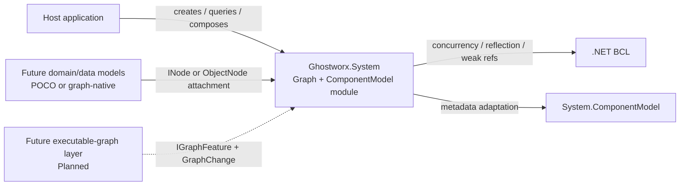

**View notes**

- **Purpose:** Show the module as a reusable foundation rather than a ComponentModel-only library.
- **Audience:** Maintainers, domain-library authors, and executable-graph developers.
- **Boundary:** Internal namespaces/types are intentionally omitted here.

## 4. Structure

### 4.1 Architecture Strategy

- **Graph-first substrate:** topology, identity, semantic relationship types, traversal, and extension hooks reside in `Ghostworx.System.Graph`.
- **Open vocabulary:** semantic kinds are namespaced values, allowing independent libraries to publish their own vocabulary constants.
- **Multiple participation modes:** graph behavior is available through inheritance, composition, or adaptation so domain-model design is not dictated by the graph framework.
- **Explicit relationships:** system collaborations are represented as typed directed edges in addition to ordinary CLR references.
- **Domain isolation:** ComponentModel defines its own vocabulary under `Ghostworx.System.ComponentModel.Graphing`.
- **Adapter over reinvention:** metadata behavior delegates to `System.ComponentModel` where mature behavior already exists.
- **Feature seam before execution engine:** graph mutation validation and post-commit observation are intentionally generic so executable semantics can be added later as a separate capability.

### 4.2 Module Decomposition

| Building block                               | Responsibility                                                       | Depends on                                              | Exposes                                                                                       |
| -------------------------------------------- | -------------------------------------------------------------------- | ------------------------------------------------------- | --------------------------------------------------------------------------------------------- |
| `Ghostworx.System.Graph`                   | Generic graph model, store, traversal, adaptation, extension hosting | BCL only                                                | `IGraph`, `INode`, `GraphStore`, `Graph`, kinds, edges, features, extensions          |
| `Ghostworx.System.ComponentModel.Graphing` | Component-specific node/relationship vocabulary                      | Graph                                                   | `ComponentGraphVocabulary`                                                                  |
| `Ghostworx.System.ComponentModel.Services` | Hierarchical graph-native service model                              | Graph + Component vocabulary                            | service interfaces,`Service`, `ServiceProvider`, `ServiceRegistration`                  |
| `Ghostworx.System.ComponentModel`          | Component/container/site runtime model                               | Graph + Services + Component vocabulary                 | `IComponent`, `Component`, `IContainer`, `Container`, `ISite`, `Site`, collection |
| `Ghostworx.System.ComponentModel.Metadata` | Graph-native metadata/type-description layer                         | Graph + Component vocabulary +`System.ComponentModel` | attributes, descriptors, providers, converter, collections                                    |

### 4.3 Component / Building-Block Diagram

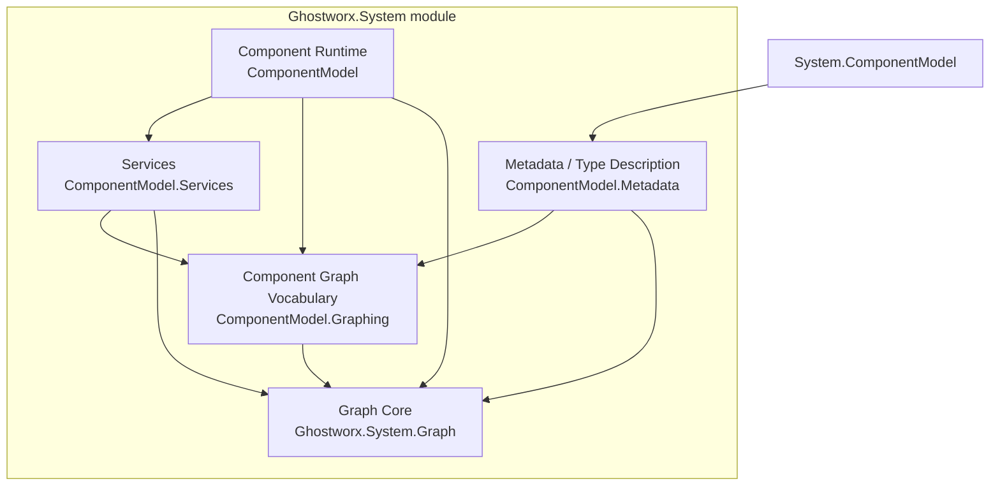

**View notes**

- **Elements:** Namespace-level architectural building blocks.
- **Relations:** Arrow means compile-time/use dependency.
- **Key rule:** No graph-core type depends on ComponentModel namespaces.

### 4.4 Key Types and Contracts

| Type / contract     | Role                                                   | Key collaborators                                      | Stability                                  |
| ------------------- | ------------------------------------------------------ | ------------------------------------------------------ | ------------------------------------------ |
| `INode`           | Minimal read-only graph participation contract         | `IGraph`, `GraphEdge`                              | Foundational public contract               |
| `IMutableNode`    | Controlled node-name/metadata mutation                 | `GraphExtensions`                                    | Optional capability                        |
| `IGraph`          | Node registry, relationship store, traversal, features | `INode`, `IGraphFeature`                           | Foundational public contract               |
| `IObjectGraph`    | Canonical CLR object attachment capability             | `ObjectNode`                                         | Reuse extension contract                   |
| `GraphStore`      | Default concurrent graph implementation                | weak refs, edge dictionaries, features                 | Core implementation base                   |
| `Graph`           | Concrete graph facade and shared graph                 | `GraphStore`                                         | Public concrete type                       |
| `NodeFacet`       | Composition-based graph participation                  | any`INode` owner                                     | Critical extension primitive               |
| `GraphNode`       | Inheritance-based graph participation                  | `NodeFacet`                                          | Convenience base class                     |
| `ObjectNode`      | Adapter for unchanged CLR objects                      | `IObjectGraph`                                       | Domain-model bridge                        |
| `IGraphFeature`   | Mutation validation and committed-change observation   | `IGraph`, `GraphChange`                            | Primary future-execution seam              |
| `GraphVocabulary` | Library-owned semantic kind factory                    | `NodeKind`, `RelationshipKind`                     | Generic vocabulary mechanism               |
| `Container`       | Owns/sits components and container services            | `ComponentCollection`, `Site`, `ServiceProvider` | Component runtime root                     |
| `ServiceProvider` | Hierarchical graph-native service registry             | registrations, parent provider                         | Runtime service infrastructure             |
| `TypeDescriptor`  | Graph-native metadata facade/provider registry         | framework provider, custom providers                   | Metadata facade                            |
| `Attribute`       | CLR attribute + graph node via composition             | `NodeFacet`                                          | Demonstrates non-inheritance participation |

## 5. Model

### 5.1 Generic Graph Model

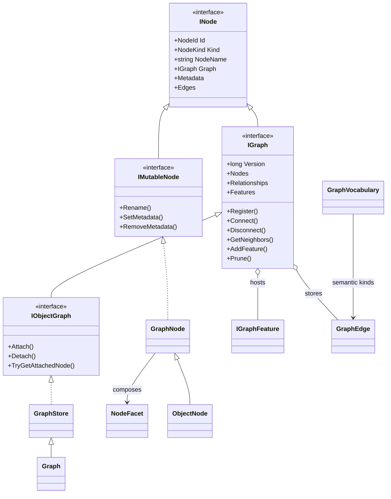

### 5.2 Component Runtime Model

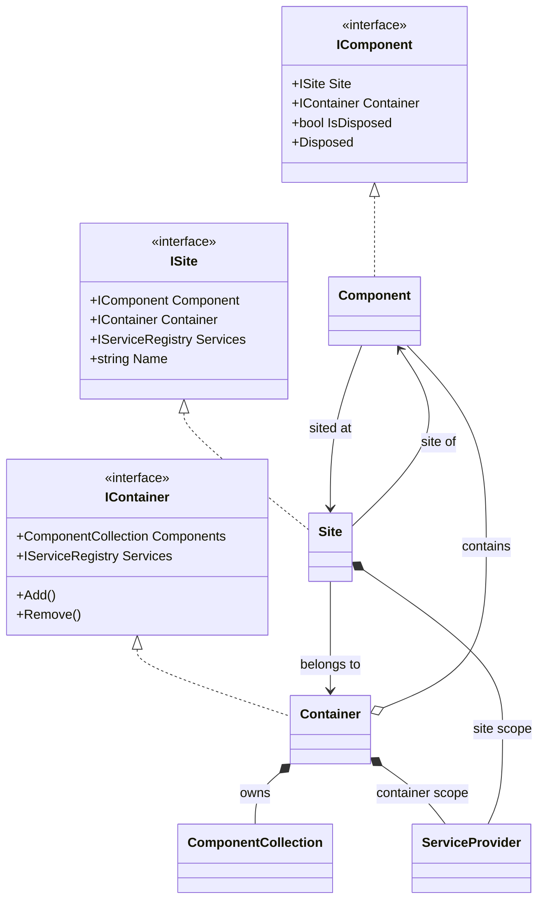

### 5.3 Service Model

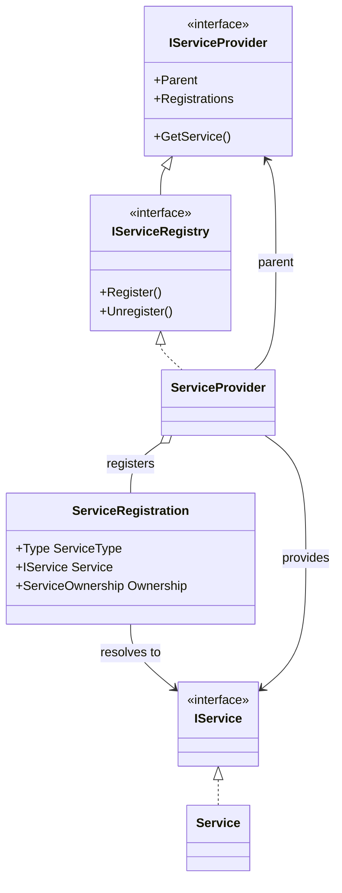

### 5.4 Metadata Model

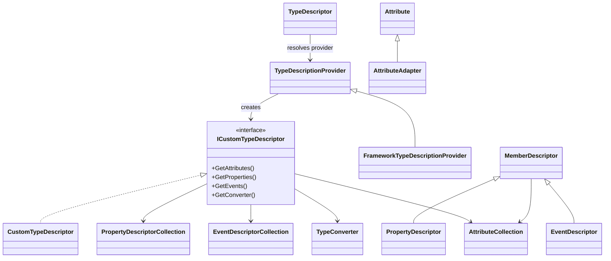

### 5.5 State and Ownership

- **Graph ownership:** every `INode` exposes exactly one owning `IGraph`; graph-local relationships require source and target to expose that same graph instance.
- **Node identity:** `NodeId` is stable for a node; `EdgeId` is stable for a committed relationship.
- **Graph storage lifetime:** registered nodes are held through `WeakReference<INode>`, except the graph node itself. Dead nodes are removed opportunistically or via `Prune()`.
- **POCO attachment lifetime:** `ConditionalWeakTable<object, ObjectAttachment>` canonicalizes wrappers without making the attached object a conventional dictionary root.
- **Component ownership:** `Container` owns the public membership collection and sites components. A component may move between containers; adding to a new container removes it from the previous one first.
- **Site ownership:** default `Site` instances are created by a container and normally own a site-local `ServiceProvider` whose parent is the container provider.
- **Service ownership:** a `ServiceRegistration` records `External` or `ProviderOwned`; disposing a provider-owned registration may dispose the service.
- **Descriptor products:** descriptor/attribute/event/property collections are graph nodes and may be transient products of metadata lookup.

### 5.6 Core Invariants

1. Every graph-native node has a non-empty `NodeId` and non-empty `NodeKind`.
2. A node can only be registered in the exact graph returned by its `Graph` property.
3. A relationship can only connect nodes owned by the same graph instance.
4. A graph relationship kind must be non-empty.
5. A logical edge key `(source, target, kind, label)` is unique in `GraphStore`; duplicate `Connect` calls return the existing edge.
6. Graph `Version` increases monotonically, but the current store does not guarantee a gap-free one-version-per-committed-change journal.
7. Feature validation occurs before the corresponding graph mutation is committed.
8. Feature post-commit failures do not roll back an already committed graph mutation.
9. `ComponentModel` semantics are expressed using `ComponentGraphVocabulary`, not by expanding core graph enums.
10. A `Site` assigned to a component must reference that same component and graph.
11. Site names within one container are unique under case-insensitive comparison when non-empty.
12. Public `ComponentCollection` mutation is controlled by `Container` to preserve site/container consistency.
13. Service instances must belong to the provider graph and be assignable to the registered service contract.
14. Graph-native framework adapters created for a descriptor operation must participate in the same graph as the descriptor infrastructure using them.

## 6. Runtime

### 6.1 Scenario: Relate Arbitrary Domain Objects

**Trigger:** Consumer calls `graph.Relate(source, target, relationshipKind, ...)` using CLR objects that may not implement `INode`.
**Result:** Both objects have canonical graph-node representations and a typed relationship exists between them.

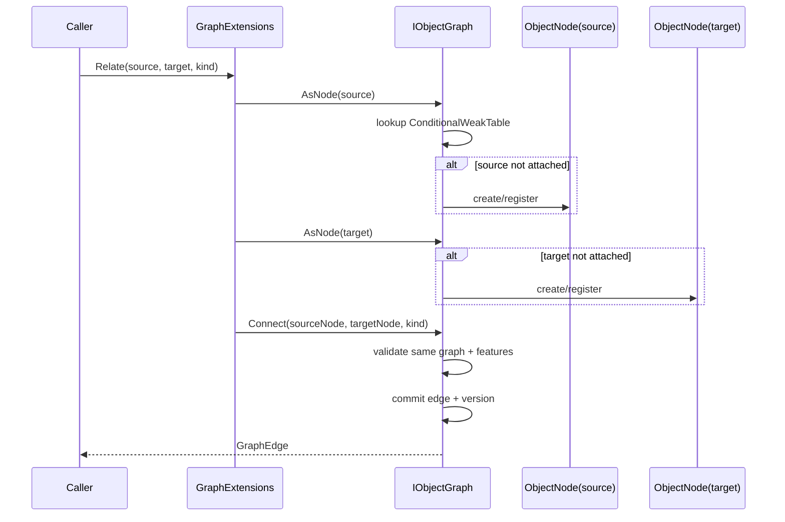

**Failure behavior:** Cross-graph native nodes, empty relationship kinds, feature validation failures, or invalid registrations throw before edge commit. A duplicate logical relationship returns the existing edge.

### 6.2 Scenario: Add a Component to a Container

**Trigger:** `Container.Add(component, name)`.
**Result:** The component is a member of the container, has a `Site`, participates in explicit graph relationships, and can resolve services through site → container provider hierarchy.

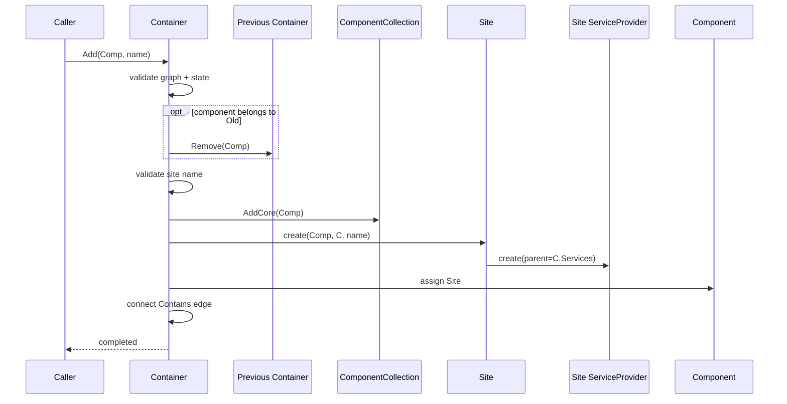

**Failure behavior:** Site creation/assignment is guarded so membership is rolled back if site construction or graph wiring fails.

### 6.3 Scenario: Register a Service

**Trigger:** `ServiceProvider.Register(serviceType, service, ownership, replace)`.
**Result:** A registration node and provider/service relationships are committed atomically with respect to the provider mutation lock.

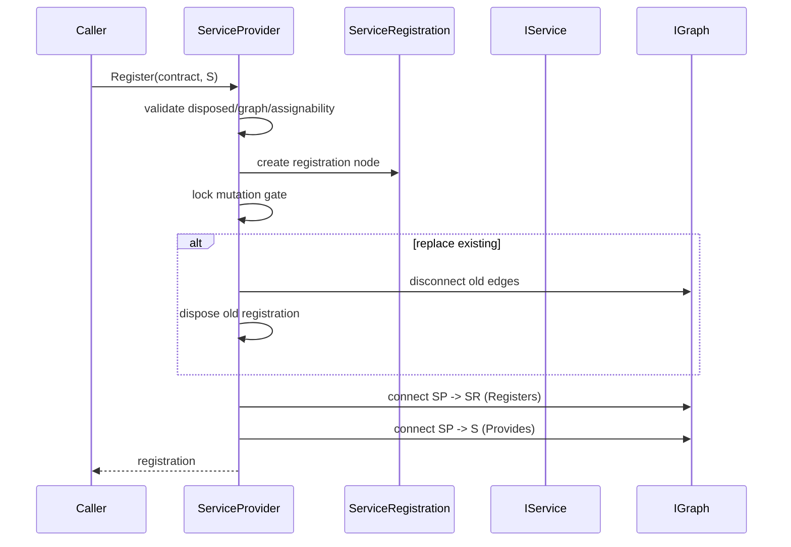

**Failure behavior:** If registration cannot be committed, the new registration is detached without disposing a caller-owned candidate service. Provider-owned services are disposed only according to ownership semantics after successful ownership transfer/replacement/removal.

### 6.4 Graph Mutation Feature Pipeline

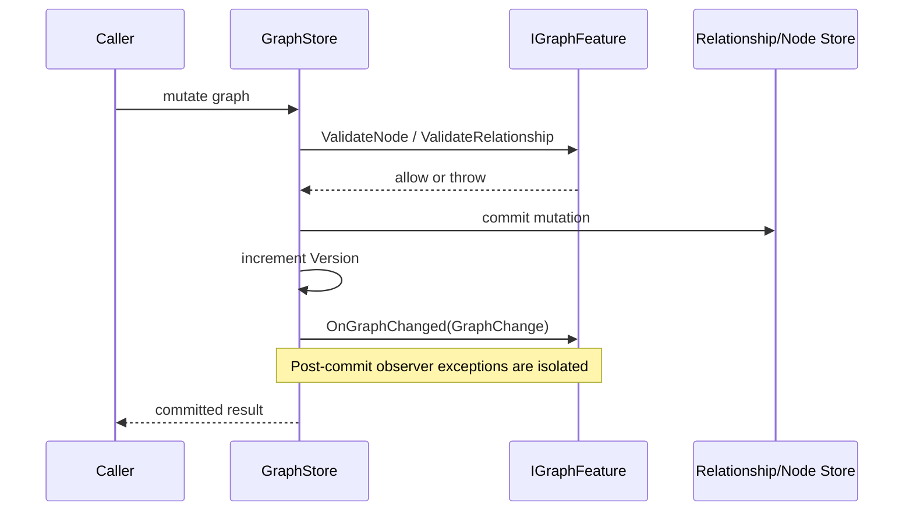

This pipeline is the most important current architectural seam for the next planned phase: executable graph behavior can supervise graph changes without forcing the storage layer to understand execution semantics.

### 6.5 Concurrency

- **Graph registry:** `ConcurrentDictionary<NodeId, WeakReference<INode>>` supports concurrent registration/lookups.
- **Relationship store:** logical edges and edge-id indexes use concurrent dictionaries.
- **Mutation version:** `Interlocked.Increment` supplies a monotonic sequence value. The current implementation does not promise contiguity: a racing duplicate `Connect` can reserve a version before losing `TryAdd`, producing a gap with no corresponding `GraphChange`.
- **Feature set:** feature attach/remove/snapshot operations are protected by `_featureGate`; callbacks operate on snapshots.
- **Object attachments:** `ConditionalWeakTable` access is serialized through `_attachmentGate` to preserve canonical wrapper creation semantics.
- **Component collection:** item mutation and snapshot reads use a private monitor lock.
- **Container:** add/remove/site consistency is serialized with `_gate`.
- **Service provider:** registration mutation is serialized with `_mutationGate`, while lookup uses the concurrent dictionary directly.
- **Type descriptor providers:** provider registry uses `ReaderWriterLockSlim`.
- **Snapshot semantics:** exposed node/relationship/registration collections are materialized snapshots rather than writable live collections.
- **Post-commit callbacks:** feature callback faults are intentionally swallowed after commit so observer failure cannot create ambiguous graph state.

## 7. Interfaces

### 7.1 Public API Surface

| API family                   | Purpose                            | Contract expectations                                        | Extension impact                                     |
| ---------------------------- | ---------------------------------- | ------------------------------------------------------------ | ---------------------------------------------------- |
| `INode` / `IMutableNode` | Universal graph participation      | Stable identity, semantic kind, owning graph, metadata/edges | Foundational; breaking changes are high impact       |
| `IGraph`                   | Graph topology and mutation        | graph-local nodes/edges, versioned mutations                 | Core execution/persistence consumers will build here |
| `IObjectGraph`             | Adapt arbitrary objects            | canonical attachment per object within graph                 | Enables graphing legacy/domain models                |
| `GraphExtensions`          | High-level convenience/traversal   | respects graph ownership                                     | Safe place for additive ergonomics                   |
| `IGraphFeature`            | Cross-cutting graph behavior       | validate before commit; observe after commit                 | Primary plug-in seam                                 |
| Component interfaces         | Component/container/site lifecycle | familiar siting and disposal semantics                       | Consumer-facing runtime contract                     |
| Service interfaces           | Hierarchical graph-native services | typed registration and ownership semantics                   | Extensible service layer                             |
| Metadata interfaces/classes  | Graph-native type metadata         | framework adaptation + custom providers                      | Tooling/design-time/agent metadata surface           |

### 7.2 Extension Points

| Extension point                          | Mechanism                            | Contract                                        | Typical use                                          |
| ---------------------------------------- | ------------------------------------ | ----------------------------------------------- | ---------------------------------------------------- |
| `GraphVocabulary`                      | Define namespaced semantic constants | Kind names must be non-empty and stable         | Domain-specific nodes/relationships                  |
| `GraphNode`                            | Inheritance                          | constructor registers node into one graph       | New graph-native runtime types                       |
| `NodeFacet`                            | Composition                          | owner exposes facet identity/graph consistently | CLR types with an existing base class                |
| `IObjectGraph.Attach` / `ObjectNode` | Adapter                              | canonical wrapper for unchanged object          | POCO/domain/data model graphing                      |
| `IGraphFeature` / `GraphFeature`     | Registration/plugin                  | pre-commit validation; post-commit observation  | constraints, indexing, diagnostics, future execution |
| `TypeDescriptionProvider`              | Provider registration                | provider belongs to descriptor graph            | custom metadata sources                              |
| `CustomTypeDescriptor`                 | Inheritance/composition              | optional parent descriptor                      | metadata layering                                    |
| `Service` / `IService`               | Inheritance/interface                | service must belong to same graph as registry   | graph-native runtime services                        |

### 7.3 Compatibility

- **Runtime/language:** .NET 8+ / C# 12.
- **Framework compatibility:** `System.ComponentModel` is aliased as `FrameworkComponentModel`; framework descriptors, attributes, converters, and type metadata are adapted into graph-native equivalents.
- **CLR model compatibility:** an existing model does not need to implement `INode`; `ObjectNode` can adapt it.
- **Source compatibility:** additive node/relationship vocabulary is expected to be source-compatible because kinds are open values rather than closed enums.
- **Binary compatibility:** no explicit semantic-versioning policy is encoded in the module yet.
- **Persistence compatibility:** N/A in the current implementation; identities are runtime values and no durable format is defined.

## 8. Cross-Cutting Concerns

### 8.1 Error Handling

- Invalid graph ownership, identity collisions, empty semantic kinds, incompatible service contracts, and invalid site assignments fail fast with exceptions.
- Graph feature validators are permitted to throw before mutation commit.
- `OnGraphChanged` exceptions are isolated after commit; graph state remains committed.
- Component addition includes rollback of collection membership if site creation/wiring fails.
- Disposing types use `Interlocked` state transitions to make repeated disposal idempotent.

### 8.2 Observability

Current observability is structural rather than logging-based:

- `IGraph.Nodes`
- `IGraph.Relationships`
- per-node `Edges`
- `IGraph.Version`
- stable `NodeId` / `EdgeId`
- `GraphChange` delivered to graph features
- semantic `NodeKind`, `RelationshipKind`, labels, node names, and node metadata

There is no built-in logger, event stream, trace context, metrics sink, or durable journal yet.

### 8.3 Performance

**Critical paths**

- Node lookup: concurrent dictionary lookup by `NodeId`.
- Relationship identity lookup: edge-id index lookup.
- Exact service lookup: concurrent dictionary by `Type`.
- Edge traversal: currently filters the complete edge value collection for a node.
- Node-kind queries: extension methods currently filter node snapshots rather than using a dedicated kind index.

**Scaling implications**

- The current graph is optimized for in-process correctness and flexibility rather than very large graph analytics.
- `GetEdges(nodeId)` is effectively O(E) over current relationships; executable or large-domain graph workloads will likely require adjacency indexes.
- `Nodes` and `Relationships` materialize sorted snapshots, which is excellent for deterministic inspection but not a zero-allocation hot path.
- Weak node references reduce unintended lifetime retention but require pruning behavior.

### 8.4 Security

The module has no external trust boundary by itself, but future consumers should consider:

- Metadata values are `object?` and may contain arbitrary references.
- Metadata converter creation uses reflection/`Activator` for declared converter types.
- A future executable graph must not treat semantic labels, metadata, or discovered types as executable authority without an explicit trust/policy layer.
- Graph features run in-process with the privileges of the host process.

### 8.5 Persistence / Serialization

**Current status: not implemented.**

Important implications for a future persistence layer:

- `NodeId` and `EdgeId` already provide stable runtime identities suitable for serialization.
- `GraphSymbol`/kind qualified names are better persistence keys than CLR enum ordinals.
- `CreatedAtVersion` and `GraphChange.Version` provide ordering primitives.
- Arbitrary `object?` metadata and `ObjectNode.Value` require an explicit serialization policy rather than generic reflection serialization.
- Weak lifetime semantics must be deliberately translated into persistence semantics; a durable graph cannot simply mirror current weak-reference behavior.

## 9. Deployment

**Deployment status:** In-process library/module. No independent process, storage service, or network endpoint is required.

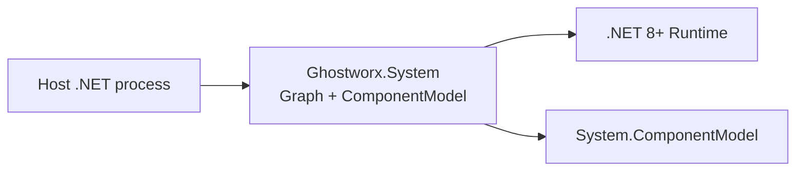

The current single-file source organization is a source-layout choice, not an architectural requirement. The namespace boundaries are already sufficient to split the module into assemblies/packages later if that becomes useful.

## 10. Decisions

| ID    | Decision                                                            | Status   | Rationale                                                                       | Consequence / trade-off                                                            |
| ----- | ------------------------------------------------------------------- | -------- | ------------------------------------------------------------------------------- | ---------------------------------------------------------------------------------- |
| AD-01 | Make graph functionality domain-neutral and foundational            | Accepted | Future models must reuse graph infrastructure without ComponentModel dependency | Requires domain vocabularies to live outside core                                  |
| AD-02 | Use open semantic value types instead of enums                      | Accepted | Independent libraries can extend vocabulary without modifying core              | Less exhaustive compiler switching than closed enums                               |
| AD-03 | Support inheritance, composition, and object adaptation             | Accepted | Graph participation must not dictate domain inheritance                         | Three participation mechanisms must remain behaviorally consistent                 |
| AD-04 | Make relationships explicit immutable values with stable identities | Accepted | Supports diagnostics, future execution, persistence, and targeted removal       | Relationship metadata is currently limited to kind/label/version                   |
| AD-05 | Enforce graph-local relationships                                   | Accepted | Strong ownership and traversal invariant                                        | Cross-graph federation requires a future explicit abstraction                      |
| AD-06 | Use weak node registry/object attachment semantics                  | Accepted | Observation should not unintentionally retain domain objects                    | Dead nodes/edges require pruning and can disappear when no longer rooted elsewhere |
| AD-07 | Use`IGraphFeature` for cross-cutting graph behavior               | Accepted | Avoid coupling storage to validation, diagnostics, indexing, or execution       | Post-commit observer faults are intentionally isolated                             |
| AD-08 | Keep`GraphStore` implementation separate from concrete `Graph`  | Accepted | Avoids C# member/enclosing-type naming conflict while preserving`INode.Graph` | Public implementation has a facade/base distinction                                |
| AD-09 | Isolate ComponentModel semantics in`ComponentGraphVocabulary`     | Accepted | Protect generic graph vocabulary from domain leakage                            | Component relationships are explicitly mapped by higher layer                      |
| AD-10 | Adapt`System.ComponentModel` metadata                             | Accepted | Leverage mature BCL behavior and compatibility                                  | Wrapper nodes can be transient and increase graph object count                     |
| AD-11 | Give sites hierarchical service scopes                              | Accepted | Component-local overrides with container fallback are useful and familiar       | More lifecycle/relationship objects per component                                  |
| AD-12 | Serialize provider/container mutations with focused locks           | Accepted | Preserve multi-step invariants while allowing concurrent reads                  | Some mutation paths are lock-based rather than fully lock-free                     |

## 11. Quality

### 11.1 Quality Scenarios

| ID   | Scenario                                                                           | Expected response                                                                        | Verification                                                       |
| ---- | ---------------------------------------------------------------------------------- | ---------------------------------------------------------------------------------------- | ------------------------------------------------------------------ |
| Q-01 | A future domain library defines`Order`, `Customer`, and `PlacedBy` semantics | No graph-core source modification required                                               | Compile a separate vocabulary +`graph.Relate` integration test   |
| Q-02 | A POCO with no Ghostworx base/interface is related to another POCO                 | Canonical`ObjectNode` wrappers are created and reused                                  | Attachment identity test                                           |
| Q-03 | A relationship attempts to join nodes from different graphs                        | Mutation is rejected before commit                                                       | Negative unit test                                                 |
| Q-04 | Two callers connect the same logical edge concurrently                             | At most one logical`(source,target,kind,label)` edge remains                           | Concurrency stress test                                            |
| Q-05 | A feature validator rejects a relationship                                         | No relationship is committed and no relationship-connected`GraphChange` is emitted     | Feature validation unit test                                       |
| Q-06 | A post-commit feature observer throws                                              | Graph mutation remains committed and caller receives committed result                    | Fault-injection test                                               |
| Q-07 | A component moves from one container to another                                    | Prior membership/site is removed before new site is established                          | Component lifecycle test                                           |
| Q-08 | A site resolves a service not registered locally                                   | Lookup falls through to parent container provider                                        | Service hierarchy test                                             |
| Q-09 | A provider-owned service registration is removed                                   | Owned service is disposed exactly once                                                   | Ownership/disposal test                                            |
| Q-10 | A type uses standard .NET metadata                                                 | Framework properties/events/attributes/converter are exposed as graph-native descriptors | Compatibility test against`System.ComponentModel.TypeDescriptor` |

### 11.2 Verification Strategy

- **Graph unit tests:** identity, registration, collisions, edge uniqueness, disconnect, traversal, pruning, metadata mutation.
- **Graph concurrency tests:** duplicate connect races, register/unregister races, feature add/remove, attachment canonicalization.
- **Feature tests:** validation ordering, post-commit notification, version monotonicity, observer fault isolation.
- **Domain adaptation tests:** unchanged POCO attachment and typed neighbor extraction.
- **Component lifecycle tests:** add/move/remove/dispose/site-name uniqueness and graph-edge consistency.
- **Service tests:** hierarchy, exact/assignable lookup, replacement, ownership, disposal under races.
- **Metadata compatibility tests:** compare representative outputs/behavior with framework `TypeDescriptor`.
- **Architecture tests:** assert `Ghostworx.System.Graph` has no dependency on `Ghostworx.System.ComponentModel.*`.
- **Performance benchmarks:** add before executable-graph work, especially adjacency traversal and change dispatch.

## 12. Risks

| ID    | Risk / debt                                                                                       | Impact                                                                                                        | Mitigation                                                                                           | Status                    |
| ----- | ------------------------------------------------------------------------------------------------- | ------------------------------------------------------------------------------------------------------------- | ---------------------------------------------------------------------------------------------------- | ------------------------- |
| RK-01 | Edge traversal scans all edges                                                                    | Large/executable graphs may become CPU-heavy                                                                  | Add adjacency indexes while keeping`IGraph` semantics                                              | Open                      |
| RK-02 | No multi-mutation transaction abstraction                                                         | Complex graph operations can expose intermediate committed states                                             | Introduce mutation batch/transaction semantics before execution workflows depend on atomic subgraphs | Open                      |
| RK-03 | No durable graph/change persistence                                                               | Cannot restore or replay graph state                                                                          | Define snapshot + change-log contracts separately from core storage                                  | Planned                   |
| RK-04 | Weak nodes can disappear when no longer strongly referenced                                       | Consumers may mistake graph membership for ownership                                                          | Document lifetime contract; add optional strong-retention policy/feature if needed                   | Accepted design / monitor |
| RK-05 | `Graph.Shared` may accumulate stale relationship entries until pruning                          | Long-lived processes can retain edge records for dead nodes                                                   | Schedule/opportunistically trigger`Prune`, or add maintenance feature/index cleanup                | Open                      |
| RK-06 | `GraphChange` carries limited mutation detail                                                   | Execution/persistence may need richer before/after context                                                    | Extend through additive event payloads or specialized feature contracts                              | Open                      |
| RK-07 | Post-commit feature exceptions are swallowed                                                      | Silent feature failure can hide broken secondary behavior                                                     | Add feature supervision/diagnostics without changing commit semantics                                | Open                      |
| RK-08 | Single source file is large                                                                       | Navigation, ownership, and testing become harder as capabilities grow                                         | Preserve namespaces and split into files/projects when module matures                                | Open                      |
| RK-09 | Reflection-based converter instantiation can fail at runtime                                      | Metadata customization errors surface late                                                                    | Validate converter contracts and constructor availability in tests/tooling                           | Open                      |
| RK-10 | No async/cancellation model                                                                       | Future graph execution may need asynchronous operations                                                       | Keep execution APIs separate from current synchronous storage contract                               | Planned                   |
| RK-11 | `Version` is monotonic but not guaranteed contiguous under a duplicate-edge race                | Durable replay/execution code could incorrectly assume every integer maps to a commit                         | Define explicit commit-sequence semantics before persistence/execution depends on it                 | Open                      |
| RK-12 | `Register` performs collision check and assignment as separate concurrent-dictionary operations | Two deliberately identical`NodeId` registrations racing could theoretically overwrite despite the pre-check | Use an atomic`TryAdd`/compare loop if caller-supplied IDs become common or security-sensitive      | Open                      |

## 13. Evolution

### 13.1 Current Extension Seams

- **`IGraphFeature`** — attach graph-wide capabilities without changing `GraphStore`.
- **`GraphChange` + monotonic `Version`** — order committed structural changes.
- **Stable `EdgeId`** — directly address relationships as future execution/control artifacts.
- **Open `NodeKind`/`RelationshipKind`** — define executable or domain semantics outside core.
- **`NodeFacet`** — add node capability to types constrained by another inheritance hierarchy.
- **`ObjectNode` / `IObjectGraph`** — project existing domain/data objects into the graph.
- **Graph metadata** — annotate nodes with execution, policy, diagnostic, or provenance information without changing domain state.
- **Traversal helpers** — provide higher-order lookup over node type and attached values.

### 13.2 Planned Directions

The next architectural phase is expected to introduce **executable graph functionality**. The present module intentionally does not prescribe what “execution” means; a separate execution layer can build on the following concepts:

1. **Executable node/edge capabilities** — behavior contracts associated with semantic node or relationship types.
2. **Execution context** — run identity, inputs, cancellation, scoped services, state, and diagnostics.
3. **Scheduling/propagation semantics** — dependency readiness, ordering, fan-out/fan-in, conditional edges, and cycle policies.
4. **Execution state model** — pending/runnable/running/succeeded/failed/cancelled/skipped states as graph-visible state.
5. **Change-driven execution** — consume committed `GraphChange` notifications where structural mutation should affect plans.
6. **Execution observability** — traces linked to `NodeId`, `EdgeId`, graph version, and execution run identity.
7. **Optional persistence/replay** — durable snapshots/change streams independent of the in-memory graph store.
8. **Indexes/projections** — adjacency, semantic-kind, dependency, and executable-state indexes implemented as features or specialized stores.

These are **planned capabilities, not current behavior**.

### 13.3 Executable-Graph Direction Diagram

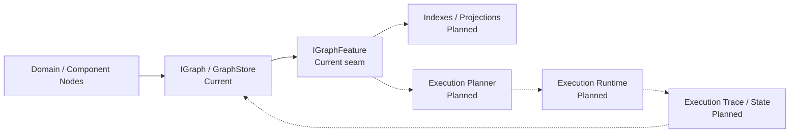

### 13.4 Change Rules

- Additive graph vocabularies should not require changes to `Ghostworx.System.Graph`.
- New cross-cutting behavior should first be evaluated as an `IGraphFeature` or extension method before adding responsibility to `GraphStore`.
- Storage optimizations may change implementation internals but must preserve graph-local ownership, stable identity, edge uniqueness, and externally visible mutation semantics.
- Executable-graph contracts should live in a separate namespace/module and depend on graph core, never the reverse.
- Persistence should serialize semantic qualified names and stable identities rather than relying on CLR enum ordinals or runtime object addresses.
- Any change to node lifetime semantics, graph ownership, or mutation commit semantics is architecturally significant and should require an ADR.

## 14. Glossary

| Term                 | Meaning                                                                                         |
| -------------------- | ----------------------------------------------------------------------------------------------- |
| Graph                | A graph-local registry of nodes and typed directed relationships; itself an`INode`            |
| Node                 | Any graph participant exposing`INode` identity, kind, graph, metadata, and edges              |
| Native node          | A type implementing graph participation directly, usually through`GraphNode` or `NodeFacet` |
| Object node          | An`ObjectNode` wrapper adapting an unchanged CLR object into a graph                          |
| Node facet           | Composition primitive that supplies graph identity/metadata/registration to an`INode` owner   |
| Graph symbol         | Namespaced open semantic identifier used to define node and relationship kinds                  |
| Vocabulary           | A library-owned set of node/relationship semantic constants                                     |
| Relationship         | Directed typed`GraphEdge` between two nodes in the same graph                                 |
| Graph feature        | Plug-in that validates impending mutations and observes committed graph changes                 |
| Graph change         | Versioned notification representing a committed structural/feature mutation                     |
| Site                 | Component-to-container association with name, design-mode flag, and service scope               |
| Service registration | Graph node binding a service contract type to a service instance and ownership policy           |
| Descriptor           | Graph-native metadata representation for types/members/events/properties                        |
| Framework adapter    | Graph-native wrapper delegating behavior to`System.ComponentModel`                            |

## Appendix A — Graph Relationship Vocabulary

The ComponentModel layer currently publishes the following semantic relationship families through `ComponentGraphVocabulary.Relationships`:

| Relationship              | Architectural meaning                                                   |
| ------------------------- | ----------------------------------------------------------------------- |
| `Contains`              | Structural containment/membership                                       |
| `ContainedBy`           | Explicit reverse containment relation where modeled                     |
| `OwnsCollection`        | Owner-to-collection association                                         |
| `MemberOf`              | Collection-to-owner association                                         |
| `SitedAt`               | Component-to-site association                                           |
| `SiteOf`                | Site-to-component association                                           |
| `HasServiceProvider`    | Owner/site to service-provider association                              |
| `ParentServiceProvider` | Child service provider to parent provider                               |
| `Registers`             | Provider to service-registration node                                   |
| `Provides`              | Provider directly to provided service                                   |
| `RegistrationFor`       | Registration semantic reserved by vocabulary                            |
| `ResolvesTo`            | Registration to service instance                                        |
| `Describes`             | Descriptor/provider relationship to described target or parent metadata |
| `UsesProvider`          | Type descriptor to provider                                             |
| `HasMember`             | Descriptor/collection membership relation                               |
| `HasAttribute`          | Descriptor/collection to attribute data                                 |
| `HasConverter`          | Descriptor to converter                                                 |
| `Adapts`                | Adapter relationship reserved for adapted framework/domain objects      |

The root graph also exposes a deliberately small domain-neutral relationship vocabulary (`Contains`, `References`, `DependsOn`, `Describes`, `Adapts`, `Custom`). Future libraries should prefer their own namespaced vocabulary when a more precise semantic exists.

## Appendix B — Source Organization

```text
Core.cs
├── Ghostworx.System.Graph
│   ├── identity and semantic value types
│   ├── graph contracts and features
│   ├── NodeFacet / GraphNode / ObjectNode
│   ├── GraphStore / Graph
│   └── GraphExtensions
├── Ghostworx.System.ComponentModel.Graphing
│   └── ComponentGraphVocabulary
├── Ghostworx.System.ComponentModel.Services
│   ├── service contracts
│   ├── Service
│   ├── ServiceRegistration
│   └── ServiceProvider
├── Ghostworx.System.ComponentModel
│   ├── component/container/site contracts
│   ├── ComponentCollection
│   ├── Component
│   ├── Site
│   └── Container
└── Ghostworx.System.ComponentModel.Metadata
    ├── graph-native attributes
    ├── descriptor abstractions/collections
    ├── TypeConverter
    ├── TypeDescriptionProvider / TypeDescriptor
    └── System.ComponentModel adapters
```

## Appendix C — Documentation Basis

This document uses the module-focused `TEMPLATE.md` created alongside it. The template synthesizes the document coverage of arc42, the stakeholder/view discipline of SEI Views & Beyond, and the visual hierarchy/runtime guidance of the C4 model.
