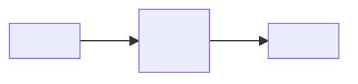
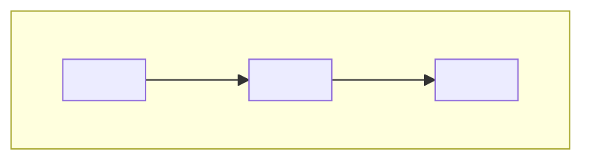
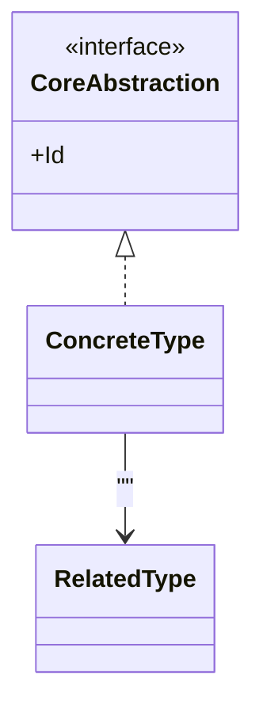
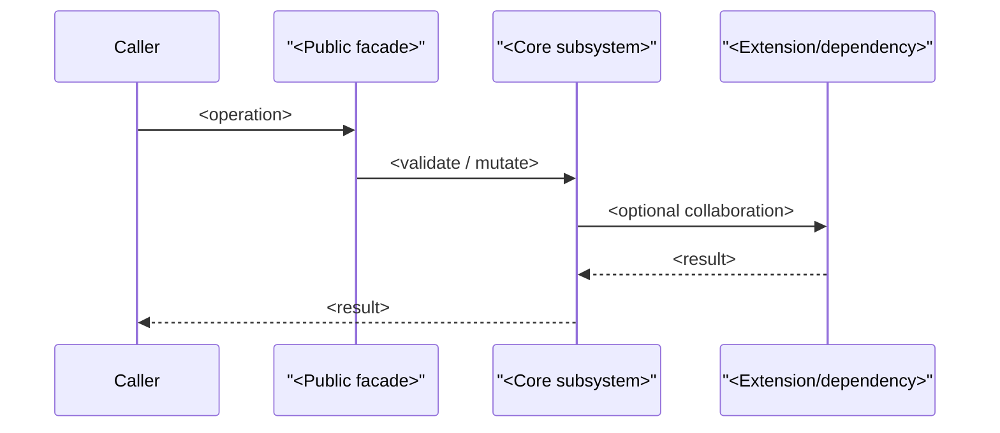
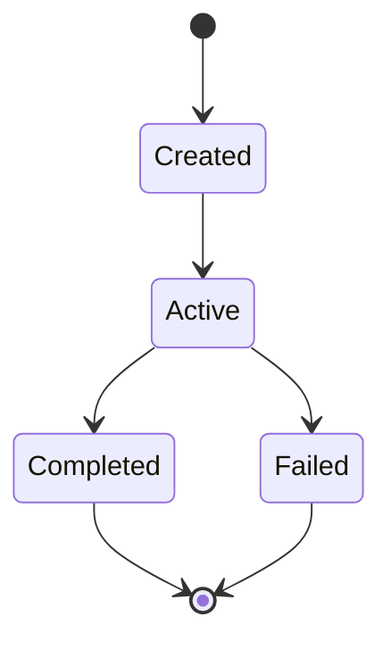
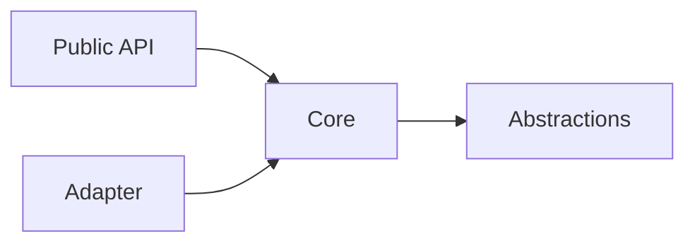

# Architecture

> **Scope selector:** [x] Module  [ ] Package  [ ] Solution  
> **Document status:** `<Draft | Proposed | Accepted | Superseded>`  
> **Owner:** `<team / architect / maintainer>`  
> **Version:** `<document version>`  
> **Last updated:** `<YYYY-MM-DD>`  
> **Source scope:** `<repository path, project, assembly, or module>`

<!--
PURPOSE OF THIS TEMPLATE

Use this document to describe the architecture of a cohesive software MODULE: a library,
assembly, bounded subsystem, framework module, or similarly sized code unit. It is intentionally
more compact than a solution-level architecture document while retaining enough rigor for future
maintainers, integrators, reviewers, and AI/software-engineering agents to reason about the module.

Adaptation:
- Module: use all Required sections; keep deployment brief or mark N/A.
- Package: retain the same structure, but expand dependencies, compatibility, and deployment.
- Solution: add system landscape, infrastructure, operations, organizational ownership, and
  environment-specific deployment detail rather than simply making every module section longer.

Authoring rules:
1. Prefer architecture facts over implementation narration.
2. State scope and non-goals explicitly.
3. Document interfaces, invariants, ownership, runtime behavior, and rationale—not only classes.
4. Keep 1-3 representative runtime scenarios unless more are architecturally significant.
5. Use diagrams only when they communicate structure or behavior better than prose.
6. For every diagram, identify its purpose, scope, important relationships, and any omitted detail.
7. Keep decisions short here; link a separate ADR when a decision needs a full decision record.
8. Mark future work as Planned; never present it as Current architecture.
9. Delete instructions/comments and unused optional subsections when publishing.
-->

## 1. Purpose

### 1.1 Summary

<!-- Required. In 2-5 sentences, explain what the module is, what capability it owns, and why it exists. -->

`<Module summary>`

### 1.2 Scope

<!-- Required. Define the architecture boundary. Name what is inside and outside. -->

**In scope**
- `<responsibility / namespace / subsystem>`
- `<responsibility>`

**Out of scope**
- `<explicit non-goal>`
- `<responsibility owned elsewhere>`

### 1.3 Stakeholders

<!-- Required. Use roles rather than names unless ownership requires a named individual/team. -->

| Stakeholder | Primary concern | Uses this document for |
|---|---|---|
| `<module consumers>` | `<API stability, behavior>` | `<integration>` |
| `<maintainers>` | `<correctness, change impact>` | `<implementation/evolution>` |
| `<operators/testers/etc.>` | `<quality concern>` | `<verification/operation>` |

## 2. Drivers

### 2.1 Responsibilities

<!-- Required. Architectural responsibilities, not a feature backlog. -->

| ID | Responsibility | Architectural consequence |
|---|---|---|
| R-01 | `<responsibility>` | `<structure/API/behavior it drives>` |
| R-02 | `<responsibility>` | `<consequence>` |

### 2.2 Quality Goals

<!-- Required. Rank the few quality attributes that materially shape the architecture. -->

| Priority | Quality attribute | Concrete meaning for this module | Evidence / measure |
|---|---|---|---|
| 1 | `<Extensibility / Performance / Reliability / ...>` | `<scenario-specific definition>` | `<test, benchmark, invariant>` |
| 2 | `<quality>` | `<definition>` | `<evidence>` |

### 2.3 Constraints

<!-- Required. Include platform, language/runtime, compatibility, regulatory, dependency, and repository constraints. -->

- `<constraint>`
- `<constraint>`

### 2.4 Non-Goals

<!-- Recommended. Prevent accidental scope expansion. -->

- `<not provided by this module>`
- `<deferred capability>`

## 3. Context

### 3.1 External Context

<!--
Required. Identify consumers, upstream/downstream libraries, framework/runtime dependencies,
and external resources. For a library module, treat consuming code and framework libraries as
external actors/systems. Keep this zoomed out.
-->

| External element | Direction | Contract / dependency | Notes |
|---|---|---|---|
| `<consumer>` | `<in/out/both>` | `<public API>` | `<notes>` |
| `<framework/library>` | `<in>` | `<API/package>` | `<notes>` |

### 3.2 Context Diagram

<!--
Recommended. C4-style context view adapted to a module. Replace placeholders.
Show the module as one box; surround it with consumers and external dependencies.
Do not include internal classes here.
-->

**View notes**
- **Purpose:** `<what question this view answers>`
- **Audience:** `<stakeholders>`
- **Boundary:** `<what is intentionally omitted>`

## 4. Structure

### 4.1 Architecture Strategy

<!-- Required. 3-7 bullets describing the organizing ideas that make the design coherent. -->

- `<principle / pattern / decomposition strategy>`
- `<principle>`
- `<principle>`

### 4.2 Module Decomposition

<!--
Required. Describe architectural building blocks: namespaces, layers, subsystems, major abstractions,
or source partitions. Each row should state responsibility and allowed dependencies.
-->

| Building block | Responsibility | Depends on | Exposes |
|---|---|---|---|
| `<block>` | `<responsibility>` | `<dependencies>` | `<contracts>` |
| `<block>` | `<responsibility>` | `<dependencies>` | `<contracts>` |

### 4.3 Component / Building-Block Diagram

<!--
Required for non-trivial modules. This is the main static architecture view.
Show coarse architectural blocks and dependency direction. Avoid a class-per-box diagram.
-->

**View notes**
- **Elements:** `<what the boxes represent>`
- **Relations:** `<meaning of arrows>`
- **Key rule:** `<dependency/invariant rule>`

### 4.4 Key Types and Contracts

<!-- Recommended. Cover architecturally significant types only. -->

| Type / contract | Role | Key collaborators | Stability |
|---|---|---|---|
| `<interface/class>` | `<role>` | `<types>` | `<public/internal/extension point>` |

## 5. Model

### 5.1 Domain / Data Model

<!--
Recommended when the module owns a meaningful model, graph, protocol, state machine, schema,
or metadata structure. Replace with ER/class/graph notation as appropriate.
-->

### 5.2 State and Ownership

<!-- Required when state/lifetime matters. State who owns what, lifetime rules, mutation boundaries, and cleanup. -->

- **State owner:** `<type/subsystem>`
- **Lifetime:** `<creation → active → disposal/removal>`
- **Mutation boundary:** `<who may mutate>`
- **Consistency rule:** `<invariant>`
- **Cleanup rule:** `<cleanup/disposal semantics>`

### 5.3 Core Invariants

<!-- Required. Write invariants as testable statements. -->

1. `<Invariant>`
2. `<Invariant>`
3. `<Invariant>`

## 6. Runtime

<!--
Required for modules with meaningful collaboration. Select 1-3 architecturally significant
scenarios: creation/registration, hot path, failure/recovery, disposal, or extension execution.
Do not document routine getters/setters.
-->

### 6.1 Scenario: `<name>`

**Trigger:** `<what starts the flow>`  
**Result:** `<observable outcome>`

**Failure behavior:** `<exceptions, rollback/commit semantics, retry behavior>`

### 6.2 Concurrency

<!-- Required if the module is thread-safe, concurrent, asynchronous, or shared. Otherwise state "Not thread-safe by design." -->

- **Concurrency model:** `<locks / lock-free / actor / immutable / single-threaded>`
- **Atomic operations:** `<operations that are atomic>`
- **Snapshot semantics:** `<what reads observe>`
- **Ordering:** `<ordering/version rules>`
- **Known race boundaries:** `<important caveats>`

## 7. Interfaces

### 7.1 Public API Surface

<!-- Required. Describe contract families and semantics; do not copy every method signature. -->

| API family | Purpose | Contract expectations | Extension impact |
|---|---|---|---|
| `<interface / facade>` | `<purpose>` | `<semantics>` | `<compatibility notes>` |

### 7.2 Extension Points

<!-- Required when extensibility is an architectural goal. -->

| Extension point | Mechanism | Contract | Typical use |
|---|---|---|---|
| `<SPI/interface/base class>` | `<inherit/compose/register/adapter>` | `<rules>` | `<use case>` |

### 7.3 Compatibility

<!-- Recommended for reusable libraries/modules. -->

- **Runtime/language:** `<target>`
- **Framework compatibility:** `<BCL/framework interop>`
- **Source compatibility policy:** `<policy>`
- **Binary compatibility policy:** `<policy>`
- **Serialization/persistence compatibility:** `<policy or N/A>`

## 8. Cross-Cutting Concerns

<!-- Keep only concerns that materially affect this module. -->

### 8.1 Error Handling

- `<validation strategy>`
- `<exception/fault policy>`
- `<post-commit failure policy>`

### 8.2 Observability

- `<events, diagnostics, tracing, versioning, metrics, hooks, or N/A>`

### 8.3 Performance

- **Critical paths:** `<operations>`
- **Complexity / scaling:** `<expected complexity>`
- **Allocation/lifetime considerations:** `<notes>`

### 8.4 Security

- `<trust boundary, validation, dangerous reflection/dynamic behavior, or N/A>`

### 8.5 Persistence / Serialization

- `<persistence model, snapshot format, compatibility, or explicitly N/A>`

## 9. Deployment

<!--
Optional for a module. Use only when packaging/runtime placement changes architecture.
For an in-process library, a short statement is enough. For packages/services, expand.
-->

**Deployment status:** `<N/A — in-process library | package | hosted service | other>`

## 10. Decisions

<!--
Required. Record only architecturally significant decisions. If a decision requires alternatives,
trade studies, or a long rationale, create an ADR and link it from this table.
-->

| ID | Decision | Status | Rationale | Consequence / trade-off |
|---|---|---|---|---|
| AD-01 | `<decision>` | `<Accepted/Proposed>` | `<why>` | `<cost/benefit>` |

## 11. Quality

### 11.1 Quality Scenarios

<!-- Required. Make top quality goals testable. -->

| ID | Scenario | Expected response | Verification |
|---|---|---|---|
| Q-01 | `<stimulus under condition>` | `<measurable response>` | `<test/benchmark/review>` |

### 11.2 Verification Strategy

- **Unit:** `<architectural invariants tested>`
- **Concurrency:** `<stress/race testing>`
- **Compatibility:** `<framework/API tests>`
- **Performance:** `<benchmarks if relevant>`
- **Architecture:** `<dependency/API/diagram consistency checks>`

## 12. Risks

| ID | Risk / debt | Impact | Mitigation | Status |
|---|---|---|---|---|
| RK-01 | `<risk>` | `<impact>` | `<mitigation>` | `<Open/Accepted/Planned>` |

## 13. Evolution

<!--
Required for foundational/reusable modules. Separate current extension seams from future capabilities.
State what the present architecture intentionally enables next.
-->

### 13.1 Current Extension Seams

- `<extension seam>`
- `<extension seam>`

### 13.2 Planned Directions

- `<planned capability — not yet implemented>`
- `<planned capability>`

### 13.3 Change Rules

- `<what can evolve compatibly>`
- `<what requires an ADR / major version / migration>`

## 14. Glossary

| Term | Meaning |
|---|---|
| `<term>` | `<precise module-specific definition>` |

## Appendix A — Diagram Guidance

<!--
Use this catalog to decide which diagrams belong in the document. Do not include every diagram by default.

1. Context diagram — almost always useful. Shows the module boundary and external collaborators.
2. Building-block/component diagram — required for non-trivial modules. Shows coarse internal structure.
3. Domain/class/data diagram — use when a model or schema is architecturally significant.
4. Runtime/sequence diagram — use for 1-3 non-obvious collaboration scenarios.
5. Deployment diagram — optional for in-process libraries; required when runtime placement matters.
6. State diagram — use when lifecycle or execution states are central.
7. Dependency diagram — use when allowed/forbidden dependency direction is a key design constraint.

Diagram quality rules:
- Give each diagram one architectural question to answer.
- Keep the abstraction level consistent inside a diagram.
- Label important relationships; arrows without semantics are ambiguous.
- Include a legend when notation is not obvious.
- State scope and omissions below the diagram.
- Prefer generated diagrams for volatile code-level detail; hand-maintain only stable architectural views.
-->

### Optional State Diagram Placeholder

### Optional Dependency Diagram Placeholder

## Appendix B — Template Basis

This template intentionally combines three established architecture-documentation approaches:

1. **arc42** — used for the overall narrative spine: goals, constraints, context, solution strategy,
   building blocks, runtime, cross-cutting concepts, decisions, quality, risks, and glossary. arc42 is
   technology-neutral and explicitly tailorable.
2. **SEI Views & Beyond** — used for stakeholder-focused views and for requiring each important view
   to communicate elements, relationships, interfaces/behavior, cross-view information, and design rationale.
3. **C4 model** — used for disciplined visual abstraction: context, internal structural zoom, dynamic/runtime,
   and deployment views, while avoiding unnecessary diagram levels.

Research references:
- arc42 Template Overview: https://arc42.org/overview/
- arc42 Building Block View: https://docs.arc42.org/section-5/
- SEI Views and Beyond Collection: https://www.sei.cmu.edu/library/views-and-beyond-collection/
- SEI Views and Beyond Documentation Template: https://www.sei.cmu.edu/library/views-and-beyond-documentation-template/
- C4 Model: https://c4model.com/
- C4 Diagrams: https://c4model.com/diagrams
