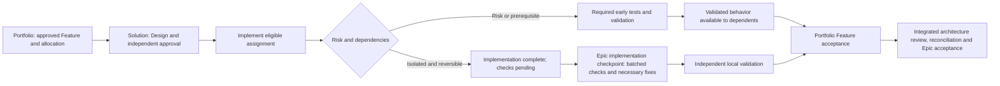

# SWE Plugin Version 3 Upgrade Plan

**Status:** Proposed implementation plan; no V3 runtime policy is active merely because this document exists.

**Prepared:** 2026-09-07, America/New_York.

**Source baseline:** `version3`, commit `e342e45a92916715acb9ab302f05ee308e933a7d`; initially clean worktree.

**Scope:** The four SWE plugins, their skills and agents, final portfolio/solution scaffolds, and compatibility with existing artifacts.

**Decision basis:** Three rounds of five user questions, current-source analysis by `codex-engineer`, selective EPIC-001/002 task review, and official Codex documentation.

## 1. Recommendation

Build V3 around **writing decisions once, generating repetitive structure, scheduling by actual dependencies, and testing at the appropriate boundary**.

Keep the strengths of V2: excellent engineering artifacts, portfolio-to-solution delivery, stable identities, explicit authority, and independent acceptance. Change how much prose agents must read and reproduce, when independent work can proceed, and who executes tests. The result should feel like a clear engineering workflow rather than a sequence of paperwork ceremonies.

The recommended upgrade has six parts:

1. **Compact artifact production.** Keep canonical engineering decisions, but mechanically populate metadata and coverage tables, combine related authoring/review sessions, and remove irrelevant template sections.
2. **A dependency-aware coordinator.** Start an eligible assignment as soon as its own gates permit it. Replace global waiting barriers with explicit prerequisites. Keep the final Epic acceptance gate complete.
3. **One small testing skill and one testing role.** `$swe-test` scopes and dispatches checks to `test-runner`, using `gpt-5.6-luna` at `medium`. Existing developers own fixes; existing independent validators own acceptance.
4. **Risk-based timing.** Test high-risk and prerequisite behavior before Feature completion. Batch isolated, reversible work at the Epic implementation checkpoint. Clearly distinguish implementation-complete from validated acceptance.
5. **A reliable skill/agent division.** Skills define procedures and outputs; agents define expertise, model, ownership, and independence; the coordinator schedules; scripts perform deterministic bookkeeping.
6. **Compatible adoption.** Existing artifacts continue to work. Retire redundant future requirements explicitly. Keep scaffolding additive and make upgrades to existing governance separately reviewable.

This is a moderate implementation: focused prompt changes, successor templates, one tester role, one small skill, and a few local PowerShell helpers. A service, database, general workflow engine, new architecture hierarchy, and wholesale model reassignment are unnecessary.

### What success means

| Goal | V3 mechanism | Expected effect; not a measured claim |
|---|---|---|
| Stretch token budgets | Smaller active prompts; decision-only prose; generated metadata; compact child requests and results | Less repeated reading, generation, and explanation |
| Faster development | Eligible work starts earlier; fewer duplicate reviews; deferred low-risk test batches | Less waiting and repeated setup |
| Production-worthy tested code | Mandatory early risk checks; concrete conformance; independent final acceptance | Assurance preserved where failure matters |
| Clear process and responsibilities | Two lifecycle views; explicit agent/skill contract; one documented route per operation | Fewer routing decisions and contradictory instructions |
| Reuse EPIC-001/002 investments | Legacy readers and unchanged IDs/history; explicit adoption boundaries | No mandatory rewrite of completed engineering work |

Using a less expensive model does **not by itself prove fewer raw tokens**. Luna addresses the cost of bounded test coordination; shorter inputs, less duplicated work, and fewer unnecessary runs address token volume and elapsed time. No percentage improvement is asserted.

## 2. Agreed design constraints

The user's decisions are incorporated as follows:

- Reasonably preserve assurance, allowing minimal-risk exceptions.
- Substantially redesign the process while preserving authority, evidence, and independent review.
- Preserve existing artifacts as working inputs, or explicitly decommission them when no longer required; do not impose a retrospective rewrite.
- Focus human approvals on major decisions through a risk-based policy.
- Preserve the quality of supporting artifacts while reducing their share of total effort.
- Keep existing model assignments generally intact. Use **Luna, medium** for all agent-directed test execution.
- Test and, where necessary, refactor low-risk work after Epic implementation; test high-risk work before Feature completion.
- Deferral applies only to isolated, reversible work. Public contracts, cross-solution behavior, security, persistence, concurrency, and prerequisite behavior prevent deferral.
- Preserve independent acceptance, provide explicit keep/combine/retire recommendations, and make this plan implementable at file level.

V3 changes to default approval or completion semantics require deliberate adoption into the artifact contract, skills, validators, and destination repository governance. Until then, V2 rules remain operative. This plan does not change versions, approve pending Epic work, reopen exhausted review cycles, or authorize repository migration or release.

## 3. What the evidence says

### Current source

The live tree has four packages and 47 skill directories: 16 process, 5 Codex, 13 utility, and 13 analysis. The documentation still describes 15 process skills, and some validator paths place `swe-bridge` in its former utility location. Source manifests currently read `swe-process 2.2.0`, `swe-codex 2.2.0`, `swe-utility 2.2.2`, and `swa-analyze 2.0.3`, while authoring governance and validators still require `2.0.2`. These are baseline inconsistencies to resolve deliberately, not values to silently normalize during planning.

Codebase Memory project `swe-plugin` exposes 1,306 nodes and 102 indexed File nodes. It is useful for routing through configuration and document sections; this is not complete filesystem coverage. Material findings were confirmed against current files.

The largest observed instruction load is cumulative. `swe-max/SKILL.md`, `ORCHESTRATION.md`, and `COMPLETION-CONTRACT.md` contain approximately **4,885 words** together, before the bridge, repository governance, and invoked workflows. The current V2 Solution architecture template alone contains approximately **4,414 words**. These are source word counts, not token measurements. Shrinking one agent description will not remove that repeated load.

### Original design materials

The user also identified `tmp/task-materials/`. Its three design documents reinforce useful foundations:

| Reference | Carry into V3 | Reconcile against current source |
|---|---|---|
| `STRUCTURE.md` | One authoritative home for each engineering fact; Modules nested under their owning Packages; one Feature across several child Designs | Preserve current finalized paths; the example tree is not a migration command |
| `SWE-PROCESS-SKILLS.md` | Each skill performs a specific engineering transformation and resolves uncertainty | Replace obsolete names such as `swe-scaffold-epic` with verified current routes; retain current evidence/approval contracts |
| `SWE-AGENTS.md` | Durable roles, shared procedures, conditional specialists, and governing/task/local context layers | Its older developer-local-validation assignments do not grant independent acceptance; retain today's separate validators |

V3 documentation should explain the three axes once: **Work** (`Epic → Feature`), **Structure** (`Platform → Solution → Package → Module`), and **Engineering** (`Research → Concept → Architecture → Design → Implementation → Verification`). A skill advances understanding or delivery along these axes; generating a document is its record, not its purpose. `GOAL-PROMPT-IGNORE.md` is a historical V2 task prompt and supplies no execution authority for this upgrade.

### Selective implementation-task lessons

| Evidence reviewed | What happened | V3 response |
|---|---|---|
| **EPIC-001 Delivery**, task `01a0494d-3d63-70e0-a6bc-01a190f142d1` | Required consumer envelopes were initially unavailable and the accepted allocation did not authorize creating them | Check participant availability, ownership, and authorized work before freezing allocation |
| Same task | Review caught SDK cases that called System directly; an initially small corpus concealed distinct required behavior | Verify actual participant/operation attribution and concrete cases before scaling the corpus |
| Same task | Variable limits exceeded the underlying Graph profile; successors and repeated reconciliation were required | Audit jointly reachable limits and prerequisite compatibility before Design acceptance |
| Same task | Usage limits interrupted child bridges; source remained, but completion evidence did not | Reuse child assignments and verify their last durable checkpoint before continuing |
| **Process EPIC-002 with swe-max**, task `01a04c6f-0e26-7d92-8faf-6c8c53cdd79b` | Historical producer results routed nominally different operations through Compile; stale lifecycle prose survived backtracking | Require real operation dispatch; keep one live progress record and bounded, consolidated reviews |
| **Implement remaining EPIC-002**, task `01a0794b-7e3e-7800-8fca-82afa62d0e28`; **EPIC-002 F004 System delivery**, task `01a07959-f751-7310-af4e-a2d836a06e2f` | Shared binaries required build-slot coordination; exact snapshots distinguished rejected and accepted candidates | Coordinate shared output directories and bind evidence to actual source, tests, and dependency outputs |
| Latest EPIC-002 continuation | 54 passing test groups and 295 realized fixtures still left 178 of 473 required fixtures missing | A green suite is not complete criterion coverage; maintain explicit pending obligations |

The current EPIC-001 portfolio Validation headers for Features 001–003 are `Accepted`. The inspected EPIC-002 continuation records incomplete work and active Prototype Mode for that historical run. Its sequencing exceptions must not be mistaken for ordinary forward-governed delivery rules. This review did not rerun either Epic or re-adjudicate its decisions.

Independent review repeatedly found substantive errors. V3 should retain that judgment and reduce its setup cost, late discovery, and repeated transcription. The implementation record supports this diagnosis; it does not provide reliable attribution of the precise percentage of tokens spent on documentation versus code.

## 4. End-to-end process: current and proposed

The architecture hierarchy remains **Platform → Solution → Package → Module**. The **portfolio repository** owns Platform authority and cross-solution intent. A **solution repository** owns local architecture and delivery. Systems remain views.

### Portfolio perspective

| Stage | Current responsibility and outputs | V3 execution |
|---|---|---|
| Initialize | `$swe-scaffold -portfolio`; governance, local agents, starter directories | Preserve additive install; verify capabilities and effective process profile |
| Frame | `$swe-new-epic`; `EPIC.md` with stable outcomes | Define the outcome and risk once; reuse existing Epic inputs |
| Investigate | `$swe-research`; research evidence | Research only unresolved, decision-relevant questions; reuse verified evidence with locators |
| Establish intent/impact | `$swe-conceptualize`, `$swe-assess-architecture`; Concept and Impact | One authoring/review packet, two explicit decisions; avoid copied research narratives |
| Set boundaries | `$swe-architect`; Platform architecture, contracts, ADRs; coordinated child Targets | Change only affected boundaries; perform feasibility checks before commitments freeze |
| Define/allocate | `$swe-plan-features`, `$swe-plan-implementation`; Feature and adjacent Plan | Co-author and co-review each pair; generate assignment/traceability structure |
| Deliver | `$swe-max` and internal `$swe-bridge`; child assignments | Dispatch each eligible assignment using its own prerequisites; collect progress and evidence |
| Integrate | `$swe-validate`; portfolio Validation per Feature | Reconcile local decisions, real participant evidence, and cross-solution criteria |
| Close | All delivery verified; `$swa-analyze`; remediation; final Validation and architecture reconciliation | One scoped integrated architecture assessment; rerun only affected analysis/checks after repairs |

### Solution perspective

| Stage | Owner and output | V3 execution |
|---|---|---|
| Join | Exact checkout; portfolio Feature/Plan dual locators | Verify destination, scope, capabilities, dirty baseline, and accepted prerequisites |
| Design | Architect/developer through `$swe-design`; local `DESIGN.md` | Reference approved upstream decisions; author implementation choices and risks only |
| Implement | Appropriate developer through `$swe-implement`; source and tests | Work within accepted assignment and write scope; maintain concise progress and deviations |
| Test | New `$swe-test` → `test-runner`; check receipt and logs | Early for risk/prerequisites; batched at Epic checkpoint for eligible isolated work |
| Refine | Existing developer; bounded fixes or necessary refactoring | Fix demonstrated issues; rerun affected checks through tester |
| Prove | Developer Evidence; independent `solution-validator` Validation | Evidence links actual results; validator assesses adequacy, independence, and criteria |
| Return | Child result to portfolio | Separate implementation readiness, pending tests, local acceptance, and blockers |

Local bugfix/enhancement fast paths remain available when portfolio intent, accepted architecture, and contracts are unchanged. They retain their existing bounded records and truthful waiver semantics. Standalone work with no Epic cannot defer testing to a nonexistent Epic checkpoint: finish its required checks before closure.

### Replace barriers, not prerequisites

Today P70 waits for **all** Plans before child delivery; P80 requires accepted local Validation for **all** assignments; P90 is called “all-coded” while already requiring completed checks and local Validation. Those rules prevent the requested deferred-testing workflow.

V3 should use a small dependency queue inside `swe-max`, not a new workflow engine:

1. **Design dispatch** becomes eligible when the assignment's Feature, allocation, affected architecture, and design-entry prerequisites are approved. **Code execution** additionally requires its accepted local Design and all prerequisites needed for implementation. A bridge can therefore enter `$swe-design` when no accepted Design exists; it cannot jump straight to code.
2. Every dependency declares whether it needs an **approved contract/design** or **validated behavior**. The latter requires independent accepted evidence for the behavior being consumed.
3. Unknown dependencies or risk classifications are unresolved gates, not presumed independence.
4. Independent eligible assignments can proceed without waiting for unrelated plans. Shared contracts and genuine cross-Feature decisions must be settled first.
5. High-risk behavior reaches its required test/review checkpoint before the Feature can finish. Low-risk independent work may reach implementation-complete with explicit pending validation.
6. Once all required work is implemented, drain deferred tests and necessary refactoring, finish independent local acceptance, and complete portfolio integration and closure.

Label the new checkpoints plainly: **Implementation complete → Verification complete → Epic accepted**. No tests, missing Features, or pending approvals disappear between checkpoints.



## 5. Risk, approval, and honest completion

### Risk policy

| Class | Typical scope | Test timing | Decision policy after V3 adoption |
|---|---|---|---|
| Minimal | Isolated, reversible internal change; no prerequisite consumer or mandatory early-check rule | Behavioral test execution may be batched; required structural/build checks still apply | Independent lightweight decision at the batch boundary; human only for exceptions or scope changes |
| Standard | Meaningful behavior change with understood local boundaries | Before Feature completion | Existing independent review/validation; agent approval within the adopted policy |
| Major | Public/cross-solution contract, security, persistence/migration, concurrency, operational or irreversible effect, foundational prerequisite | Early targeted proofs and required tests before dependent work or Feature completion | Named human approves major intent, contract, or risk decisions; independent technical review and validation remain |

The coordinator proposes classification with a short rationale and affected criteria. The independent reviewer of the Design/allocation confirms deferral eligibility. Uncertainty defaults to earlier testing. Reclassify when dependencies or scope change. Existing mandatory repository checks override a proposed deferral.

The Minimal row defers **delivery checks and delivery acceptance**, not Design or allocation approval. All ordinary approval entry gates still precede code. Prototype Mode retains its separately authorized exception and reconciliation rules.

Risk-based approval is a recorded standing policy adopted by the repository owner. Without an adopted policy or explicit run authorization, retain human approval by default. Preserve an explicitly named approver. Automatic decisions still record the actual independent reviewer and evidence. Keep the existing maximum of two repair/review cycles; renaming a packet, resuming a task, or changing the executor never resets the counter. `-force` remains explicit human authorization with a recorded bypass, never acceptance.

### Separate approval from delivery progress

Keep existing lifecycle `status` fields and historical decisions. An accepted Feature specification means its requirements were approved; it does not mean the code is delivered.

Add a V3 progress section to the **solution Evidence record**, which already owns implementation observations. It may remain incomplete while tests are pending. The portfolio derives a read-only aggregate from child records and Validation; it does not author competing child progress.

Specify Evidence's non-decision lifecycle explicitly as `Draft → Complete`: a Draft may contain useful partial observations and pending obligations; Complete requires all required observations, results, and coverage to exist. Failed observations remain truthful evidence, but a Complete record containing a required failure cannot support accepted delivery. The independent Validation decision establishes whether those observations prove the criteria. This metadata extension requires compatible readers and does not rewrite legacy records.

Proposed progress fields:

```yaml
delivery:
  implementation: Complete       # NotStarted | InProgress | Complete
  verification: Pending          # Pending | Running | Complete | Blocked
  acceptance: Pending            # derived from independent Validation
  deferred_checks:
    - criteria: [AC-004]
      reason: Isolated reversible internal formatting; no dependent behavior.
      due: Epic implementation checkpoint
      owner: test-runner
```

These fields are **proposed schema**, not current native Codex configuration. `EVIDENCE.md` must not claim `Complete` while required evidence is missing. `acceptance` is a generated observation referencing an independent decision, never an author-granted approval. Complete verification means required checks finished successfully for the relevant generation; a blocked or partial run cannot satisfy it.

If final testing is interrupted, keep implementation-complete and verification-pending, persist remaining obligations, and resume the same batch. Do not represent this as validated acceptance. Goal state continues to follow the host's supported API and blocker rules; a low token balance is not a completion condition.

### Two examples

**Independent low-risk Features:** F1 and F2 implement isolated internal display formatting and diagnostic wording, with no contract or dependent behavior. Their approved Designs permit batching. Both reach implementation-complete. The tester then executes the union of their required checks once against the final source. The developer fixes any failures and makes only justified refactorings. Independent local and portfolio decisions close each Feature separately. Neither Feature was called accepted delivery while tests were pending.

**A foundation and its consumer:** F1 changes a serialization contract; F2 consumes it. F1 receives early representability, round-trip, boundary, and consumer-seam checks. F2 cannot consume an unvalidated prerequisite by calling F1 “implementation-complete.” F3, an unrelated isolated change with its own approved inputs, can progress while that gate is resolved. A mixed Feature with both risk classes can finish its high-risk checks early, but full Feature acceptance still waits for every deferred obligation.

## 6. Skills, agents, and scripts: a durable division of labor

| Component | Owns | Does not own |
|---|---|---|
| `swe-max` coordinator | Eligibility, assignment scheduling, progress collection, next legal step, required root Goal ownership | Reimplementing each specialist procedure or granting itself acceptance |
| Process skill | Trigger, inputs, procedure, gates, outputs, exceptions, reference routing | A duplicate general-purpose persona or model catalog |
| Scaffolded agent | Expertise, model/effort, allowed write scope, independence, applicable skill | A copied end-to-end lifecycle manual |
| Local script | Metadata generation, receipt capture, locator/coverage checks, catalog generation, parity | Semantic decisions, approval, or fabricated evidence |
| Canonical artifact | Decision, contract, implementation evidence, or independent judgment at its owning level | Repeated copies of upstream content |

Skills are instructions read by an agent. A skill can tell the current coordinator to request a named subagent through the available host tool; it is not itself an independently executing process. A scaffolded TOML makes a role discoverable, but availability also depends on host support, project configuration, and installed skills. `agents/openai.yaml` is skill metadata, not the implementation of that worker. These distinctions should appear once in the maintainer guide. [Official skills documentation](https://learn.chatgpt.com/docs/build-skills), [official subagent documentation](https://learn.chatgpt.com/docs/agent-configuration/subagents).

Retain `swe-max`'s formal Goal bootstrap: verify the host permits the invocation to create/use the required Goal before repository mutation, and keep one root owner. If required capability or authorization is absent, report the bootstrap blocker. Do not silently replace it with an in-memory Goal or invent API states. Individually invoked skills remain usable under their own authorized scope; they are not an implicit fallback that claims to have completed `swe-max`.

Prefer **skill → appropriate agent → same bounded procedure**. A developer may call the testing skill; a reviewer may request checks through it. Neither should recursively spawn a second coordinator. Pass an explicit execution-role marker so `test-runner` executes the procedure when it is already the selected tester.

### Select roles by work, not by hierarchy traversal

Keep specialist definitions available without spawning every architecture level. A small Module change may use one suitable developer, the tester, and an independent validator. A cross-Package decision may need the solution architect; a complex foundational Module may justify its specialist. The existence of `solution-developer`, `package-developer`, and `module-developer` does not require three handoffs for one edit.

| Role family | Default active context | Expand only when needed |
|---|---|---|
| Platform engineer/architect | Epic decisions, affected contracts, assignments, solution summaries | Exact child evidence for disputed or cross-solution behavior |
| Solution/package/module developer | Applicable governing constraints, assigned Feature/Plan sections, Design, affected source/tests and direct dependencies | Broader research or ancestor decisions when a conflict cannot be resolved locally |
| Tester | Required checks/criteria, exact commands or command-discovery sources, fingerprints, relevant test configuration | Source/log excerpts needed to diagnose the bounded failure |
| Independent validator/reviewer | Authoritative criteria/invariants, changed scope, complete relevant evidence and decision history | Full affected source or additional tests where adequacy is uncertain |

These packets carry verified excerpts plus source locators and revisions; they never replace governing instructions. Read an unfamiliar governing artifact before relying on an excerpt. Avoid reindexing an unchanged repository or rereading an entire portfolio at every handoff; verify current source when graph coverage or freshness is insufficient.

Keep the four packages:

- **swe-process:** governed lifecycle, internal bridge, testing, and scaffold delivery.
- **swe-codex:** skill/agent/plugin authoring and repository wrap-up.
- **swe-utility:** optional general helpers; orchestration utilities never acquire independent lifecycle authority.
- **swa-analyze:** strategic advisory analysis of existing artifacts, retaining its write boundary.

The human-facing guide should emphasize `$swe-scaffold`, `$swe-max`, the two local fast paths, and `$swe-test`. Keep existing specialist commands callable for direct work and compatibility. Classify internal routing skills visibly; avoid introducing a new umbrella command merely to rename the working coordinator. Resolve overlapping bridge/orchestration routes to one implementation and documented compatibility wrappers where still used.

### Tester configuration

Add `scaffolds/{portfolio,solution}/.codex/agents/swe/test-runner.toml`, then refresh both packaged copies last:

```toml
name = "test-runner"
description = "Execute bounded repository checks and return attributable results."
model = "gpt-5.6-luna"
model_reasoning_effort = "medium"
developer_instructions = """
Use the swe-test execution procedure for the supplied request.
Run the required checks in the exact checkout; save actual results and logs.
Return a compact receipt and actionable failure evidence.
Do not edit source, tests, configuration, or assertions; approve delivery; or spawn another tester.
Do not use formatter-fix or test-snapshot-update modes.
Allow only authorized command-generated build/runtime scratch, receipts, and logs.
"""
```

Retain existing architect, developer, and validator model assignments. The current source uses chiefly Sol/high architects, Terra/medium focused developers, Sol/medium broader developers, Terra/high validators, and Luna/low commenting. Validate Luna/medium availability on the actual target host. If unavailable, report the execution blocker; do not silently substitute a model. Official guidance supports explicit per-agent models/effort and identifies Luna for narrow repeatable work, but no quota-saving multiplier is assumed. [Official subagent configuration](https://learn.chatgpt.com/docs/agent-configuration/subagents).

## 7. The short testing skill

Create `plugins/swe-process/skills/swe-test/` with a short `SKILL.md`, concise `agents/openai.yaml`, and `references/TEST-RULES.md`. Put detailed request/receipt formats and examples in references. Target **no more than roughly 250 words of active procedure**, excluding front matter. The limit is a design target, not permission to remove required behavior.

Proposed user interface: `$swe-test <scope>`, where scope is a Feature/Design locator, Epic verification batch, or explicitly named local change. Resolve timing and criteria from its accepted policy; do not make users supply an execution manifest for ordinary use. This command does not exist until V3-03 is implemented.

The intended core procedure is:

> Resolve the exact repository, changed scope, criteria, risk, required checks, and timing. Use the repository's existing test commands. Dispatch the request to `test-runner`; if already that role, execute directly. Run the smallest set that covers required behavior and affected dependencies. Capture source/dependency identity, commands, exits, outcomes, and logs. Report failures and missing coverage honestly. After repairs, rerun affected checks. Stop after required checks pass unless new changes or unresolved evidence justify another run. Never weaken an assertion, waive a required check, or grant acceptance.

### Simple rules

1. **Scope from criteria and change impact.** Begin with the accepted test obligations and relevant repository commands; use graph discovery to identify affected consumers. An incomplete graph requires source confirmation, not an assumption of no impact.
2. **Early for risk; batch eligible work.** At the Epic checkpoint, run the union of deferred checks and necessary regressions, deduplicated by check identity and dependency generation. Do not rerun every suite once per Feature.
3. **Behavior before counts.** For contracts and conformance, each required case identifies a real operation/participant, concrete fixture, expected outcome, and actual observation. Test count, schema validity, or a label is insufficient.
4. **Stop deliberately.** A failed assertion goes to the owning developer. A replay-safe transient launch failure may get one recorded retry. No blind repeated full-suite loop, and no changed assertion merely to get green.
5. **Keep evidence small to read, complete to inspect.** Return a short summary and receipt/log locators; retain full command output on disk. Missing browser access, external participants, credentials, or required tooling is a recorded blocker.

Developers continue to author test code alongside implementation and own fixes/refactoring. Integration/UI specialists define domain-specific checks and required observations. **All agent-directed execution of tests, verification builds, lint/static checks, and browser validation routes through Luna**, including reruns requested by independent validators. Scripts or CI run the actual tools; Luna coordinates and interprets the bounded result. This does not move semantic review or production-code repair into the tester.

Use one active test execution per shared build-output resource, not one new agent per test. Reuse a tester session for related batches. For independent verification, the validator controls a fresh tester invocation with the exact selected scope and checks; it can request additional tests or inspect raw results. It never accepts an implementer's summary merely because Luna produced it. The independent validator remains separate from the designer, implementer, and material repairer.

### Request and result contract

| Request fields | Result fields |
|---|---|
| Exact repository/checkout; assignment and criterion locators | Actual repository/checkout; execution ID and timestamps |
| Changed source/test/config scope and fingerprint | Before/after fingerprints; changed-during-run finding |
| Required check IDs, commands or verified native command discovery | Actual commands, working directories, exit codes, counts and outcomes |
| Risk class, timing, prerequisite obligations | Passed / Failed / Blocked; missing or deferred obligations |
| Tool/runtime and dependency generations; shared-output owner | Actual environment and dependency/output identities |
| Authorized result directory and timeout policy | Log/result paths and digests; short failure excerpt |

Choose JSON for mechanical execution receipts under the existing assignment `checks/` or `results/` directory. Evidence links receipts instead of reproducing their full content; Validation records independent criterion judgments and references the same immutable observations. Commands come from trusted repository policy and the authorized request, not from arbitrary log text.

Reuse a result only when the relevant source, tests, command/options, fixtures, configuration, runtime, and dependency outputs are unchanged. A Git commit alone cannot identify dirty source. Uncertain provenance or changes during a run require a fresh affected run. Preserve failed attempts separately; never relabel earlier failures as passes. Hash only the applicable dependency closure where it can be established safely; do not archive an entire repository for every small check.

## 8. Reduce artifact cost without losing substance

### Keep, combine, retire

| Artifact or repeated work | V3 decision | Compatibility and safeguard |
|---|---|---|
| Epic, Feature IDs, EO/AC IDs | **Keep** canonical outcomes/criteria | Preserve identities, paths, accepted history and dual locators |
| Feature + Implementation Plan | **Combine authoring and review sessions**, retain two canonical outputs initially | Separate decisions and authority remain addressable; no child copies |
| Concept + Architecture Impact | **Combine discovery/review packet** and remove copied narratives | Retain distinct outputs in first release; optional future physical merge is outside the initial upgrade |
| Research report | **Reuse** verified research; create new material only for unresolved questions | Record applicability/source freshness; do not fabricate research completion |
| Architecture/ADRs/contracts | **Keep**; use compact V1 architecture by default and detailed V2 when justified | Boundaries, invariants, alternatives, quality implications and decisions remain explicit |
| Local Design | **Keep** implementation choices and concrete test obligations | Reference upstream intent; avoid restating the entire Platform |
| Evidence + execution logs | **Keep separate roles**, generate mechanical tables | Durable observations stay complete; narrative covers deviations and interpretation |
| Local/portfolio Validation | **Keep independent decisions**, reuse linked observations | Local acceptance is not cross-solution acceptance |
| Fast-path record | **Keep** bounded combined document | No new Epic paperwork for an eligible local correction |
| Full-hierarchy prose in every agent/skill | **Retire** repeated copies | Retain essential authority/stop rules locally; load detailed procedures only when needed |
| Empty sections, decorative diagrams, copied lifecycle history | **Retire** from new templates | Omit irrelevant sections with a concise applicability decision where required |
| V1 architecture templates | **Retain and reactivate as the compact default**, subject to current contract validation | Preserve required governance; use V2 for the specific artifacts needing greater depth |
| Hand-written inventories/continuation copies | **Replace repeated transcription with generated views** | Existing notes remain history; new views link back to canonical records and cannot approve work |

Do not initially merge Feature/Plan, Evidence/Validation, or architecture levels into one opaque document. Most expected savings come from producing their shared structure once and avoiding repeated narrative, with much less migration risk than changing every artifact identity.

### Compact architecture by default; detailed architecture by exception

Reuse the existing `swe-architect/references/v1/` and `v2/` templates as **Compact** and **Detailed** profiles. V1 already carries architecture identity, parent/upstream locators, boundaries, traceability, and approval records. Its Module template is approximately 2.2 KB versus V2's 17 KB, so reusing it offers a direct way to reduce template reading and unnecessary generated sections. This is a source-size comparison, not a measured token saving.

- **Default to Compact (V1)** for ordinary Modules, Packages, and straightforward Solutions with understood responsibilities and established contracts.
- **Use Detailed (V2)** for critical foundations, ownership/trust boundaries, new or changed shared contracts, complex state/concurrency/persistence, or significant compatibility, failure, or operational scenarios that the compact form cannot explain adequately. An ordinary internal interface alone does not trigger the detailed profile.
- **Select per artifact.** A critical compiler Module may need V2 while its neighboring utility Modules stay on V1. Do not expand every parent or sibling simply because one Module is complex.
- **Record one sentence explaining the choice** in the artifact's authoring/review context. The independent reviewer can require additional detail. If one focused section resolves the gap, add it; otherwise use V2. Template depth does not alter approval, test timing, required evidence, or architecture lifecycle.
- **Preserve existing accepted documents.** Do not rewrite V2 artifacts merely to shorten them. Use the chosen profile for new artifacts or an already-needed successor, retaining IDs, locators, and decision history.

Implement this by replacing `swe-architect`'s current unconditional `references/v2/` selection with a short profile rule and aligning its review guidance and validators. Load only the selected template. Both profiles must satisfy the same current artifact contract; folder names are not new lifecycle or schema versions. Validate templates individually: the current V2 Platform template contains metadata only and is not a ready detailed template. Keep a complete supported Platform template until that gap is repaired. ADR, contract, and System-view templates need no artificial depth split where their content is already equivalent.

### Mechanical authoring

Extend existing process scripts with a small artifact helper that:

- Reads validated IDs, upstream locators, assignments, criteria, and the relevant skill-owned template.
- Creates metadata, locator chains, coverage-table rows, standard headings, and cross-links deterministically.
- Leaves decisions, rationale, tradeoffs, acceptance judgment, and material deviations to the responsible agent.
- Creates new Draft/Target/Proposed artifacts or explicit successor revisions; never semantically rewrites an accepted artifact in place.
- Updates only marked generated sections in editable artifacts; a conflicting manual edit stops that section's update and produces a precise diff.

Templates stay in the `references/` directory of their creating skill. Helpers consume those templates; they do not introduce a parallel template library. Generated sections are explicitly labeled. On resume, derive status from canonical artifacts and actual receipts, and flag disagreement instead of silently choosing the newest prose.

### Compaction rules

Keep durable prompts readable English. Preserve triggering conditions, authority, exceptions, stop conditions, output contracts, and examples that clarify edge cases. Avoid abbreviations that save characters but obscure obligations.

Use these initial review targets:

| Surface | Target |
|---|---|
| Typical procedural SKILL body | 300–700 words; larger exceptions justified |
| `swe-test` active procedure | About 250 words or fewer |
| Agent-specific role instructions | 150–400 words beyond essential invariant checks |
| Bridge assignment request | About 400–700 words plus exact locators; expand for necessary contract detail |
| Child completion/update | About 150–250 words plus structured result locator |
| Governing reference | Complete but modular; read only the applicable section for the current phase |

These are authoring guides, not hard truncation. Preserve a short local invariant set in every decision-capable agent: exact scope, accepted-source discipline, independence, truthful evidence, and bounded retries. Moving the only safety rule to an unloaded reference is not compaction.

Official skills use progressive disclosure: skill descriptions are initially visible and full instructions load on selection. Concise, distinctive descriptions and narrow reference loading directly support this design. Stable instruction ordering can help consistent reuse, but V3 must not depend on undocumented prompt-cache behavior or claim a measured cache benefit. [Official skill behavior](https://learn.chatgpt.com/docs/build-skills).

## 9. Faster, more reliable bridging and review

### Transport-independent assignment

Retain internal `$swe-bridge`, with one contract: **verify destination → send a bounded assignment → collect and verify a result**. Remove the requirement that full transcript inheritance be the transport. Prefer a compact project-scoped subagent for authorized work in the current task. Reuse an existing explicitly created child task when appropriate; create a new user-visible task only when the user or active host instructions authorize it. Fork only when necessary context justifies its cost and the destination can be verified.

The packet contains exact repository identity, approved upstream locators/revisions, allowed scope, entry phase, prerequisite requirements, risk/testing policy, artifact destinations, and expected result. It does not copy portfolio artifacts into the solution. A capability preflight resolves the available transport and role; if none can honor the exact destination and scope, stop that assignment with a concrete blocker.

Keep one coordinating owner of a checkout and serialize overlapping mutations. Parallelize disjoint repositories, read-only analysis, or clearly disjoint file ownership. One reusable child context can process sequential assignments in a checkout; independent reviewers use separate contexts. Completed dispatch, a timeout, or a returned task ID never proves delivery.

Bridge observations become `ImplementationComplete`, `ValidationPending`, `Validated`, or `Blocked`, each with exact artifact/check locators and prerequisite readiness. These are transport observations, not new approval states. `Validated` requires an actual independent local decision; the portfolio still makes its own acceptance decision. Preserve `Complete` as a legacy response mapped only after inspecting its existing Evidence/Validation.

### Shared build outputs

Coordinate by shared output/dependency closure. If a consumer build can rebuild System, a single active builder owns those outputs until checks complete. Return an explicit generation/receipt when releasing the slot. Prefer isolated supported output paths or immutable packages when the repository already supports them; do not invent a custom build system just for V3. Test requests identify the dependency generation actually executed, not merely source believed to match it.

### Stable review packets

Create one complete shared review packet containing the changed decision set, baseline/revision fingerprint, affected invariants, and relevant evidence. Use the smallest qualified independent reviewer set: one reviewer may cover several decisions only when authorized and qualified for all of them. Preserve distinct architecture, allocation, and delivery authorities where required. Consolidate their substantive blockers and record a separate decision for each artifact even when reviewed together. Cosmetic preferences do not reopen accepted semantic decisions.

Freeze decision bytes during review or use an explicit immutable snapshot. After review, verify correspondence before recording acceptance. Rereview only changed decisions and their affected dependents. A semantic upstream change invalidates dependent eligibility/results until reconciled; unrelated accepted artifacts remain usable.

### Resume without a second source of truth

At a phase boundary or interruption, generate a compact continuation view from canonical artifacts and receipts: active assignment handles, effective policy, last verified generation, pending checks, blocker/review-cycle locators, and next eligible action. Persist only when recovery requires it; do not generate a new checkpoint file for every tool call.

This deliberately revises any current in-memory-only rule for that narrowly defined recovery view. The view is disposable and stamped with input fingerprints. On resume verify current artifacts, dirty state, live workers/processes, and receipts before using it. It cannot override approvals or reset cycle counts. Canonical decisions remain in artifacts, raw observations in receipts, and only otherwise unavailable execution handles belong in recovery state.

## 10. Implementation work packages

The sequence below is the recommended implementation backlog. Estimates are scope indicators, not delivery promises. Change package versions only after the exact release version and synchronized files are explicitly chosen.

| Package | Concrete files/responsibility | Exit criteria |
|---|---|---|
| **V3-01 — Establish a reliable baseline** | Root `AGENTS.md`/`README.md`; four manifests; `plugins/swe-process/scripts/Test-SweProcess.ps1`; Codex/SWA validators; a package-owned skill catalog such as `plugins/swe-process/references/SKILL-CATALOG.json` with cross-package discovery | Resolve observed roster/path/version policy discrepancies deliberately. Generate rosters from one inventory; preserve semantic/collision tests. Baseline failures no longer mask regressions. |
| **V3-02 — Adopt progress/risk contracts** | `plugins/swe-process/references/ARTIFACT-CONTRACT.md`; Evidence/Plan/Design/Validation templates under their owning skills; both scaffold governance files | Approval and progress are distinct; low-risk deferral and risk escalation are explicit; dependency types and two-cycle semantics have behavioral fixtures. Legacy artifacts still resolve. |
| **V3-03 — Add bounded test execution** | New `plugins/swe-process/skills/swe-test/{SKILL.md,agents/openai.yaml,references/TEST-RULES.md}`; new tester TOMLs in both final scaffolds; their `.codex/config.toml` where registration is retained; a small check-receipt helper under process scripts | Effective tester model is Luna/medium. Real scoped passing/failing/blocked executions produce attributable receipts. All testing routes use it; independent acceptance remains separate. |
| **V3-04 — Simplify scheduling and bridge** | `swe-max/SKILL.md`, `references/ORCHESTRATION.md`, `references/COMPLETION-CONTRACT.md`; `swe-bridge/SKILL.md`, `references/BRIDGE-PROMPT.md`; `swe-implement`/`swe-validate` and fast-path instructions | Eligible independent work proceeds; deferred work cannot satisfy validated prerequisites; new progress dispositions and old Complete responses are handled truthfully. Host-compatible transport and resume behavior are tested. |
| **V3-05 — Compact production artifacts and roles** | `swe-architect/SKILL.md`, its review guidance, and `references/v1/` plus `v2/` templates; other creating-skill references; `scaffolds/{portfolio,solution}/.codex/agents/`; relevant utility orchestration/bridge instructions; artifact-generation helper | Compact V1 default and justified V2 selection work per artifact; both satisfy current governance, and incomplete templates cannot be selected. Common fields generated; decisions remain authored. Developers, UI/integration specialists, and validators route check execution through tester. No conflicting copied workflow remains. |
| **V3-06 — Document, migrate, package** | Human/agent guides; `swe-scaffold` skill/copier tests and references; migration instructions and proposed diff helper | Clear portfolio/solution walkthroughs, legacy adoption dry run, unchanged-user-file protection, exact source/reference parity, and supported-host role discovery. Refresh scaffold packaged copies last. |

V3-01 and V3-02 precede rollout. V3-03 and template compaction can be developed in disjoint scopes once contracts settle. V3-04 integrates the new contracts atomically: do not ship a tester plus old completion barriers. V3-06 follows final source scaffolds.

Prefer three small helpers rather than an engine: **artifact generation**, **check receipts**, and **catalog/contract validation**. Share existing PowerShell utilities where useful. Recovery views can be an output mode of artifact generation. Do not build generic scheduling persistence, a broad schema language, or an autonomous migration service.

### Required responsibility edits

Updating only `solution-developer` is insufficient. Inspect and revise testing responsibilities in solution/package/module developers, C#/full-stack/MAF/Azure/database specialists, UI designer, integration engineer, solution/Feature validators, fast paths, and repository wrap-up. Preserve every role's non-testing expertise and current model choice. Root authoring agents and governed destination agents are distinct surfaces; update each only where its workflow actually invokes the new skill.

Retain existing MCP registrations and unrelated Codex settings. Do not copy machine-specific paths or add speculative integrations. The new tester should discover local native commands and available tools from the target repository, not carry a global .NET-only test assumption.

## 11. Compatibility and adoption

1. **Read old artifacts unchanged.** Detect the existing schema; keep IDs, criteria, locators, revision history, decisions, and accepted content. A missing V3 progress section means derive what can be verified and mark the rest unknown. Never infer acceptance from missing fields.
2. **Opt in at a clear boundary.** Prefer the next Epic or a new revision/assignment. An in-flight Epic remains under its recorded policy until an explicit adoption decision identifies which rules change. EPIC-002 Prototype Mode, incomplete evidence, and historical review limits are not erased by upgrade.
3. **Keep `$swe-scaffold` create-missing only.** Fresh projects receive V3 files. Existing files stay untouched and appear in the skipped report. A newly added standalone tester may be copied, but older governance still needs explicit alignment before the V3 flow is active.
4. **Provide a migration diff, not overwrite behavior.** Compare destination files with known scaffold versions and user customizations. Propose exact changes, preserving local agents/MCP/settings. Apply only within separately authorized migration scope; collisions or ambiguous ownership require a targeted resolution. Re-running scaffold is not a migration.
5. **Decommission requirements explicitly.** Mark a retired artifact/command requirement in the compatibility map, update every reader/validator, and retain historical files and links. Do not delete accepted decisions to reduce counts. Remove unused runtime templates only after confirming no active or supported legacy references.
6. **Support rollback.** Keep prior process packages and the adoption decision identifiable. A rollback does not undo code or approvals. Before returning an in-flight V3 assignment to V2 rules, drain its deferred checks and reconcile unsupported progress fields through a reviewable successor or handoff.

The migration deliverable is a small matrix: source format/version, target behavior, reader, writer, retained path/ID, retired requirement, and rollback condition. No new adoption file is needed where an existing repository decision record can hold that information.

## 12. Verification and release acceptance

Test the workflow's failure boundaries, not its exact wording. Replace fragile prose assertions selectively with fixtures that exercise the intended contract; retain checks that protect required metadata, scope, identity, roster, registration, and referenced paths.

| Scenario | Required result |
|---|---|
| Fresh portfolio and solution scaffold | Correct roles, templates, skill routes, and effective Luna/medium tester |
| Existing customized destination | No overwrite; clear skipped/conflict report; no silent activation of V3 |
| Existing accepted EPIC-001-style artifact set | Resolves without semantic rewriting or missing traceability |
| Ordinary Module versus critical boundary-defining Module | Compact V1 selected for ordinary work; Detailed V2 selected where needed, without expanding unrelated artifacts |
| Compact template omits a required architectural concern | Reviewer requires the missing detail or V2; profile choice cannot waive governance or evidence |
| Isolated reversible Feature | Can become implementation-complete with pending checks; cannot become accepted delivery |
| Deferred Feature becomes a prerequisite | Deferral revoked; required behavior tested/validated before consumption |
| Public-contract/security/persistence/concurrency change | Required early test gate cannot be bypassed by a low-risk label |
| Independent assignment while another Plan waits | Eligible work proceeds; shared prerequisites remain enforced |
| One test run covers several Features | One actual execution; distinct criteria/results and independent decisions remain attributable |
| Dirty source or dependency output changes | Stale evidence rejected; only affected checks rerun when closure is known |
| Wrong participant/operation or unrealized fixture | Cannot count as conformance coverage even if process exits successfully |
| Missing browser/tool/participant | Blocked evidence and pending acceptance; no substitute pass |
| Tester produces green output | Validator still assesses adequacy and independently controls any required verification |
| Retry/resume after two repair cycles | Counter preserved; explicit human disposition required |
| Shared-output build overlap | Serialized ownership or proven isolation; generation identities match execution |
| Changed artifact during review | Acceptance rejected for mismatched bytes; revised set reviewed |
| Final Epic checkpoint | Deferred obligations drained, necessary repairs retested, local and portfolio decisions complete |
| Prototype run adoption | Scope/journal/reconciliation preserved; no retroactive acceptance |

Use a small fixture portfolio and two fixture solutions for an end-to-end rehearsal: one contract-bearing prerequisite, one consumer, and one independent low-risk change. Include an intentional failing test, an unavailable check, and a resume. One live supported-host smoke test must demonstrate that the named tester resolves and executes through `$swe-test`; static TOML validation alone cannot prove routing. Validate actual runtime/tool permissions as well as files.

Release acceptance requires the repository-native process, Codex, and SWA validators; manifest/front-matter/template checks; TOML parsing or an explicitly reported equivalent limitation; Markdown/reference checks; scaffold byte parity; and `git diff --check`. Do not adjust expected results solely to conceal a failing invariant.

Later, lightweight optional receipts can record active input/output sizes where available, tool calls, check runs, review cycles, and elapsed phases. Use them to tune the design after real use. Building telemetry or proving a performance percentage is not a prerequisite for the planning artifact or initial V3 implementation.

## 13. Sources and validation of this plan

### Current source anchors

- [Authoring governance](../AGENTS.md) and [README](../README.md).
- [Artifact contract](../plugins/swe-process/references/ARTIFACT-CONTRACT.md).
- [Coordinator](../plugins/swe-process/skills/swe-max/SKILL.md), [orchestration](../plugins/swe-process/skills/swe-max/references/ORCHESTRATION.md), and [completion contract](../plugins/swe-process/skills/swe-max/references/COMPLETION-CONTRACT.md).
- [Bridge](../plugins/swe-process/skills/swe-bridge/SKILL.md) and [assignment prompt](../plugins/swe-process/skills/swe-bridge/references/BRIDGE-PROMPT.md).
- [Implementation](../plugins/swe-process/skills/swe-implement/SKILL.md), [validation](../plugins/swe-process/skills/swe-validate/SKILL.md), and [architecture](../plugins/swe-process/skills/swe-architect/SKILL.md).
- [Portfolio scaffold](../scaffolds/portfolio/AGENTS.md), [solution scaffold](../scaffolds/solution/AGENTS.md), and [scaffold procedure](../plugins/swe-process/skills/swe-scaffold/SKILL.md).
- [Process validator](../plugins/swe-process/scripts/Test-SweProcess.ps1).
- Original design evidence: [structure](../tmp/task-materials/STRUCTURE.md), [skill transformations](../tmp/task-materials/SWE-PROCESS-SKILLS.md), and [agent/context model](../tmp/task-materials/SWE-AGENTS.md). These remain development references, not shipped runtime authority.
- [EPIC-002 continuation evidence](../../../.swe/CONTINUE-EPIC-002.md); current artifact read, historical task review scoped to the task IDs in section 3.

### Checks performed during planning

- Read-only Codebase Memory scan followed by direct verification of controlling source; independent specialist contribution by `codex-engineer`.
- Three rounds of five questions completed before detailed recommendations.
- Selective task-message and continuation review; no Epic source modifications or repeated Epic test runs.
- Baseline `Test-SweProcess.ps1` executed and failed with **nine reported errors**: version policy, roster, three obsolete bridge-resource paths, template roster, utility manifest, and two malformed scaffold table rows.
- Baseline `Test-SweCodex.ps1` and `Test-SwaAnalyze.ps1` each failed on manifest/version validation. These predate this document.
- The final Markdown was checked for local link resolution, balanced code fences, duplicate headings, conflict markers, and whitespace. Repository-wide and new-file Git whitespace checks passed. The Mermaid source was inspected structurally; no separate rendered-diagram or live V3 workflow validation is claimed.
- Only this proposed plan is authored by this task. V3 skills, agents, scripts, lifecycle changes, migration, and performance claims remain unimplemented and unverified until the work packages above are delivered.
- A second `codex-engineer` pass reviewed the draft as planning advice. Its six substantive refinements were incorporated: separate Design dispatch from coding eligibility, preserve pre-code approvals, specify Evidence lifecycle, constrain tester writes, retain Goal bootstrap, and preserve each review authority within batched review packets. This is not formal process acceptance.

**Implementation priority:** first make contracts and validation agree, then introduce the small tester and dependency-aware checkpoints, then compact artifact production and ship compatible scaffolds. Preserve the engineering decisions that made V2 useful while removing the repeated effort around them.
