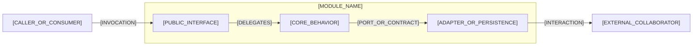

# [MODULE_NAME] Module Architecture

## Responsibility and Invariants

[MODULE_RESPONSIBILITY_AND_INVARIANTS]

## Interfaces and Collaborators

| Interface | Direction | Contract |
|---|---|---|
| [INTERFACE] | [INBOUND_OR_OUTBOUND] | [CONTRACT] |

### Building-Block View

Use this view to show coarse internal responsibilities and dependency direction. Avoid a class-per-box diagram; add a class or data-model view only when the model itself is architecturally significant.

- Relationship meaning: [ARROW_SEMANTICS]
- Key invariant: [DIAGRAM_INVARIANT]
- Scope and omissions: [DIAGRAM_SCOPE_AND_OMISSIONS]

## State and Behavior

[STATE_LIFECYCLE_AND_KEY_BEHAVIOR]

## Failure, Security, and Observability

- [CONCERN_AND_RESPONSE]

## Traceability and Divergence

- [PARENT_ADR_OR_FEATURE_LINK]
- [DIVERGENCE_OR_NONE]

## Approval Record

| Field | Value |
|---|---|
| Mode | [HUMAN_OR_AUTO_APPROVE_OR_FORCE] |
| Author | [AUTHOR] |
| Approver | [INDEPENDENT_APPROVER_OR_FORCE_AUTHORIZING_HUMAN] |
| Decision | [PENDING_OR_ACCEPTED_OR_CHANGES_REQUIRED_OR_REJECTED_OR_BYPASSED] |
| Recorded | [ISO_8601_TIMESTAMP_OR_PENDING] |
| Evidence | [REVIEW_REFERENCE_OR_NONE] |
| Bypass reason | [REQUIRED_FOR_FORCE_OR_NONE] |
