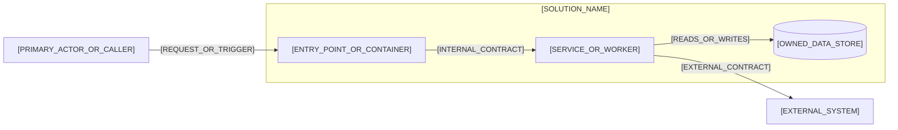

# [SOLUTION_NAME] Solution Architecture

## Responsibilities and Boundaries

[RESPONSIBILITIES_AND_NON_RESPONSIBILITIES]

## Package Decomposition

| Package | Responsibility | Dependencies |
|---|---|---|
| [PACKAGE] | [RESPONSIBILITY] | [DEPENDENCIES] |

### Container and Package View

Use this view to show the Solution's major runtime or deployable units and the Packages that implement them. Do not expand Packages into Modules here.



- Element-to-Package mapping: [ELEMENT_TO_PACKAGE_MAPPING]
- Relationship meaning: [ARROW_SEMANTICS]
- Scope and omissions: [DIAGRAM_SCOPE_AND_OMISSIONS]

## Runtime and Integration Views

[COMPONENTS_FLOWS_AND_CONTRACTS]

### Key Runtime Interaction

Use this sequence for the most architecturally significant end-to-end interaction. Add another sequence only when it explains a materially different collaboration or failure path.

```mermaid
sequenceDiagram
    actor Actor as [PRIMARY_ACTOR]
    participant Entry as [ENTRY_POINT]
    participant Service as [INTERNAL_SERVICE]
    participant External as [EXTERNAL_COLLABORATOR]

    Actor->>Entry: [REQUEST_OR_TRIGGER]
    Entry->>Service: [VALIDATED_COMMAND_OR_QUERY]
    Service->>External: [CONTRACT_OPERATION]
    External-->>Service: [RESULT_OR_EVENT]
    Service-->>Actor: [OUTCOME]
```

- Scenario and architectural significance: [SCENARIO_AND_SIGNIFICANCE]
- Failure or asynchronous behavior omitted: [RUNTIME_OMISSIONS]

## Data, Security, Qualities, and Operations

- [CONSTRAINT_OR_DECISION]

## Traceability and Divergence

- [UPSTREAM_OR_ADR_LINK]
- [DIVERGENCE_OR_NONE]

## Approval Record

| Field | Value |
|---|---|
| Mode | [HUMAN_OR_AUTO_APPROVE_OR_FORCE] |
| Author | [AUTHOR] |
| Approver | [INDEPENDENT_APPROVER_OR_FORCE_AUTHORIZING_HUMAN] |
| Decision | [PENDING_OR_ACCEPTED_OR_CHANGES_REQUIRED_OR_REJECTED_OR_BYPASSED] |
| Recorded | [ISO_8601_TIMESTAMP_OR_PENDING] |
| Evidence | [REVIEW_REFERENCE_OR_NONE] |
| Bypass reason | [REQUIRED_FOR_FORCE_OR_NONE] |
