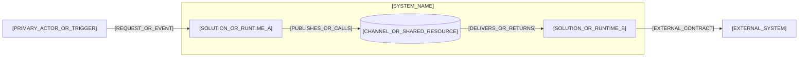

# [SYSTEM_NAME] System View

## Purpose and Boundaries

[CROSS_SOLUTION_OR_RUNTIME_OUTCOME_AND_EXCLUSIONS]

This artifact is a runtime and operational view of its parent Platform or Solution architecture, not an independent architecture level.

## Participants and Responsibilities

| Participant | Responsibility | Key Contracts | Lifecycle Status |
|---|---|---|---|
| [SOLUTION_OR_RUNTIME_PARTICIPANT] | [RESPONSIBILITY] | [CONTRACT_LINKS] | [STATUS] |

## Runtime Topology

Use this view to show the operational participants, external boundary, and important synchronous or asynchronous relationships. Keep internal Package and Module structure in their owned architecture documents.



- Relationship meaning: [ARROW_SEMANTICS]
- Trust or deployment boundaries: [BOUNDARY_SEMANTICS]
- Scope and omissions: [DIAGRAM_SCOPE_AND_OMISSIONS]

## Key Runtime Interaction

Use this sequence for the collaboration whose ordering, contracts, or failure handling most shapes the System view.

```mermaid
sequenceDiagram
    actor Actor as [PRIMARY_ACTOR]
    participant A as [SOLUTION_OR_RUNTIME_A]
    participant B as [SOLUTION_OR_RUNTIME_B]
    participant External as [EXTERNAL_SYSTEM]

    Actor->>A: [REQUEST_OR_TRIGGER]
    A->>B: [CONTRACT_OPERATION_OR_EVENT]
    B->>External: [EXTERNAL_INTERACTION]
    External-->>B: [RESULT_OR_ACKNOWLEDGEMENT]
    B-->>A: [OUTCOME_OR_EVENT]
    A-->>Actor: [SYSTEM_OUTCOME]
```

- Scenario and architectural significance: [SCENARIO_AND_SIGNIFICANCE]
- Failure, retry, or asynchronous behavior: [FAILURE_AND_ASYNC_SEMANTICS]

## Data, Trust, Deployment, and Operations

- Data ownership and movement: [DATA_OWNERSHIP_AND_FLOW]
- Identity and trust boundaries: [IDENTITY_AND_TRUST_BOUNDARIES]
- Deployment and availability: [DEPLOYMENT_AVAILABILITY_AND_RECOVERY]
- Observability and operational ownership: [OBSERVABILITY_AND_OPERATIONS]

## Decisions, Traceability, and Divergence

- [ADR_CONTRACT_DESIGN_OR_FEATURE_LINK]
- [DIVERGENCE_OR_NONE]

## Approval Record

| Field | Value |
|---|---|
| Mode | [HUMAN_OR_AUTO_APPROVE_OR_FORCE] |
| Author | [AUTHOR] |
| Approver | [INDEPENDENT_APPROVER_OR_FORCE_AUTHORIZING_HUMAN] |
| Decision | [PENDING_OR_ACCEPTED_OR_CHANGES_REQUIRED_OR_REJECTED_OR_BYPASSED] |
| Recorded | [ISO_8601_TIMESTAMP_OR_PENDING] |
| Evidence | [REVIEW_REFERENCE_OR_NONE] |
| Bypass reason | [REQUIRED_FOR_FORCE_OR_NONE] |
