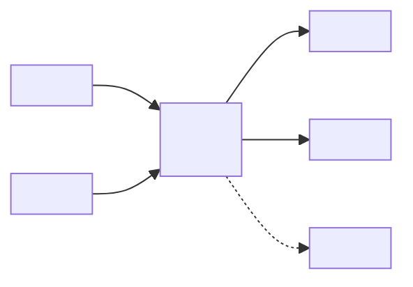
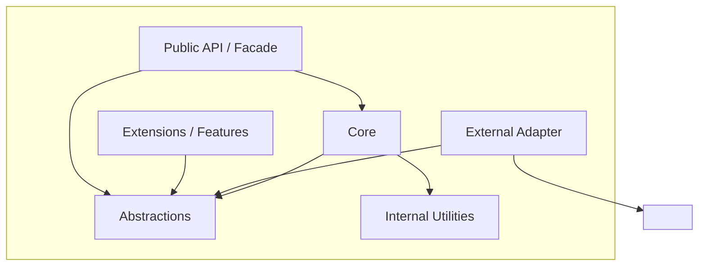
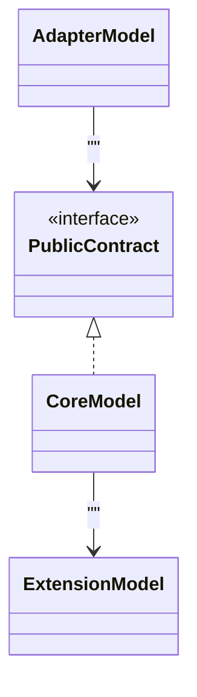
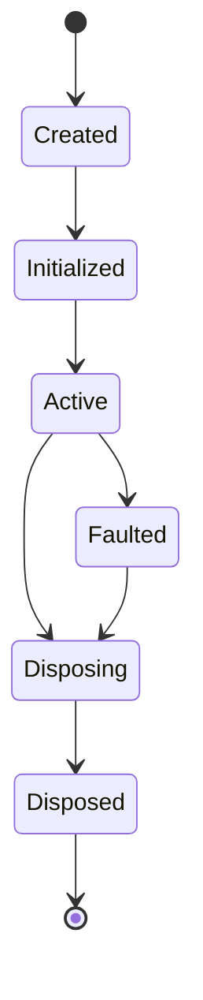
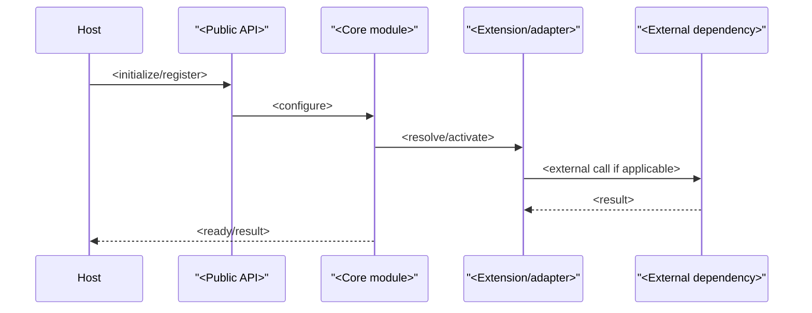
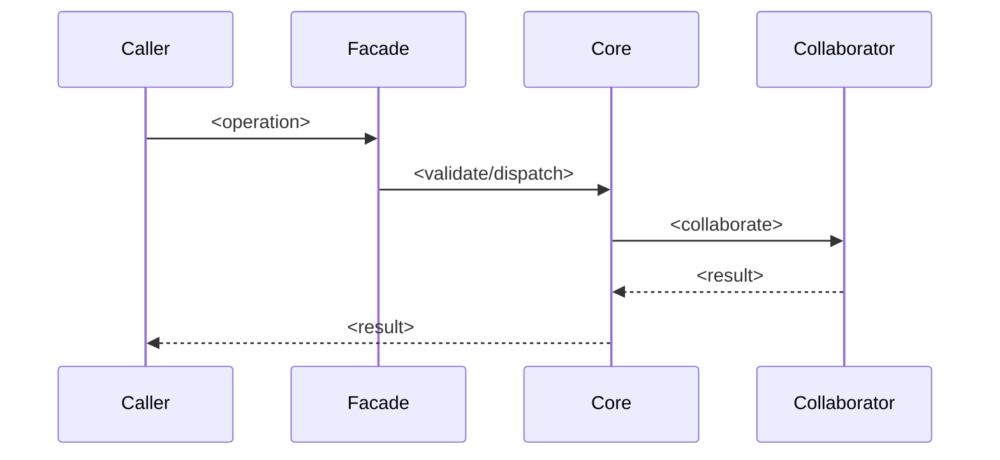
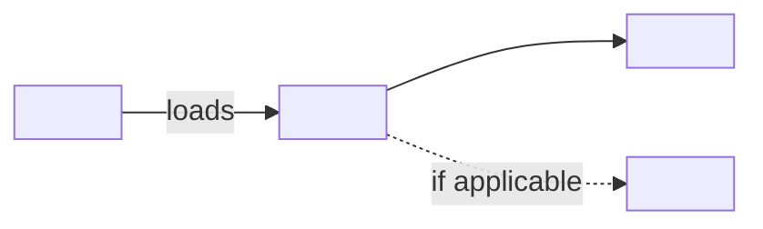
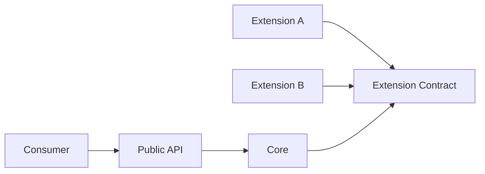
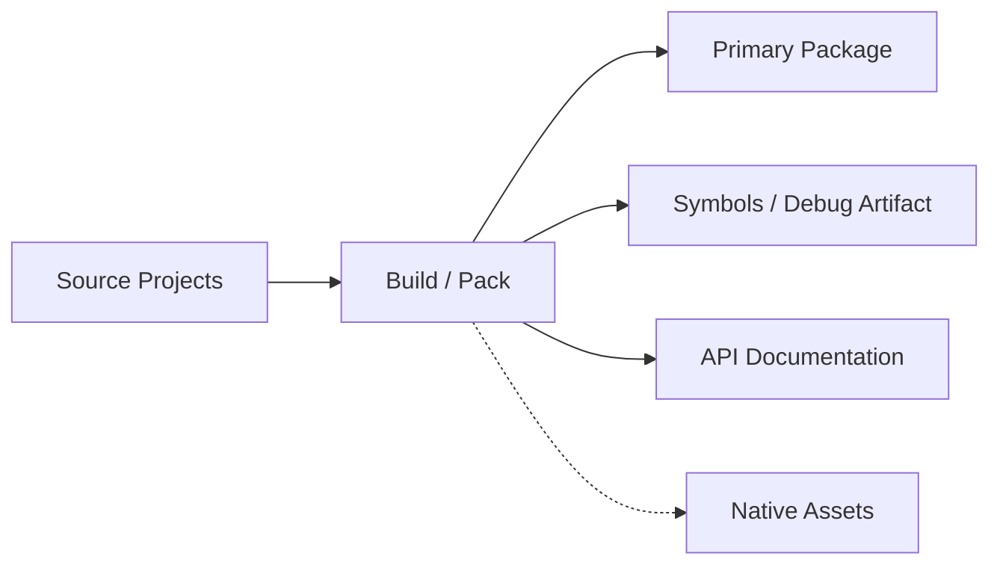

# [PACKAGE_NAME] Package Architecture

<!--
PURPOSE OF THIS TEMPLATE

Use this document for a MEDIUM-SIZED PACKAGE: a reusable library, SDK, framework package,
bounded subsystem, or project that is larger than a single module and is commonly composed of
multiple internal modules and/or depends on external projects/packages.

This template deliberately scales the Module Architecture template upward. It preserves the
module-level concerns that remain architecturally relevant, then adds package-specific concerns:
- internal module topology and dependency rules;
- external dependency governance and transitive dependency impact;
- public API/facade design;
- compatibility and versioning;
- extension/plugin mechanisms;
- packaging, distribution, and consumption;
- package-level runtime/lifecycle behavior;
- supply-chain and integration risk.

Do NOT use this template merely because a codebase has many files. Use it when the designed unit
has a meaningful package/project boundary, multiple architectural building blocks, reusable
contracts, or dependency/compatibility obligations to external consumers.

AUTHORING RULES
1. Describe architecture facts, constraints, contracts, invariants, and rationale—not source-code narration.
2. Treat the package boundary as a product/API boundary even when the package is currently internal.
3. Distinguish public contracts from internal implementation and explicitly state dependency direction.
4. Record external dependencies because they are architectural commitments, not incidental build details.
5. Document versioning and compatibility wherever downstream consumers can be affected.
6. Include 2-5 architecturally significant runtime scenarios; avoid routine call-by-call documentation.
7. Use diagrams to answer a specific architectural question. State the scope and omissions of each diagram.
8. Keep decisions concise here; use ADRs for material alternatives/trade studies.
9. Mark future capabilities as Planned. Do not describe them as Current.
10. Delete instructional comments and unused optional sections before publishing.
-->

## 1. Purpose

### 1.1 Summary

<!-- Required. In 3-6 sentences, state what the package is, what capability it owns, and why it exists. -->

`<Package summary>`

### 1.2 Scope

<!-- Required. Define the package/project boundary precisely. -->

**In scope**
- `<capability / subsystem>`
- `<public contract family>`
- `<internal module family>`

**Out of scope**
- `<explicit non-goal>`
- `<capability owned by another package/system>`
- `<deployment/system responsibility not owned here>`

### 1.3 Package Boundary

<!-- Required. State what makes this a package rather than merely a folder or module. -->

- **Compilation/build boundary:** `<project / assembly / package artifact>`
- **Public consumption boundary:** `<how consumers reference/use it>`
- **Configuration boundary:** `<what configuration it owns, if any>`
- **Lifetime boundary:** `<host/process/request/application/etc.>`
- **Ownership boundary:** `<team / subsystem owner>`

### 1.4 Stakeholders

| Stakeholder | Primary concern | Uses this document for |
|---|---|---|
| `<package consumers>` | `<API, compatibility, performance>` | `<integration and upgrades>` |
| `<maintainers>` | `<cohesion, dependency direction, evolution>` | `<implementation/change review>` |
| `<extension authors>` | `<stable extension contracts>` | `<plugins/adapters/customization>` |
| `<build/release owners>` | `<packaging, provenance, compatibility>` | `<release/distribution>` |
| `<security/operations/test roles>` | `<relevant concern>` | `<verification/risk>` |

## 2. Architectural Drivers

### 2.1 Responsibilities

| ID | Responsibility | Architectural consequence |
|---|---|---|
| R-01 | `<package responsibility>` | `<API/module/dependency consequence>` |
| R-02 | `<package responsibility>` | `<consequence>` |
| R-03 | `<package responsibility>` | `<consequence>` |

### 2.2 Quality Goals

<!-- Rank only qualities that materially shape architecture. -->

| Priority | Quality attribute | Package-specific meaning | Evidence / measure |
|---|---|---|---|
| 1 | `<Extensibility / Compatibility / Performance / ...>` | `<scenario-specific meaning>` | `<test/benchmark/policy>` |
| 2 | `<quality>` | `<meaning>` | `<evidence>` |
| 3 | `<quality>` | `<meaning>` | `<evidence>` |

### 2.3 Constraints

- **Platform/runtime:** `<constraint>`
- **Language/toolchain:** `<constraint>`
- **External framework:** `<constraint>`
- **Package manager/distribution:** `<constraint>`
- **Compatibility:** `<constraint>`
- **Licensing/regulatory:** `<constraint>`
- **Repository/organization:** `<constraint>`

### 2.4 Assumptions

<!-- Recommended. Record assumptions that affect architecture but are not controlled by the package. -->

- `<assumption>`
- `<assumption>`

### 2.5 Non-Goals

- `<non-goal>`
- `<deferred capability>`

## 3. Context and Ecosystem

### 3.1 External Context

<!--
Required. Treat downstream consumers, host applications, framework/runtime libraries, external
packages, generated artifacts, and optional integrations as external elements.
-->

| External element | Role | Direction | Contract / dependency | Required? |
|---|---|---|---|---|
| `<consumer/host>` | `<role>` | `<in/out/both>` | `<public API>` | `<yes/no>` |
| `<external package>` | `<role>` | `<in>` | `<package/API>` | `<yes/no>` |
| `<tool/service>` | `<role>` | `<in/out/both>` | `<protocol/file/API>` | `<yes/no>` |

### 3.2 Package Context Diagram

<!--
Required for reusable/non-trivial packages.
Show the package as one unit, its primary consumers, hosts, and architecturally significant dependencies.
Do not show internal modules here.
-->



**View notes**
- **Question answered:** `<what this view explains>`
- **Audience:** `<stakeholders>`
- **Boundary:** `<what is omitted>`
- **Required vs optional dependencies:** `<notation explanation>`

### 3.3 Dependency Classification

<!-- Required when external dependencies exist. -->

| Dependency | Classification | Architectural reason | Replacement strategy |
|---|---|---|---|
| `<dependency>` | `<core / adapter / optional / build-only / test-only>` | `<why it exists>` | `<how tightly coupled / abstraction seam>` |

## 4. Architecture Strategy

### 4.1 Organizing Principles

<!-- Required. 4-8 bullets. -->

- `<decomposition principle>`
- `<dependency inversion rule>`
- `<public API principle>`
- `<extension strategy>`
- `<compatibility principle>`

### 4.2 Architectural Style and Patterns

| Pattern / style | Applied to | Reason | Consequence |
|---|---|---|---|
| `<Facade / Adapter / Plugin / Pipeline / Layered / ...>` | `<area>` | `<why>` | `<trade-off>` |

### 4.3 Dependency Rules

<!-- Required. Express as enforceable statements. -->

1. `<Module A may depend on Module B; B must not depend on A.>`
2. `<Public API must not expose implementation-only dependency types.>`
3. `<Optional integrations depend inward through abstractions.>`
4. `<Add package-specific rule.>`

## 5. Package Composition

### 5.1 Internal Module Inventory

<!--
Required. A "module" here may be a namespace group, source partition, subproject, internal assembly,
feature slice, or other cohesive architectural building block.
-->

| Module / building block | Responsibility | Depends on | Exposes | Visibility |
|---|---|---|---|---|
| `<Core>` | `<responsibility>` | `<none/abstractions>` | `<contracts>` | `<public/internal>` |
| `<Abstractions>` | `<responsibility>` | `<minimal dependencies>` | `<interfaces/types>` | `<public/internal>` |
| `<Adapter>` | `<responsibility>` | `<Core + external dep>` | `<integration>` | `<public/internal>` |

### 5.2 Internal Building-Block Diagram

<!--
Required for packages with >1 meaningful internal module.
Show dependency direction and package boundary. Avoid class-per-box detail.
-->



**View notes**
- **Elements:** `<meaning of boxes>`
- **Arrows:** `<compile-time/runtime dependency meaning>`
- **Key invariant:** `<most important dependency rule>`
- **Omissions:** `<implementation detail omitted>`

### 5.3 Module Interaction Matrix

<!-- Recommended when dependencies are non-trivial. -->

| From \ To | `<Core>` | `<Abstractions>` | `<Adapter>` | `<Extension>` |
|---|---:|---:|---:|---:|
| `<Core>` | — | `Allowed` | `Forbidden` | `<rule>` |
| `<Adapter>` | `<rule>` | `Allowed` | — | `<rule>` |

### 5.4 Key Types and Contracts

| Type / contract | Owning module | Role | Stability | Consumer impact |
|---|---|---|---|---|
| `<public interface/class>` | `<module>` | `<role>` | `<stable/evolving/internal>` | `<impact>` |

## 6. Public API and Contract Architecture

### 6.1 API Families

<!-- Required for reusable packages. Describe contract families rather than listing every method. -->

| API family | Purpose | Primary consumers | Stability level | Notes |
|---|---|---|---|---|
| `<facade/interfaces>` | `<purpose>` | `<consumer>` | `<stable/preview/internal>` | `<notes>` |

### 6.2 Public vs Internal Boundary

- **Public surface:** `<what is intentionally public>`
- **Internal surface:** `<what must remain implementation detail>`
- **Friend/internal access:** `<policy or N/A>`
- **Reflection/dynamic exposure:** `<policy or N/A>`

### 6.3 Contract Compatibility

- **Source compatibility policy:** `<policy>`
- **Binary compatibility policy:** `<policy>`
- **Behavioral compatibility policy:** `<policy>`
- **Serialization/wire compatibility:** `<policy or N/A>`
- **Deprecation policy:** `<policy>`
- **Breaking-change policy:** `<major version / migration / ADR requirement>`

### 6.4 API Evolution Rules

1. `<rule>`
2. `<rule>`
3. `<rule>`

## 7. Model and State

### 7.1 Domain / Data / Metadata Model

<!--
Use when the package owns a meaningful model, schema, graph, AST, protocol, metadata model, or state model.
Replace with a more appropriate Mermaid diagram type when needed.
-->



### 7.2 State Ownership

| State | Owner | Lifetime | Mutation authority | Persistence |
|---|---|---|---|---|
| `<state>` | `<module/type>` | `<lifetime>` | `<who mutates>` | `<none/cache/durable>` |

### 7.3 Core Invariants

1. `<testable invariant>`
2. `<testable invariant>`
3. `<testable invariant>`

### 7.4 Lifecycle



**Lifecycle notes:** `<adapt states and transitions to the package; remove if not relevant>`

## 8. Dependency Architecture

### 8.1 External Dependency Inventory

<!--
Required when package dependencies are architecturally meaningful.
Include runtime dependencies and important build/generation dependencies separately.
-->

| Dependency | Version policy | Runtime? | Exposed publicly? | Why needed | Risk |
|---|---|---:|---:|---|---|
| `<package/project>` | `<range/pin/floating>` | `<yes/no>` | `<yes/no>` | `<reason>` | `<risk>` |

### 8.2 Dependency Diagram

```mermaid
flowchart LR
    Package["<Package>"]
    Framework["<Framework / BCL>"]
    Required["<Required dependency>"]
    Optional["<Optional dependency>"]
    Build["<Build-time dependency>"]

    Package -->|runtime|required| Required
    Package --> Framework
    Package -.->|optional adapter| Optional
    Build -.->|generates/builds| Package
```

### 8.3 Transitive Dependency Policy

- `<whether transitive dependencies may leak into public contracts>`
- `<version conflict policy>`
- `<dependency unification/shading/isolation policy>`
- `<native dependency policy if applicable>`

### 8.4 Dependency Substitution

<!-- Recommended. Describe anti-corruption/adaptation seams around volatile dependencies. -->

| Volatile dependency | Abstraction seam | Substitute/test double | Migration cost |
|---|---|---|---|
| `<dependency>` | `<adapter/interface>` | `<mechanism>` | `<low/medium/high + why>` |

## 9. Runtime Architecture

<!-- Select 2-5 architecturally significant scenarios. -->

### 9.1 Scenario: `<Initialization / Registration>`

**Trigger:** `<trigger>`  
**Result:** `<result>`



**Failure behavior:** `<atomicity, cleanup, partial initialization, retry>`

### 9.2 Scenario: `<Primary Hot Path>`



### 9.3 Scenario: `<Extension / Plugin Invocation>`

<!-- Optional but recommended when extensibility is a design goal. -->

`<Describe discovery, ordering, execution, isolation, and failure semantics.>`

### 9.4 Concurrency

- **Concurrency model:** `<thread-safe/shared/single-threaded/async/etc.>`
- **Synchronization strategy:** `<locks/immutability/concurrent collections/etc.>`
- **Atomic operations:** `<operations>`
- **Snapshot/read semantics:** `<semantics>`
- **Ordering/version semantics:** `<semantics>`
- **Known race boundaries:** `<caveats>`

### 9.5 Failure and Recovery

| Failure class | Detection | Containment | Recovery | Caller-visible behavior |
|---|---|---|---|---|
| `<validation>` | `<how>` | `<boundary>` | `<action>` | `<exception/result>` |
| `<dependency failure>` | `<how>` | `<boundary>` | `<retry/fallback/none>` | `<behavior>` |

## 10. Integration and Extension

### 10.1 Integration Points

| Integration | Direction | Mechanism | Contract owner | Optional? |
|---|---|---|---|---|
| `<framework/service/package>` | `<in/out/both>` | `<API/adapter/events/files>` | `<owner>` | `<yes/no>` |

### 10.2 Extension Points

| Extension point | Mechanism | Contract | Discovery/registration | Typical use |
|---|---|---|---|---|
| `<interface/base class/feature>` | `<inherit/compose/register>` | `<rules>` | `<mechanism>` | `<use>` |

### 10.3 Extension Isolation

- **Failure isolation:** `<policy>`
- **Ordering:** `<policy>`
- **Thread-safety expectations:** `<policy>`
- **Lifetime/ownership:** `<policy>`
- **Capability/security restrictions:** `<policy or N/A>`

## 11. Configuration

<!-- Include when package behavior is configurable. -->

### 11.1 Configuration Surface

| Setting / options group | Owner | Default | Scope | Compatibility impact |
|---|---|---|---|---|
| `<setting>` | `<module>` | `<default>` | `<global/instance/request>` | `<impact>` |

### 11.2 Configuration Rules

- `<validation>`
- `<immutability/reload policy>`
- `<environment-variable/file/code configuration policy>`
- `<secret handling if applicable>`

## 12. Cross-Cutting Concerns

### 12.1 Error Handling

- `<validation strategy>`
- `<exception/result taxonomy>`
- `<boundary translation policy>`
- `<post-commit failure semantics>`

### 12.2 Observability

- **Logging:** `<policy / N/A>`
- **Events/hooks:** `<policy>`
- **Metrics:** `<policy / N/A>`
- **Tracing:** `<policy / N/A>`
- **Diagnostic context:** `<IDs/version/correlation/etc.>`

### 12.3 Performance

- **Critical paths:** `<operations>`
- **Expected scale:** `<objects/requests/data size>`
- **Complexity targets:** `<O(...) or qualitative>`
- **Allocation/lifetime:** `<notes>`
- **Caching:** `<policy / N/A>`

### 12.4 Security and Supply Chain

- **Trust boundary:** `<what inputs/extensions are trusted>`
- **Input validation:** `<policy>`
- **Reflection/dynamic loading:** `<restrictions>`
- **Dependency provenance:** `<policy>`
- **Package signing/verification:** `<policy or N/A>`
- **Known risky capabilities:** `<notes>`

### 12.5 Persistence / Serialization

- **Persistence model:** `<none/snapshot/durable/etc.>`
- **Format/schema:** `<format>`
- **Version tolerance:** `<policy>`
- **Migration:** `<policy>`
- **Ownership:** `<who owns durability>`

## 13. Packaging and Distribution

<!-- Required for externally consumed packages; concise for internal project-only packages. -->

### 13.1 Produced Artifacts

| Artifact | Purpose | Consumer | Versioned? |
|---|---|---|---:|
| `<library/package>` | `<purpose>` | `<consumer>` | `<yes/no>` |
| `<symbols/docs/generated assets>` | `<purpose>` | `<consumer>` | `<yes/no>` |

### 13.2 Build and Packaging Boundary

- **Build project(s):** `<path/project>`
- **Target framework(s):** `<TFM/runtime>`
- **Generated code/assets:** `<mechanism or N/A>`
- **Native assets:** `<platform handling or N/A>`
- **Package metadata:** `<ownership/source>`

### 13.3 Versioning and Release

- **Versioning scheme:** `<SemVer/calendar/internal>`
- **Release cadence:** `<policy>`
- **Pre-release policy:** `<policy>`
- **Compatibility validation:** `<tool/tests>`
- **Release provenance/signing:** `<policy>`

### 13.4 Consumption Example

<!-- Keep conceptual; do not turn this into end-user documentation. -->

```text
<package reference>
    ↓
<host registration / construction>
    ↓
<public facade / contract usage>
```

## 14. Deployment / Hosting

<!--
Package-level deployment is usually about runtime placement inside a host rather than infrastructure.
Expand only if this package hosts processes/services/native workers.
-->

**Deployment status:** `<in-process library | plugin | sidecar | hosted worker | mixed | other>`



### 14.1 Host Assumptions

- `<process/runtime assumption>`
- `<DI/service registration assumption>`
- `<filesystem/network/native requirement>`
- `<startup/shutdown expectation>`

## 15. Architectural Decisions

| ID | Decision | Status | Rationale | Consequence / trade-off | ADR |
|---|---|---|---|---|---|
| AD-01 | `<decision>` | `<Accepted/Proposed>` | `<why>` | `<trade-off>` | `<link or N/A>` |

## 16. Quality and Verification

### 16.1 Quality Scenarios

| ID | Scenario | Expected response | Verification |
|---|---|---|---|
| Q-01 | `<stimulus + condition>` | `<measurable response>` | `<test/benchmark/review>` |
| Q-02 | `<scenario>` | `<response>` | `<verification>` |

### 16.2 Verification Strategy

- **Unit:** `<invariants/contracts>`
- **Module integration:** `<cross-module behavior>`
- **Dependency compatibility:** `<matrix/contract tests>`
- **Concurrency:** `<stress/race tests>`
- **Performance:** `<benchmarks>`
- **Serialization:** `<golden/backward compatibility tests>`
- **Package/API:** `<public API diff / binary compatibility>`
- **Architecture:** `<dependency rule / visibility / cycle checks>`
- **Supply chain:** `<dependency/license/vulnerability checks>`

## 17. Risks and Technical Debt

| ID | Risk / debt | Likelihood | Impact | Mitigation | Status |
|---|---|---|---|---|---|
| RK-01 | `<risk>` | `<L/M/H>` | `<impact>` | `<mitigation>` | `<Open/Accepted/Planned>` |

## 18. Evolution

### 18.1 Current Extension Seams

- `<seam>`
- `<seam>`

### 18.2 Planned Directions

- `<planned capability — not current>`
- `<planned integration>`
- `<planned compatibility change>`

### 18.3 Change Rules

- `<compatible change rule>`
- `<breaking change rule>`
- `<when an ADR is required>`
- `<when a package major version is required>`

### 18.4 Migration Strategy

<!-- Recommended for mature/public packages. -->

- **From prior versions:** `<migration mechanism>`
- **Deprecation window:** `<policy>`
- **Automated migration tooling:** `<tool or N/A>`
- **Fallback/rollback:** `<policy>`

## 19. Glossary

| Term | Meaning |
|---|---|
| `<term>` | `<precise package-specific meaning>` |

## Appendix A — Diagram Catalog and Instructions

<!--
INCLUDE ONLY DIAGRAMS THAT ANSWER A REAL ARCHITECTURAL QUESTION.

RECOMMENDED PACKAGE-LEVEL DIAGRAMS

1. Package Context Diagram — REQUIRED for reusable/non-trivial packages.
   Question: Who consumes the package and what does it depend on?

2. Internal Building-Block Diagram — REQUIRED when the package has multiple modules.
   Question: How is the package decomposed and what is the allowed dependency direction?

3. Dependency Diagram — REQUIRED when external dependencies are architecturally significant.
   Question: Which dependencies are required, optional, adapted, or build-only?

4. Domain/Data/Class Diagram — RECOMMENDED when the package owns a model/schema/graph/protocol.
   Question: What are the stable conceptual entities and relationships?

5. Runtime Sequence Diagrams — REQUIRED for 2-5 non-obvious scenarios.
   Question: How do package modules and external dependencies collaborate at runtime?

6. Lifecycle/State Diagram — USE when package-owned objects/services have meaningful states.

7. Extension/Plugin Diagram — USE when third-party or downstream extension is a core design goal.

8. Deployment/Hosting Diagram — USE when runtime placement or native/external resources matter.

9. Packaging/Artifact Diagram — USE when multiple produced artifacts or generated/native assets matter.

DIAGRAM QUALITY RULES
- Give each diagram exactly one primary architectural question.
- Keep one abstraction level per diagram.
- Label relationships with semantics.
- Show boundaries explicitly.
- Identify required vs optional dependencies visually.
- Add view notes defining elements, arrow meaning, omissions, and invariants.
- Prefer stable architecture over volatile class-level detail.
- Prefer generated code-level diagrams only as supplemental evidence.
-->

### Optional Extension Diagram Placeholder



### Optional Artifact Diagram Placeholder



## Appendix B — Architecture Review Checklist

Before accepting the document, verify:

- [ ] Package boundary and non-goals are explicit.
- [ ] Every internal module has one clear responsibility.
- [ ] Dependency direction is documented and cycle-free by design.
- [ ] Public contracts are distinguishable from implementation details.
- [ ] External dependencies are classified as required/optional/build/test.
- [ ] Volatile external dependencies have an intentional adaptation strategy where warranted.
- [ ] Public dependency types are exposed only intentionally.
- [ ] Versioning, deprecation, and compatibility policies are explicit.
- [ ] Runtime lifecycle, failure, concurrency, and ownership semantics are documented.
- [ ] Extension points define ordering, lifetime, thread-safety, and failure expectations.
- [ ] Packaging/distribution concerns match how consumers actually acquire the package.
- [ ] Quality attributes have concrete verification methods.
- [ ] Risks include dependency, compatibility, and supply-chain concerns.
- [ ] Planned architecture is clearly separated from current architecture.
- [ ] Diagrams use consistent abstraction and explain arrow semantics.

## Appendix C — Template Basis

This template scales the previously defined Module Architecture template upward and combines the
same three complementary professional architecture-documentation approaches:

1. **arc42** — provides the narrative spine: goals, constraints, context, solution strategy,
   building blocks, runtime, cross-cutting concepts, decisions, quality, risks, and glossary.
2. **SEI Views & Beyond** — strengthens stakeholder/view discipline and requires important views
   to describe elements, relations, interfaces/behavior, rationale, and cross-view consistency.
3. **C4 model** — provides controlled structural zoom and conventions for context, internal
   structural views, dynamic/runtime views, and deployment views.

Package-specific additions in this template are deliberate: dependency topology, public API
compatibility, internal module composition, extension contracts, package distribution, transitive
dependency policy, and supply-chain considerations become first-class architectural concerns at
this scale.

Research references:
- arc42 Template Overview: https://arc42.org/overview/
- arc42 Building Block View: https://docs.arc42.org/section-5/
- SEI Views and Beyond Collection: https://www.sei.cmu.edu/library/views-and-beyond-collection/
- SEI Views and Beyond Documentation Template: https://www.sei.cmu.edu/library/views-and-beyond-documentation-template/
- C4 Model: https://c4model.com/
- C4 Diagrams: https://c4model.com/diagrams
