# [SOLUTION_NAME] Solution Architecture

<!--
PURPOSE OF THIS TEMPLATE

Use this document for a LARGE SOLUTION: a product, platform, system, or related set of projects/
services/packages that collaborate to deliver one or more end-to-end capabilities.

This template scales the Module and Package Architecture templates upward. At solution scale,
architecture is no longer only about internal structure and dependencies. It must also explain:
- system boundaries and external actors/systems;
- decomposition into deployable projects/services/packages;
- integration contracts and message/data flows;
- data ownership and consistency;
- deployment topology and environments;
- identity, trust boundaries, and security controls;
- reliability, scalability, resilience, and disaster recovery;
- observability and operational ownership;
- delivery/DevSecOps and infrastructure automation;
- cross-team governance, architectural decisions, and standards;
- migration/evolution across independently changing components.

Use this template when the architecture spans multiple projects, deployable units, processes,
data stores, independently versioned packages, external services, or organizational ownership
boundaries. It may also describe a "solution of solutions" when the individual systems have their
own package/system architecture documents.

AUTHORING RULES
1. Keep this document at solution architecture level. Link package/module documents rather than duplicating them.
2. Document architecture decisions, boundaries, contracts, ownership, and runtime interactions—not implementation detail.
3. Separate logical architecture from physical deployment architecture.
4. Distinguish synchronous APIs, asynchronous messaging, shared data, batch/file transfer, and control-plane flows.
5. Every persistent data set must have an explicit owner/source of truth.
6. Every integration point must identify its contract owner and compatibility/versioning strategy.
7. Every externally reachable or cross-trust-boundary flow must have an explicit security model.
8. Define measurable quality scenarios/SLOs for the properties that drive architecture.
9. Include representative success, failure, degradation, and recovery scenarios.
10. Use ADRs for significant decisions and link them; do not bury major trade studies in prose.
11. Clearly label Current, Transitional, and Target architecture where migration is involved.
12. Delete instructions/comments and unused optional sections before publishing.
-->

## 1. Executive Architecture Summary

### 1.1 Solution Summary

<!-- Required. 4-8 sentences. Explain the solution, its purpose, primary users, and architectural shape. -->

`<Solution summary>`

### 1.2 Architectural Thesis

<!--
Required. Summarize the handful of ideas that make the solution coherent:
e.g., event-driven bounded services, modular monolith, edge/cloud split, CQRS, zero-trust,
API-first integration, domain-owned data, etc.
-->

- `<architectural principle>`
- `<architectural principle>`
- `<architectural principle>`
- `<architectural principle>`

### 1.3 Scope

**In scope**
- `<business/technical capability>`
- `<project/service/package>`
- `<integration/data responsibility>`

**Out of scope**
- `<external responsibility>`
- `<future capability>`
- `<organizational/system boundary>`

### 1.4 Current / Transitional / Target State

| State | Description | Applicable? |
|---|---|---:|
| Current | `<architecture operating today>` | `<yes/no>` |
| Transitional | `<temporary coexistence/migration architecture>` | `<yes/no>` |
| Target | `<intended end-state architecture>` | `<yes/no>` |

## 2. Stakeholders and Concerns

### 2.1 Stakeholders

| Stakeholder | Primary concerns | Architectural decisions affected | Uses this document for |
|---|---|---|---|
| `<users/product>` | `<capability, UX, availability>` | `<scope/SLO>` | `<planning>` |
| `<engineering teams>` | `<boundaries/contracts/evolution>` | `<decomposition>` | `<delivery>` |
| `<platform/SRE>` | `<operability/reliability>` | `<deployment/observability>` | `<operations>` |
| `<security>` | `<identity/trust/data>` | `<controls>` | `<review>` |
| `<data owners>` | `<ownership/quality/retention>` | `<data architecture>` | `<governance>` |
| `<external integrators>` | `<contract stability>` | `<API/event design>` | `<integration>` |

### 2.2 Concern-to-View Matrix

<!-- SEI-style view discipline: show where each major concern is addressed. -->

| Concern | Primary section/view | Supporting view |
|---|---|---|
| `<integration>` | `<Integration Architecture>` | `<Runtime sequences>` |
| `<security>` | `<Security Architecture>` | `<Trust-boundary deployment view>` |
| `<availability>` | `<Reliability>` | `<Deployment topology>` |
| `<data ownership>` | `<Data Architecture>` | `<Data-flow view>` |

## 3. Architectural Drivers

### 3.1 Business / Mission Goals

| ID | Goal | Architectural implication | Success signal |
|---|---|---|---|
| BG-01 | `<goal>` | `<design consequence>` | `<metric/outcome>` |

### 3.2 Capability Responsibilities

| ID | Capability | Owning solution area | Architectural consequence |
|---|---|---|---|
| C-01 | `<capability>` | `<domain/project>` | `<consequence>` |

### 3.3 Quality Attribute Priorities

| Priority | Quality attribute | Solution-specific meaning | Measure / SLO / evidence |
|---|---|---|---|
| 1 | `<Availability / Security / Latency / ...>` | `<scenario>` | `<target>` |
| 2 | `<quality>` | `<scenario>` | `<target>` |
| 3 | `<quality>` | `<scenario>` | `<target>` |

### 3.4 Constraints

- **Business:** `<constraint>`
- **Regulatory/legal:** `<constraint>`
- **Platform/cloud:** `<constraint>`
- **Technology:** `<constraint>`
- **Legacy:** `<constraint>`
- **Budget/cost:** `<constraint>`
- **Schedule:** `<constraint>`
- **Organizational:** `<constraint>`
- **Data residency:** `<constraint>`

### 3.5 Assumptions and Dependencies

| Assumption / dependency | Owner | Impact if false/unavailable | Mitigation |
|---|---|---|---|
| `<assumption>` | `<owner>` | `<impact>` | `<mitigation>` |

### 3.6 Non-Goals

- `<non-goal>`
- `<deferred capability>`

## 4. System Landscape and Context

### 4.1 External Actors and Systems

| External element | Type | Relationship | Contract / channel | Owner |
|---|---|---|---|---|
| `<user/persona>` | `Actor` | `<uses>` | `<UI/API>` | `<owner>` |
| `<external system>` | `System` | `<integrates>` | `<API/event/file>` | `<owner>` |
| `<identity provider>` | `Platform` | `<authenticates>` | `<OIDC/SAML/etc.>` | `<owner>` |

### 4.2 System Context Diagram

<!--
REQUIRED. C4-style context view.
Show the solution as one boundary, users, external systems, and major information/control flows.
Do not show internal services here.
-->

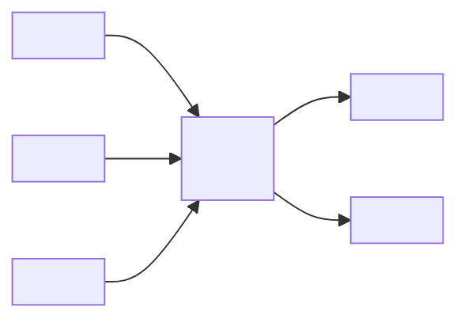

**View notes**
- **Question answered:** `<who/what interacts with the solution?>`
- **Boundary:** `<logical scope>`
- **Arrow semantics:** `<request/data/control/etc.>`
- **Omissions:** `<internal details intentionally hidden>`

### 4.3 Solution Boundary Rules

1. `<rule>`
2. `<rule>`
3. `<rule>`

## 5. Solution Strategy

### 5.1 Architectural Style

<!-- Examples: modular monolith, service-oriented, microservices, event-driven, layered platform, edge/cloud hybrid. -->

`<Describe selected architecture style and why it fits the drivers.>`

### 5.2 Design Principles

- `<principle>`
- `<principle>`
- `<principle>`
- `<principle>`

### 5.3 Major Patterns

| Pattern | Applied to | Purpose | Trade-off |
|---|---|---|---|
| `<event-driven / API gateway / outbox / saga / ...>` | `<area>` | `<purpose>` | `<trade-off>` |

## 6. Logical Solution Decomposition

### 6.1 Projects / Systems / Services / Packages

<!--
REQUIRED. Each row should correspond to a meaningful independently owned or versioned architectural unit.
Link each unit's own ARCHITECTURE.md when available.
-->

| Unit | Type | Responsibility | Owner | Depends on | Deployment unit? | Architecture doc |
|---|---|---|---|---|---:|---|
| `<Project A>` | `<service/package/UI/worker>` | `<responsibility>` | `<team>` | `<units>` | `<yes/no>` | `<link>` |
| `<Project B>` | `<type>` | `<responsibility>` | `<team>` | `<units>` | `<yes/no>` | `<link>` |

### 6.2 Container / Solution Diagram

<!--
REQUIRED. C4-container-equivalent view for the solution.
Show deployable/runtime units, major data stores, and external systems. Do not explode into classes.
-->

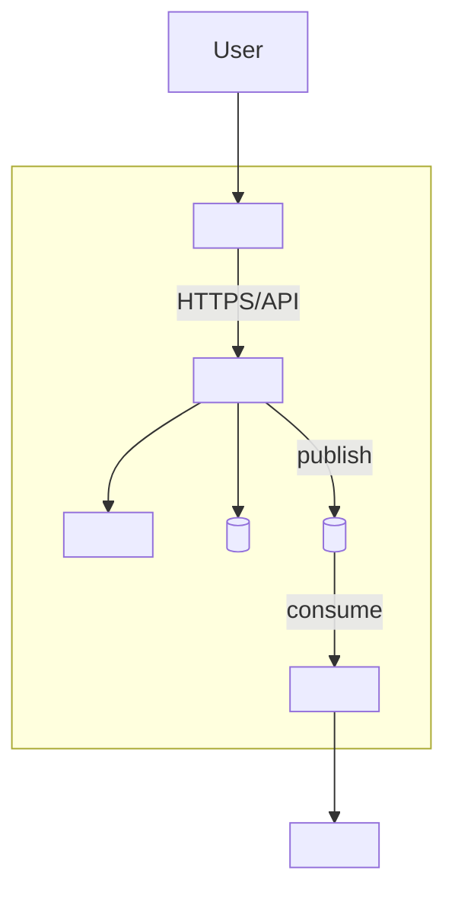

**View notes**
- **Elements:** `<runtime/deployment meaning>`
- **Relationships:** `<protocol/data/control semantics>`
- **Ownership:** `<team/domain boundaries if useful>`
- **Omissions:** `<lower-level package/module detail>`

### 6.3 Dependency and Ownership Rules

1. `<unit dependency rule>`
2. `<data ownership rule>`
3. `<integration ownership rule>`
4. `<shared library rule>`
5. `<cross-domain dependency rule>`

### 6.4 Shared Capabilities

| Shared capability | Provider | Consumers | Access mechanism | Coupling risk |
|---|---|---|---|---|
| `<identity/config/telemetry/etc.>` | `<unit/platform>` | `<consumers>` | `<API/package/service>` | `<risk>` |

## 7. Integration Architecture

### 7.1 Integration Catalog

<!-- REQUIRED for solutions with multiple projects or external systems. -->

| ID | Producer | Consumer | Pattern | Protocol / format | Contract owner | SLA/SLO | Versioning |
|---|---|---|---|---|---|---|---|
| INT-01 | `<A>` | `<B>` | `<sync API / event / file / DB / callback>` | `<REST/gRPC/AMQP/etc.>` | `<owner>` | `<target>` | `<strategy>` |

### 7.2 Integration Principles

- `<API-first / contract-first / event ownership / no shared DB / etc.>`
- `<timeout/retry policy>`
- `<idempotency policy>`
- `<backward compatibility policy>`
- `<schema evolution policy>`
- `<correlation/tracing policy>`

### 7.3 Synchronous Interaction Diagram

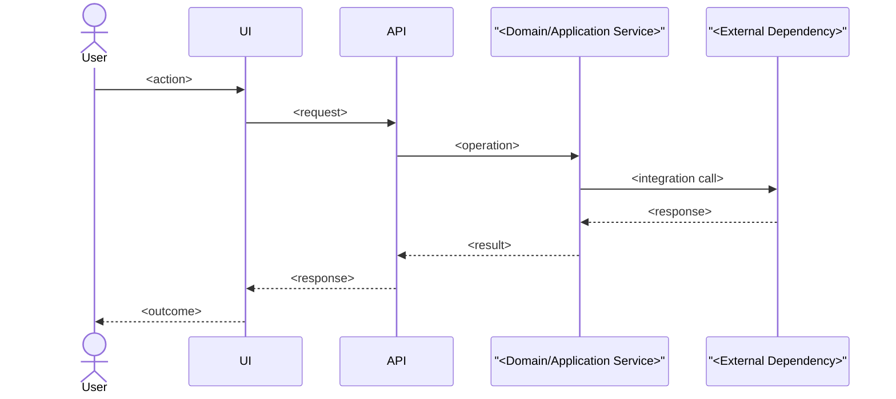

**Failure/degradation behavior:** `<timeouts, retries, circuit breaking, fallback, user impact>`

### 7.4 Asynchronous / Event Interaction Diagram

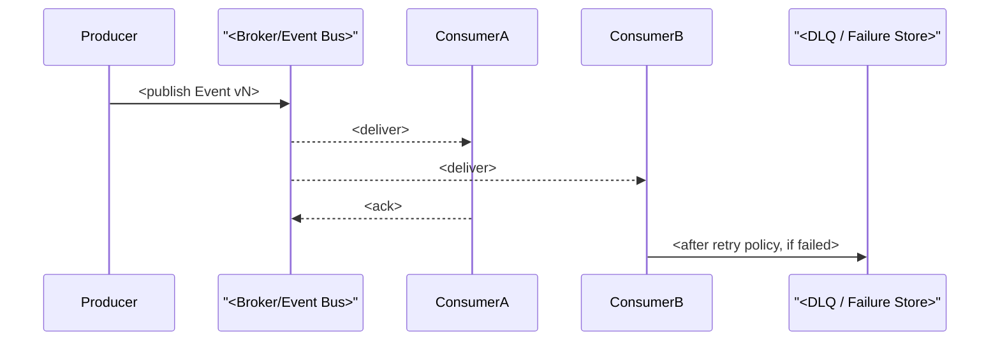

### 7.5 Contract Governance

- **API definition source:** `<OpenAPI/proto/code/etc.>`
- **Event/schema registry:** `<location/process or N/A>`
- **Breaking change approval:** `<process>`
- **Consumer-driven contract tests:** `<policy>`
- **Compatibility window:** `<policy>`

## 8. Data Architecture

### 8.1 Data Domains and Ownership

<!-- Every durable data set should have one authoritative owner/source of truth. -->

| Data domain / store | Owner | Source of truth | Readers | Writers | Classification | Retention |
|---|---|---|---|---|---|---|
| `<domain/store>` | `<unit/team>` | `<system>` | `<consumers>` | `<writers>` | `<public/internal/confidential/restricted>` | `<policy>` |

### 8.2 Data Architecture Diagram

```mermaid
flowchart LR
    Source["<Source System>"]
    ServiceA["<Owning Service>"]
    Primary[("<Primary Store>")]
    Bus[("<Event / Change Feed>")]
    ReadModel[("<Read Model / Cache>")]
    Analytics["<Analytics / Downstream>"]

    Source -->|"<input>"| ServiceA
    ServiceA -->|authoritative writes| Primary
    ServiceA -->|publish changes| Bus
    Bus --> ReadModel
    Bus --> Analytics
```

### 8.3 Data Principles

- `<single-writer / source-of-truth rule>`
- `<shared database policy>`
- `<transaction boundary>`
- `<eventual consistency policy>`
- `<PII/sensitive data policy>`
- `<retention/deletion policy>`
- `<schema/version policy>`

### 8.4 Consistency and Transactions

| Workflow | Consistency model | Transaction boundary | Compensation / recovery |
|---|---|---|---|
| `<workflow>` | `<strong/eventual>` | `<boundary>` | `<mechanism>` |

### 8.5 Data Movement and Residency

- `<regions / residency constraints>`
- `<replication policy>`
- `<export/import/batch flows>`
- `<encryption requirements>`

## 9. Runtime Architecture

<!--
Document 3-7 architecturally significant end-to-end scenarios.
Include at least one failure/degraded-mode path for systems where availability matters.
-->

### 9.1 Scenario: `<Primary End-to-End Flow>`

**Trigger:** `<trigger>`  
**Success result:** `<result>`  
**Participating units:** `<list>`

```mermaid
sequenceDiagram
    actor Actor
    participant A as "<Entry Point>"
    participant B as "<Application Unit>"
    participant C as "<Domain/Worker Unit>"
    participant D as "<Data/External Unit>"

    Actor->>A: <action>
    A->>B: <request>
    B->>C: <command/query>
    C->>D: <read/write/integrate>
    D-->>C: <result>
    C-->>B: <result>
    B-->>A: <result>
    A-->>Actor: <outcome>
```

### 9.2 Scenario: `<Failure / Degraded Mode>`

`<Describe trigger, failure containment, fallback, recovery, and user/operator-visible outcome.>`

### 9.3 Scenario: `<Background / Scheduled / Event-Driven Flow>`

`<Describe trigger, processing, idempotency, retry, checkpointing, and completion semantics.>`

### 9.4 Runtime Coordination

- **Orchestration/choreography:** `<model>`
- **Long-running workflows:** `<saga/workflow engine/state machine/etc.>`
- **Idempotency:** `<mechanism>`
- **Correlation:** `<mechanism>`
- **Ordering:** `<guarantee>`
- **Backpressure:** `<policy>`
- **Cancellation:** `<policy>`

## 10. Deployment and Infrastructure Architecture

### 10.1 Environment Model

| Environment | Purpose | Data class | External access | Promotion source |
|---|---|---|---|---|
| `<dev>` | `<purpose>` | `<synthetic/etc.>` | `<policy>` | `<source>` |
| `<test/stage>` | `<purpose>` | `<policy>` | `<policy>` | `<source>` |
| `<prod>` | `<purpose>` | `<policy>` | `<policy>` | `<source>` |

### 10.2 Deployment Diagram

<!--
REQUIRED when solution has more than one deployable/runtime unit.
Show physical/runtime placement, network/trust zones, stores, and external dependencies.
-->

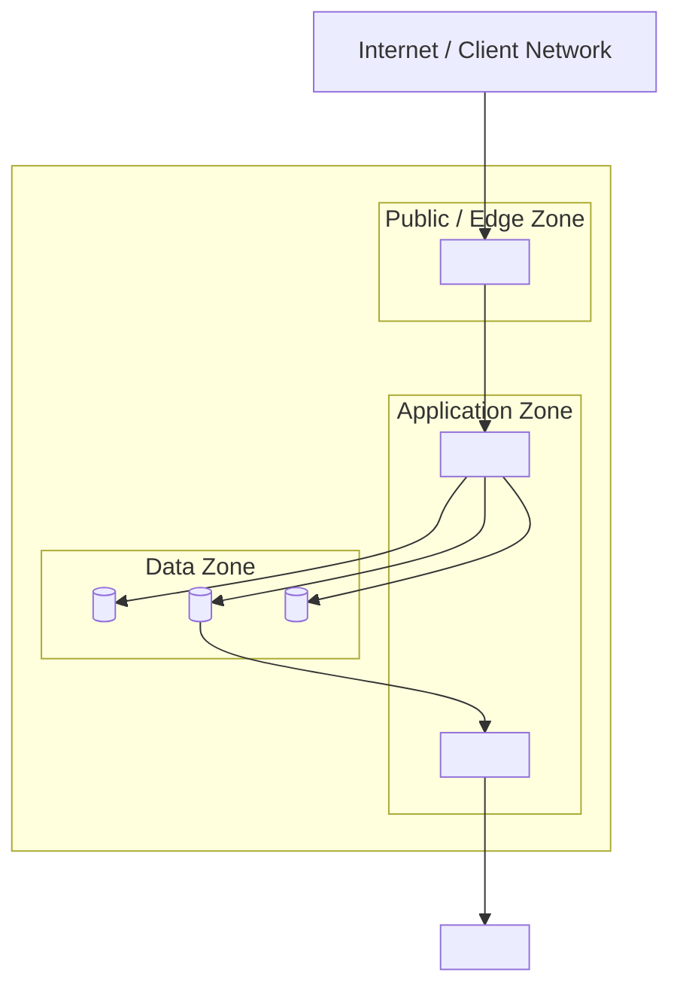

**View notes**
- **Nodes:** `<VM/container/process/PaaS meaning>`
- **Zones:** `<network/trust meaning>`
- **Scaling:** `<where horizontal/vertical scaling occurs>`
- **HA:** `<redundancy/failure-domain meaning>`

### 10.3 Runtime Placement

| Unit | Hosting model | Scale unit | Statefulness | Region/AZ strategy | Startup dependency |
|---|---|---|---|---|---|
| `<API>` | `<container/App Service/VM/etc.>` | `<instance>` | `<stateless/stateful>` | `<strategy>` | `<dependency>` |

### 10.4 Network Architecture

- **Ingress:** `<paths/ports/protocols>`
- **Egress:** `<policy>`
- **Service-to-service:** `<network/auth model>`
- **Private endpoints:** `<policy>`
- **DNS/service discovery:** `<mechanism>`
- **Firewall/network policy:** `<policy>`

### 10.5 Infrastructure Ownership

| Resource group / capability | Owner | Provisioning method | Change mechanism |
|---|---|---|---|
| `<resource>` | `<team>` | `<IaC/manual/platform>` | `<pipeline/process>` |

## 11. Security Architecture

### 11.1 Security Objectives

- `<objective>`
- `<objective>`
- `<objective>`

### 11.2 Identity and Access

| Subject | Authentication | Authorization | Credential/token lifetime | Owner |
|---|---|---|---|---|
| `<human user>` | `<OIDC/etc.>` | `<RBAC/ABAC/etc.>` | `<policy>` | `<owner>` |
| `<service/workload>` | `<managed identity/mTLS/etc.>` | `<policy>` | `<policy>` | `<owner>` |

### 11.3 Trust Boundary Diagram

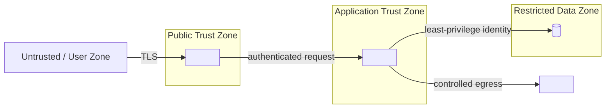

### 11.4 Security Controls

- **Secrets:** `<vault/rotation/access policy>`
- **Encryption in transit:** `<policy>`
- **Encryption at rest:** `<policy>`
- **Least privilege:** `<policy>`
- **Input validation:** `<policy>`
- **Supply chain:** `<SBOM/signing/scanning policy>`
- **Vulnerability management:** `<policy>`
- **Audit:** `<events/retention>`
- **Threat modeling:** `<method/link/status>`

### 11.5 Sensitive Data

| Data class | Locations | Access | Protection | Retention/deletion |
|---|---|---|---|---|
| `<PII/secret/etc.>` | `<stores/logs>` | `<principals>` | `<controls>` | `<policy>` |

## 12. Reliability, Resilience, and Continuity

### 12.1 Availability Targets

| Capability | SLO | Failure tolerance | Dependency assumptions |
|---|---|---|---|
| `<capability>` | `<99.x%>` | `<degraded/fail closed/etc.>` | `<assumptions>` |

### 12.2 Resilience Patterns

| Failure mode | Pattern | Parameters | Recovery |
|---|---|---|---|
| `<downstream timeout>` | `<timeout/retry/circuit breaker>` | `<values>` | `<behavior>` |
| `<message failure>` | `<retry/DLQ>` | `<values>` | `<behavior>` |

### 12.3 High Availability

- `<redundancy model>`
- `<failure domains>`
- `<state replication>`
- `<leader/election/failover if applicable>`

### 12.4 Disaster Recovery

- **RPO:** `<target>`
- **RTO:** `<target>`
- **Backup:** `<strategy>`
- **Restore:** `<strategy>`
- **Regional failure strategy:** `<strategy>`
- **DR testing:** `<frequency/mechanism>`

## 13. Performance and Scalability

### 13.1 Workload Model

| Dimension | Expected | Peak | Growth assumption |
|---|---:|---:|---|
| `<requests/sec>` | `<value>` | `<value>` | `<value>` |
| `<concurrent users>` | `<value>` | `<value>` | `<value>` |
| `<events/sec>` | `<value>` | `<value>` | `<value>` |
| `<data volume>` | `<value>` | `<value>` | `<value>` |

### 13.2 Performance Budgets

| Path | Target | Budget allocation | Verification |
|---|---|---|---|
| `<user/API path>` | `<p95/p99>` | `<component budgets>` | `<load test/APM>` |

### 13.3 Scaling Strategy

- **Stateless compute:** `<horizontal/vertical policy>`
- **Workers:** `<partition/concurrency strategy>`
- **Database:** `<scale/read/write/partition strategy>`
- **Cache:** `<strategy>`
- **Messaging:** `<partition/throughput strategy>`
- **Limits/quotas:** `<known bounds>`

## 14. Observability and Operations

### 14.1 Observability Model

- **Logs:** `<structured logging standard>`
- **Metrics:** `<RED/USE/business metrics/etc.>`
- **Traces:** `<distributed tracing standard>`
- **Correlation IDs:** `<policy>`
- **Health checks:** `<liveness/readiness/dependency health>`
- **Audit events:** `<policy>`

### 14.2 Operational Ownership

| Capability / unit | Primary owner | On-call owner | Runbook | Dashboard |
|---|---|---|---|---|
| `<service>` | `<team>` | `<team>` | `<link>` | `<link>` |

### 14.3 Alerting and Incident Response

- `<alerting philosophy>`
- `<SLO/error-budget policy>`
- `<incident severity model>`
- `<escalation path>`
- `<post-incident learning policy>`

### 14.4 Operational Dependencies

| Dependency | Health signal | Failure impact | Operator action |
|---|---|---|---|
| `<dependency>` | `<metric/health endpoint>` | `<impact>` | `<runbook action>` |

## 15. Configuration and Secrets

### 15.1 Configuration Ownership

| Configuration | Owner | Scope | Source | Reload behavior |
|---|---|---|---|---|
| `<setting/group>` | `<unit>` | `<env/service/tenant>` | `<config store/env/etc.>` | `<restart/live>` |

### 15.2 Secret Ownership

| Secret/credential class | Stored in | Consumed by | Rotation | Human access |
|---|---|---|---|---|
| `<secret>` | `<vault>` | `<workload>` | `<policy>` | `<policy>` |

### 15.3 Feature Flags

- **Provider:** `<system>`
- **Ownership:** `<team>`
- **Lifecycle:** `<creation → rollout → removal>`
- **Safety:** `<default/fallback>`
- **Auditability:** `<policy>`

## 16. Delivery and DevSecOps Architecture

### 16.1 Source and Repository Structure

| Repository/project | Purpose | Owner | Produces |
|---|---|---|---|
| `<repo/project>` | `<purpose>` | `<team>` | `<artifact>` |

### 16.2 Build and CI

- `<build strategy>`
- `<test gates>`
- `<static analysis>`
- `<dependency/security scanning>`
- `<artifact provenance/SBOM>`
- `<signing>`

### 16.3 Deployment and Promotion

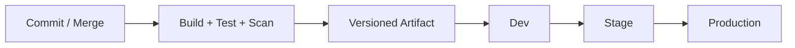

- **Promotion model:** `<build once/promote same artifact>`
- **Approval gates:** `<policy>`
- **Rollback:** `<mechanism>`
- **Database migration:** `<strategy>`
- **Progressive delivery:** `<blue/green/canary/flags/etc.>`

### 16.4 Infrastructure as Code

- **Tooling:** `<Terraform/Bicep/CloudFormation/etc.>`
- **Ownership:** `<team>`
- **State management:** `<policy>`
- **Drift detection:** `<policy>`
- **Environment parity:** `<policy>`

## 17. Compliance, Privacy, and Governance

<!-- Keep only concerns applicable to the solution. -->

### 17.1 Compliance

| Requirement / framework | Applies to | Architectural controls | Evidence |
|---|---|---|---|
| `<SOC2/HIPAA/etc.>` | `<scope>` | `<controls>` | `<evidence>` |

### 17.2 Privacy

- `<data minimization>`
- `<consent/usage policy>`
- `<retention/deletion>`
- `<subject access/export if applicable>`

### 17.3 Technology and Architecture Governance

- **Approved technologies:** `<policy/link>`
- **Exception process:** `<process>`
- **Architecture review trigger:** `<conditions>`
- **ADR ownership:** `<policy>`
- **Cross-team contract review:** `<policy>`

## 18. Cost and Capacity

<!-- Recommended for cloud/hosted solutions. -->

### 18.1 Major Cost Drivers

| Driver | Scaling variable | Cost sensitivity | Control |
|---|---|---|---|
| `<compute>` | `<requests/instances>` | `<high/medium/low>` | `<autoscale/reservation/etc.>` |

### 18.2 Cost Guardrails

- `<budget/alerting>`
- `<resource quota>`
- `<retention controls>`
- `<environment shutdown policy>`
- `<FinOps ownership>`

## 19. Architectural Decisions

| ID | Decision | Status | Rationale | Consequence / trade-off | ADR |
|---|---|---|---|---|---|
| AD-01 | `<decision>` | `<Accepted/Proposed>` | `<why>` | `<trade-off>` | `<link>` |

### 19.1 Decision Principles

- `<principle>`
- `<principle>`

## 20. Quality Scenarios and Verification

### 20.1 Quality Scenarios

<!--
Use concrete stimulus/environment/response/measure scenarios for top quality attributes.
-->

| ID | Attribute | Scenario | Expected response / measure | Verification |
|---|---|---|---|---|
| Q-01 | `<Availability>` | `<dependency fails during peak>` | `<measurable behavior>` | `<test>` |
| Q-02 | `<Performance>` | `<peak load>` | `<p95/p99 target>` | `<load test>` |
| Q-03 | `<Security>` | `<unauthorized request>` | `<deny/audit>` | `<security test>` |

### 20.2 Architecture Verification Strategy

- **Unit/package tests:** `<scope>`
- **Integration contract tests:** `<scope>`
- **End-to-end tests:** `<scope>`
- **Performance/load:** `<scope>`
- **Resilience/chaos:** `<scope>`
- **Security:** `<SAST/DAST/pen test/threat model>`
- **DR:** `<restore/failover test>`
- **Architecture fitness functions:** `<dependency/layering/contract rules>`
- **Operational readiness:** `<runbook/alert/dashboard review>`

## 21. Risks and Technical Debt

| ID | Risk / debt | Likelihood | Impact | Owner | Mitigation | Status |
|---|---|---|---|---|---|---|
| RK-01 | `<risk>` | `<L/M/H>` | `<impact>` | `<owner>` | `<mitigation>` | `<Open/Accepted/Planned>` |

### 21.1 Dependency / Vendor Risks

- `<risk>`
- `<risk>`

### 21.2 Architectural Hotspots

- `<area where change/failure complexity concentrates>`
- `<area requiring further design/ADR/prototype>`

## 22. Evolution, Migration, and Roadmap

### 22.1 Current Extension Seams

- `<seam>`
- `<seam>`

### 22.2 Target Evolution

- `<future capability — explicitly planned>`
- `<future scaling/integration direction>`

### 22.3 Migration Architecture

<!-- Required when replacing/modernizing an existing system. -->

| Migration stage | Old path | New path | Coexistence mechanism | Exit criteria |
|---|---|---|---|---|
| `<stage>` | `<legacy>` | `<target>` | `<strangler/dual-write/adapter/etc.>` | `<criteria>` |

### 22.4 Compatibility and Cutover

- `<contract compatibility>`
- `<data migration>`
- `<rollback>`
- `<feature flag / phased rollout>`
- `<consumer migration sequence>`

### 22.5 Change Rules

- `<what may change independently>`
- `<what requires coordinated release>`
- `<what requires an ADR>`
- `<what requires architecture review>`
- `<what constitutes a solution-breaking change>`

## 23. Glossary

| Term | Meaning |
|---|---|
| `<term>` | `<precise solution-specific definition>` |

## Appendix A — Diagram Catalog and Instructions

<!--
A solution document needs more views than a module/package document, but each diagram must still
answer one primary architectural question. Do NOT create diagrams merely to satisfy the template.

CORE SOLUTION DIAGRAMS

1. System Context Diagram — REQUIRED.
   Question: Who uses the solution and which external systems does it interact with?

2. Container / Solution Decomposition Diagram — REQUIRED.
   Question: Which major runtime/deployable units make up the solution and how do they communicate?

3. Integration Diagram / Catalog — REQUIRED for multi-project or externally integrated solutions.
   Question: What crosses solution/unit boundaries, by what protocol/pattern, and who owns the contract?

4. Data Architecture / Data-Flow Diagram — REQUIRED when durable or shared data is material.
   Question: Who owns data, where is it stored, and how does it move?

5. Runtime Sequence Diagrams — REQUIRED for 3-7 significant end-to-end scenarios.
   Include success, failure/degraded, and asynchronous/background behavior where applicable.

6. Deployment Diagram — REQUIRED for multi-process/hosted/distributed solutions.
   Question: Where do runtime units execute and across what network/trust/failure boundaries?

7. Trust Boundary / Security Diagram — REQUIRED when multiple trust zones or external access exist.
   Question: Where do identity/trust transitions occur and what controls protect them?

CONDITIONAL DIAGRAMS

8. System Landscape Diagram — Use when this solution is one system among many internal systems.
9. Component Diagram — Use only for a particularly important service/project; otherwise link its package architecture.
10. Event Topology Diagram — Use when event-driven integration is dominant.
11. Network Diagram — Use when routing/private connectivity/firewalls materially shape architecture.
12. State/Workflow Diagram — Use for long-running workflows, orchestration, or execution state.
13. DR/Failover Diagram — Use when multi-region or non-trivial recovery architecture exists.
14. CI/CD Diagram — Use when delivery topology or promotion controls are architecturally significant.
15. Migration Diagram — Use during modernization/coexistence.
16. Dependency Diagram — Use when cross-project dependency direction is a critical design rule.

DIAGRAM QUALITY RULES
- State the architectural question above or below the diagram.
- Keep a consistent abstraction level.
- Label protocols and semantics on cross-boundary arrows.
- Visually identify system, trust, network, ownership, and deployment boundaries when relevant.
- Distinguish synchronous, asynchronous, data, and control flows.
- Add a legend when notation is not obvious.
- State important omissions explicitly.
- Avoid one giant "everything diagram"; prefer a coherent set of views.
- Link lower-level architecture documents rather than exploding solution diagrams into classes.
-->

### Optional Event Topology Placeholder

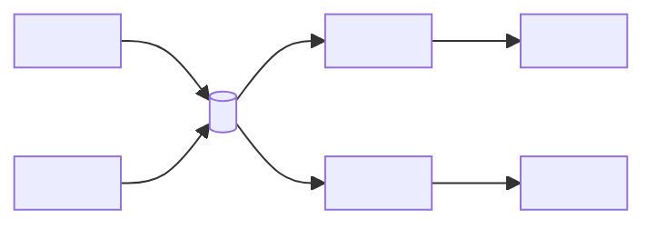

### Optional Migration Diagram Placeholder

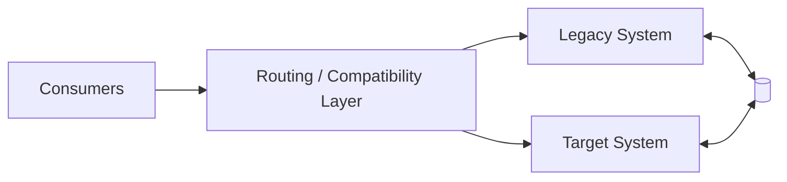

### Optional Multi-Region / DR Placeholder

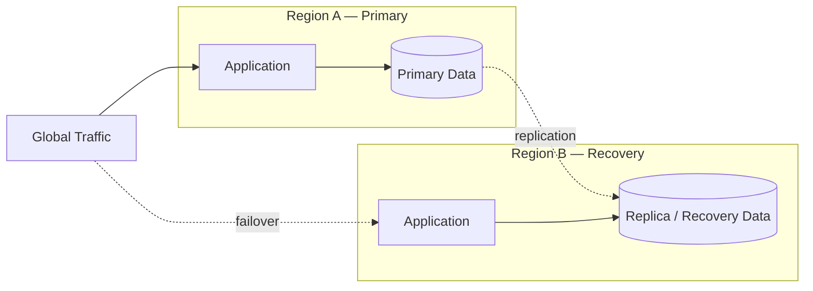

## Appendix B — Architecture Review Checklist

Before accepting the document, verify:

- [ ] Solution scope, system boundary, non-goals, and target state are explicit.
- [ ] All major projects/services/packages have one clear responsibility and owner.
- [ ] Lower-level package/module architecture is linked rather than duplicated.
- [ ] Cross-unit dependency rules prevent accidental architectural cycles/coupling.
- [ ] Every integration identifies producer, consumer, mechanism, contract owner, and versioning strategy.
- [ ] Synchronous and asynchronous failure semantics are documented.
- [ ] Every durable data set has a source of truth and explicit read/write ownership.
- [ ] Consistency and transaction boundaries are explicit.
- [ ] Deployment topology identifies scaling, statefulness, zones, and critical dependencies.
- [ ] Trust boundaries, workload identity, secrets, and sensitive-data controls are explicit.
- [ ] Availability, resilience, RPO/RTO, and recovery behavior match business requirements.
- [ ] Performance/scalability assumptions are quantified where architecture depends on them.
- [ ] Logs, metrics, traces, health signals, alerts, runbooks, and operational ownership are addressed.
- [ ] Build, artifact, deployment, IaC, security scanning, and rollback mechanisms are documented.
- [ ] Architecture decisions are linked to ADRs when trade-offs are material.
- [ ] Quality goals have measurable scenarios and verification methods.
- [ ] Risks include vendor/dependency, data, security, operational, cost, and migration concerns as applicable.
- [ ] Current, transitional, and target architecture are not conflated.
- [ ] Diagrams use consistent abstraction and explain boundaries/arrow semantics.

## Appendix C — Document Hierarchy

Use the architecture documents as a hierarchy rather than duplicating detail:

```text
SOLUTION_ARCHITECTURE.md
    │
    ├── Project / Package A
    │      └── PACKAGE_ARCHITECTURE.md
    │              ├── Module A1 → MODULE_ARCHITECTURE.md
    │              └── Module A2 → MODULE_ARCHITECTURE.md
    │
    ├── Project / Package B
    │      └── PACKAGE_ARCHITECTURE.md
    │
    └── Cross-solution concerns
           ├── Integration contracts
           ├── Data ownership
           ├── Deployment topology
           ├── Security / trust
           └── Operations / governance
```

**Rule:** The larger document owns cross-boundary decisions. The smaller document owns internal design.
When information belongs at both levels, the solution document states the governing constraint and
links to the lower-level document for implementation-specific architecture.

## Appendix D — Template Basis

This template is the solution-scale evolution of the same architecture-documentation approach used
for the Module and Package templates:

1. **arc42** — supplies the architecture narrative: goals, constraints, context, solution strategy,
   building blocks, runtime, deployment, cross-cutting concepts, decisions, quality, risks, and glossary.
2. **SEI Views & Beyond** — supplies stakeholder/concern-driven viewpoint discipline, explicit element
   and relationship semantics, interface/behavior description, rationale, and cross-view consistency.
3. **C4 model** — supplies controlled visual zoom: system context, containers/deployable units,
   selective component detail, dynamic/runtime views, and deployment views.

At solution scale, the template deliberately adds concerns that do not belong in a small module
document: integration governance, data ownership, environment/deployment topology, identity and
trust boundaries, resilience/DR, observability and operational ownership, DevSecOps/IaC, compliance,
cost/capacity, migration, and cross-team architecture governance.

Research references:
- arc42 Template Overview: https://arc42.org/overview/
- arc42 Building Block View: https://docs.arc42.org/section-5/
- SEI Views and Beyond Collection: https://www.sei.cmu.edu/library/views-and-beyond-collection/
- SEI Views and Beyond Documentation Template: https://www.sei.cmu.edu/library/views-and-beyond-documentation-template/
- C4 Model: https://c4model.com/
- C4 Diagrams: https://c4model.com/diagrams
