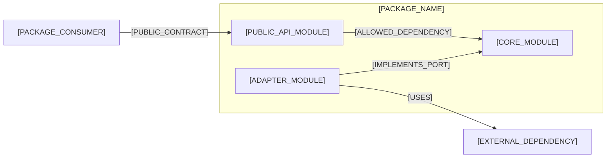

# [PACKAGE_NAME] Package Architecture

## Responsibility and Boundary

[PACKAGE_RESPONSIBILITY_AND_EXCLUSIONS]

## Module Decomposition

| Module | Responsibility | Public Surface |
|---|---|---|
| [MODULE] | [RESPONSIBILITY] | [PUBLIC_SURFACE] |

### Module and Dependency View

Use this view to show the Package boundary, Module responsibilities, and allowed dependency direction. Keep classes and method calls in Module-level documentation.

- Relationship meaning: [ARROW_SEMANTICS]
- Key dependency rule: [DEPENDENCY_RULE]
- Scope and omissions: [DIAGRAM_SCOPE_AND_OMISSIONS]

## Dependencies and Data

- [DEPENDENCY_OR_DATA_OWNERSHIP]

## Qualities and Constraints

- [QUALITY_OR_CONSTRAINT]

## Traceability and Divergence

- [PARENT_ADR_OR_FEATURE_LINK]
- [DIVERGENCE_OR_NONE]

## Profile and Decision Basis

- Profile: [COMPACT_OR_DETAILED]; rationale: [ONE_SENTENCE_PROFILE_RATIONALE]
- Parent alignment and exclusions: [GOVERNING_CONSTRAINTS_AND_BOUNDARY]
- Invariants: [MUST_HOLD_BEHAVIOR_AND_OWNERSHIP_RULES]
- Alternatives and consequences: [CHOICE_REJECTED_ALTERNATIVE_AND_TRADEOFF]
- Feasibility and verification: [PROOF_OBLIGATIONS_AND_REQUIRED_CHECKS]
- Applicability: [OMITTED_CONCERN_AND_REASON_OR_NONE]

## Failure, Security, and Operational Readiness

- Failure and recovery: [ERROR_RETRY_RESOURCE_LIMIT_AND_RECOVERY_BEHAVIOR]
- Security and trust: [THREAT_BOUNDARY_AND_CONTROL]
- Operations and compatibility: [OBSERVABILITY_DEPLOYMENT_MIGRATION_AND_REVERSAL]

## Review Packet

- Decision bytes or immutable snapshot: [INPUT_AND_DECISION_FINGERPRINT_LOCATORS]
- Effective policy and named approver: [POLICY_LOCATOR_AND_APPROVER]
- Paired decisions and order: [PAIRED_ARTIFACT_LOCATORS_OR_NONE]
- Review cycle history: [DURABLE_HISTORY_LOCATOR]; repair cycles consumed: [COUNT]
- Correspondence at decision time: [VERIFIED_MATCH_OR_BLOCKER]

## Approval Record

| Field | Value |
|---|---|
| Mode | [HUMAN_OR_AUTO_APPROVE_OR_FORCE] |
| Author | [AUTHOR] |
| Approver | [INDEPENDENT_APPROVER_OR_FORCE_AUTHORIZING_HUMAN] |
| Decision | [PENDING_OR_ACCEPTED_OR_CHANGES_REQUIRED_OR_REJECTED_OR_BYPASSED] |
| Recorded | [ISO_8601_TIMESTAMP_OR_PENDING] |
| Evidence | [REVIEW_REFERENCE_OR_NONE] |
| Bypass reason | [REQUIRED_FOR_FORCE_OR_NONE] |
