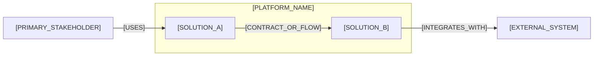

# [PLATFORM_NAME] Platform Architecture

## Purpose and Outcomes

[PURPOSE_AND_QUALITY_OUTCOMES]

## Context and Boundaries

[PLATFORM_BOUNDARY_AND_EXTERNAL_CONTEXT]

### Platform Context and Solution Landscape

Use this view to show who depends on the Platform, its owned Solutions, and the most important external relationships. Keep Solution internals in their own architecture documents.

- Relationship meaning: [ARROW_SEMANTICS]
- Scope and omissions: [DIAGRAM_SCOPE_AND_OMISSIONS]

## Solution Decomposition

| Solution | Responsibility | Owned Data | Interfaces |
|---|---|---|---|
| [SOLUTION] | [RESPONSIBILITY] | [DATA] | [CONTRACT_LINK] |

## System and Runtime Views

[IMPORTANT_RUNTIME_INTERACTIONS_AND_SYSTEM_VIEW_LINKS]

## Qualities, Security, and Operations

- [QUALITY_OR_CONSTRAINT]

## Decisions, Contracts, and Traceability

- [ADR_OR_CONTRACT_LINK]
- [EPIC_FEATURE_OR_IMPACT_LINK]

## Divergence and Lifecycle

- [DIVERGENCE_OR_NONE]

## Profile and Decision Basis

- Profile: [COMPACT_OR_DETAILED]; rationale: [ONE_SENTENCE_PROFILE_RATIONALE]
- Parent alignment and exclusions: [GOVERNING_CONSTRAINTS_AND_BOUNDARY]
- Invariants: [MUST_HOLD_BEHAVIOR_AND_OWNERSHIP_RULES]
- Alternatives and consequences: [CHOICE_REJECTED_ALTERNATIVE_AND_TRADEOFF]
- Feasibility and verification: [PROOF_OBLIGATIONS_AND_REQUIRED_CHECKS]
- Applicability: [OMITTED_CONCERN_AND_REASON_OR_NONE]

## Failure, Security, and Operational Readiness

- Failure and recovery: [ERROR_RETRY_RESOURCE_LIMIT_AND_RECOVERY_BEHAVIOR]
- Security and trust: [THREAT_BOUNDARY_AND_CONTROL]
- Operations and compatibility: [OBSERVABILITY_DEPLOYMENT_MIGRATION_AND_REVERSAL]

## Review Packet

- Decision bytes or immutable snapshot: [INPUT_AND_DECISION_FINGERPRINT_LOCATORS]
- Effective policy and named approver: [POLICY_LOCATOR_AND_APPROVER]
- Paired decisions and order: [PAIRED_ARTIFACT_LOCATORS_OR_NONE]
- Review cycle history: [DURABLE_HISTORY_LOCATOR]; repair cycles consumed: [COUNT]
- Correspondence at decision time: [VERIFIED_MATCH_OR_BLOCKER]

## Approval Record

| Field | Value |
|---|---|
| Mode | [HUMAN_OR_AUTO_APPROVE_OR_FORCE] |
| Author | [AUTHOR] |
| Approver | [INDEPENDENT_APPROVER_OR_FORCE_AUTHORIZING_HUMAN] |
| Decision | [PENDING_OR_ACCEPTED_OR_CHANGES_REQUIRED_OR_REJECTED_OR_BYPASSED] |
| Recorded | [ISO_8601_TIMESTAMP_OR_PENDING] |
| Evidence | [REVIEW_REFERENCE_OR_NONE] |
| Bypass reason | [REQUIRED_FOR_FORCE_OR_NONE] |
