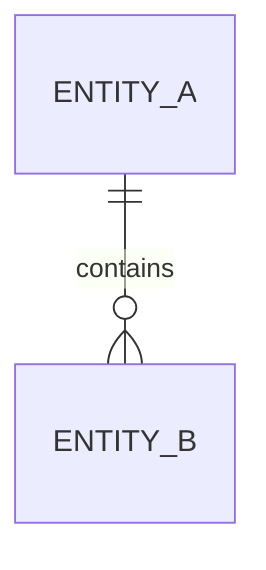
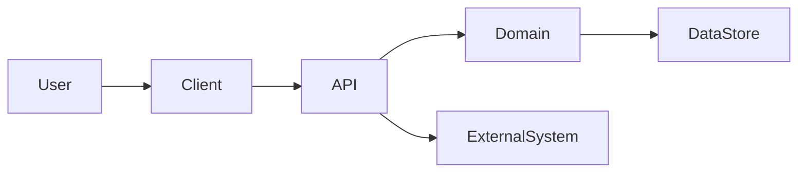

# CONCEPT.md

> **Purpose:** Define the software concept with enough product, domain, technical, operational, and delivery clarity to support creation of a complete `DESIGN.md`.
>
> **Status:** Draft | In Review | Approved | Superseded  
> **Owner:** `<name or team>`  
> **Contributors:** `<names or teams>`  
> **Created:** `<YYYY-MM-DD>`  
> **Last Updated:** `<YYYY-MM-DD>`  
> **Target Design Document:** `<path or link to DESIGN.md>`  
> **Related Initiative / Epic:** `<identifier or link>`  
> **Decision Deadline:** `<YYYY-MM-DD or N/A>`

---

## 1. Executive Summary

### 1.1 Concept Statement

Describe the proposed software capability in one concise paragraph.

**Template**

> `<Product/system/service>` will enable `<target users or systems>` to `<primary capability or outcome>` by `<high-level approach>`, resulting in `<measurable business or operational value>`.

### 1.2 Problem Summary

What problem exists today?

- Current condition:
- Who experiences the problem:
- Frequency and severity:
- Business or user impact:
- Why existing solutions are insufficient:
- Evidence supporting the problem:

### 1.3 Proposed Outcome

Describe the desired future state without prematurely prescribing detailed implementation.

- Primary outcome:
- Secondary outcomes:
- Expected user or system behavior:
- Expected organizational impact:
- Definition of success:

### 1.4 Recommendation

State the current recommendation.

- **Recommendation:** Proceed | Proceed with Conditions | Research Further | Do Not Proceed
- **Recommended concept direction:**
- **Key rationale:**
- **Conditions or prerequisites:**

---

## 2. Context and Motivation

### 2.1 Background

Summarize the business, product, operational, regulatory, or technical context that led to this concept.

### 2.2 Opportunity

Explain the opportunity created by solving the problem.

- Revenue or cost impact:
- Productivity impact:
- Risk reduction:
- User experience improvement:
- Strategic differentiation:
- Platform or reuse potential:

### 2.3 Why Now

Explain why this concept should be evaluated or developed now.

- Triggering events:
- Market or customer pressure:
- Technology readiness:
- Regulatory deadlines:
- Operational urgency:
- Dependency timing:
- Cost of delay:

### 2.4 Current State

Describe how the relevant process or system works today.

Include, where applicable:

- Existing systems and services
- Current workflows
- Manual steps
- Known bottlenecks
- Existing data flows
- Existing integrations
- Current performance or reliability
- Current security posture
- Current operating cost
- Known technical debt

### 2.5 Desired Future State

Describe the target operating model and experience after successful implementation.

---

## 3. Goals, Non-Goals, and Success Criteria

### 3.1 Goals

List concrete outcomes the concept must achieve.

| ID | Goal | Rationale | Priority | Measurement |
|---|---|---|---|---|
| G-01 | `<goal>` | `<why it matters>` | Must | `<metric>` |
| G-02 | `<goal>` | `<why it matters>` | Should | `<metric>` |

### 3.2 Non-Goals

Explicitly state what this concept will not address.

| ID | Non-Goal | Rationale | Possible Future Phase |
|---|---|---|---|
| NG-01 | `<excluded capability>` | `<reason>` | `<phase or N/A>` |

### 3.3 Success Metrics

Define measurable indicators of success.

| Metric | Baseline | Target | Measurement Method | Evaluation Window |
|---|---:|---:|---|---|
| `<metric>` | `<current>` | `<target>` | `<method>` | `<period>` |

### 3.4 Failure Criteria

Define conditions that would indicate the concept is not viable or should be reconsidered.

- Adoption below:
- Performance below:
- Cost above:
- Reliability below:
- Compliance issue:
- Security issue:
- Operational burden above:
- Other stop conditions:

---

## 4. Stakeholders and Users

### 4.1 Stakeholder Map

| Stakeholder | Role | Interest | Influence | Responsibilities | Approval Required |
|---|---|---|---|---|---|
| `<name/team>` | `<role>` | `<interest>` | High/Med/Low | `<responsibility>` | Yes/No |

### 4.2 User Groups and Personas

For each user group, describe:

#### Persona: `<name or role>`

- Responsibilities:
- Goals:
- Pain points:
- Technical proficiency:
- Frequency of use:
- Environment of use:
- Accessibility considerations:
- Trust and safety concerns:
- Critical tasks:
- Failure impact:

### 4.3 System Actors

List non-human actors.

| Actor | Type | Interaction | Trust Level | Authentication Method |
|---|---|---|---|---|
| `<system/service/device>` | External/Internal | `<interaction>` | Trusted/Untrusted/Conditional | `<method>` |

---

## 5. Scope

### 5.1 In Scope

- `<capability>`
- `<workflow>`
- `<user group>`
- `<integration>`
- `<data domain>`

### 5.2 Out of Scope

- `<explicit exclusion>`
- `<deferred capability>`
- `<unsupported platform or environment>`

### 5.3 Scope Boundaries

Describe the boundaries between this concept and adjacent systems, teams, or responsibilities.

### 5.4 Minimum Viable Scope

Define the smallest coherent implementation that can validate the concept.

### 5.5 Future Scope

List plausible future extensions without committing them to the current implementation.

---

## 6. Domain Definition

### 6.1 Domain Overview

Describe the business or technical domain in which the software operates.

### 6.2 Ubiquitous Language

Define domain terms that must be used consistently.

| Term | Definition | Synonyms to Avoid | Source |
|---|---|---|---|
| `<term>` | `<definition>` | `<ambiguous terms>` | `<authority>` |

### 6.3 Domain Capabilities

| Capability | Description | Owner | Existing or New | Strategic Importance |
|---|---|---|---|---|
| `<capability>` | `<description>` | `<owner>` | Existing/New | Core/Supporting/Generic |

### 6.4 Bounded Contexts

Identify likely domain boundaries.

| Bounded Context | Responsibility | Key Entities | Upstream | Downstream |
|---|---|---|---|---|
| `<context>` | `<responsibility>` | `<entities>` | `<systems>` | `<systems>` |

### 6.5 Core Domain Entities

| Entity / Aggregate | Description | Identity | Lifecycle | Invariants |
|---|---|---|---|---|
| `<entity>` | `<description>` | `<identifier>` | `<states>` | `<rules>` |

### 6.6 Business Rules

| Rule ID | Rule | Source | Enforcement Point | Exception Handling |
|---|---|---|---|---|
| BR-01 | `<rule>` | `<policy/law/domain expert>` | `<system/process>` | `<handling>` |

### 6.7 Domain Events

| Event | Trigger | Producer | Consumers | Business Meaning |
|---|---|---|---|---|
| `<event>` | `<trigger>` | `<producer>` | `<consumers>` | `<meaning>` |

---

## 7. User Journeys and Use Cases

### 7.1 Primary User Journey

Describe the end-to-end happy path.

1. `<step>`
2. `<step>`
3. `<step>`

### 7.2 Alternate Journeys

Document important alternate paths.

### 7.3 Failure and Recovery Journeys

Document what happens when:

- Required data is missing
- Authentication fails
- Authorization is denied
- Dependencies are unavailable
- Processing times out
- Data conflicts occur
- A user makes an error
- Partial completion occurs
- Recovery or retry is required

### 7.4 Use Case Catalog

| ID | Use Case | Primary Actor | Trigger | Outcome | Priority |
|---|---|---|---|---|---|
| UC-01 | `<use case>` | `<actor>` | `<trigger>` | `<outcome>` | Must |

### 7.5 Use Case Detail

#### UC-01: `<Use Case Name>`

- **Primary actor:**
- **Supporting actors:**
- **Preconditions:**
- **Trigger:**
- **Main flow:**
  1. `<step>`
  2. `<step>`
- **Alternate flows:**
- **Failure flows:**
- **Postconditions:**
- **Business rules:**
- **Data created or changed:**
- **Audit requirements:**
- **Acceptance indicators:**

---

## 8. Functional Capabilities

### 8.1 Capability Summary

| ID | Capability | Description | User Value | Priority | Phase |
|---|---|---|---|---|---|
| FC-01 | `<capability>` | `<description>` | `<value>` | Must | MVP |

### 8.2 Capability Detail

#### FC-01: `<Capability Name>`

- Description:
- Actors:
- Inputs:
- Processing:
- Outputs:
- Preconditions:
- Postconditions:
- Business rules:
- Exceptions:
- Dependencies:
- Data involved:
- Audit events:
- Permissions:
- Configurability:
- Acceptance indicators:

### 8.3 Administrative Capabilities

Include, where relevant:

- User and role management
- Tenant or organization management
- Configuration management
- Feature flags
- Content or reference data management
- Audit review
- Operational controls
- Support tooling
- Data correction
- Retention and deletion controls

### 8.4 Reporting and Analytics

- Operational reports:
- Business reports:
- Product analytics:
- Usage analytics:
- Compliance reports:
- Export requirements:
- Real-time versus batch requirements:

---

## 9. Quality Attributes and Non-Functional Requirements

### 9.1 Quality Attribute Priorities

Rank the most important quality attributes.

| Quality Attribute | Priority | Rationale | Tradeoff Notes |
|---|---|---|---|
| Security | Critical | `<rationale>` | `<tradeoff>` |
| Reliability | High | `<rationale>` | `<tradeoff>` |
| Performance | High | `<rationale>` | `<tradeoff>` |
| Maintainability | High | `<rationale>` | `<tradeoff>` |

Consider:

- Availability
- Reliability
- Resilience
- Recoverability
- Performance
- Scalability
- Security
- Privacy
- Safety
- Usability
- Accessibility
- Maintainability
- Modifiability
- Testability
- Deployability
- Interoperability
- Portability
- Observability
- Auditability
- Data integrity
- Cost efficiency
- Sustainability

### 9.2 Quality Attribute Scenarios

Use stimulus-response scenarios to make quality expectations testable.

| ID | Attribute | Source | Stimulus | Environment | Artifact | Response | Measure |
|---|---|---|---|---|---|---|---|
| QA-01 | Availability | `<source>` | `<event>` | `<condition>` | `<component>` | `<expected response>` | `<numeric target>` |

### 9.3 Performance Requirements

| Scenario | Expected Load | Latency Target | Throughput Target | Degradation Behavior |
|---|---:|---:|---:|---|
| `<operation>` | `<load>` | `<p50/p95/p99>` | `<rate>` | `<behavior>` |

Include:

- Interactive response time
- Batch completion time
- Startup time
- Search or query latency
- File or payload size limits
- Concurrency
- Peak load
- Sustained load
- Burst load
- Resource utilization limits

### 9.4 Availability and Reliability

- Availability target:
- Error budget:
- Recovery Time Objective:
- Recovery Point Objective:
- Mean Time to Detect:
- Mean Time to Recover:
- Data durability target:
- Maximum tolerable outage:
- Planned maintenance expectations:
- Required redundancy:

### 9.5 Scalability

- Initial scale:
- Expected 12-month scale:
- Expected 36-month scale:
- Scaling dimensions:
- Known hotspots:
- Horizontal or vertical scaling assumptions:
- Geographic scaling:
- Tenant scaling:
- Data growth model:

### 9.6 Usability and Accessibility

- Supported accessibility standard:
- Keyboard navigation:
- Screen reader support:
- Color and contrast:
- Localization:
- Responsive behavior:
- Usability targets:
- User training assumptions:
- Error message requirements:

### 9.7 Maintainability and Evolvability

- Expected change frequency:
- Required modularity:
- Extension points:
- Backward compatibility expectations:
- Deprecation policy:
- Upgrade strategy:
- Documentation expectations:
- Code ownership expectations:

---

## 10. Security, Privacy, Safety, and Compliance

### 10.1 Security Objectives

- Confidentiality:
- Integrity:
- Availability:
- Authenticity:
- Non-repudiation:
- Least privilege:
- Defense in depth:
- Secure defaults:

### 10.2 Trust Boundaries

Identify likely trust boundaries and transitions.

| Boundary | From | To | Data Crossing | Required Controls |
|---|---|---|---|---|
| TB-01 | `<source>` | `<destination>` | `<data>` | `<controls>` |

### 10.3 Authentication

- User authentication method:
- Service authentication method:
- Multi-factor authentication:
- Session management:
- Token lifetime:
- Credential storage:
- Identity provider:
- Offline authentication requirements:

### 10.4 Authorization

- Authorization model:
- Roles:
- Permissions:
- Resource-level access:
- Tenant isolation:
- Administrative override:
- Break-glass access:
- Policy evaluation:
- Deny-by-default behavior:

### 10.5 Threat Model Summary

Identify major threats using STRIDE, attack trees, abuse cases, or equivalent methods.

| Threat ID | Threat | Asset | Actor | Attack Path | Impact | Proposed Mitigation |
|---|---|---|---|---|---|---|
| TH-01 | `<threat>` | `<asset>` | `<actor>` | `<path>` | `<impact>` | `<mitigation>` |

### 10.6 Abuse and Misuse Cases

- Unauthorized access:
- Privilege escalation:
- Data exfiltration:
- Fraud:
- Harassment or harmful content:
- Automated abuse:
- Resource exhaustion:
- Prompt injection or model manipulation:
- Insider misuse:
- Supply-chain compromise:

### 10.7 Privacy

- Personal data processed:
- Sensitive data processed:
- Data subjects:
- Purpose of processing:
- Lawful basis:
- Consent requirements:
- Data minimization:
- Data retention:
- Deletion requirements:
- Data portability:
- Data residency:
- Cross-border transfer:
- Privacy impact assessment required:
- User transparency requirements:

### 10.8 Compliance

| Regulation / Standard | Applicability | Required Controls | Evidence Required | Owner |
|---|---|---|---|---|
| `<law/standard>` | `<reason>` | `<controls>` | `<evidence>` | `<owner>` |

Examples may include:

- GDPR
- CCPA/CPRA
- HIPAA
- PCI DSS
- SOC 2
- ISO 27001
- FedRAMP
- CJIS
- COPPA
- WCAG
- Industry-specific recordkeeping rules

### 10.9 Audit and Evidence

- Events requiring audit:
- Audit record contents:
- Immutability requirements:
- Retention:
- Access to audit data:
- Export:
- Chain of custody:
- Compliance evidence generation:

### 10.10 Safety

For systems that can create physical, financial, legal, medical, or societal harm:

- Safety hazards:
- Hazard severity:
- Safety constraints:
- Human-in-the-loop requirements:
- Fail-safe behavior:
- Prohibited autonomous actions:
- Escalation requirements:
- Validation requirements:

---

## 11. Data Concept

### 11.1 Data Domains

| Data Domain | Description | System of Record | Steward | Sensitivity |
|---|---|---|---|---|
| `<domain>` | `<description>` | `<system>` | `<owner>` | Public/Internal/Confidential/Restricted |

### 11.2 Conceptual Data Model

Describe major entities, relationships, ownership, and lifecycle. Add a Mermaid diagram if useful.

### 11.3 Data Sources

| Source | Data Provided | Access Method | Freshness | Quality | Ownership |
|---|---|---|---|---|---|
| `<source>` | `<data>` | `<API/file/database/event>` | `<SLA>` | `<assessment>` | `<owner>` |

### 11.4 Data Lifecycle

For each major data type, define:

- Creation
- Validation
- Enrichment
- Storage
- Retrieval
- Update
- Versioning
- Archival
- Retention
- Deletion
- Legal hold
- Export

### 11.5 Data Classification

| Data Type | Classification | Encryption Required | Masking Required | Logging Restrictions |
|---|---|---|---|---|
| `<data>` | `<level>` | Yes/No | Yes/No | `<restrictions>` |

### 11.6 Data Quality

- Required completeness:
- Required accuracy:
- Required timeliness:
- Required consistency:
- Duplicate handling:
- Validation rules:
- Reconciliation:
- Data quality monitoring:
- Ownership of correction:

### 11.7 Data Governance

- Data owner:
- Data steward:
- Access approval:
- Schema governance:
- Metadata requirements:
- Lineage requirements:
- Retention authority:
- Deletion authority:

---

## 12. Integration Concept

### 12.1 External Systems

| System | Purpose | Direction | Interface Type | Criticality | Owner |
|---|---|---|---|---|---|
| `<system>` | `<purpose>` | Inbound/Outbound/Bidirectional | API/Event/File/Database | Critical/High/Medium/Low | `<owner>` |

### 12.2 Interface Expectations

For each integration:

- Protocol:
- Authentication:
- Data format:
- Contract ownership:
- Versioning:
- Rate limits:
- Timeout:
- Retry behavior:
- Idempotency:
- Ordering:
- Error handling:
- Data validation:
- Observability:
- Service-level expectations:

### 12.3 Eventing and Messaging

- Event producers:
- Event consumers:
- Delivery semantics:
- Ordering requirements:
- Replay requirements:
- Dead-letter handling:
- Schema evolution:
- Event retention:
- Duplicate handling:

### 12.4 Interoperability Standards

List required protocols, schemas, formats, or industry standards.

---

## 13. Recommended Solution Direction

> This section defines a recommended direction, not a final design. Detailed component design belongs in `DESIGN.md`.

### 13.1 Solution Approach

Describe the recommended high-level approach.

### 13.2 Architecture Style

Select and justify the likely architecture style.

- Modular monolith
- Layered architecture
- Hexagonal architecture
- Clean architecture
- Microservices
- Event-driven architecture
- Service-oriented architecture
- Serverless
- Peer-to-peer
- Edge or offline-first
- Data pipeline
- Plugin-based architecture
- Agentic architecture
- Hybrid

**Recommended style:**  
**Rationale:**  
**Alternatives considered:**  
**Primary tradeoffs:**

### 13.3 Conceptual Architecture

Describe major responsibilities and interactions without committing to implementation-level detail.

### 13.4 Component Responsibilities

| Conceptual Component | Responsibility | Owns Data | Key Interfaces | Scaling Need |
|---|---|---|---|---|
| `<component>` | `<responsibility>` | `<data>` | `<interfaces>` | `<need>` |

### 13.5 Deployment Direction

- Client model:
- Hosting model:
- Cloud, on-premises, hybrid, or edge:
- Regions:
- Environment strategy:
- Containerization:
- Orchestration:
- Offline capability:
- Network zones:
- Disaster recovery direction:

### 13.6 Build vs. Buy vs. Adopt

| Capability | Build | Buy | Open Source | Managed Service | Recommendation |
|---|---:|---:|---:|---:|---|
| `<capability>` | `<assessment>` | `<assessment>` | `<assessment>` | `<assessment>` | `<choice>` |

### 13.7 Reuse Strategy

- Existing platform services:
- Shared libraries:
- Existing components:
- Existing contracts:
- Existing infrastructure:
- Existing identity and security controls:
- Existing observability stack:

---

## 14. Recommended Technology Stack

> Record the recommended stack and the decision criteria. Final selections may be confirmed or changed in `DESIGN.md` and supporting ADRs.

### 14.1 Stack Summary

| Layer | Recommended Technology | Version / Range | Rationale | Alternatives |
|---|---|---|---|---|
| Client | `<technology>` | `<version>` | `<rationale>` | `<alternatives>` |
| API | `<technology>` | `<version>` | `<rationale>` | `<alternatives>` |
| Domain / Services | `<technology>` | `<version>` | `<rationale>` | `<alternatives>` |
| Database | `<technology>` | `<version>` | `<rationale>` | `<alternatives>` |
| Cache | `<technology>` | `<version>` | `<rationale>` | `<alternatives>` |
| Messaging | `<technology>` | `<version>` | `<rationale>` | `<alternatives>` |
| Search | `<technology>` | `<version>` | `<rationale>` | `<alternatives>` |
| Object Storage | `<technology>` | `<version>` | `<rationale>` | `<alternatives>` |
| Identity | `<technology>` | `<version>` | `<rationale>` | `<alternatives>` |
| Infrastructure | `<technology>` | `<version>` | `<rationale>` | `<alternatives>` |
| CI/CD | `<technology>` | `<version>` | `<rationale>` | `<alternatives>` |
| Observability | `<technology>` | `<version>` | `<rationale>` | `<alternatives>` |
| Testing | `<technology>` | `<version>` | `<rationale>` | `<alternatives>` |

### 14.2 Technology Selection Criteria

Evaluate each major technology against:

- Functional fit
- Quality attribute fit
- Team expertise
- Ecosystem maturity
- Long-term support
- Security posture
- Compliance fit
- Vendor stability
- Portability
- Interoperability
- Performance
- Scalability
- Operability
- Licensing
- Total cost of ownership
- Exit strategy
- AI-assisted development support
- Availability of testing and tooling
- Community and documentation quality

### 14.3 Technology Constraints

- Mandated languages:
- Mandated platforms:
- Prohibited technologies:
- Approved cloud providers:
- Approved licenses:
- Supported operating systems:
- Supported browsers:
- Required SDKs:
- Required enterprise services:
- Version support policy:

### 14.4 Dependency Policy

- Package source policy:
- License policy:
- Vulnerability policy:
- Update cadence:
- Version pinning:
- Lockfile requirements:
- Dependency review:
- Software bill of materials:
- Provenance requirements:

---

## 15. AI, Machine Learning, and Agentic System Considerations

> Complete this section when the concept includes generative AI, machine learning, autonomous agents, recommendation systems, or probabilistic components.

### 15.1 AI Capability

- AI-assisted capability:
- User value:
- Why deterministic software is insufficient:
- Model role:
- Human role:
- Expected autonomy level:

### 15.2 Model Strategy

- Hosted or local model:
- Model families under consideration:
- Selection criteria:
- Context window requirements:
- Latency requirements:
- Cost constraints:
- Fine-tuning requirements:
- Embedding model:
- Reranking model:
- Multimodal requirements:
- Fallback model:

### 15.3 Retrieval and Knowledge

- Knowledge sources:
- Retrieval approach:
- Chunking approach:
- Indexing approach:
- Freshness requirements:
- Citation requirements:
- Access-control filtering:
- Evaluation corpus:
- Data leakage controls:

### 15.4 Agent Architecture

- Agent responsibilities:
- Tool access:
- Memory:
- Planning:
- Delegation:
- Maximum iteration or cost:
- Sandboxing:
- Permission boundaries:
- Human approval points:
- Termination conditions:
- Recovery behavior:

### 15.5 AI Safety and Reliability

- Hallucination risk:
- Prompt injection risk:
- Sensitive data disclosure:
- Tool misuse:
- Unauthorized action:
- Bias and fairness:
- Model drift:
- Unsafe content:
- Required guardrails:
- Required validation:
- Required human review:

### 15.6 AI Evaluation

| Evaluation Area | Metric | Baseline | Target | Dataset | Review Method |
|---|---|---:|---:|---|---|
| Accuracy | `<metric>` | `<baseline>` | `<target>` | `<dataset>` | `<method>` |
| Groundedness | `<metric>` | `<baseline>` | `<target>` | `<dataset>` | `<method>` |
| Safety | `<metric>` | `<baseline>` | `<target>` | `<dataset>` | `<method>` |
| Cost | `<metric>` | `<baseline>` | `<target>` | `<dataset>` | `<method>` |

### 15.7 AI Observability

- Prompt and response logging:
- Redaction:
- Traceability:
- Model version tracking:
- Token and cost tracking:
- Tool-call tracing:
- User feedback:
- Evaluation sampling:
- Drift detection:

---

## 16. User Experience Concept

### 16.1 Experience Principles

Examples:

- Minimize cognitive load
- Preserve user control
- Make system status visible
- Prefer progressive disclosure
- Make errors recoverable
- Explain automated decisions
- Provide trustworthy citations
- Preserve continuity across sessions

### 16.2 Information Architecture

Describe primary navigation, major workspaces, and content hierarchy.

### 16.3 Interaction Model

- Primary interaction mode:
- Secondary interaction modes:
- Keyboard support:
- Command palette:
- Natural language:
- Forms:
- Batch operations:
- Notifications:
- Background processing:
- Approval workflows:

### 16.4 Conceptual Screens or Surfaces

| Surface | Purpose | Primary Users | Key Actions |
|---|---|---|---|
| `<screen/workspace/API>` | `<purpose>` | `<users>` | `<actions>` |

### 16.5 Error and Empty States

Define expectations for:

- No data
- Loading
- Partial data
- Permission denied
- Validation errors
- Dependency failure
- Offline mode
- Conflict resolution
- Retry
- Escalation

---

## 17. Operational Concept

### 17.1 Operating Model

- Owning team:
- Supporting teams:
- Support hours:
- On-call expectations:
- Escalation path:
- Runbook ownership:
- Service catalog entry:
- Service-level objectives:

### 17.2 Observability

- Required logs:
- Required metrics:
- Required traces:
- Required dashboards:
- Required alerts:
- Required audit events:
- Correlation identifiers:
- User-visible status:

### 17.3 Supportability

- Diagnostic tooling:
- Administrative tooling:
- Data repair tooling:
- Feature flags:
- Safe mode:
- Support impersonation:
- Customer support workflow:
- Incident evidence:
- Known failure categories:

### 17.4 Business Continuity and Disaster Recovery

- Backup:
- Restore:
- Failover:
- Regional recovery:
- Disaster recovery testing:
- Manual fallback:
- Data reconciliation:
- Communication plan:

### 17.5 Capacity and Cost Management

- Primary cost drivers:
- Cost allocation:
- Budget:
- Unit economics:
- Capacity forecast:
- Cost alerts:
- Quotas:
- Cost optimization levers:

---

## 18. Delivery and Engineering Strategy

### 18.1 Delivery Approach

- Prototype
- Proof of concept
- Pilot
- Minimum viable product
- Incremental rollout
- Big-bang migration
- Parallel run
- Dark launch
- Feature-flagged release

**Recommended approach:**  
**Rationale:**

### 18.2 Proposed Phases

| Phase | Objective | Scope | Entry Criteria | Exit Criteria |
|---|---|---|---|---|
| 0. Discovery | `<objective>` | `<scope>` | `<criteria>` | `<criteria>` |
| 1. Validation | `<objective>` | `<scope>` | `<criteria>` | `<criteria>` |
| 2. MVP | `<objective>` | `<scope>` | `<criteria>` | `<criteria>` |
| 3. Scale | `<objective>` | `<scope>` | `<criteria>` | `<criteria>` |

### 18.3 Engineering Workflow

Describe the expected workflow from concept to production.

1. Approve `CONCEPT.md`
2. Create architecture and design spikes
3. Record major decisions in ADRs
4. Produce `DESIGN.md`
5. Decompose into features
6. Define implementation plans
7. Implement with automated verification
8. Validate quality attributes
9. Release incrementally
10. Measure outcomes and revise

### 18.4 AI-Assisted Development Strategy

- Approved coding agents:
- Approved model providers:
- Repository access policy:
- Secret handling:
- Generated code review requirements:
- Test generation:
- Documentation generation:
- Static analysis:
- Provenance:
- Human approval gates:
- Agent sandbox:
- Token or cost budget:
- Prompt and workflow versioning:

### 18.5 Repository Strategy

- Repository model:
- Monorepo or polyrepo:
- Branching model:
- Versioning:
- Release model:
- Code ownership:
- Required repository files:
- Generated artifact policy:

### 18.6 Environments

| Environment | Purpose | Data Policy | Deployment Method | Access |
|---|---|---|---|---|
| Local | `<purpose>` | `<policy>` | `<method>` | `<access>` |
| Development | `<purpose>` | `<policy>` | `<method>` | `<access>` |
| Test | `<purpose>` | `<policy>` | `<method>` | `<access>` |
| Staging | `<purpose>` | `<policy>` | `<method>` | `<access>` |
| Production | `<purpose>` | `<policy>` | `<method>` | `<access>` |

### 18.7 Testing Strategy Direction

- Unit testing:
- Component testing:
- Integration testing:
- Contract testing:
- End-to-end testing:
- Performance testing:
- Security testing:
- Accessibility testing:
- Chaos testing:
- Disaster recovery testing:
- AI evaluation:
- User acceptance testing:
- Production verification:

### 18.8 Definition of Ready for Design

The concept is ready for `DESIGN.md` when:

- [ ] Problem and outcomes are clear
- [ ] Goals and non-goals are approved
- [ ] Primary users and journeys are understood
- [ ] Scope boundaries are explicit
- [ ] Major business rules are documented
- [ ] Functional capabilities are identified
- [ ] Quality attributes have measurable targets
- [ ] Security, privacy, compliance, and safety needs are identified
- [ ] Major data domains and integrations are identified
- [ ] Recommended architecture direction is documented
- [ ] Recommended technology stack is documented
- [ ] Major constraints and assumptions are documented
- [ ] Key risks have mitigation or research plans
- [ ] Major alternatives have been evaluated
- [ ] Open questions have owners and resolution dates
- [ ] Required design decisions are identified

---

## 19. Migration and Adoption

### 19.1 Migration Scope

- Systems being replaced:
- Data to migrate:
- Users to migrate:
- Integrations to transition:
- Processes to retire:
- Historical data requirements:

### 19.2 Migration Strategy

- Big bang
- Phased
- Strangler pattern
- Parallel run
- Blue-green
- Dual write
- Read-through
- Import/export
- Manual migration

### 19.3 Compatibility

- Backward compatibility:
- API compatibility:
- Data compatibility:
- Client compatibility:
- Browser or OS compatibility:
- Coexistence period:
- Deprecation timeline:

### 19.4 Adoption Strategy

- Pilot users:
- Training:
- Documentation:
- Change management:
- Communications:
- Support readiness:
- Feedback channels:
- Adoption metrics:

### 19.5 Rollback Strategy

- Rollback triggers:
- Technical rollback:
- Data rollback:
- User communication:
- Recovery validation:

---

## 20. Constraints

### 20.1 Business Constraints

- Budget:
- Deadline:
- Contractual commitments:
- Staffing:
- Procurement:
- Partner dependencies:
- Market commitments:

### 20.2 Technical Constraints

- Existing platforms:
- Required technologies:
- Legacy compatibility:
- Network limitations:
- Hosting limitations:
- Device limitations:
- Data residency:
- Performance ceilings:

### 20.3 Organizational Constraints

- Team structure:
- Skill availability:
- Ownership boundaries:
- Approval processes:
- Release windows:
- Support coverage:

### 20.4 Regulatory and Policy Constraints

- Applicable laws:
- Internal policies:
- Records retention:
- Audit:
- Accessibility:
- Security baselines:
- Data handling restrictions:

---

## 21. Assumptions

| ID | Assumption | Impact if False | Validation Method | Owner | Due Date |
|---|---|---|---|---|---|
| A-01 | `<assumption>` | `<impact>` | `<method>` | `<owner>` | `<date>` |

Classify assumptions as:

- Business
- User
- Technical
- Data
- Integration
- Operational
- Security
- Legal
- Cost
- Schedule

---

## 22. Dependencies

| ID | Dependency | Type | Owner | Required By | Status | Contingency |
|---|---|---|---|---|---|---|
| D-01 | `<dependency>` | Internal/External/Technical/Business | `<owner>` | `<date>` | `<status>` | `<plan>` |

Include:

- Platform services
- External vendors
- APIs
- Data sources
- Identity providers
- Infrastructure
- Procurement
- Legal review
- Security review
- Domain expertise
- Other teams
- Model providers
- Hardware

---

## 23. Risks and Mitigations

### 23.1 Risk Register

| ID | Risk | Category | Probability | Impact | Exposure | Mitigation | Contingency | Owner |
|---|---|---|---|---|---|---|---|---|
| R-01 | `<risk>` | `<category>` | High/Med/Low | High/Med/Low | `<score>` | `<mitigation>` | `<contingency>` | `<owner>` |

### 23.2 Risk Categories

Consider:

- Product-market risk
- User adoption risk
- Technical feasibility
- Architecture
- Performance
- Scalability
- Security
- Privacy
- Compliance
- Safety
- Data quality
- Integration
- Vendor lock-in
- Cost
- Schedule
- Staffing
- Operational complexity
- Migration
- AI reliability
- Model availability
- Intellectual property
- Licensing
- Supply chain

### 23.3 Spikes and Experiments

| ID | Question | Experiment | Success Criterion | Timebox | Owner |
|---|---|---|---|---|---|
| SP-01 | `<unknown>` | `<experiment>` | `<criterion>` | `<duration>` | `<owner>` |

---

## 24. Alternatives Considered

### 24.1 Option Summary

| Option | Description | Advantages | Disadvantages | Cost | Risk | Recommendation |
|---|---|---|---|---|---|---|
| A | `<option>` | `<advantages>` | `<disadvantages>` | `<estimate>` | `<risk>` | Selected/Rejected |
| B | `<option>` | `<advantages>` | `<disadvantages>` | `<estimate>` | `<risk>` | Selected/Rejected |

### 24.2 Decision Criteria

Weight the evaluation criteria.

| Criterion | Weight | Option A | Option B | Option C |
|---|---:|---:|---:|---:|
| Functional fit | `<weight>` | `<score>` | `<score>` | `<score>` |
| Security | `<weight>` | `<score>` | `<score>` | `<score>` |
| Cost | `<weight>` | `<score>` | `<score>` | `<score>` |
| Delivery speed | `<weight>` | `<score>` | `<score>` | `<score>` |
| Operability | `<weight>` | `<score>` | `<score>` | `<score>` |

### 24.3 Rejected Directions

Document important rejected approaches and why they were rejected to prevent repeated analysis.

---

## 25. Economic and Cost Model

### 25.1 Cost Categories

- Engineering labor
- Infrastructure
- Licenses
- Vendor services
- Model inference
- Storage
- Data transfer
- Support
- Security and compliance
- Training
- Migration
- Ongoing maintenance

### 25.2 Estimated Cost

| Cost Item | One-Time | Monthly | Annual | Scaling Driver | Confidence |
|---|---:|---:|---:|---|---|
| `<item>` | `$0` | `$0` | `$0` | `<driver>` | High/Med/Low |

### 25.3 Unit Economics

- Cost per user:
- Cost per transaction:
- Cost per document:
- Cost per API call:
- Cost per model invocation:
- Cost per tenant:
- Gross savings or revenue:
- Break-even point:

### 25.4 Cost Guardrails

- Maximum monthly spend:
- Maximum per-operation cost:
- Alert thresholds:
- Quotas:
- Automatic throttling:
- Cost attribution requirements:

---

## 26. Feasibility Assessment

### 26.1 Product Feasibility

- Evidence users need the capability:
- Expected adoption:
- Workflow fit:
- Usability concerns:

### 26.2 Technical Feasibility

- Known proof points:
- Unknowns:
- Required prototypes:
- Required performance validation:
- Required vendor validation:

### 26.3 Operational Feasibility

- Support model:
- Skill requirements:
- Monitoring:
- Incident handling:
- Maintenance burden:

### 26.4 Legal and Compliance Feasibility

- Required approvals:
- Blocking issues:
- Contract concerns:
- Data use rights:
- Intellectual property concerns:

### 26.5 Financial Feasibility

- Budget fit:
- Return on investment:
- Total cost:
- Cost sensitivity:
- Funding dependency:

### 26.6 Feasibility Conclusion

- **Overall feasibility:** High | Medium | Low | Unknown
- **Blocking unknowns:**
- **Required validation before design:**

---

## 27. Open Questions

| ID | Question | Why It Matters | Owner | Resolution Method | Due Date | Status |
|---|---|---|---|---|---|---|
| Q-01 | `<question>` | `<impact>` | `<owner>` | `<method>` | `<date>` | Open |

---

## 28. Required Architecture and Design Decisions

List decisions expected to require ADRs or explicit resolution in `DESIGN.md`.

| Decision ID | Decision Topic | Why Required | Target Artifact | Owner |
|---|---|---|---|---|
| DEC-01 | `<topic>` | `<reason>` | ADR / DESIGN.md | `<owner>` |

Typical decisions include:

- Architecture style
- Service boundaries
- Data ownership
- Database selection
- Consistency model
- API style
- Messaging technology
- Deployment model
- Identity architecture
- Authorization model
- Multi-tenancy
- Caching
- Search
- Observability
- Build vs. buy
- Model provider
- Agent orchestration
- Migration strategy

---

## 29. DESIGN.md Handoff Requirements

The resulting `DESIGN.md` should resolve the concept into implementation-ready technical decisions.

### 29.1 Required Design Outputs

- System context
- Container and component architecture
- Runtime interactions
- Deployment architecture
- Network topology
- Trust boundaries
- Data models
- Storage design
- API contracts
- Event contracts
- Authentication and authorization design
- Threat model
- Failure modes
- Resilience design
- Observability design
- Performance and capacity model
- Scalability design
- Environment design
- CI/CD design
- Testing architecture
- Migration design
- Rollout and rollback design
- Cost model
- Operational runbooks
- ADRs
- Implementation decomposition

### 29.2 Traceability

Every major design element should trace back to one or more of:

- Goal
- Use case
- Functional capability
- Business rule
- Quality attribute
- Security requirement
- Compliance requirement
- Constraint
- Risk
- Assumption
- Dependency

### 29.3 Design Validation Checklist

- [ ] All must-have capabilities are addressed
- [ ] All critical quality attributes are addressed
- [ ] Security controls are designed
- [ ] Privacy requirements are designed
- [ ] Compliance evidence is accounted for
- [ ] Major failure modes are handled
- [ ] Performance targets are supported
- [ ] Scaling targets are supported
- [ ] Data lifecycle is supported
- [ ] Integration contracts are defined
- [ ] Operations and observability are designed
- [ ] Migration and rollback are defined
- [ ] Costs remain within guardrails
- [ ] Risks are mitigated or accepted
- [ ] Open questions are resolved or explicitly deferred
- [ ] Major decisions are recorded in ADRs

---

## 30. Traceability Matrix

| Source ID | Source Type | Requirement / Decision | Design Section | Feature / Work Item | Verification |
|---|---|---|---|---|---|
| G-01 | Goal | `<statement>` | `<section>` | `<feature>` | `<test/metric>` |
| QA-01 | Quality Attribute | `<statement>` | `<section>` | `<feature>` | `<test>` |
| TH-01 | Threat | `<statement>` | `<section>` | `<feature>` | `<control validation>` |

---

## 31. Approval

### 31.1 Reviewers

| Reviewer | Role | Review Area | Status | Date | Comments |
|---|---|---|---|---|---|
| `<name>` | `<role>` | `<area>` | Pending/Approved/Rejected | `<date>` | `<comments>` |

### 31.2 Approval Decision

- **Decision:** Approved | Approved with Conditions | Rejected | More Research Required
- **Decision date:**
- **Approver:**
- **Conditions:**
- **Next artifact:**
- **Target design completion date:**

---

## Appendix A: Concept Completion Checklist

### Problem and Value

- [ ] Problem is evidence-based
- [ ] Target users are identified
- [ ] Business value is explicit
- [ ] Why-now rationale is documented
- [ ] Success metrics are measurable
- [ ] Failure criteria are defined

### Scope and Domain

- [ ] Goals are prioritized
- [ ] Non-goals are explicit
- [ ] Scope boundaries are clear
- [ ] Domain terminology is defined
- [ ] Core entities and rules are identified
- [ ] Primary use cases are documented

### Requirements

- [ ] Functional capabilities are complete enough for design
- [ ] Administrative capabilities are included
- [ ] Reporting needs are included
- [ ] Quality attributes are prioritized
- [ ] Quality attributes include measurable scenarios
- [ ] Accessibility requirements are included

### Security, Privacy, and Compliance

- [ ] Trust boundaries are identified
- [ ] Authentication needs are identified
- [ ] Authorization needs are identified
- [ ] Threats and abuse cases are identified
- [ ] Privacy obligations are identified
- [ ] Compliance obligations are identified
- [ ] Audit requirements are identified
- [ ] Safety constraints are identified where applicable

### Data and Integration

- [ ] Data domains are identified
- [ ] Data ownership is identified
- [ ] Data lifecycle is documented
- [ ] Data classifications are documented
- [ ] Integrations are identified
- [ ] Interface expectations are documented
- [ ] Eventing requirements are documented

### Technical Direction

- [ ] Architecture direction is documented
- [ ] Conceptual components are identified
- [ ] Deployment direction is documented
- [ ] Build/buy/adopt decisions are evaluated
- [ ] Recommended technology stack is documented
- [ ] Technology constraints are documented
- [ ] AI/ML considerations are documented where applicable

### Delivery and Operations

- [ ] Delivery phases are defined
- [ ] Testing direction is documented
- [ ] Operational ownership is defined
- [ ] Observability expectations are defined
- [ ] Disaster recovery expectations are defined
- [ ] Migration and adoption are addressed
- [ ] Rollback expectations are documented

### Decision Readiness

- [ ] Constraints are documented
- [ ] Assumptions are testable
- [ ] Dependencies have owners
- [ ] Risks have mitigations
- [ ] Alternatives were evaluated
- [ ] Open questions have owners and dates
- [ ] Required ADRs are identified
- [ ] DESIGN.md handoff requirements are complete
- [ ] Concept is approved by required stakeholders

---

## Appendix B: Recommended Supporting Artifacts

Create or link these artifacts when appropriate:

- `VISION.md`
- `BUSINESS_CASE.md`
- `RESEARCH.md`
- `CONCEPT.md`
- `DESIGN.md`
- `ADR-XXXX.md`
- `THREAT_MODEL.md`
- `DATA_MODEL.md`
- `API_SPEC.md`
- `EVENT_CATALOG.md`
- `FEATURE.md`
- `PLAN.md`
- `TEST_STRATEGY.md`
- `RUNBOOK.md`
- `MIGRATION_PLAN.md`
- `RELEASE_PLAN.md`

---

## Appendix C: Document Conventions

### Requirement Keywords

Use these terms consistently:

- **MUST:** Mandatory
- **MUST NOT:** Prohibited
- **SHOULD:** Recommended unless a justified exception exists
- **SHOULD NOT:** Discouraged unless a justified exception exists
- **MAY:** Optional

### Identifier Prefixes

| Prefix | Meaning |
|---|---|
| G | Goal |
| NG | Non-goal |
| UC | Use case |
| FC | Functional capability |
| BR | Business rule |
| QA | Quality attribute |
| TH | Threat |
| A | Assumption |
| D | Dependency |
| R | Risk |
| Q | Open question |
| SP | Spike or experiment |
| DEC | Required decision |

### Evidence Standard

Major claims should be supported by one or more of:

- User research
- Production telemetry
- Customer feedback
- Business metrics
- Domain expert input
- Legal or regulatory authority
- Prototype results
- Technical benchmarks
- Vendor documentation
- Operational incident data
